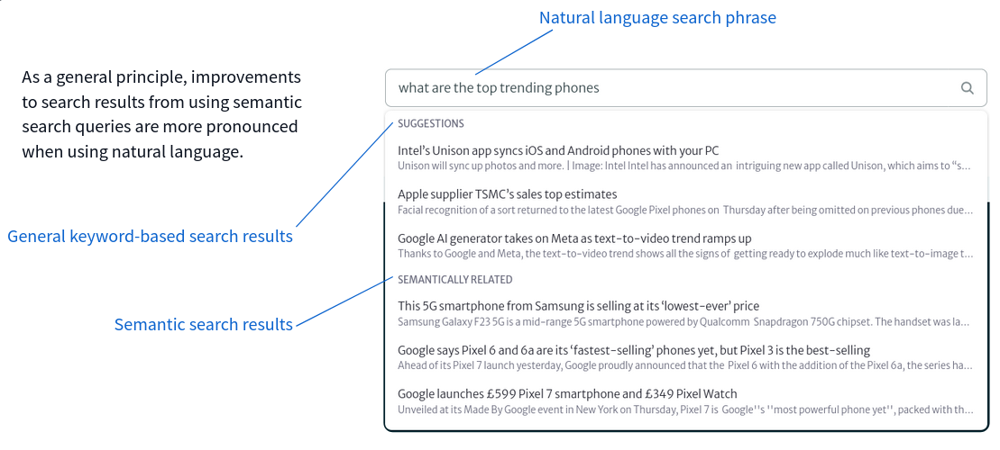
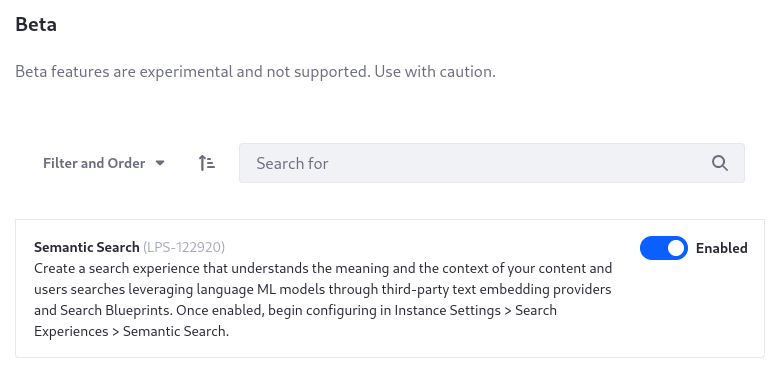

---
toc:
  - ./semantic-search/setting-up-a-text-embedding-provider.md
  - ./semantic-search/creating-a-search-blueprint-for-semantic-search.md
taxonomy-category-names:
- Search
- Liferay Enterprise Search
- Search Experiences and Blueprints
- Liferay Self-Hosted
- Liferay PaaS
- Liferay SaaS
uuid: e305b83d-913c-497f-8760-6a9c0ecc87f3
---

# Semantic Search
{bdg-secondary}`7.4 U70+`
{bdg-link-primary}`[Beta Feature](../../../system-administration/configuring-liferay/feature-flags.md)`

_Semantic_ search evaluates the intent behind a searched phrase. Meanwhile, a _keyword_ search matches a searched phrase to the indexed text fields, and cannot produce a match based on meaning.

| Searched Phrase | Indexed Content | Match Type |
| :--- | :--- | :--- |
| what's new in tech | Liferay Releases Search Experiences for 7.3 | Semantic &#10004;<br />Keyword &#10008; |
| new releases | New features released in Liferay Search Experiences | Semantic &#10004;<br />Keyword &#10004; |

Even sophisticated keyword searches like Liferay's (as powered by Elasticsearch) cannot match the user's intent with indexed documents, despite employing inventive techniques like
- analysis to tokenize the keywords and document fields.
- fuzziness and slop to enable imprecise matching.
- stemming to break words down into their roots to allow synonym matching.
- stop words to ignore insignificant words.

Searching by tokenized keywords and document fields can be enough for many search needs. If you need more from the search experience, semantic search greatly closes the gap between what a keyword search can accomplish and what the user really wants from the search: process not just the words of the search, but their intent.



Semantic search enables an additional content processing pipeline. When enabled, the platform produces a vector representation of the input text called a text embedding, and stores it in the index document in Elasticsearch. At search time, the search keywords entered by users go through the same vectorization and embedding process, making it possible to perform similarity searches that provide more meaningfully relevant search results for users. Not all content types support text embedding:

| Supported Content Type         | Enabled by Default? |
| :----------------------------- | :------------------ |
| Blogs Entry                    | &#10004;            |
| Knowledge Base Article         | &#10004;            |
| Message Boards Message         | &#10008;            |
| Basic Web Content Article      | &#10004;            |
| Wiki Page                      | &#10004;            |

```{important}
An effective semantic search solution requires a model trained for your data domain. The most straightforward approach is to find a suitable pre-trained model, then fine-tune it to your data. The examples demonstrated here are not production-ready semantic search solutions.
```

## Enabling Semantic Search

To enable semantic search in Liferay,

1. Open the *Global Menu* (), then click *Control Panel* &rarr; *Instance Settings*.
1. Open the *Platform* &rarr; *Feature Flags* section.
1. In the Beta entry, enable Semantic Search.



To enable semantic search using a [portal property](../../../installation-and-upgrades/reference/portal-properties.md), add this to `portal-ext.properties`:

```properties
feature.flag.LPS-122920=true
```

To enable semantic search using an [environment variable](../../../installation-and-upgrades/installing-liferay/using-liferay-docker-images/configuring-containers.md#using-liferay-env-variables), add this to your configuration:

```properties
LIFERAY_FEATURE_PERIOD_FLAG_PERIOD__UPPERCASEL__UPPERCASEP__UPPERCASES__MINUS__NUMBER1__NUMBER2__NUMBER2__NUMBER9__NUMBER2__NUMBER0_=true
```

To configure semantic search,

1. [Choose a model or create your own.](#choosing-a-model)
1. [Enable a text embedding provider and configure it in Liferay.](./semantic-search/setting-up-a-text-embedding-provider.md)
1. [Index the text embeddings.](#indexing-the-text-embeddings)
1. [Create a Search Blueprint to perform a similarity search between the vectorized search terms and documents.](./semantic-search/creating-a-search-blueprint-for-semantic-search.md)

### Choosing a Model

A [properly trained model](https://www.sbert.net/docs/pretrained_models.html) is paramount: the data in your index must be appropriate for the model chosen. Working with a pre-trained model is convenient, but fine-tuning to your data may be necessary before using it in production. Only through robust testing can you know that the chosen model is appropriate.

For example, if a user searches _how does a skate move?_, a model trained on marine biology will provide different results than one trained on recreation.

The [Hugging Face model hub](https://huggingface.co/models) provides a large collection of pre-trained, domain specific models.

### Indexing the Text Embeddings

The text embeddings must be indexed when

1. Enabling Semantic Search for the first time.
1. Changing the text embedding provider, the model, the vector dimensions, or the text truncation strategy in the Semantic Search configuration.

To index the text embeddings, use the Index Actions screen and click the _Reindex_ button for just the model types you are enabling in the Asset Entry Class Names setting of the Semantic Search System or Instance Settings.

## Configuring Semantic Search

Beyond [setting up a text embeddings provider](./semantic-search/setting-up-a-text-embedding-provider.md), additional configuration options are available for semantic search. Visit Control Panel &rarr; Instance Settings &rarr; Semantic Search.

The Text Embedding Provider Settings are covered in [Enabling Semantic Search](#enabling-semantic-search)

The Index Settings include these:

**Max Character Count:** Set the maximum number of characters to be sent to the text embedding provider. By default up to 500 characters are sent to be transformed into their vector representations. The ideal value here depends on which [text embedding provider](./semantic-search/setting-up-a-text-embedding-provider.md) you're using.

**Text Truncation Strategy:** Select whether to extract the pre-transformation sample from the Beginning (default), Middle, or End of the text. This setting applies only if the source text is longer than the maximum character count. Depending on the strategy and the max character count, the title/subject and parts of the content/body can be used to generate the text embedding.

**Types:** Select the content types to be transformed. By default four supported types are processed, including Blogs Entry, Knowledge Base Article, Web Content Article, and Wiki Page. Message Boards Message entities can be configured if desired. 

```{note}
Only Basic Web Content articles are currently supported.
```

**Languages:** Select the languages and localizations to be transformed. By default all listed languages are selected. Select multiple languages from the list using _Ctrl + Click_.

```{warning}
Enabling a language doesn't guarantee that the sentence embedding is created for the language. The language must be available in the site. If a language is enabled in System/Instance Settings and available in the site, but there is no translation for a given piece of content, the default translation is used to create the text embeddings.
```

**Text Embedding Cache Timeout:** Set the cache timeout in milliseconds for transformed search keywords. If the cache is within the timeout, Liferay won't request the keyword's text embedding from the text embedding provider. By default the timeout is 604800 ms (about ten minutes).

## Understanding Semantic Search in Liferay

Semantic Search in Liferay is either

1. Full semantic search, where the normal indexers are disabled in a Search blueprint, and only text embeddings are used to search for relevant content.

1. Hybrid semantic search, where a keyword search is performed first, and text embeddings are used to re-score the results.

Providing a robust understanding semantic search and its intricacies is beyond the scope of this brief explanation. Here is described how a Liferay hybrid semantic search implementation works, while describing a few fundamental concepts of a semantic search.

Semantic search impacts the Liferay search at both index time and search time, introducing an additional level of content processing.

### Semantic Search at the Indexing Phase

* First, regular content processing occurs:
  * [LIFERAY] Content in Liferay is sent to the search engine where it's processed according to its data type: text is analyzed appropriately and stored in the index.
* [LIFERAY] Additional semantic search processing occurs:
   * Following the configuration in System/Instance Settings, the text snippet is sent by Liferay to the text embedding provider. 
      * The Max Character Count and Text Truncation Strategy determine the snippet sent to the text embedding provider.
      * Liferay selects the title and content for Blogs Entries, Knowledge Base Articles, Wiki Pages, Basic Web Content Articles. For Message Boards Messages, the subject and body fields are processed.
  * [TEXT EMBEDDING PROVIDER] First the snippet is processed according the configured model, which tokenizes the snippet according to its parameter. For the BERT models often used, 512 is the maximum number of tokens the models handle. This is influenced by the number of characters set in the Semantic Search &rarr; Max Character Count setting in System/Instance Settings.
  * [TEXT EMBEDDING PROVIDER] A vector representation of the source, called a text embedding, is created based on the model used the by the transformer. 
  * [LIFERAY] The result of the text embedding process is stored in the [Liferay Company Index](../../search-administration-and-tuning/elasticsearch-indexes-reference.md) as a [dense_vector](https://www.elastic.co/guide/en/elasticsearch/reference/8.8/dense-vector.html) field for each document[^1].
  * Following the configuration in System/Instance Settings, the text snippet is sent to the text embedding provider, text embedding occurs, and a vector representation is created based on the model used the by the transformer. The result of the text embedding process is stored in the [Liferay Company Index](../../search-administration-and-tuning/elasticsearch-indexes-reference.md) as a [dense_vector](https://www.elastic.co/guide/en/elasticsearch/reference/8.8/dense-vector.html) field for each document[^1].

[^1]: To inspect the field in a document, use the [Display Results in Document Form](../../search-pages-and-widgets/search-results/configuring-the-search-results-widget.md) setting, or the [Search Blueprints preview](./search-blueprints/creating-and-managing-search-blueprints.md#testing-a-blueprint-with-the-preview-sidebar) functionality.

### Semantic Search at the Searching Phase

* Regular keyword matching occurs:
  * The search phrase entered in the Search Bar widget is received by Liferay's search framework, sent through to the search engine for analysis and additional processing, matched to existing index documents in the search engine, which are scored for relevance and returned to Liferay for its additional processing (highlighting, summarizing, performing additional filtering for permissions, etc.). 
* Additional semantic search processing occurs:
  * The search phrase is sent to the text embedding provider, and a vector representation is created (the [text embedding](https://neuml.github.io/txtai/embeddings/)). Before rendering the search results scored by keyword search relevance, the results captured within the window limit setting are re-scored by comparing the vector representation of the search phrase with the vector representations of index documents. New scores are calculated, and the results are returned to the search page for consumption by the end user. See Elastic's [What is Vector Search](https://www.elastic.co/what-is/vector-search) for more information.
