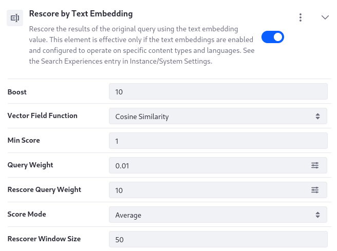
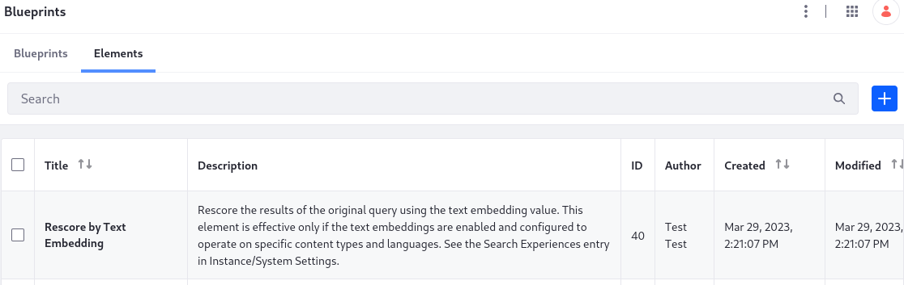

----
uuid: 714a2db2-830e-40a8-8f49-5da57a629ef1
----
# Creating a Search Blueprint for Semantic Search

{bdg-secondary}`7.4 U70+`
{bdg-link-dark}`[Beta Feature](https://help.liferay.com/hc/en-us/articles/12917247551757-Beta-Features)`

Once a model is selected and the text embeddings are indexed, you must configure Liferay to account for the embeddings at search time. Conceptually you have two choices:

1. Create a blueprint to completely override Liferay's default search request, building one from scratch to execute a pure semantic search query, only using the text embeddings.
1. Use the out-of-the-box Rescore by Text Embedding element to create a blueprint that executes the standard keyword-based query, then rescores the results with a similarity function between the text embeddings of the indexed dense_vector field and the embeddings of the search phrase.

To build a semantic search experience leveraging the text embeddings created by the embedding provider you configured, Liferay includes an out-of-the-box element called Rescore by Text Embedding that rescores the results of the original query using the text embedding value. Use the element to build a [search blueprint](../search-blueprints/creating-and-managing-search-blueprints.md). With this element and the visual query builder in Blueprints, you can configure and test the search query to build the right semantic search solution.

```{important}
The Rescore by Text Embedding element, when configured to work with an embedding provider, can produce more targeted search results for some data sets. However, many semantic search solutions will require manual tweaking and perhaps new elements to achieve a robust search solution.
```



This element is effective only if the embedding provider is enabled and configured to operate on specific content types and languages. See [Setting Up a Text Embedding Provider](./setting-up-a-text-embedding-provider.md).

## Adding the Rescore by Text Embedding Element

If you start Liferay for the first time with [semantic search enabled](../semantic-search.md#enabling-semantic-search), the Rescore by Text Embedding element is ready to use in the [Search Blueprints UI](../search-blueprints/creating-and-managing-elements.md). If you do not see the element in your instance, you can add it manually:

1. In Liferay, open the *Global Menu* (), then click *Application* &rarr; *Blueprints*.

1. Click *Elements*, then click *Add* ().

1. Enter the title *Rescore by Text Embedding* and click *Create*.

1. Copy the element's JSON from the section below, [Reference: Rescore by Text Embedding Element](#reference-rescore-by-text-embedding-element)

1. Overwrite the default JSON with the JSON you copied from below.



## Configuring the Rescore by Text Embedding Element

Several configurable options are provided in the Rescore by Text Embedding element: 

**Boost:** Defaulting to 10, this setting determines by how much to boost rescored results.

**Vector Field Function:** Choose from the Cosine Similarity or Dot Product functions. Defaulting to use the Cosine Similarity function, the selected function measures similarity between the searched keywords and the target document text embeddings. Check the model's documentation to determine which function is most suitable. 

**Min Score:** Defaulting to 1, this setting's integer (or 0) sets the minimum score a returned document must have to be included in the rescore query. 

**Query Weight:** Defaulting to 0.01, this setting controls the weight of the original query in the final score calculation.

**Rescore Query Weight:** Defaulting to 10, this sets the weight of the rescore query in the final score calculation.

**Score Mode:** Defaulting to Average, this setting dictates the strategy to use when combining the original query scores with the results of the rescore. Choose from Average, Max, Min, Multiply, or Total.

**Rescorer Window Size:** Defaulting to 50, you can choose the number of results to rescore at a time. Choosing a very high window size can impact performance negatively .

## Reference: Rescore by Text Embedding Element

For convenience, you can copy this JSON for the Rescore by Text Embedding element:

```json
{
	"description_i18n": {
		"en_US": "rescore-by-text-embedding-description"
	},
	"elementDefinition": {
		"category": "semantic search",
		"configuration": {
			"queryConfiguration": {
				"queryEntries": [
					{
						"condition": {
							"exists": {
								"parameterName": "keywords"
							}
						},
						"rescores": [
							{
								"query": {
									"script_score": {
										"boost": "${configuration.boost}",
										"min_score": "${configuration.min_score}",
										"query": {
											"bool": {
												"filter": [
													{
														"exists": {
															"field": "text_embedding_${ml.text_embeddings.vector_dimensions}_${context.language_id}"
														}
													}
												],
												"must": [
													{
														"match_all": {
														}
													}
												]
											}
										},
										"script": {
											"params": {
												"query_vector": "${ml.text_embeddings.keywords_embedding}"
											},
											"source": "${configuration.vector_field_function}(params.query_vector, 'text_embedding_${ml.text_embeddings.vector_dimensions}_${context.language_id}') + 1"
										}
									}
								},
								"queryWeight": "${configuration.query_weight}",
								"rescoreQueryWeight": "${configuration.rescore_query_weight}",
								"scoreMode": "${configuration.score_mode}",
								"windowSize": "${configuration.window_size}"
							}
						]
					}
				]
			}
		},
		"icon": "custom-field",
		"uiConfiguration": {
			"fieldSets": [
				{
					"fields": [
						{
							"defaultValue": 10,
							"label": "boost",
							"name": "boost",
							"type": "number",
							"typeOptions": {
								"min": 0
							}
						},
						{
							"defaultValue": "cosineSimilarity",
							"helpText": "vector-field-function-field-help",
							"label": "vector-field-function",
							"name": "vector_field_function",
							"type": "select",
							"typeOptions": {
								"nullable": false,
								"options": [
									{
										"label": "Cosine Similarity",
										"value": "cosineSimilarity"
									},
									{
										"label": "Dot Product",
										"value": "dotProduct"
									}
								]
							}
						},
						{
							"defaultValue": 1,
							"helpText": "min-score-field-help",
							"label": "min-score",
							"name": "min_score",
							"type": "number",
							"typeOptions": {
								"min": 0
							}
						},
						{
							"defaultValue": 0.01,
							"helpText": "query-weight-field-help",
							"label": "query-weight",
							"name": "query_weight",
							"type": "slider",
							"typeOptions": {
								"min": 0.01,
								"step": 0.1
							}
						},
						{
							"defaultValue": 10,
							"helpText": "rescore-query-weight-field-help",
							"label": "rescore-query-weight",
							"name": "rescore_query_weight",
							"type": "slider",
							"typeOptions": {
								"min": 0.01,
								"step": 0.1
							}
						},
						{
							"defaultValue": "avg",
							"helpText": "score-mode-field-help",
							"label": "score-mode",
							"name": "score_mode",
							"type": "select",
							"typeOptions": {
								"nullable": false,
								"options": [
									{
										"label": "Average",
										"value": "avg"
									},
									{
										"label": "Max",
										"value": "max"
									},
									{
										"label": "Min",
										"value": "min"
									},
									{
										"label": "Multiply",
										"value": "multiply"
									},
									{
										"label": "Total",
										"value": "total"
									}
								]
							}
						},
						{
							"defaultValue": 50,
							"helpText": "rescore-window-size-field-help",
							"label": "rescore-window-size",
							"name": "window_size",
							"type": "number",
							"typeOptions": {
								"min": 1
							}
						}
					]
				}
			]
		}
	},
	"externalReferenceCode": "RESCORE_BY_TEXT_EMBEDDING",
	"title_i18n": {
		"en_US": "rescore-by-text-embedding"
	},
	"type": 0
}
```
