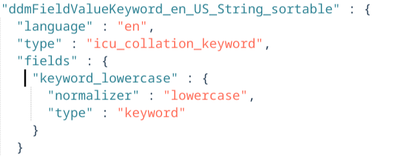
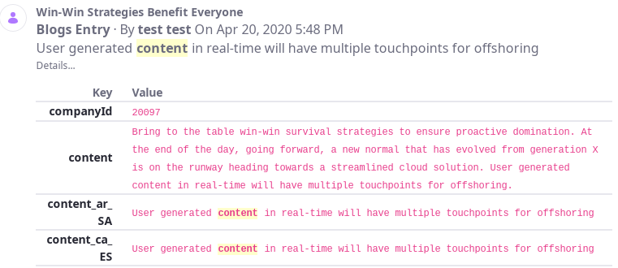
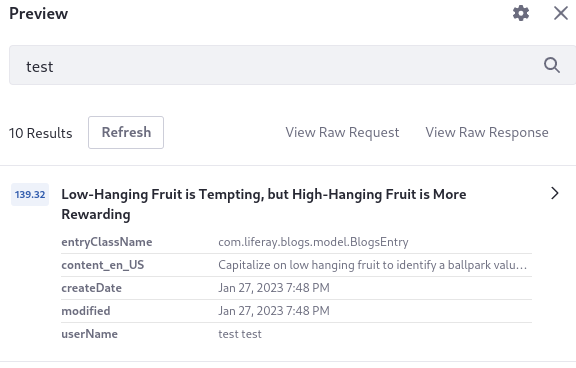

# Exploring Indexed Fields

For certain uses of Liferay's search widgets and APIs, you must explore the fields of search documents or inspect the field mappings of the search engine.

The indexed search document source shows exactly how the fields of a content type were indexed, and how the mappings were applied to each field. For example, you can see how the mappings for nested object fields end up being stored in the index. The document source cannot show you the type of data and it does not contain mapped sub-fields. 


The field mappings provide a lower level view of how each field is treated at index and search time, including its data type and any sub-fields that are available for using the field's data in different ways. For example, you can use the mappings to discover a keyword field that's indexed as a sub-field of a text field. This keyword sub-field might then be used in the Custom Facet.



<!--Would it be good to include a mash-up screenshot of mappings ui, document src, blueprints preview, maybe search insights -->

| Widget | Relevant Configurations | Requirement | Where to Look |
| :--- | :--- | :--- | :--- |
| [Custom Facet](search-facets/custom-facet.md) | Aggregation Field | Finding `keyword` fields | [Document Source](#viewing-the-document-source)<br>[Field Mappings](#inspecting-the-mappings)
| [Sort Widget](search-results/sorting-search-results.md) | Field | Finding sortable fields<br>Discovering sortable variant fields or sub-fields | [Document Source](#viewing-the-document-source)<br>[Field Mappings](#inspecting-the-mappings) |
| [Custom Filter](search-results/using-the-custom-filter-widget.md) | Field<br>Query | Finding the proper field types for a given query<br>Seeing result scores to tune boosting | [Document Source](#viewing-the-document-source)<br>[Field Mappings](#inspecting-the-mappings)<br>[Search Insights Response String](search-insights.md) |
| [Search Blueprints](../liferay-enterprise-search/search-experiences/search-blueprints.md) | Various element and blueprint configurations | Finding the proper field types for a given query<br>Seeing result scores to tune boosting | [Blueprint Preview](../liferay-enterprise-search/search-experiences/search-blueprints/creating-and-managing-search-blueprints.md#testing-a-blueprint-with-the-preview-sidebar)<br>[Field Mappings](#inspecting-the-mappings) |

The [search APIs](../developer-guide/search-headless-apis/search-api.md) also require knowing about the fields and mappings of the search infrastructure.

## Viewing the Document Source

### Viewing Search Results in Document Form

You can inspect the document source as it's returned from the search engine. The Search Results widget has a configuration _Display Results in Document Form_ that shows the document form of the returned results. See [Inspecting Search Engine Documents](search-results/configuring-the-search-results-widget.md#inspecting-search-engine-documents) for more information.

Inspecting the fields of returned documents is useful for finding indexed field names and values for a particular content type. For example, you might want to understand how an object's date field is indexed.


There are limitations to viewing the document source:

1. You cannot know the field type.
1. Sub-fields are not present in the document source.

For these details you must view the field mappings.



### Previewing a Blueprint's Search Results

You can preview results in their document form right from a sidebar in the Edit Blueprint screen. See [Testing a Blueprint with the Preview Sidebar](../liferay-enterprise-search/search-experiences/search-blueprints/creating-and-managing-search-blueprints.md#testing-a-blueprint-with-the-preview-sidebar) for more information.



Here you can access these features:

- Click _View Raw Request_ to see the entire search request string. From the Raw Request modal, you can copy the request to the clipboard or download it as a JSON file. This is the same request seen in the [Search Insights](../../../search-pages-and-widgets/search-insights.md) widget on the search page.

- Click _View Raw Response_ to see the entire search response string. Here you can copy the response to the clipboard or download it as a JSON file. This is the same string you see in the [Search Insights](../../../search-pages-and-widgets/search-insights.md) widget on the search page.

- The score of each result appears to the left of the result title. Click the score to see the Score Explanation.

[Some elements](./search-blueprints-elements-reference.md) read search context attributes that you can provide or override manually. Click the gear icon () to add search context attributes to the Blueprint preview search, then enter the key/value pair for the attribute and click _Done_.

## Inspecting the Mappings

The field mappings for the search engine provide information on how the field should be indexed and searched. For example, if you know that you require a `keyword` field in the Sort widget, you can inspect the mappings for just such fields.

To browse the entire list of available fields, inspect the field mappings from *Control Panel* &rarr; *Configuration* &rarr; *Search* (click the *Field Mappings* tab). Here you'll see numerous indexes. Liferay's main content is indexed into the [company index](../../search-administration-and-tuning/elasticsearch-indexes-reference.md), which is named `liferay-[company id]` (e.g., `liferay-10819726314237`).

When you find the field, note its type and if it has sub-fields. Some fields are mapped as `text` fields to enable full text search or as `icu_collation` fields to enable sorting, but are also given a sub-field of type `keyword` for using in aggregations (i.e., facets).

Alternatively, use your search engine's API to browse the mappings:

- Access Elasticsearch's field mappings with the [Get Mapping API](https://www.elastic.co/guide/en/elasticsearch/reference/8.8/indices-get-mapping.html):
- Access OpenSearch's field mappings with its [Mappings API](https://opensearch.org/docs/latest/security-analytics/api-tools/mappings-api/)
- Access Solr's field mappings with its [List Fields API](https://solr.apache.org/guide/8_10/schema-api.html#list-fields)

Here's a snippet of output from the Elasticsearch example:

```json
"ddmStructureKey": {
  "store": true,
  "type": "keyword"
},
"ddmTemplateKey": {
  "store": true,
  "type": "keyword"
},
"defaultLanguageId": {
  "store": true,
  "type": "keyword"
},
"description": {
  "store": true,
  "term_vector": "with_positions_offsets",
  "type": "text"
},
"discussion": {
  "store": true,
  "type": "keyword"
},
```

### Discovering Sub-Fields

Some fields are indexed as [multi-fields](https://www.elastic.co/guide/en/elasticsearch/reference/8.8/multi-fields.html), adding sub-field mappings to the main field. Some `text` and `icu_collation_keyword` fields in Liferay are mapped with `keyword` sub-fields and are usable in the Custom Facet. 

To use sub-fields in the Custom Facet, use dot notation (e.g., `fieldName.sub_field_name`). Examples include `assetTagNames.raw` and `title_en_US_sortable.keyword_lowercase`. Some [nested fields](#accessing-nested-fields) are mapped this way.

!!! warning
    You can see sub-fields when you view the mappings in Liferay, but they are not present in the document source. This means that you cannot find these fields using the [Display Results in Document Form setting](../search-results/configuring-the-search-results-widget#inspecting-search-engine-documents) in Search Results.

## Accessing Custom Fields 

When you create a [Custom Field](./../../../system-administration/configuring-liferay/adding-custom-fields.md) with the setting _Searchable_ enabled, the custom field is indexed with the backing asset (Blogs Entries, for example). After reindexing it's also applied to existing entries. If you index the field as a keyword, the field itself is a text field, named like `expando__keyword__custom_fields__Enabled` (if you named the field _Enabled_ in the Custom Fields UI), but it contains a nested field mapping for creating a separate `raw` keyword field. 

To use the raw keyword field in the Custom Facet, append `.raw` to the Custom Field name in the _Aggregation Field_:

`expando__keyword__custom_fields__Enabled.raw`
 
If you've copied the field mappings locally, search the file for `expando__keyword__custom_fields__Enabled` and you can see its mapping:

```json
{
  "liferay-[companyId]" : {
    "mappings" : {
      "expando__keyword__custom_fields__Enabled" : {
        "full_name" : "expando__keyword__custom_fields__Enabled",
        "mapping" : {
          "expando__keyword__custom_fields__Enabled" : {
            "type" : "text",
            "store" : true,
            "fields" : {
              "raw" : {
                "type" : "keyword"
              }
            },
            "analyzer" : "keyword_lowercase"
          }
        }
      }
    }
  }
}
```

To see all the raw fields, search the mappings for `raw`.

Setting a custom field to searchable means that the value of the field is indexed when the entity is modified or when a reindex is triggered. Only `java.lang.String` fields can be made searchable.

## Accessing Nested Fields

<!--Does "in Elasticsearch" actually add anything to this? -->
[Object definition fields](../../liferay-development/objects/creating-and-managing-objects/fields/adding-fields-to-objects.md), [web content structure fields](../../content-authoring-and-management/web-content/web-content-structures/configuring-structure-fields.md), and [document type fields](../../content-authoring-and-management/documents-and-media/uploading-and-managing/managing-metadata/defining-document-types.md) are indexed as nested fields in Elasticsearch.

You can query these nested fields in search blueprints, use them to sort results on the search page, and create custom filters or facets for these fields. To do this, enter these elements separated by periods:

* Parent field

* Name of the field that holds the field name

* Name of the field that holds the value

This example references an object field:

```
nestedFieldArray.lastAccessed.value_date
```

This example references a web content structure field:

```
ddmFieldArray.ddm__keyword__40806__Textb5mx_en_US.ddmFieldValueKeyword_en_US_String_sortable.keyword_lowercase
```

### Using Object Definition Fields

{bdg-secondary}`7.4 U72+/GA72+`

To find [object definition](../../../liferay-development/objects.md) fields in existing documents in the index, use the [Display Results in Document Form](../search-results/configuring-the-search-results-widget#inspecting-search-engine-documents) setting in the Search Results widget.

The document has a `nestedFieldArray` field with nested content:

```json
"nestedFieldArray" : [
   {
     "fieldName" : "lastAcessed",
     "valueFieldName" : "value_date",
     "value_date" : "20230502000000"
   },
   {
     "fieldName" : "immunityType",
     "valueFieldName" : "value_keyword",
     "value_keyword" : "diplomatic"
   },
   {
     "fieldName" : "randomNumber",
     "valueFieldName" : "value_integer",
     "value_integer" : "19"
   }
],
```

To use an object field in the search widgets, specify the parent field (e.g., `nestedFieldArray`), the name of the field that holds the field name (e.g., `fieldName`), and the name of the field that holds the value (e.g., `value_date`). Use this pattern: `nestedFieldArray.[fieldName].[valueFieldName]`.

For example, you can sort by the `lastAccessed` date field in the nested array above by entering `nestedFieldArray.lastAccessed.value_date`.

### Using Web Content Structure Fields and Document Type Fields

Fields from document types and web content structures are indexed the same way due to their shared backend framework. To find [nested web content structure (DDM) fields](../../../liferay-internals/reference/7-3-breaking-changes.md#dynamic-data-mapping-fields-in-elasticsearch-have-changed-to-a-nested-document) in existing documents in the index, use the [Display Results in Document Form](../search-results/configuring-the-search-results-widget#inspecting-search-engine-documents) setting in the Search Results widget.

The document has a `ddmFieldArray` field with nested content:

```json
 "ddmFieldArray" : [
    {
      "ddmFieldName" : "ddm__keyword__40806__Textb5mx_en_US",
      "ddmValueFieldName" : "ddmFieldValueKeyword_en_US",
      "ddmFieldValueKeyword_en_US_String_sortable" : "some text has been entered",
      "ddmFieldValueKeyword_en_US" : "some text has been entered"
    },
    {
      "ddmFieldName" : "ddm__keyword__40806__Selectjdw0_en_US",
      "ddmValueFieldName" : "ddmFieldValueKeyword_en_US",
      "ddmFieldValueKeyword_en_US_String_sortable" : "option 3",
      "ddmFieldValueKeyword_en_US" : "value 3"
    },
    {
      "ddmFieldName" : "ddm__keyword__40806__Boolean15cg_en_US",
      "ddmValueFieldName" : "ddmFieldValueKeyword_en_US",
      "ddmFieldValueKeyword_en_US" : "true",
      "ddmFieldValueKeyword_en_US_String_sortable" : "true"
    }
  ],
```

To use one of these fields in the search widgets, enter the `ddmFieldName` value (e.g., `ddm__keyword__40806__Testb5mx_en_US`) in the widget's Aggregation Field.

Depending on your version, [nested field storage for DDM fields](../../../liferay-internals/reference/7-3-breaking-changes.md#dynamic-data-mapping-fields-in-elasticsearch-have-changed-to-a-nested-document) may be enabled by default for Elasticsearch:

| Liferay Version  | Nested Field Enabled by Default |
| :--------------- | :------- |
| 7.4 all updates  | &#10004; |
| 7.3 all updates  | &#10004; |
| DXP 7.2 SP3/FP8+ | &#10008; |

To change the behavior, use the _Enable Legacy Dynamic Data Mapping Index Fields_ setting in System Settings &rarr; Dynamic Data Mapping Indexer.

## Related Topics

* [Searching for Content](../../getting-started/searching-for-content.md)
* [Search Administration](../../search-administration-and-tuning/search-administration.md)
* [Using the Custom Filter Widget](../search-results/using-the-custom-filter-widget.md)
