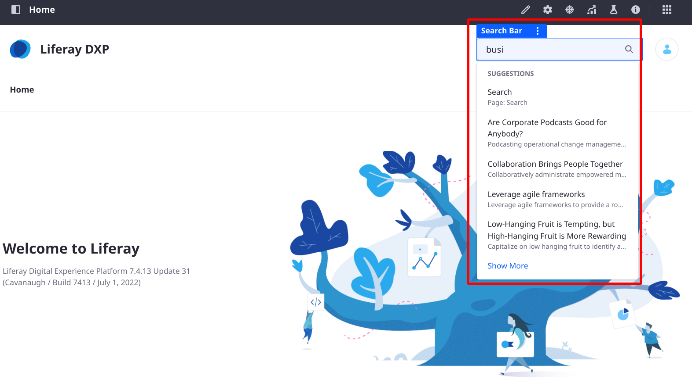

---
toc:
  - ./search-bar-suggestions/configuring-search-bar-suggestions.md
  - ./search-bar-suggestions/search-bar-suggestions-blueprints.md
taxonomy-category-names:
- Search
- Search Pages and Widgets
- Search Experiences and Blueprints
- Liferay Self-Hosted
- Liferay PaaS
- Liferay SaaS
uuid: 46302b5c-b514-48b3-9d29-b3dcaaf8643a
---
# Search Bar Suggestions

{bdg-secondary}`7.4 U36+ and GA36+`

Liferay's Search Bar Suggestions provides _search as you type_ functionality. As you type search keywords into the Search Bar widget, the query is processed by the search engine, and results are returned in a drop-down list. You can click one of the results from the list or execute the search as usual by clicking the magnifying glass icon or the Enter key to view the results in the Search Results widget.

!!! important
    Only the default display template shows search bar suggestions out of the box. Create a [widget template](../../site-building/displaying-content/additional-content-display-options/styling-widgets-with-widget-templates.md) for the [search bar](using-search-widget-display-templates.md) if you need a customized display.

To learn how to use and configure Search Bar Suggestions, see [Configuring Search Bar Suggestions](./search-bar-suggestions/configuring-search-bar-suggestions.md)

To use [Search Blueprints](../liferay-enterprise-search/search-experiences/search-blueprints.md) to control the query used in Search Bar Suggestions, see [Search Bar Suggestions Blueprints](./search-bar-suggestions/search-bar-suggestions-blueprints.md).
