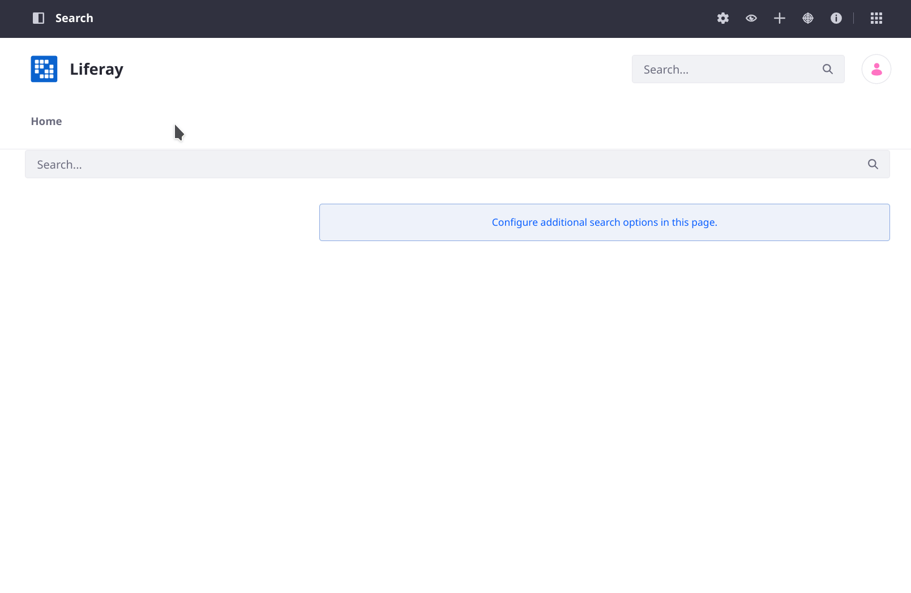
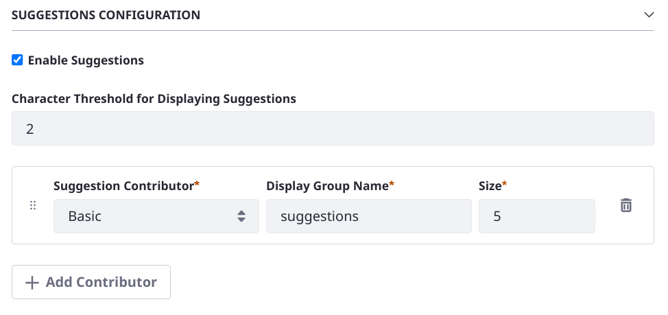
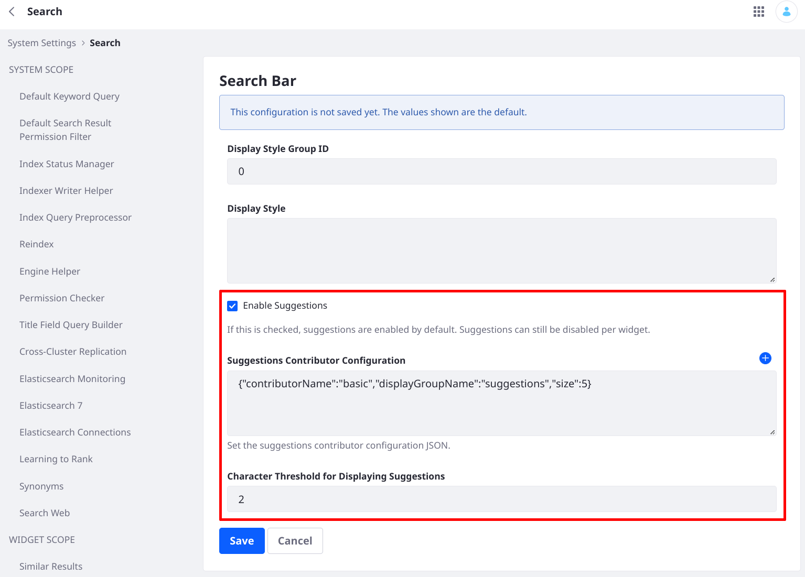

---
taxonomy-category-names:
- Search
- Search Pages and Widgets
- Search Experiences and Blueprints
- Liferay Self-Hosted
- Liferay PaaS
- Liferay SaaS
uuid: 9071aff1-f19f-4c53-a279-f19fd76847f1
---
# Configuring Search Bar Suggestions

{bdg-secondary}`7.4 U36+ and GA36+`

Search Bar Suggestions adds _search as you type_ functionality to Liferay's Search Bar widget. 



The user types search keywords into the Search Bar as usual. The keywords are ingested by Liferay and sent to the search engine; results are returned in a drop-down list. Continuing to type causes additional queries to be sent. You can click one of the results from the list or execute the search as usual by clicking the magnifying glass icon or the Enter key to view the results in the Search Results widget.

## Configuration Options

If Search Bar Suggestions is enabled in [Instance Settings](#search-bar-suggestions-configuration-scope), you can configure Search Suggestions at the widget [scope](../../../system-administration/configuring-liferay/understanding-configuration-scope.md).

The primary way to configure Search Bar Suggestions is with the Search Bar widget's configuration.



**Enable Suggestions:** Suggestions are enabled by default. Uncheck the checkbox to turn off suggestions.

**Character Threshold for Displaying Suggestions:** Each time the configured number of characters is entered into the Search Bar, the query is re-processed and the results are refreshed accordingly. Tune this setting to balance sending lots of search requests (i.e., setting the threshold too low triggers many search requests) with usability (i.e., setting the threshold too high means the user must type a lot to trigger the first suggestion query).

**Suggestions Contributor Configuration:** Configure the contributor(s) that control the query sent to the search engine. This setting is made up of three values:

1. **Suggestions Contributor**: The default contributor, and the only one available out-of-the-box in Liferay CE, is `Basic`. In Liferay DXP you can choose to use one or more Blueprint contributors instead. See [Search Bar Suggestions Blueprints](./search-bar-suggestions-blueprints.md) for more information.

1. **Display Group Name**: The default is `suggestions`. This value is a language key that resolves to Suggestions as the heading in the UI for the English language. You can change the language key or add your own. For example, make it `is-this-what-you're-looking-for`, then add the [translation](../../../system-administration/configuring-liferay/changing-translations-with-language-override.md#adding-a-language-key-and-translation). If you are using more than one Blueprint contributor, make sure each one has a unique Display Group Name value.

1. **Size**: Set the maximum number of results to display in the Search Bar drop-down list. The default is `5`. Because display space is limited, there's no benefit to setting the size to a large number.

```{tip}
Search Blueprints users can choose to use a Blueprint to control the Search Bar Suggestions query. When _Blueprint_ is selected as the contributor, additional configuration options appear in the Search Bar widget configuration. See [Search Bar Suggestions Blueprints](./search-bar-suggestions-blueprints.md) for more information.
```

## Configuring Search Bar Suggestions in the Control Panel

There are three Control Panel configuration entries that can affect Search Bar Suggestions:

1. Service Access Policies
1. Search Suggestions in System Settings
1. Search Bar in System and Instance Settings

### Configuring the Suggestions Service Access Policy

[Service Access Policies](../../../installation-and-upgrades/securing-liferay/securing-web-services/setting-service-access-policies.md#understanding-service-access-policies) control access to Liferay's services. The policy for search bar suggestions is enabled by default, allowing unauthenticated users to access the REST service endpoint that returns the suggestions. In short, it enables search bar suggestions for guest users as they type in the search bar.

To configure the Service Access Policy,

1. Open the Global Menu &rarr; Control Panel &rarr; Service Access Policy (in the Security section).

1. Click the _SEARCH_SUGGESTIONS_ entry.

If you disable the policy, guests do not see suggestions, even if suggestions is enabled in the widget configuration.

### Configuring the Suggestions REST Endpoint 

The REST endpoint that provides the Search Bar Suggestions functionality can be disabled if necessary, using System or Instance Settings.

To configure the Search Suggestions endpoint,

1. Go to System or Instance Settings in the Global Menu &rarr; Control Panel &rarr; Configuration section.

1. In the Platform &rarr; Search category, open the Search Suggestions entry.

1. There's just one setting: Enabled.

When disabled, calls to the required endpoint are ignored; thus, none of the other configurations for Search Bar Suggestions are taken into consideration. In fact, the Search Bar widget configuration doesn't display the Search Bar Suggestions settings. The feature is entirely disabled throughout the system or instance.

### Configuring Suggestions with the Search Bar

Most configuration of Search Bar Suggestions occur at the widget scope. In addition to the Search Bar widget's configuration, you can configure the Search Bar Suggestions defaults at the system and instance [scope](../../../system-administration/configuring-liferay/understanding-configuration-scope.md).



Here's what happens when you enable or disable Search Bar Suggestions at the system, instance, or widget [scope](../../../system-administration/configuring-liferay/understanding-configuration-scope.md):

| Configuration Scope | Enabled? | Search Bar widget result |
| :------------------- | :-------- | :------------------------ |
| System Settings     | &#10008; | Sets the default for all instances as disabled. Suggestions settings do not appear in the widget configuration. |
| Instance Settings   | &#10008; | Suggestions settings do not appear in the widget configuration. |
| Instance Settings   | &#10004; | Suggestions are enabled, and settings appear in the widget configuration. Suggestions can be disabled in the widget configuration. |

The other settings work according to Liferay's [configuration scope paradigm](../../../system-administration/configuring-liferay/understanding-configuration-scope.md): settings at higher scopes like system and instance set the defaults, whereas the more granular widget scope can override those defaults.
