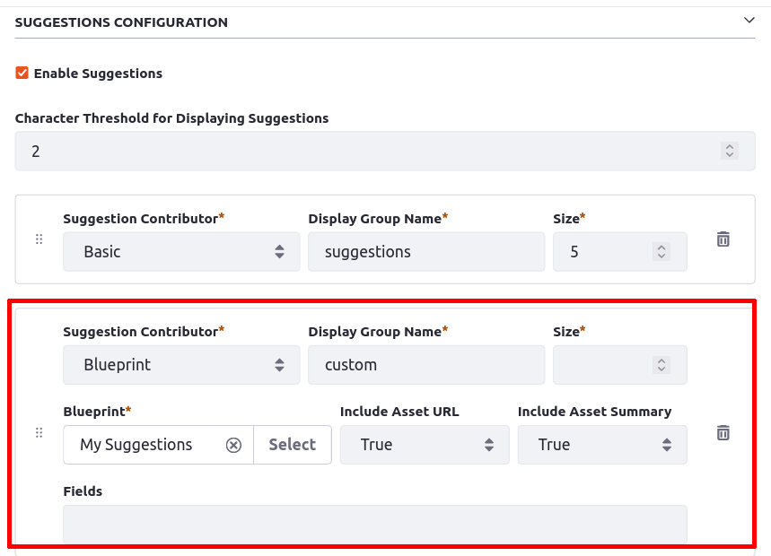

---
taxonomy-category-names:
- Search
- Search Pages and Widgets
- Search Experiences and Blueprints
- Liferay Self-Hosted
- Liferay PaaS
- Liferay SaaS
uuid: 2de44205-0b3c-41b3-857b-3a60fc40ec81
---
# Search Bar Suggestions Blueprints

{bdg-primary}`Subscription`
{bdg-secondary}`7.4 U36+ and GA36+`

Search Bar Suggestions uses the regular [search bar query](../search-insights.md) by default. [Liferay Enterprise Search users](../../liferay-enterprise-search/activating-liferay-enterprise-search.md) can influence or override the query using [Search Blueprints](../../liferay-enterprise-search/search-experiences/search-blueprints/understanding-search-blueprints.md).

First, [build a Blueprint](../../liferay-enterprise-search/search-experiences/search-blueprints/creating-and-managing-search-blueprints.md). Once you have a Blueprint,

1. Make sure Search Bar Suggestions are enabled in Instance Settings. They are enabled by default.

1. Configure Search Bar Suggestions in the Search Bar widget configuration.
   - Click the Options () menu and choose _Configuration_.

1. Change the Suggestions Contributor to _Blueprint_.

1. Select the Blueprint by clicking _Select_.

1. Click _Save_.

Now the Search Bar Suggestions use the Blueprint-provided query clauses and configurations to send a customized request to Elasticsearch.

There are a few additional configurations you can use.

## Configuring Search Bar Suggestions to use a Blueprint

When you select the Blueprint Suggestions Contributor, new configuration fields appear in the Search Bar Widget Configuration.

**Blueprint:** This is the only required additional setting. Select the Blueprint to use.

**Include Asset URL:** Enable this to return the link to the result with the response. If an asset appears on a page accessible to the search user, clicking a result brings the user to that display page. Otherwise the asset is shown in an Asset Publisher under the search page's context. If disabled, clicking on results in the Suggestions list does nothing.

**Include Asset Summary:** Enable this to return the [summary](../search-results/search-results-behavior.md#result-summaries) of the result with the response. Disable this to return a more concise list of results, excluding the summary built by the search framework.

**Fields:** Define additional indexed fields to also return with the response. This is used when creating a custom [widget template](../../../site-building/displaying-content/additional-content-display-options/styling-widgets-with-widget-templates.md#creating-a-widget-template) that requires the use of certain index fields and their values.
