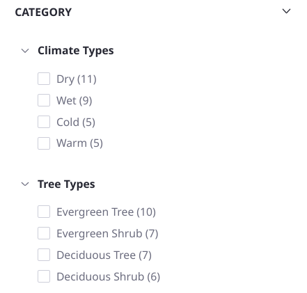
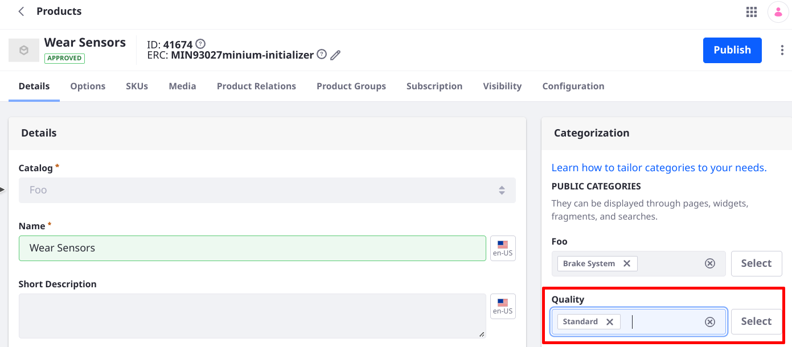
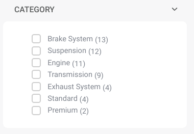

# Tag and Category Facet

The Tag Facet narrows search results for any assets with tags that match the search keyword. Likewise, the Category Facet narrows search results for any categorized assets that match the search keyword. Each match appears as a facet term.


## Configuring the Tag Facet and the Category Facet

The Tag Facet and the Category Facet contain identical configuration options. To configure either, open the Options menu () of the facet and click *Configuration*.


**Display Settings:** Choose between *Default*, *Compact Layout*, and *Label Layout*. The Default layout shows checkboxes next to each term but the Compact layout does not. The Label layout shows small clickable labels for each term.

The Advanced Configuration section contains additional options: 

**Tag or Category Parameter Name:** Change the parameter name in the URL for the Facet. The default is *tag* or *category*. 

**Max Terms:** Set the maximum number of facet terms to display, regardless of how many matching terms are found for the facet.

**Frequency Threshold:** Set the minimum frequency required for terms to appear in the list of facet terms. For example, if the frequency threshold of a facet is set to 3, a term with two matching results doesn't appear in the term result list.

**Display Frequencies:** Choose whether or not to display the term frequencies.

Once finished, click the *Save* button.

## Vocabularies in the Category Facet

{bdg-secondary}`7.4 U46+ and GA46+`

By default the Category Facet widget collects and displays results from all categories in every vocabulary in the site, and displays them in a flat list. In this paradigm vocabularies are not considered in the display or configuration of the widget. With the enhancements made in Update 46, you gain these behaviors:

1. Display categories under their vocabulary by selecting the Vocabulary Layout in the Category Facet's configuration screen. 

   

1. Decide which vocabularies and categories to include in the facet. This capability requires that the `assetVocabularyCategoryIds` field is used to create the aggregations in the Category Facet. Switching to this field in System Settings &rarr; Search &rarr; Category Facet Field activates the vocabulary settings within the Category Facet widget's configuration screen. 

   

With this behavior you can provide a powerful search facet experience: users select multiple categories (facet terms) within one vocabulary in one widget to expand the search results, but select categories from another vocabulary in a second widget to narrow the results. You might think of this in terms of boolean operators: use OR selection behavior inside a facet, but AND selection between facets.

```{important}
To achieve the AND style selection between facets, you must configure a different Category Parameter Name for each widget. By default all Category Facet widgets have this field set to _category_.
```

Consider a commerce portal for buying auto parts. Each part is a commerce product that's categorized in distinct vocabularies:

- Vocabulary: Vehicle System

   Categories: 
   - Brake System
	- Engine
	- Exhaust System
	- Suspension
	- Transmission
	- Turbocharger

- Vocabulary: Quality 

   Categories:
   - Premium
   - Standard

When your site users select Engine and Exhaust System, they expect to see products matching either category. If they then select the Premium category from the Quality vocabulary, they expect the results to be narrowed to just premium auto parts for the engine and exhaust systems of the vehicle. This can be accomplished out-of-the-box as of Update 46.

To configure the use case above,

1. Create a new site from Global Menu &rarr; Control Panel &rarr; Sites. When prompted select the Minium site template.
1. Name the site Foo and click _Add_.
1. Go to the Global site's menu &rarr; Categorization &rarr; Categories. Add a vocabulary named Quality and create two categories: Premium and Standard.

   ```{importan}
   You must create a global category in the Global site, rather than a site category in the Foo site.
   ```

   ```{note}
   There's an existing vocabulary created by the site template during site initialization (named Foo after the site): it'd be better named _Vehicle Systems_  to match the example you're building and characterize the categories better (e.g., Brake System). However, the Foo vocabulary's categories are referenced by existing Commerce products, so it cannot be edited. 
   ```

   

1. Categorize some of the existing Commerce Products in Global Menu &rarr; Commerce &rarr; Products (under the Product Management section).

   Add the Premium category to

   - Premium Brake Fluid
   - Premium Brake Pad

   Add the Standard category to several additional products, such as

   - ABS Sensor
   - Brake Fluid
   - Wear Sensors
   - Brake Pads
   - Brake Rotors

   

1. Go to the Foo site's home page. By default a Minium site's home page is the product catalog, which is essentially a search page with Allow Empty Searches enabled.

   Look at the Category Facet widget: the categories of both vocabularies are shown in one flat list. Selecting multiple facet terms (e.g., Suspension and Standard) expands the results on the page: this demonstrates OR operator behavior among facet terms.

   

   Some of the widgets on the page are Commerce-specific widgets (e.g. the Specification Facet) but the Category Facet is the standard search widget.

1. Change the Category Facet widget to create its aggregations using the `assetVocabularyCategoryIds` field. Go to System Settings &rarr; Search. In the Category Facet Field entry, Select `assetVocabularyCategoryIds` in the Category Facet Field selector and update the configuration.

1. On the Foo site's home page add a Category Facet widget configured to show only the Foo vocabulary's categories. 

   - Click the plus icon at the top of the page.
   - Drag a Category Facet widget directly above or below the existing one.
   - Open the widget configuration screen ().
   - Change the Category Parameter Name (e.g., `foocategories`).
   - Click the Select Vocabularies radio button. Expand Global and select Foo.
   - Click Save.
   <!-- review italics policy -->

1. Using a similar procedure, configure the original Category Facet widget to display only the Quality vocabulary's categories. Since you already changed the Category Parameter Name of the new Category Facet widget, you can leave the default value in the existing widget.

1. Refresh the page. Selecting the Brake System and Suspension categories in the Category Facet widget showing the Foo vocabulary ensures that the displayed products match the category of Brake System OR Suspension products are showing.

   Selecting Standard from the Category Facet showing the Quality categories narrows the results to only those products categorized as Brake System OR Suspension AND Standard.

<!-- Animated GIF? -->
