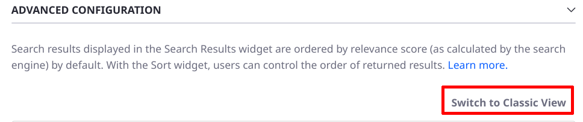
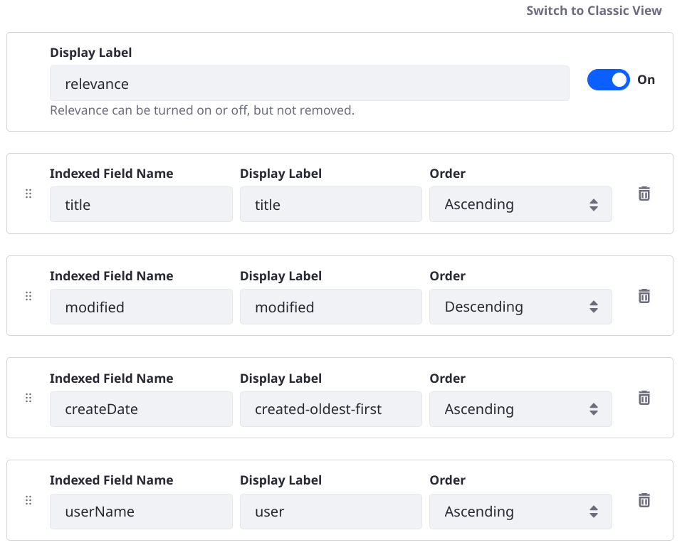
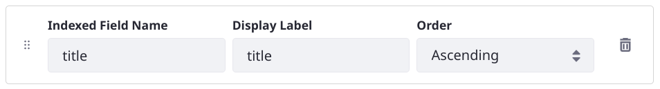

---
taxonomy-category-names:
- Search
- Search Pages and Widgets
- Liferay Self-Hosted
- Liferay PaaS
- Liferay SaaS
uuid: 8068b0aa-71c6-4041-bf2d-cf5816f6616e

---
# Sorting Search Results

Search results displayed in the [Search Results](./search-results.md) widget are ordered by [relevance score](./search-results.md#search-results-relevance) (as calculated by the [search engine](https://www.elastic.co/guide/en/elasticsearch/guide/master/scoring-theory.html)) by default. With the Sort widget, users can control the order of returned results.

!!! warning
    [Search Blueprints](../../liferay-enterprise-search/search-experiences/search-blueprints.md) can also add sorting to the search page. Make sure you understand [how these blueprint-added sorts interact](../../liferay-enterprise-search/search-experiences/search-blueprints/sorting-results-in-a-search-blueprint.md#search-blueprints-versus-the-sort-widget) with the Sort widget's configuration.

Add the widget to a [Search Page](../working-with-search-pages/search-pages.md) to begin sorting results.

Out of the box, you can order results in these ways as an alternative to relevance sorting:

- alphabetically by Title
- by the Modified date (newest first by default, or choose oldest first)
- by the Create date (newest first by default, or choose oldest first)
- alphabetically by the User that created each matching asset

Choose from one of the Sort widget's pre-configured sorting strategies or configure your own. 

You can also delete unwanted sort options from the widget.

## Adding the Sort Widget to a Page

To get started with the Sort widget,

1. Open the Add menu () for the page and expand the Widgets section.

1. From the Search category, drag the Sort widget onto the page.

## Configuring the Sort Widget

```{note}
The Sort widget's configuration screen is updated in Liferay 7.4 DXP Update 29+/CE GA 29+. For a period of time you can choose to use the older configuration screen by clicking the link _Switch to Classic View_.



The option to use the classic configuration view will be removed in a future Update/GA.
```

From the Sort widget's Configuration screen, you can

- Disable the default Relevance sort option.
- Edit existing Sort options
- Delete options
- Add new options



```{note}
Relevance can be turned on or off, but not removed completely. When relevance is enabled, the default search engine behavior is used: results are sorted in descending order of relevance (highest scores first).
```

To access the widget configuration screen, open the widget Options menu () and click _Configuration_.

Each Sort option has three settings: _Indexed Field_, _Display Label_, and _Order_.


**Indexed Field:** Enter the `fieldName` of the indexed field to sort. Most of the time this is a [keyword](https://www.elastic.co/guide/en/elasticsearch/reference/7.x/keyword.html) field. Other acceptable options are `date` and any [numeric datatype](https://www.elastic.co/guide/en/elasticsearch/reference/8.8/number.html). There's even a way to coerce `text` fields into behaving with the Sort widget (see below). 

**Display Label:** Set the displayed label for the type of sort being configured.

**Order:** Choose to sort in ascending or descending order. See [Controlling the Sort Order in the Classic Configuration](#controlling-the-sort-order-in-the-classic-configuration) if you're using the classic view or if you're on an earlier Liferay verison that does not contain the updated configuration UI.



## Changing the Default Sort Behavior

Out of the box, the Relevance option is first in the Sort widget's list, making it the default sort applied to the page. Therefore, results are sorted by relevance when a search is executed. Searching by relevance is the expected default behavior for most users, but you can exert a different sort strategy on default searches by changing the first option in the Sort widget configuration.

To change the default sort option,

1. Open the Sort widget's configuration screen by clicking the Widget Options  button.

1. Click the Add  button below the Relevance option.

1. Duplicate the current Relevance option's values---this ensures that Relevance is the second option in the list.

1. Now change the top option. If you choose one of the existing options, make sure you remove the duplicate by clicking its Remove .

1. Save the configuration. Enter a search and you'll see the new sort applied.

## Finding Sortable Fields

To find the fields available for use in the Sort widget, Users with the proper permissions can navigate to *Control Panel* &rarr; *Configuration* &rarr; *Search*.  From there, open the Field Mappings tab and browse the mappings for each index.  Scroll to the `properties` section of the mapping and find any `keyword` field, `date` field, or a field with a numeric data type. The `type` field is instructive:

    "type" : "keyword"

    "type" : "date"

    "type" : "long"

If you really must sort by a `text` field, add a new version of the field to the index with the type `keyword`. From the field mappings screen mentioned above, look at the `firstName` field in the index called `liferay-[companyID]`: 

```
"firstName" : {
    "type" : "text",
    "store" : true
},
"firstName_sortable" : {
    "type" : "keyword",
    "store" : true
},
```

There's a corresponding field with the suffix `_sortable`, and of the correct type for sorting (`keyword`). The sortable field got there via a [portal property](https://learn.liferay.com/reference/latest/en/dxp/propertiesdoc/portal.properties.html#Lucene%20Search):

```properties
index.sortable.text.fields=firstName,jobTitle,lastName,name,screenName,title
```

All the text fields listed here have a `fieldName_sortable` counterpart created automatically in the index. To add more, copy this property into a [`portal-ext.properties`](./../../../installation-and-upgrades/reference/portal-properties.md) file into your Liferay Home folder, add any new field names you need to sort by, and restart the server.

## Adding New Sort Options

To sort by the new field or an existing field of the proper type, click the _Add Option_ button. 

```{tip}
Make sure to use the `fieldName_sortable` version of a text field in the widget configuration. 
```

To add a new sort option that's already of the proper data type, use the plus symbol below any option's _Field_ configuration and fill in the fields. The order of options here in the configuration screen matches the order in the select list when configuring the widget for search.

## Editing and Deleting Sort Options

To edit an existing option, edit the text in its configuration section.

To delete an existing option, use the trash icon.

## Controlling the Sort Order in the Classic Configuration

To control the order for the sort option in the Classic configuration, add a plus or minus symbol after the `fieldName`. Look how it's done for the existing sort options labeled _Created_ and _Created (oldest first)_ to understand how it works:

**Label:** _Created_
**Field:** `createDate-`

The `-` sign following the field name indicates that the order is _descending_.  Sorting this way brings search results created most recently to the top of the list.

**Label:** _Created (oldest first)_
**Field:** `createDate+`

The `+` sign following the field name indicates that the order is _ascending_.  Sorting this way brings the oldest (by creation date) results to the top of the list.

## Sorting by Nested Fields

### Sorting by Object Definition Fields

{bdg-secondary}`7.4 U72+/GA72+`

[Object definition](../../../building-applications/objects.md) fields are indexed as nested fields in Elasticsearch. To find object fields in existing documents in the index, use the [Display Results in Document Form](../search-results/configuring-the-search-results-widget#inspecting-search-engine-documents) setting in the Search Results widget.

```json
"nestedFieldArray" : [
   {
     "fieldName" : "lastAcessed",
     "valueFieldName" : "value_date",
     "value_date" : "20230502000000"
   },
   {
     "fieldName" : "immunityType",
     "valueFieldName" : "value_keyword",
     "value_keyword" : "diplomatic"
   },
   {
     "fieldName" : "luckyNumber",
     "valueFieldName" : "value_integer",
     "value_integer" : "19"
   }
],
```

To sort by an object's field, a special notation is required, following the pattern `nestedFieldArray.[fieldName].[valueFieldName]`. For example, to sort by the `lastAccessed` date field in the nested array above, enter `nestedFieldArray.lastAccessed.value_date` as the Sort widget configuration's Indexed Field.

### Sorting by Web Content Structure Fields

{bdg-secondary}`7.2 FP12+, 7.3 FP2+, 7.4 (all updates)`

The Sort widget works with keyword, date, and numeric fields. To find web content structure (DDM) fields in existing documents in the index, use the [Display Results in Document Form](../search-results/configuring-the-search-results-widget#inspecting-search-engine-documents) setting in the Search Results widget.

The documents have a `ddmFieldArray` object with nested content:

```json
 "ddmFieldArray" : [
    {
      "ddmFieldName" : "ddm__keyword__40806__Textb5mx_en_US",
      "ddmValueFieldName" : "ddmFieldValueKeyword_en_US",
      "ddmFieldValueKeyword_en_US_String_sortable" : "some text has been entered",
      "ddmFieldValueKeyword_en_US" : "some text has been entered"
    },
    {
      "ddmFieldName" : "ddm__keyword__40806__Selectjdw0_en_US",
      "ddmValueFieldName" : "ddmFieldValueKeyword_en_US",
      "ddmFieldValueKeyword_en_US_String_sortable" : "option 3",
      "ddmFieldValueKeyword_en_US" : "value 3"
    },
    {
      "ddmFieldName" : "ddm__keyword__40806__Boolean15cg_en_US",
      "ddmValueFieldName" : "ddmFieldValueKeyword_en_US",
      "ddmFieldValueKeyword_en_US" : "true",
      "ddmFieldValueKeyword_en_US_String_sortable" : "true"
    }
  ],
```

To use one of these fields in a Sort configuration, enter the `ddmFieldName` value (e.g., `ddm__keyword__40806__Testb5mx_en_US`) as the Indexed Field setting.

Depending on your version, [nested field storage](../../../liferay-internals/reference/7-3-breaking-changes.md#dynamic-data-mapping-fields-in-elasticsearch-have-changed-to-a-nested-document) may be enabled by default for Elasticsearch:

| Liferay Version  | Nested Field Enabled by Default |
| :--------------- | :------- |
| 7.4 all updates  | &#10004; |
| 7.3 all updates  | &#10004; |
| DXP 7.2 SP3/FP8+ | &#10008; |

To change the behavior, use the _Enable Legacy Dynamic Data Mapping Index Fields_ setting in System Settings &rarr; Dynamic Data Mapping Indexer.

## Related Topics

* [Sorting Results in a Search Blueprint](../../liferay-enterprise-search/search-experiences/search-blueprints/sorting-results-in-a-search-blueprint.md)
* [Search Results Behavior](search-results-behavior.md)
* [Working with Search Pages](../working-with-search-pages.md)
