---
taxonomy-category-names:
- Search
- Search Pages and Widgets
- Widgets
- Liferay Self-Hosted
- Liferay PaaS
- Liferay SaaS
uuid: 6accf706-b809-4189-b014-2a90d4362f04
---
# Using Search Widget Templates

The default search widgets views are useful, but your site's widgets likely need a specific design. You can choose from one of the available widget templates or create a new one. See [Styling Widgets with Widget Templates](../../site-building/displaying-content/additional-content-display-options/styling-widgets-with-widget-templates.md) for general information about creating templates for a widget's display.

From [each widget's](../search-configuration-reference.md#search-widgets) configuration, choose a template from the Display Template field. Available templates were created specifically for the widget you're configuring, and are visible in the Global site or the current site at *Site Menu* () &rarr; *Design* &rarr; *Templates* &rarr; *Widget Templates*.

From [Instance Settings](../../system-administration/configuring-liferay/understanding-configuration-scope.md#system-settings-and-instance-settings) you can change the default template for a widget. When you add the widget to a page, it defaults to the configured template. Doing this requires getting the widget template's key from the template editor.

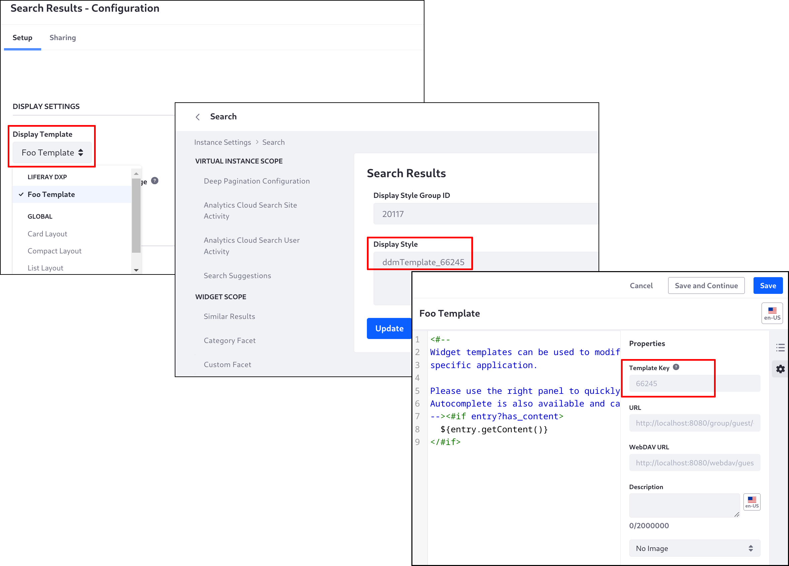

There are several out-of-the-box templates you can choose.

## Using the Out-of-the-Box Templates

You can use the out-of-the-box widget templates as-is or as inspiration for [creating your own widget template](#creating-a-search-widget-template). Here's a preview, so you can see which one works best for you. 

### Custom Filter

The Default template:

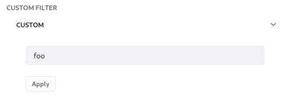

The Compact Layout template:

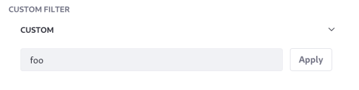

### Search Bar

The Default template:


The Left Aligned Icon Layout template:


!!! Note
    The Left Aligned Icon Layout template does not support [search bar suggestions](./search-bar-suggestions.md).

### Search Facets

A Default template is available for all search facet widgets:

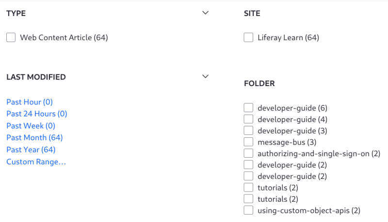

The Compact Layout template is available for all but the Modified Facet widget:

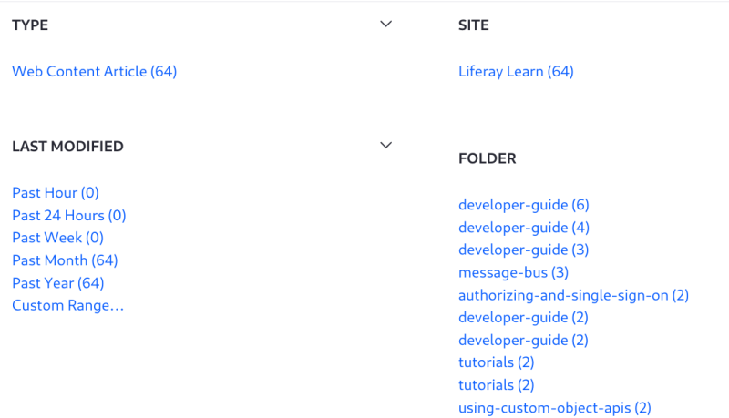

The Label Layout template is available for all but the Modified Facet widget:

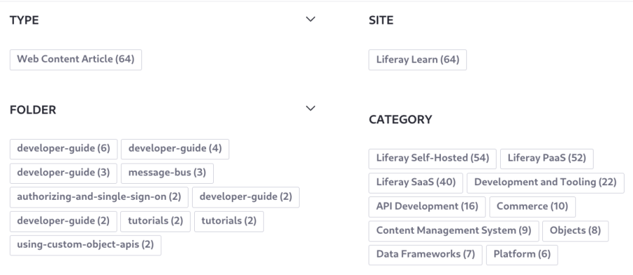

The Cloud Layout template is available for the Tag Facet and Category Facet widgets:


The Vocabulary Layout template is available for the [Category Facet widget](./search-facets/category-facet.md):

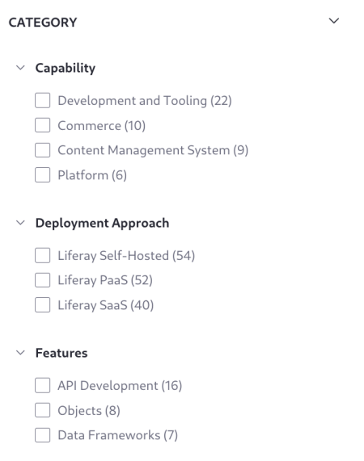

The Radio Layout template is available for the Modified Facet:

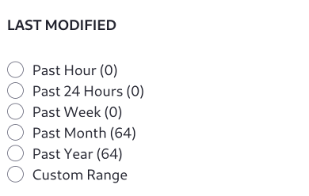

### Search Results

The List Layout template is the default:


The Card Layout:

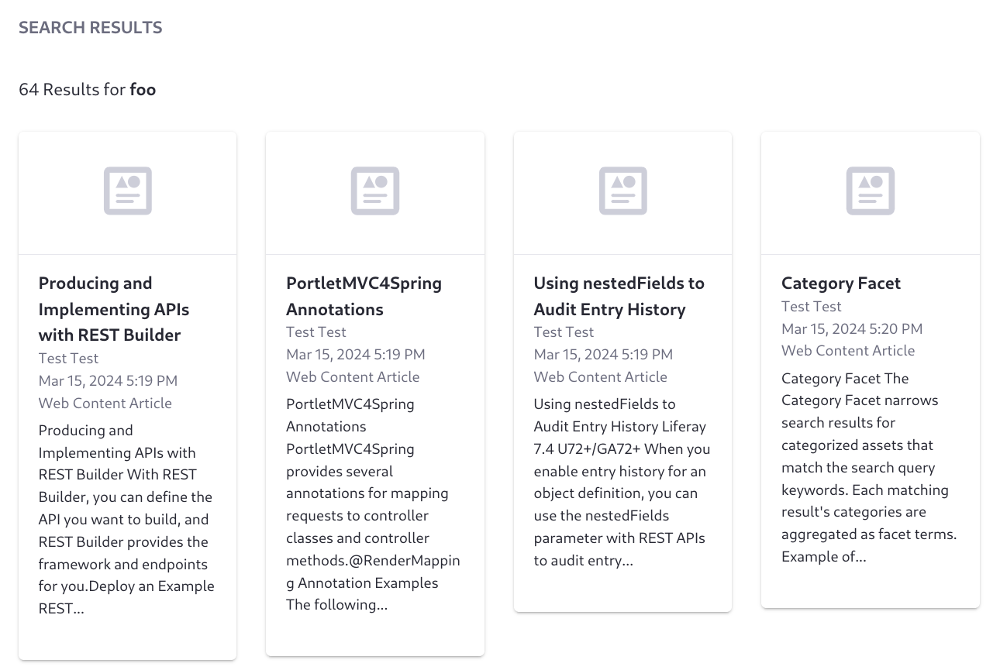

The Compact Layout:

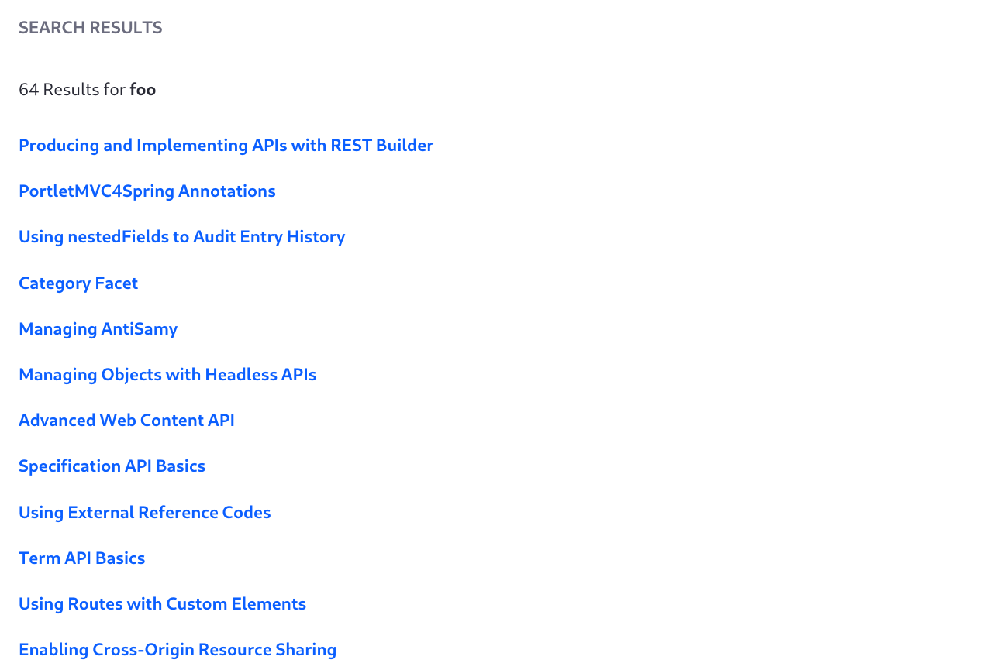

### Similar Results

The Compact Layout template is the default:


The List Layout template:

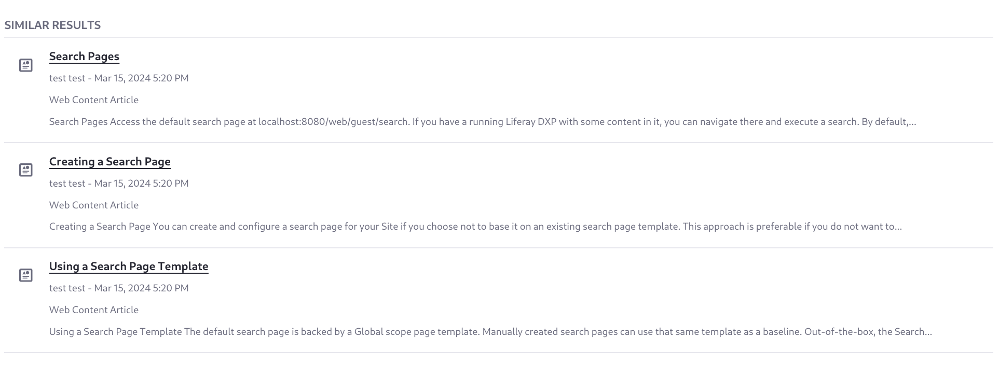

The Card Layout template:

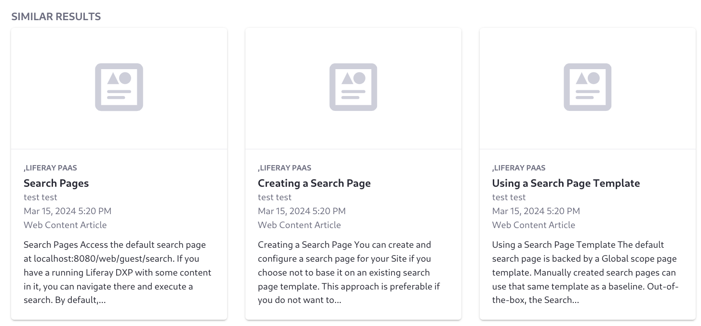

## Creating a Search Widget Template

1. Go to the site where you want to use the template.

   !!! note
       The out-of-the-box widget templates appear in the Global site. You can do the same or add yours to a specific site.

1. Open _Site_ &rarr; _Design_ &rarr; _Templates_.

1. Click the _Widget Templates_ tab.

1. Click _New_ &rarr; _More_.

1. From the list of widgets, choose the widget your template should target. 

   !!! Note
       The first listing for Search Results Template targets the Search Results widget, while the second listing with the same name targets the Commerce Search Results widget.

1. Using the editor's predefined variables, create your template using FreeMarker.

1. Click _Save_ when finished, or _Save and Continue_ to save your progress and continue working.

Once saved, you can select the template from the widget configuration.

You can accelerate template development by copying an existing template and modifying it as needed:

1. Go to the Global site. Click _Select Site_ () &rarr; _My Sites_ &rarr; _Global_.

1. Open _Site_ &rarr; _Design_ &rarr; _Templates_.

1. Click the _Widget Templates_ tab.

1. Search for the title of the template to copy. For example, search for _compact_ to start with the Compact Layout template. 

1. Find the entry for the widget you want, then click _Actions_ () &rarr; _Make a Copy_.

   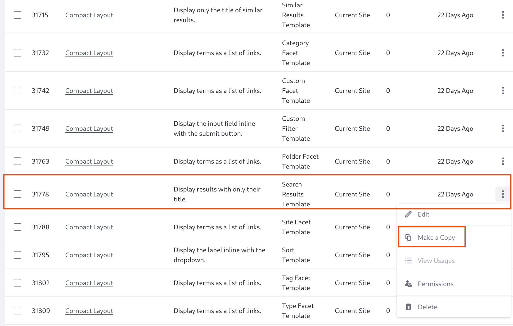

1. Using the editor's predefined variables and your own FreeMarker, create the template.

   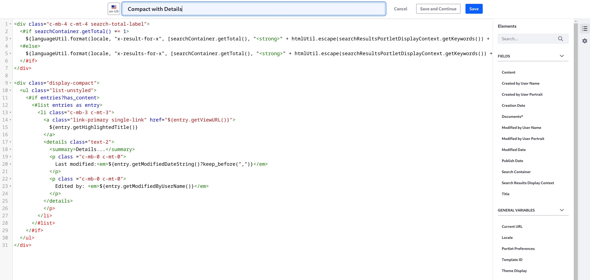

1. Click _Save_ when finished, or _Save and Continue_ to save your progress and continue working.

Once saved, you can select the template from the widget configuration.

## Example: Extending the Search Results Widget's Compact Layout Template

This example extends the Compact Layout template to include the last modified date of the result:

1. In the Global site's menu, open _Site_ &rarr; _Design_ &rarr; _Templates_ and click the _Widget Templates_ tab.

1. Search for _compact_, then click _Actions_ () &rarr; _Make a Copy_ for the Search Results Template.

1. Name it _Compact with Details_.

1. Your copy appears in the list with the others, so click _Compact with Details_ to begin editing.

1. Replace the template's list item block (the code from `<li>` to `</li>`) with this code:

   ```html
   <li class="c-mb-3 c-mt-3">
      <a class="link-primary single-link" href="${entry.getViewURL()}">
         ${entry.getHighlightedTitle()}
      </a>
      <details class="text-2">
         <summary>Details...</summary>
         <p class ="c-mb-0 c-mt-0">
            Last modified:<em>${entry.getModifiedDateString()?keep_before(",")}</em>
         </p>
         <#if entry.getModifiedByUserName()?has_content>
            <p class ="c-mb-0 c-mt-0">
               Edited by: <em>${entry.getModifiedByUserName()}</em>
            </p>
         </#if>
      </details>
   </li>
   ```

1. Click _Save_.

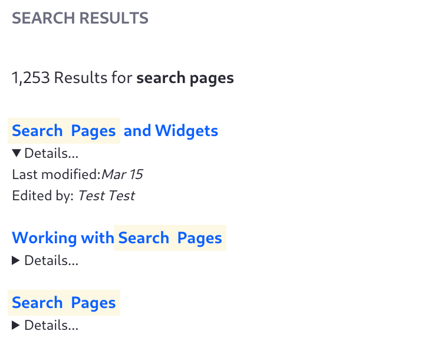

## Related Topics

* [Search Configuration Reference](../search-configuration-reference.md)
* [Styling Widgets with Widget Templates](../../site-building/displaying-content/additional-content-display-options/styling-widgets-with-widget-templates.md)
