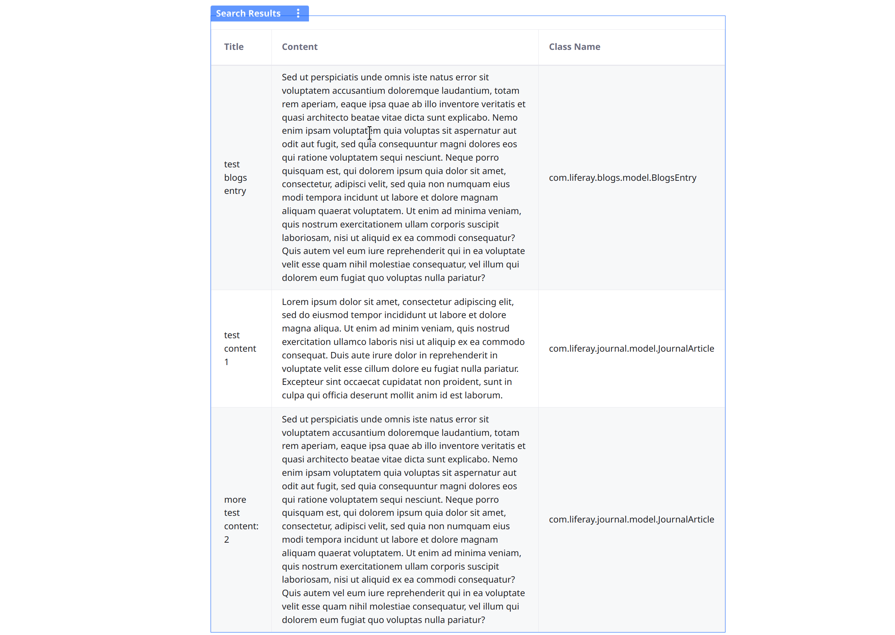

---
taxonomy-category-names:
- Search
- Search Pages and Widgets
- Widgets
- Liferay Self-Hosted
- Liferay PaaS
- Liferay SaaS
uuid: b1d411bc-c88e-4659-b779-91676fcf194f
---
# Search Results Widget Template Reference

While [creating a search results widget template](../using-search-widget-display-templates.md#creating-a-search-widget-template), you can access pre-populated variables in the FreeMarker template editor. The variables listed in the editor hint at what's possible, but there are many more variables available in the search results widget template context. The source code specific to your version contains the authoritative list of variables that are injected into the template context. 

These Java classes provide the available template variables for the Search Results widget. You can find them by searching <https://github.com/liferay/liferay-portal/tree/[$LIFERAY_LEARN_PORTAL_GIT_TAG$]>:

- `SearchContainer`: Some of the getters in this class are variables in the search results widget template. See the list below for what's available.
- `SearchResultsPortletDisplayContext`: All the getters in this class provide variables to the search results widget template (e.g., `getDisplayStyleGroupId()`).
- `SearchResultSummaryDisplayContext`: All the getters in this class provide variables to the search results widget template (e.g., `getDisplayStyleGroupId()`).

Here is an easier to digest list of the currently available variables:

| Editor Field Name | Description | Java Return Type | Usage Example |
| :---------------- | :---------- | :--- | :------------ |
| Documents | The collection of the search result entries. To see what's available for each entry, see the Search Result Entry Fields. | `List< SearchResultSummaryDisplayContext>` |  |
| Search Container | You can use the search container to build a grid with search results and their properties. | `SearchContainer` | See [Using the Search Container](#using-the-search-container) for an example. |
|  | The current results page number | `int` | `${searchContainer.getCur()}` |
|  | The current page number's parameter name | `String` | `${searchContainer.getCurParam()}` |
|  | The delta, or number of entries to display per page | `int` | `${searchContainer.getDelta()}` |
|  | The delta parameter name | `String` | `${searchContainer.getDeltaParam()}` |
|  | The index of the last result to show | `int` | `${searchContainer.getEnd()}` |
|  | An ID for the search container instance | `String` | `${searchContainer.getId(request, nameSpace)}` |
|  | The page URL for pagination | `PortletURL` | `${searchContainer.getIteratorURL()}` |
|  | Sort column | `String` | `${searchContainer.getOrderByCol()}` |
|  | Sort column parameter name | `String` | `${searchContainer.getOrderByColParam() }` |
|  | An order type for the columns, either ascending or descending | `String` | `${searchContainer.getOrderByType()}` |
|  | The parameter to order by | `String` | `${searchContainer.getOrderByTypeParam()}` |
|  | The Portlet request | `PortletRequest` | `${searchContainer.getPortletRequest()}` |
|  | The index of the last hit to show | `int` | `${searchContainer.getResultEnd()}` |
|  | The list of result documents | `List<Document>` | `${searchContainer.getResults()}` |
|  | The number of hits to skip from the beginning | `int` | `${searchContainer.getStart()}` |
|  | The total number of hits | `int` | `${searchContainer.getTotal()}` |
|  | Whether there are any results | `boolean` | `${searchContainer.hasResults()}` |
|  | Whether the user can choose the number of items displayed per page | `boolean` | `${searchContainer.isDeltaConfigurable()}` |
|  | Whether to use hover effects | `boolean` | `${searchContainer.isHover()}` |
| Search Results Display Context | Information about the current search and widget configuration | `SearchResultsDisplayContext` |  |
|  | The site ID where the widget template is located | `long` | `${searchResultsPortletDisplayContext.getDisplayStyleGroupId()}` |
|  | The retrieved search engine documents | `List<Document>` | `${searchResultsPortletDisplayContext.getDocuments()}` |
|  | The current search keywords | `String` | `${searchResultsPortletDisplayContext.getKeywords()}` |
|  | The search container | `SearchContainer` | `${searchResultsPortletDisplayContext.getSearchContainer()}` |
|  | The search results portlet instance configuration | `SearchResultsPortletInstanceConfiguration` | `${searchResultsPortletDisplayContext.getSearchResultsPortletInstanceConfiguration()}` |
|  | The search result summary context for the search engine document. See Search Result Entry Fields. | `SearchResultSummaryDisplayContext` | `${searchResultsPortletDisplayContext.getSearchResultSummaryDisplayContext(document)}` |
|  | The search result summary contexts. See Search Result Entry Fields. | `List<SearchResultSummaryDisplayContext>` | `${searchResultsPortletDisplayContext.getSearchResultSummaryDisplayContexts()}` |
|  | The total number of hits | `int` | `${searchResultsPortletDisplayContext.getTotalHits()}` |
|  | Whether the widget is visible | `boolean` | `${searchResultsPortletDisplayContext.isRenderNothing()}` |
|  | Whether the widget configuration enables showing an empty results message | `boolean` | `${searchResultsPortletDisplayContext.isShowEmptyResultMessage()}` |
|  | Whether the configuration enables pagination | `boolean` | `${searchResultsPortletDisplayContext.isShowPagination()}` |

There are variables you can use for each search result. Some appear in the template editor, but there are more:

| Editor Field Name | Description | Type | Usage Example |
| :---------------- | :---------- | :--- | :------------ |
|  | The asset's user ID. If the entry is a user the value is that user's ID. | `long` | `${entry.getAssetEntryUserId()}` |
|  | The asset's download URL | `String` | `${entry.getAssetRendererURLDownload()}` |
|  | The model class name of the entry | `String` | `${entry.getClassName()}` |
|  | The primary key of the entry's backing model | `long` | `${entry.getClassPK()}` |
| Content | The highlighted search result summary content | `String` | `${entry.getContent()}` |
| Creation Date | The entry creation date | `String` | `${entry.getCreationDateString()}` |
| Created by User Name | The full name of the entry creator | `String` | `${entry.getCreatorUserName()}` |
| Created by User Portrait | The URL to the entry creator's portrait/avatar | `String` | `${entry.getCreatorUserPortraitURLString()}` |
|  | The asset category ID request parameter name | `String` | `${entry.getFieldAssetCategoryIds()}` |
|  | The asset tag name request parameter name | `String` | `${entry.getFieldAssetTagNames()}` |
| Title | The highlighted title | `String` | `${entry.getHighlightedTitle()}` |
|  | The CSS icon class for the represented model class/asset entry type | `String` | `${entry.getIconId()}` |
|  | The summary language ID, if different from the current display language | `String` | `${entry.getLocaleLanguageId()}` |
|  | A notification text that the summary language ID is different from the current display language | `String` | `${entry.getLocaleReminder()}` |
|  | The label for the model class represented by the entry | `String` | `${entry.getModelResource()}` |
| Modified by User Name | The full name of the entry's last modifier | `String` | `${entry.getModifiedByUserName()}` |
| Modified by User Portrait | The URL to the last modifier's portrait/avatar | `String` | `${entry.getModifiedByUserPortraitURLString()}` |
| Modified Date | The entry's last modification date | `String` | `${entry.getModifiedDateString()}` |
|  | The path of the current theme's image directory | `String` | `${entry.getPathThemeImages()}` |
|  | The portlet URL for the search results portlet instance | `PortletURL` | `${entry.getPortletURL()}` |
| Publish Date | The entry's publication date | `String` | `${entry.getPublishedDateString()}` |
|  | The URL to a thumbnail for the backing asset entry | `String` | `${entry.getThumbnailURLString()}` |
|  | The title for the search result entry's backing asset | `String` | `${entry.getTitle()}` |
|  | The URL to the portrait/avatar of the user who created the backing asset entry | `String` | `${entry.getUserPortraitURLString()}` |
|  | The view URL for the search result entry | `String` | `${entry.getViewURL()}` |
|  | Whether the backing asset entry has asset categories or tags | `boolean` | `${entry.isAssetCategoriesOrTagsVisible()}` |
|  | Whether the asset's download URL is available | `boolean` | `${entry.isAssetRendererURLDownloadVisible()}` |
|  | Whether the summary content is available | `boolean` | `${entry.isContentVisible()}` |
|  | Whether the creation date is available | `boolean` | `${entry.isCreationDateVisible()}` |
|  | Whether the creator's portrait is available | `boolean` | `${entry.isCreatorUserPortraitVisible()}` |
|  | Whether the creator's name is available | `boolean` | `${entry.isCreatorVisible()}` |
|  | Whether the document display mode is enabled | `boolean` | `${entry.isDocumentFormVisible()}` |
|  | Whether the document fields for entries without class name or primary key available | `boolean` | `${entry.isFieldsVisible()}` |
|  | Whether the CSS icon class for the represented model class/asset entry type is available | `boolean` | `${entry.isIconVisible()}` |
|  | Whether the locale reminder text is available | `boolean` | `${entry.isLocaleReminderVisible()}` |
|  | Whether the label for the model class represented by this entry is available | `boolean` | `${entry.isModelResourceVisible()}` |
|  | Whether the last modifier's name is available | `boolean` | `${entry.isModifiedByUserNameVisible()}` |
|  | Whether the last modifier's portrait is available | `boolean` | `${entry.isModifiedByUserPortraitVisible()}` |
|  | Whether the last modification date is available | `boolean` | `${entry.isModifiedDateVisible()}` |
|  | Whether the published date is available | `boolean` | `${entry.isPublishedDateVisible()}` |
|  | Whether the entry is unavailable because of an error | `boolean` | `${entry.isTemporarilyUnavailable()}` |
|  | Whether a thumbnail is available for the asset | `boolean` | `${entry.isThumbnailVisible()}` |
|  | Whether the portrait is available for the asset entry creator | `boolean` | `${entry.isUserPortraitVisible()}` |

## Using the Search Container

Here's an example of setting up the search container to show your search results:

```html
<@liferay_ui["search-container"] searchContainer=searchContainer>

   <@liferay_ui["search-container-results"] results=searchContainer.results>

      <@liferay_ui["search-container-row"] 
         className="com.liferay.portal.kernel.search.Document"
         keyProperty="UID" modelVar="document"
      >

         <@liferay_ui["search-container-column-text"] 
            href="" name="Title" value=document.get("localized_title_en_US")
         />
      </@>
   </@>

   <@liferay_ui["search-iterator"] />
</@>
```

```html
<#assign localized_title_field="localized_title_${locale}"/>
<#assign localized_content_field="content_${locale}"/>

<@liferay_ui["search-container"] searchContainer=searchContainer>

   <@liferay_ui["search-container-results"] results=searchContainer.results>

      <@liferay_ui["search-container-row"] 
         className="com.liferay.portal.kernel.search.Document"
         keyProperty="UID" modelVar="document"
      >
				<@liferay_ui["search-container-column-text"] 
               href="" name="Title" value=document.get(localized_title_field)
            /> 
        
				<@liferay_ui["search-container-column-text"] 
               href="" name="Content" value=document.get(localized_content_field)
            /> 

				<@liferay_ui["search-container-column-text"] 
               href="" name="Class Name" value=document.get("entryClassName")
            /> 
      </@>
   </@>

   <@liferay_ui["search-iterator"] />
</@>
```



## Related Topics

* [Creating a Widget Template](../../../site-building/creating-pages/page-fragments-and-widgets/using-widgets/styling-widgets/creating-a-widget-template.md)
* [Page Fragments and Widgets](../../../site-building/creating-pages/page-fragments-and-widgets.md)
* _External Link_: [Customizing the Suggestions Drop-Down in the Search Bar Widget](https://liferay.dev/blogs/-/blogs/customizing-the-suggestions-dropdown-in-search-bar-widget)
