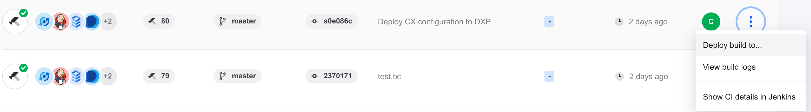
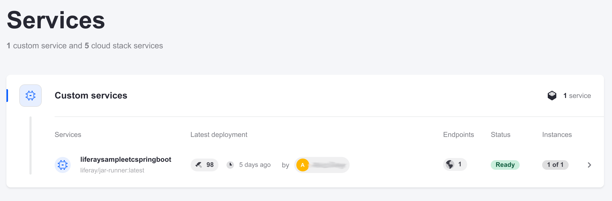
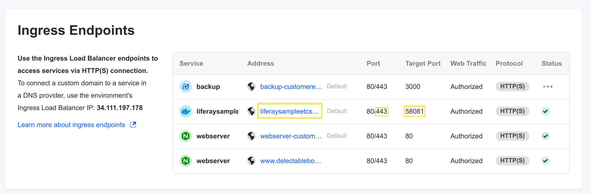
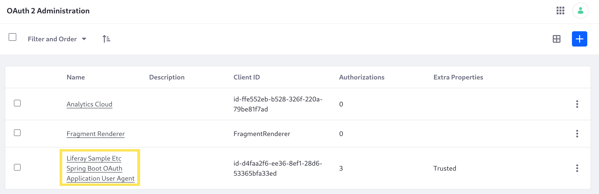
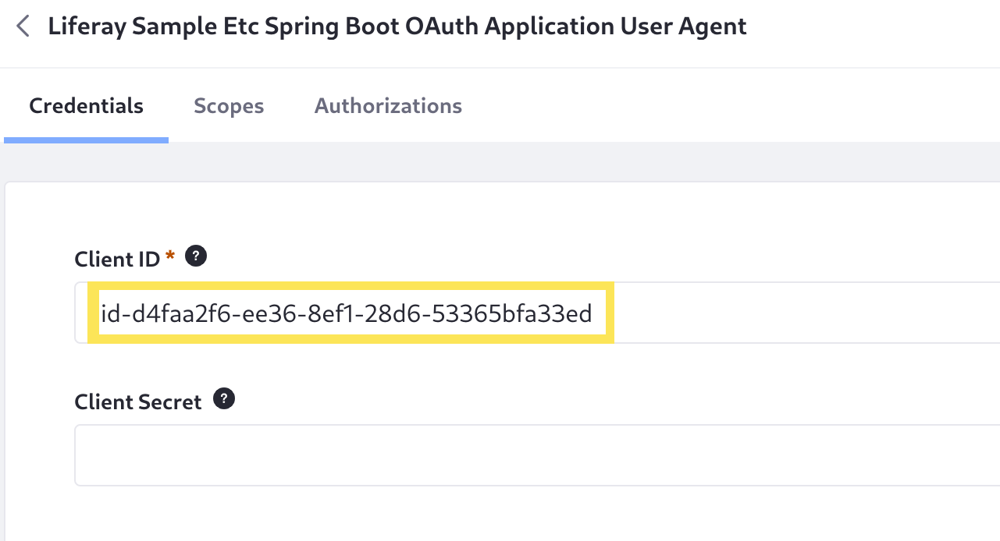
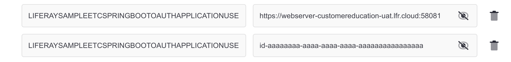
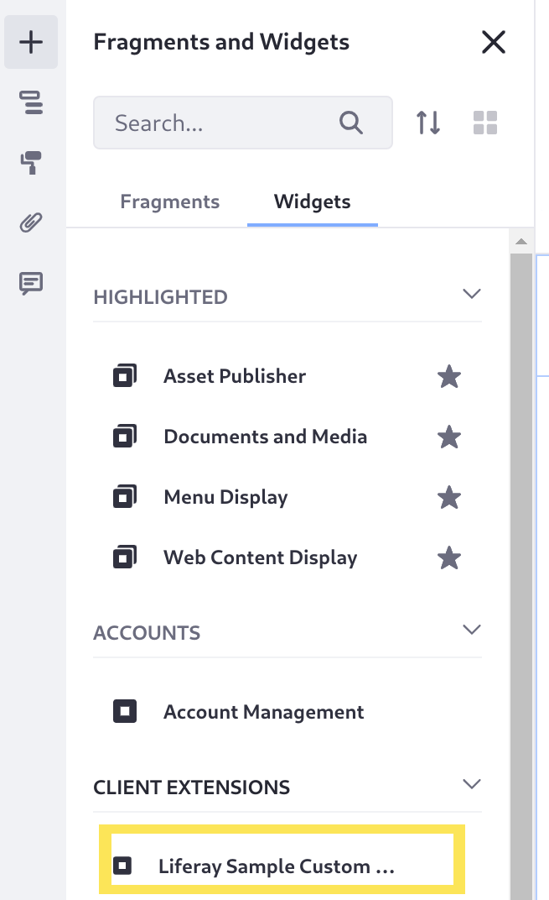
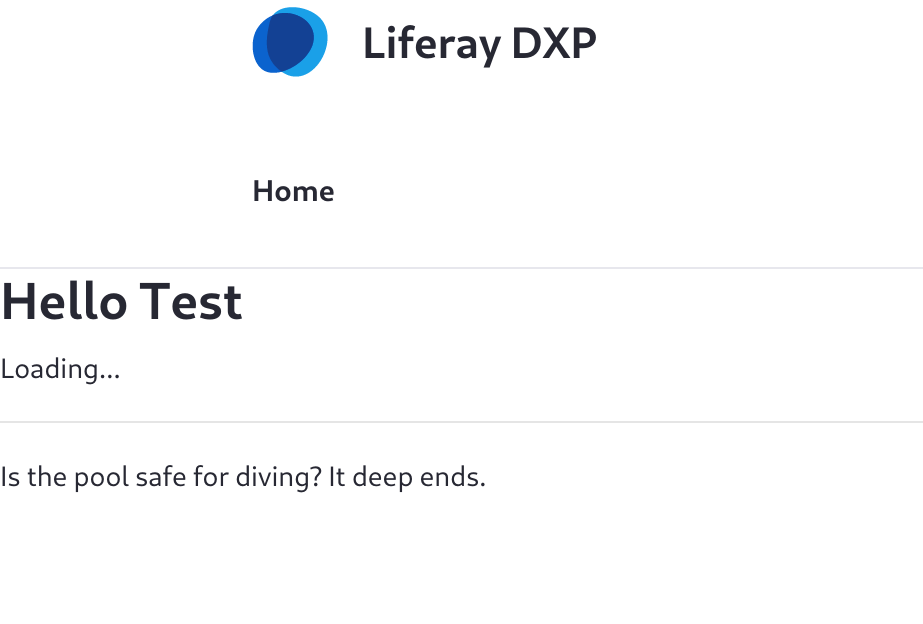

---
taxonomy-category-names:
- Cloud Platform Administration
- Reference
- Liferay PaaS
uuid: 240d0998-8a75-4e99-a9fa-27e581b2c28a
---
# Deploying Microservice Client Extensions to Liferay PaaS

In most cases, you can deploy client extensions with Liferay PaaS similarly to [self-hosted instances](https://learn.liferay.com/w/dxp/liferay-development/client-extensions/working-with-client-extensions#deploying-to-a-self-hosted-liferay-instance).

Deploy frontend, configuration, and batch client extensions with this procedure:

1. Place your client extension project folder in your PaaS Liferay workspace's `client-extensions/` folder (`liferay/configs/[ENV]/client-extensions/`).

1. Create a new build of the Liferay service and [deploy it to your environment](../updating-services-in-liferay-paas/deploying-changes-via-the-liferay-cloud-console.md).

The client extension is added as part of the Liferay Docker image, and it works on its own within Liferay.

However, [microservice client extensions](https://learn.liferay.com/web/guest/w/dxp/liferay-development/integrating-microservices) require more work to deploy to Liferay PaaS. Here, you'll learn about the process and walk through it with Liferay's sample workspace.

## Deploying Microservice Client Extensions

{bdg-secondary}`Requires [Liferay workspace 10.0.0+](https://learn.liferay.com/w/dxp/liferay-development/tooling/liferay-workspace/configuring-liferay-workspace#updating-liferay-workspace-and-bundled-plugins)`

Here is the general procedure for using microservice client extensions in Liferay PaaS:

1. [Prepare Your Liferay Workspace](#prepare-your-liferay-workspace)

1. [Configure Required Environment Variables in `LCP.json`](#configure-required-environment-variables)

    Additional environment variables are required to ensure that Liferay DXP can communicate with your microservice, which runs in a separate Cloud container. See [the tables here](#environment-variables-reference) for a complete list.
    
1. [Deploy the Client Extension to Liferay DXP](#build-and-deploy-the-client-extensions-with-liferay-dxp)

    Microservice client extension projects must include a client extension to authenticate with Liferay (such as an [OAuth user agent client extension](https://learn.liferay.com/web/guest/w/dxp/liferay-development/configuration-as-code#oauth-user-agent-client-extensions)). This step deploys that as a configuration on Liferay DXP's side.

1. [Deploy the Microservice to Your Cloud Environment](#deploy-the-microservice-to-your-cloud-environment)

    This step deploys the microservice as a separate service, running in its own container outside of Liferay.

1. [Update the OAuth 2.0 Profile](#update-the-oauth-2-0-profile)

    An OAuth 2.0 profile is automatically created when you deploy the client extension to Liferay DXP, but you need to update the network configuration to work with your microservice.

1. [Update the Microservice's Environment Variables](#update-environment-variables)

    This step adds the last environment variables required for deployment. You must have already deployed your client extensions to confirm the values for these final variables.

Most of these steps are exclusive to microservice client extensions because of their unique requirements for securely communicating in the Cloud network.

Try it yourself with a microservice using an OAuth user agent client extension. This example uses the Liferay sample workspace's [Spring Boot microservice](https://learn.liferay.com/w/dxp/liferay-development/integrating-microservices/using-a-microservice-client-extension).

## Prepare Your Liferay Workspace

If you haven't already done so, download the Liferay sample workspace:

```bash
curl -o com.liferay.sample.workspace-latest.zip https://repository.liferay.com/nexus/service/local/artifact/maven/content\?r\=liferay-public-releases\&g\=com.liferay.workspace\&a\=com.liferay.sample.workspace\&\v\=LATEST\&p\=zip
```

This `.zip` file includes a workspace with a variety of sample client extensions, including the two needed for this walkthrough:

* `liferay-sample-etc-spring-boot`, the microservice client extension project. It also contains an OAuth user agent client extension for authentication.

* `liferay-sample-custom-element-2`, a frontend client extension with a custom widget. You'll use this client extension to retrieve data from the microservice in Liferay and demonstrate the successful connection between them.

Unzip the workspace and copy the `client-extensions/` folder into your PaaS project repository's `liferay/configs/[ENV]/` folder. Merge it with the existing client extensions folder if you already have one.

!!! note
    Alternatively, you can copy all of the `.zip` folder contents into your workspace, but make sure you are not overwriting any of your own important configurations in existing files such as `settings.gradle`.

## Configure Required Environment Variables

Before you build and deploy the microservice, add some environment variables to configure it for communication with Liferay.

1. In the copied `client-extensions/liferay-sample-etc-spring-boot/` folder, open the `LCP.json` file.

1. In the `env` block, [add new environment variables](https://learn.liferay.com/w/liferay-cloud/reference/defining-environment-variables#defining-environment-variables-via-lcpjson) with these values:

    * **COM_LIFERAY_LXC_DXP_DOMAINS**: Your website's domain. (If you haven't configured a custom domain for your UAT Liferay instance, the value will be something like `webserver-mysite-uat.lfr.cloud`).

    * **COM_LIFERAY_LXC_DXP_MAIN_DOMAIN**: Your website's domain.

    * **COM_LIFERAY_LXC_DXP_SERVER_PROTOCOL**: `https`

    * **LIFERAY_OAUTH_APPLICATION_EXTERNAL_REFERENCE_CODES**: `liferay-sample-etc-spring-boot-oauth-application-user-agent`

    These environment variables are all [required for any microservice client extension](#all-microservice-client-extensions) in Liferay PaaS.

1. Add all of the additional environment variables required to authenticate with an [OAuth user agent client extension](#oauth-user-agent-client-extensions), except for `[ERC]_OAUTH2_USER_AGENT_AUDIENCE` and `[ERC]_OAUTH2_USER_AGENT_CLIENT_ID` (which are better to configure after you've deployed it).

    Replace `[ERC]` in each environment variable name with `LIFERAYSAMPLEETCSPRINGBOOTOAUTHAPPLICATIONUSERAGENT`. You can use the [example values listed in the table](#oauth-user-agent-client-extensions) for this example, because the routes and scopes won't change.

    ```json
    "env": {
        "COM_LIFERAY_LXC_DXP_DOMAINS": "webserver-customereducation-uat.lfr.cloud",
        "COM_LIFERAY_LXC_DXP_MAIN_DOMAIN": "webserver-customereducation-uat.lfr.cloud",
        "COM_LIFERAY_LXC_DXP_SERVER_PROTOCOL": "https",
        "LIFERAY_OAUTH_APPLICATION_EXTERNAL_REFERENCE_CODES": "liferay-sample-etc-spring-boot-oauth-application-user-agent",
        "LIFERAYSAMPLEETCSPRINGBOOTOAUTHAPPLICATIONUSERAGENT_OAUTH2_AUTHORIZATION_URI": "/o/oauth2/authorize",
        "LIFERAYSAMPLEETCSPRINGBOOTOAUTHAPPLICATIONUSERAGENT_OAUTH2_INTROSPECTION_URI": "/o/oauth2/introspect",
        "LIFERAYSAMPLEETCSPRINGBOOTOAUTHAPPLICATIONUSERAGENT_OAUTH2_JWKS_URI": "/o/oauth2/jwks",
        "LIFERAYSAMPLEETCSPRINGBOOTOAUTHAPPLICATIONUSERAGENT_OAUTH2_REDIRECT_URIS": "/o/oauth2/redirect",
        "LIFERAYSAMPLEETCSPRINGBOOTOAUTHAPPLICATIONUSERAGENT_OAUTH2_TOKEN_URI": "/o/oauth2/token",
        "LIFERAYSAMPLEETCSPRINGBOOTOAUTHAPPLICATIONUSERAGENT_OAUTH2_USER_AGENT_SCOPES": "Liferay.Headless.Admin.Workflow.everything"
    },
    ```

    !!! tip
        You can also deploy your client extension LUFFA to a local (self-hosted) Liferay instance to see the default values for these variables. Deploy the client extension with `../../gradlew clean deploy`, then examine the contents of each of the [routes](https://learn.liferay.com/w/dxp/liferay-development/client-extensions/working-with-client-extensions#routes) contained in the instance's `routes/default/liferay-sample-etc-spring-boot/` folder.

Now you're ready to deploy your client extensions to Liferay.

## Build and Deploy the Client Extensions with Liferay DXP

The Liferay workspace in your PaaS repository's `liferay/` folder automatically builds and deploys the code in it, including your client extensions.

Next, create and deploy a new build with your Spring Boot and custom element client extensions so they are available in Liferay DXP.

1. From the root folder of your repository, create a new branch and commit the change.

    ```bash
    git checkout -b client-extensions
    ```

    ```bash
    git add .
    ```

    ```bash
    git commit -m "Deploy client extensions to Liferay DXP."
    ```

1. Push the change up to create a build.

    ```bash
    git push origin client-extensions
    ```

    After a delay, the new build is created. The client extensions are automatically deployed to [the Liferay service container's `osgi/client-extensions/` folder](https://learn.liferay.com/w/dxp/liferay-development/client-extensions/working-with-client-extensions#deploying-to-a-self-hosted-liferay-instance).

1. In the Liferay Cloud console, navigate to the *Builds* page.

1. Click the Actions menu () &rarr; *Deploy build to...*

    

1. Select your production environment from the *Select environment* drop-down menu.

1. Click the checkboxes acknowledging the impact of the change.

1. Click *Deploy build*.

After a delay, your Liferay service redeploys with both a new custom widget to place on pages (called "Liferay Sample Custom Element 2") and an OAuth 2.0 configuration for the microservice.

## Deploy the Microservice to Your Cloud Environment

Now Liferay DXP has the necessary configurations deployed, but the Spring Boot microservice isn't running yet. The microservice must run as a separate service, in its own container.

1. In the Liferay sample workspace, navigate back to the `client-extensions/liferay-sample-etc-spring-boot/` folder.

1. Build the client extension.

    ```bash
    ../../gradlew clean build
    ```

    The client extension builds into a LUFFA in the `dist/` folder.

1. Deploy the client extension LUFFA with the LCP tool.

    ```bash
    lcp deploy --extension dist/liferay-sample-etc-spring-boot.zip
    ```

    The tool may prompt you to use your browser to authenticate with Liferay Cloud if you haven't already.

1. When prompted, select your UAT environment from the list.

After a delay, the client extension appears as its own service in your UAT environment. It can't connect to Liferay DXP yet, though, because you need to authenticate it with OAuth 2.0.



## Update the OAuth 2.0 Profile

An OAuth 2.0 profile is automatically created in Liferay, but it still has some placeholder values meant for local testing that you must adjust.

### Check Your Microservice's Network Information

First, check your microservice's URL and port information in the Cloud network.

1. In the Cloud console, navigate to your UAT environment.

1. Click *Network* from the menu on the left.

    The Network page shows the network information to access each service with HTTPs.

1. Copy the values from the client extension service's *Address* and *Target Port* fields, as well as the second number in the *Port* field (which is used for HTTPS connections). Make a note of them separately to use later.

    

### Update the OAuth 2.0 Profile's Network Information

1. Log into your UAT Liferay instance as an administrator.

1. Click the Applications menu () &rarr; *Control Panel* &rarr; *OAuth 2 Administration*.

1. Click the *Liferay Sample Etc Spring Boot OAuth Application User Agent* profile.

    

1. Update the *Website URL* field with your microservice's URL you copied previously. Remove any trailing slash and append a colon and the value you copied for the HTTPS port, like this example:

    ```
    https://liferaysampleetcspringboot-customereducation-uat.lfr.cloud:443
    ```

1. In the *Callback URIs* field, replace *localhost* in the existing string with your Liferay instance's URL (not including `https://`), like this example:

    ```
    @protocol@://www.mysite.com@port-with-colon@/o/oauth2/redirect
    ```

1. At the bottom of the page, click *Save*.

Now your OAuth 2.0 profile has the correct network information. Now you only need to configure the last couple of environment variables for your client extension service.

## Update Environment Variables

1. While you're still on your OAuth 2.0 profile's page, copy the *Client ID* value at the top.

    

1. Go back to the Liferay Cloud console and navigate to your UAT environment.

1. Click *Services* &rarr; the *liferaysampleeetcspringboot* service.

1. On the service's environment variables page, add two new environment variables using the values you copied previously:

    * **LIFERAYSAMPLEETCSPRINGBOOTOAUTHAPPLICATIONUSERAGENT_OAUTH2_USER_AGENT_AUDIENCE**: `https://[Your Liferay domain]:[Target port]`

    * **LIFERAYSAMPLEETCSPRINGBOOTOAUTHAPPLICATIONUSERAGENT_OAUTH2_USER_AGENT_CLIENT_ID**: `[Client ID]`

    

1. Click *Save changes*.

1. Click the Actions menu at the top of the screen () &rarr; *Restart service*.

The service restarts, and it can successfully connect with the Liferay service.

!!! tip
    Your UAT environment's basic authentication configuration can also potentially prevent communication between Liferay and the microservice. If the connection is still not successful, you can temporarily disable basic authentication while you test the microservice in UAT. To disable it, remove the `auth_basic "Authentication Required";` line from the `webserver/configs/uat/conf.d` file in your repository and redeploy the web server service.

## Test the Connection with Your Custom Element

Now you're ready to test the connection with the custom element you deployed to Liferay.

1. Navigate and log into your UAT Liferay instance.

1. On your site's home page, click the Edit icon () at the top of the page.

1. From the *Fragments and Widgets* menu on the left side of the screen, click *Widgets*.

1. Drag the *Liferay Sample Custom Element 2* widget onto the page.

    

1. Click *Publish* at the top of the page.

The page publishes and the custom widget loads a message with a joke. The joke message is retrieved from your microservice client extension, running in a separate container from Liferay.



!!! note
    This custom element also integrates with the `liferay-sample-etc-node` client extension. If you haven't deployed and properly configured that client extension, too, an additional message appears but doesn't finish loading (like in the image above). Errors also appear in the browser console, because it cannot communicate with the expected microservice.

## Environment Variables Reference

### All Microservice Client Extensions

These environment variables are required for *all* microservice client extensions.

| **Environment Variable** | **Value Type** | **Example Value** |
| :--- | :--- | :--- |
| COM_LIFERAY_LXC_DXP_DOMAINS | Comma-delimited string | `www.mysite.com,www.extrasite.com` |
| COM_LIFERAY_LXC_DXP_MAIN_DOMAIN | String | `www.mysite.com` |
| COM_LIFERAY_LXC_DXP_SERVER_PROTOCOL | String | `https` |
| LIFERAY_OAUTH_APPLICATION_EXTERNAL_REFERENCE_CODES | Comma-delimited string | `liferay-sample-etc-spring-boot-oauth-application-user-agent` |

### OAuth Headless Server Client Extensions

These environment variables are required for any microservice client extensions that authenticate using an [OAuth headless server client extension](https://learn.liferay.com/web/guest/w/dxp/liferay-development/configuration-as-code#oauth-headless-server-client-extensions).

Replace `ERC` in each variable name with your OAuth headless server client extension's external reference code *converted to upper case and with all dashes removed* (e.g., `LIFERAYSAMPLEETCCRONOAUTHAPPLICATIONHEADLESSSERVER`).

| **Environment Variable** | **Value Type** | **Example Value** |
| :--- | :--- | :--- |
| [ERC]_OAUTH2_HEADLESS_SERVER_AUDIENCE | String | `https://www.mysite.com:58081` |
| [ERC]_OAUTH2_HEADLESS_SERVER_CLIENT_ID | String | `id-aaaaaaaa-aaaa-aaaa-aaaa-aaaaaaaaaaaa` |
| [ERC]_OAUTH2_HEADLESS_SERVER_CLIENT_SECRET | String | `secret-aaaaaaaa-aaaa-aaaa-aaaa-aaaaaaaaaaaa` |
| [ERC]_OAUTH2_AUTHORIZATION_URI | String | `/o/oauth2/authorize` |
| [ERC]_OAUTH2_INTROSPECTION_URI | String | `/o/oauth2/introspect` |
| [ERC]_OAUTH2_JWKS_URI | String | `/o/oauth2/jwks` |
| [ERC]_OAUTH2_REDIRECT_URIS | String | `/o/oauth2/redirect` |
| [ERC]_OAUTH2_TOKEN_URI | String | `/o/oauth2/token` |
| [ERC]_OAUTH2_USER_AGENT_SCOPES | Comma-delimited string | `Liferay.Headless.Admin.Workflow.everything` |

### OAuth User Agent Client Extensions

These environment variables are required for any microservice client extensions that authenticate using an [OAuth user agent client extension](https://learn.liferay.com/web/guest/w/dxp/liferay-development/configuration-as-code#oauth-user-agent-client-extensions).

Replace `ERC` in each variable name with your OAuth headless server client extension's external reference code *converted to upper case and with all dashes removed* (e.g., `LIFERAYSAMPLEETCSPRINGBOOTOAUTHAPPLICATIONUSERAGENT`).

| **Environment Variable** | **Value Type** | **Example Value** |
| :--- | :--- | :--- |
| [ERC]_OAUTH2_USER_AGENT_AUDIENCE | String | `https://www.mysite.com:58081` |
| [ERC]_OAUTH2_USER_AGENT_CLIENT_ID | String | `id-aaaaaaaa-aaaa-aaaa-aaaa-aaaaaaaaaaaa` |
| [ERC]_OAUTH2_AUTHORIZATION_URI | String | `/o/oauth2/authorize` |
| [ERC]_OAUTH2_INTROSPECTION_URI | String | `/o/oauth2/introspect` |
| [ERC]_OAUTH2_JWKS_URI | String | `/o/oauth2/jwks` |
| [ERC]_OAUTH2_REDIRECT_URIS | String | `/o/oauth2/redirect` |
| [ERC]_OAUTH2_TOKEN_URI | String | `/o/oauth2/token` |
| [ERC]_OAUTH2_USER_AGENT_SCOPES | Comma-delimited string | `Liferay.Headless.Admin.Workflow.everything` |

## Related Topics

* [Integrating Microservices](https://learn.liferay.com/w/dxp/liferay-development/integrating-microservices)
* [Using a Microservice Client Extension](https://learn.liferay.com/w/dxp/liferay-development/integrating-microservices/using-a-microservice-client-extension)
