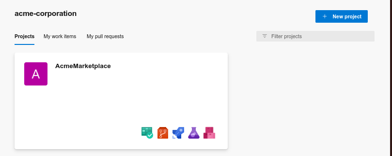
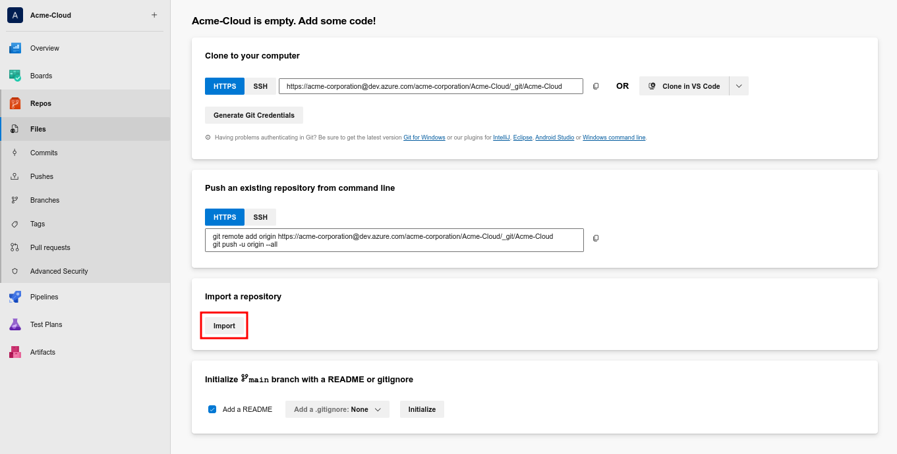
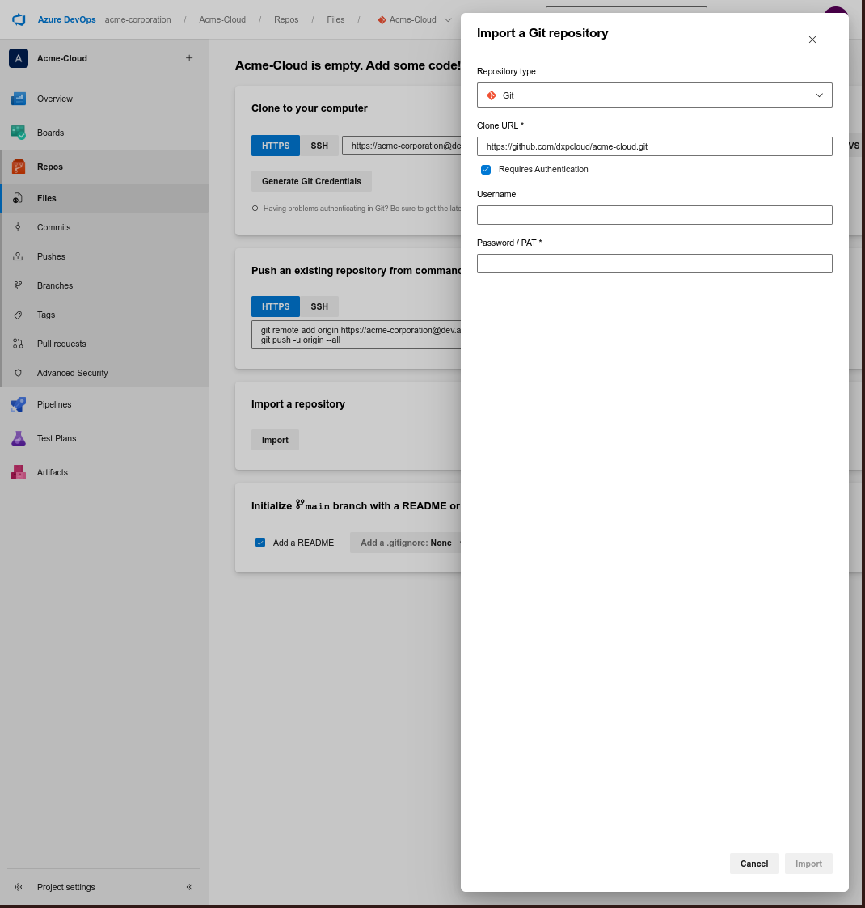
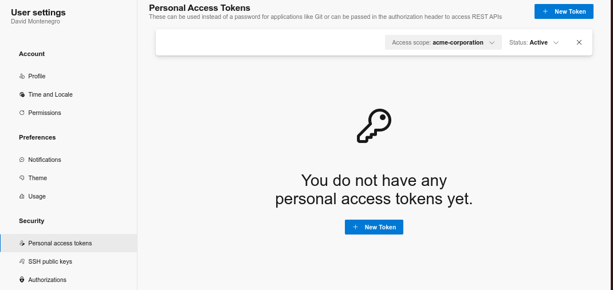

---
taxonomy-category-names:
- Cloud
- Cloud Platform Administration
- Liferay PaaS
uuid: 2bb866ab-12f8-45ee-bc20-5ea889744925
---
# Configuring Your Azure Repository

Upon receiving a Liferay Cloud onboarding email, you're provisioned a GitHub repository hosted in the `dxpcloud` organization. This repository is a template for a team's separate private Liferay Cloud development repository and is typically removed after 10 business days. Users must:

1. Transfer the provisioned repository to their own private repository.
1. Integrate their private repository with the Jenkins (CI) service in Liferay Cloud using a Webhook.

The provisioned repository will be on GitHub, but you can transfer it to a GitLab repository as of version 3.2.0 of the Jenkins service. This must be done with administrative access to the GitLab repository.

!!! note
    The repository's administrators *are not necessarily the same* as your project's administrators in the Cloud console.

## Preparing the Jenkins Service

If you've customized your Jenkinsfile, follow this guide to [extend the default Jenkinsfile](../platform-services/continuous-integration.md#extending-the-default-jenkinsfile).

## Importing from GitHub to Azure

1. Go to [Azure DevOps](https://dev.azure.com/).

1. Click *New project*.

   

1. Provide a name for the project.

1. Ensure the visibility is set to private.

1. Click *Repos* in the side navigation.

1. Click *Import* under *Import a repository*.

   

1. Insert the GitHub repository's URL into *Clone URL*.

1. Select *Requires Authentication*.

   

1. Fill out the Username and Password/PAT fields and click *Import*.

1. In the terminal, clone the provisioned GitHub repository locally:

   ```git clone git@github.com:dxpcloud/example.git```

   !!! note
       If you have already cloned the repository for work with another provider, then you can skip this step and work within the same clone.

1. Add a new Git remote and point to Azure:

   ```git remote add azure ORGANIZATION@dev.azure.com:ORGANIZATION/PROJECTNAME/_git/PROJECTNAME```

1. Push the cloned repository to the new remote repository:

   ```git push azure master```

If you need help creating, cloning, and pushing repositories, see [Azure's documentation](https://learn.microsoft.com/en-us/azure/devops/user-guide/code-with-git?toc=%2Fazure%2Fdevops%2Fget-started%2Ftoc.json&view=azure-devops).

## Generating Access Tokens for Azure

Next, create an access token that will be used by the Webhook to trigger Jenkins builds:

1. Navigate to the personal access tokens page.

   

1. Click *New Token*.

1. Provide a name and an expiration date for this token.

1. Configure the access token to have the following permission:

   - **Code**: Read

## Connecting Azure to Your Jenkins Service

Lastly, set environment variables in the Jenkins service's to point to your new repository:

1. Log in to the Liferay Cloud Console and navigate to your Jenkins service in the `infra` environment.

1. Navigate to the *Environment Variables* tab.

1. Configure the following environment variables:

| Name                          | Value          |
| :---------------------------- | :------------- |
| `LCP_CI_SCM_PROVIDER`         | azure-devops   |
| `LCP_CI_SCM_REPOSITORY_OWNER` | [repo_owner]   |
| `LCP_CI_SCM_REPOSITORY_NAME`  | [repo_name]    |
| `LCP_CI_SCM_TOKEN`            | [access_token] |

After updating these environment variables, the Jenkins service restarts. Any pushed branches and pull requests in your new repository trigger builds.

## Verifying Builds

Pushed branches trigger builds that you can see or deploy from the *Builds* tab in the Liferay Cloud Console. After setting up integration with the Jenkins service, a good next step is to verify these builds, to ensure that the integration was successful. Verify that new Git pushes trigger Jenkins builds:

1. Make a change to the repository (like adding a file), then commit it to the branch:

   ```bash
   git commit -m "Add file to test builds"
   ```

1. Push the branch up to Azure DevOps:

   ```bash
   git push azure branch-name
   ```

1. Navigate to the *Builds* page in the Liferay Cloud Console.

1. Verify that the build displays for the pushed branch on the *Builds* page.

## Related Topics

- [Configuring Your GitHub Repository](./configuring-your-github-repository.md)
- [Configuring Your BitBucket Repository](./configuring-your-bitbucket-repository.md)
- [Configuring Your GitLab Repository](./configuring-your-gitlab-repository.md)
