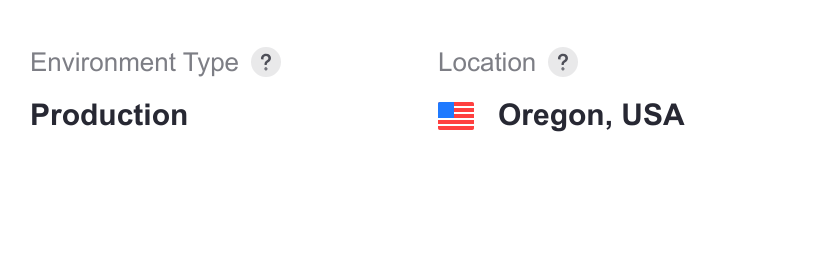

---
taxonomy-category-names:
- Cloud
- Cloud Platform Administration
- Liferay PaaS
uuid: b08cc158-6f2f-446e-bd60-1f5da22a7d72
---
# Liferay PaaS Go-Live Checklist

Liferay Cloud is committed to your project's smooth launch. This go-live checklist should help you catch potential issues in advance and optimize your Cloud environments.

These items are *critical* to review before you go live:

- Your [plan quotas](#subscription-plan-quotas)

- Regularly scheduled [backups](#backups)

- Project performance, including [stress testing](#stress-testing)

- Any registered [custom domains](#custom-domains)

- Correctly configured [auto-scaling](#auto-scaling)

- [Deploying without downtime](#zero-downtime-deployments)

- Your [team members](#team-membership) invited and given the proper permissions

Prioritize these items as you go through this checklist so that your project launch is successful.

## Reviewing Your Project Architecture

The goal of reviewing your project architecture is to be sure your environment, services, and features are optimized to achieve the end result of what you're building.

### Environment Specifications

Confirm that your production environment matches your subscription. On your production environment's *Settings* page, the *Environment Type* should show as: **Production**.

For more information, see [Environment Type](https://learn.liferay.com/en/w/liferay-cloud/getting-started/understanding-liferay-cloud-environments#environment-type).

### Service Versions

Check your production environment's services and confirm they are up-to-date. Compare the versions in your environment with the [latest versions here](https://help.liferay.com/hc/en-us/sections/360006251311-Services-Changelog).

### Clustering

Confirm that clustering is properly configured, if you have a High Availability production environment. See [Setting Up Clustering in Liferay Cloud](../customizing-liferay-dxp-in-the-cloud/using-the-liferay-dxp-service/setting-up-clustering-in-liferay-cloud.md).

### Development Life Cycle and Workflow

Deploy test builds to confirm that the Software Development Life Cycle (SDLC) is working properly. When you generate a build with Liferay Cloud's CI, it should appear on the Builds page in the Liferay Cloud console. Builds should be deployed from the Deployments page.

Here is more information about the SDLC and how to use it:

- [Overview of the Liferay Cloud Deployment Workflow](../updating-services-in-liferay-paas/overview-of-the-liferay-cloud-deployment-workflow.md)

- [Deploying Changes via the Liferay Cloud Console](../updating-services-in-liferay-paas/deploying-changes-via-the-liferay-cloud-console.md)

- [Deploying Changes via the CLI Tool](../updating-services-in-liferay-paas/deploying-changes-via-the-cli-tool.md)

- [Automatically Deploying CI Service Builds](../updating-services-in-liferay-paas/automatically-deploying-ci-service-builds.md)

## Reviewing Your Metrics

Your metrics include items such as the alerts you may receive, your quotas, and your ability to profile your environment. Adjust these properly before going into production.

### Subscription Plan Quotas

Deploy to all of your environments to confirm each of their quotas. If you have changed the resource allocation for some services, revert these changes for your production environment before you go live.

See [Quotas and Resource Usage](../manage-and-optimize/quotas-and-resource-usage.md) for more information.

### Dynatrace

If you purchased High Availability or Dynatrace add-ons, check your subscription to confirm which environments should have Dynatrace set up to detect issues. Your project's main contributors should have access to a Dynatrace dashboard to diagnose issues.

See [Integrating Dynatrace with Production Environments](../manage-and-optimize/application-metrics.md#integrating-dyanatrace-with-production-environments) for more information.

### Alerts

Check the bell icon on the top-right of the Liferay Cloud console to check for any alerts that must be addressed.

Confirm that your project's main contributors also have updated their preferences to receive alerts via email. See [Real-Time Alerts](../manage-and-optimize/real-time-alerts.md) for more information.

## Reviewing Your Continuity Plan

Your continuity plan includes items to ensure your site keeps running through various events.

### Backups

Your production environment should take automatic backups on a fixed frequency. Check the frequency to ensure it matches your project's needs.

Additionally, run a manual backup and restore it to your environment to make sure this process is working correctly. See the [Backup Service](../platform-services/backup-service.md) and [Restoring an Environment from the Backups Page](../platform-services/backup-service/restoring-data-from-a-backup.md#restoring-an-environment-from-the-backups-page) for more information.

### Auto-Scaling

If you have clustering configured, you should activate and test auto-scaling in your environment before going live. See [Auto-Scaling](../manage-and-optimize/auto-scaling.md) for more information.

### Disaster Recovery

If you purchased a Disaster Recovery environment, simulate a disaster scenario and verify how fast you can recover the environment in case of a regional outage.

See the [Disaster Recovery Overview](../support-and-troubleshooting/troubleshooting-tools-and-resources/disaster-recovery-overview.md) for more information.

### Zero-Downtime Deployments

Deploy to your environments to verify that they do not cause downtime. If they do, consider adjusting your liveness and readiness probes.

See [Self-Healing](../support-and-troubleshooting/troubleshooting-tools-and-resources/self-healing.md) for more information.

## Reviewing Your Project's Benchmarks

Your performance benchmarks ensure your site runs as you plan it to run.

### Performance

Analyze your environment's performance metrics. If you migrated a self-hosted instance to Liferay Cloud, confirm that it runs as well in your new environment as it did before the migration.

See [Application Metrics](../manage-and-optimize/application-metrics.md) for more information.

### Stress Testing

Run a stress test on your UAT environment and analyze the results. Let Liferay Support know the results by opening a Support ticket once you've tested your environment.

## Reviewing Final Details

### Custom Domains

Confirm that all of your DNS entries point to Liferay Cloud and check how the domains are referenced.

!!! note
    Changes or additions to custom domains can take up to 24-48 hours to fully propagate. Plan go-live times with this in mind.

See [Custom Domains](../configuring-the-cloud-network/custom-domains.md) for more information.

### Team Membership

Confirm that all of your team members are added to your project, and that they each have the correct roles and permissions per environment.

See [Environment Teams and Roles](../manage-and-optimize/environment-teams-and-roles.md) for more information.

### VPN Configuration

If you've configured a VPN, confirm that the connection is working as expected. See the [VPN Integration Overview](../configuring-the-cloud-network/vpn-integration-overview.md) for more information.

### Database Maintenance Window

Configure a database maintenance window and set it to off-peak hours. Database maintenance occurs once every few months and may lead to database connectivity failures for up to two minutes. See [Database Maintenance Window Variables](../platform-services/database-service.md#database-maintenance-window-variables) for more information.

## Additional Consideration

This checklist was designed with a typical Liferay PaaS project in mind. Take special consideration for any unique customizations or integration your project uses.