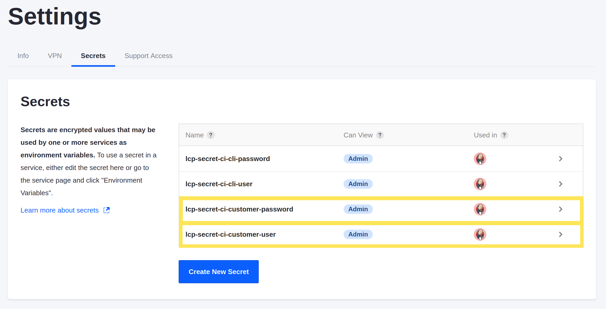
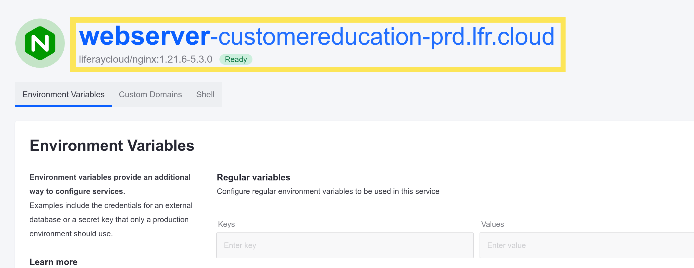
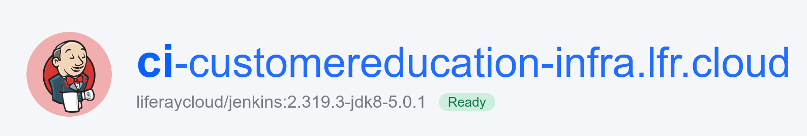

---
taxonomy-category-names:
- Cloud
- Cloud Platform Administration
- Liferay PaaS
uuid: eac9c112-377f-4106-8800-041f96c3de1f
---
# Logging into Your Liferay Cloud Services

By default, you must log in to access the web interfaces for the Liferay and Infrastructure services on any non-production environment (e.g., uat). Typically, login credentials appear in the initial onboarding email, but they are also located in the Cloud console.

## Locating Login Credentials

1. Navigate to the _infra_ environment.

1. Click _Settings_ in the left menu.

1. Click the _Secrets_ tab.

1. Click the _lcp-secret-ci-customer-user_ and _lcp-secret-ci-customer-password_ secrets to access them.

   

1. Click *View* on each secret's page to reveal the value. Click on the revealed value to copy it to your clipboard.

   

## Logging In

1. Navigate to your chosen environment (dev, uat, etc.).

1. Click *Visit Site* at the top of the page.

   

   The drop-down menu lists all available endpoints to your `liferay` service, including the default `webserver` service endpoint and any custom domains you added to the environment.

1. Click on the desired endpoint to access your Liferay instance with the corresponding URL.

1. Enter the Liferay Cloud [Jenkins user name and password](#locating-login-credentials) when prompted.

   

Once logged in, the user is redirected to the Liferay DXP 7.x instance (in this example, Liferay DXP 7.2 GA1).

### Finding Default Service URLs

You can find the default `webserver` endpoint's URL in its service page. Hover over the `webserver` logo to expand its URL:

Your [Jenkins login credentials](#locating-login-credentials) are still required when accessing Liferay through this method.

You can follow similar steps to access the Jenkins CI web interface. Navigate to the `ci` service in the `infra` environment to find the Jenkins URL:

## Related Topics

* [Customizing Liferay DXP in the Cloud](../customizing-liferay-dxp-in-the-cloud/using-the-liferay-dxp-service.md)
* [Continuous Integration](../platform-services/continuous-integration.md)
* [Web Server Service](../platform-services/web-server-service.md)
