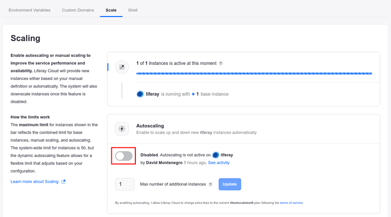
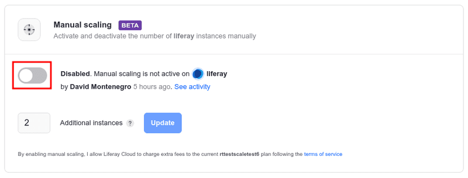

---
taxonomy-category-names:
- Cloud
- Cloud Platform Administration
- Cloud Platform Services
- Liferay PaaS
uuid: f5e2b006-daf3-4775-9182-0d9455a63b38
---
# Scaling the Liferay Service

Liferay Cloud offers two modes of scaling. The auto-scaling feature automatically creates and destroys instances of the Liferay service as needed to optimize performance. By default, this feature is *disabled* in every Liferay Cloud account. Alternatively, you can create and destroy Liferay instances manually using manual scaling. This addresses sudden changes such as increased server traffic, memory leaks, or other issues.

Using auto-scaling, a service can automatically increase (upscale) the number of Liferay DXP instances to a [defined maximum](#setting-the-maximum-number-of-additional-instances), or decrease (downscale) to the number specified in the `scale` property in [`LCP.json`](../reference/configuration-via-lcp-json.md). The `scale` property specifies the minimum number of instances to run:

```json
   "scale": 2,
```

Monitor your application's [resource usage](./quotas-and-resource-usage.md) (CPU and memory) regularly for applications that require auto-scaling. More insight into your resource requirements helps you more effectively fine-tune your [JVM memory settings](#jvm-memory-configuration) and [auto-scaling behavior](#specifying-target-average-utilization).

## How Scaling is Charged

Manual and auto-scaling is only available for the Liferay DXP service in production environments. Once scaling is enabled, each extra instance of the service incurs an hourly charge. This charge is independent of the normal Liferay PaaS subscription process.

At the end of every quarter that you use or deploy additional instances, Liferay will issue you an invoice. You must pay this invoice in accordance with your agreement with Liferay.

For each service instance added via manual or auto-scaling, the price depends on your subscription plan. The total charge is based on the number of clock hours that you used the scaled instances. For pricing purposes, the total usage during a calendar quarter is rounded up to the nearest full clock hour.

## JVM Memory Configuration

For scaling to work properly, it is important to set an appropriate memory allocation for your Liferay image's JVM. This allocation is necessary to allow the memory usage to expand or contract depending on the server's load.

Set the `liferay` service's `LIFERAY_JVM_OPTS` environment variable to allocate memory using the `-Xms` and `-Xmx` flags. The `-Xms` flag sets the initial memory allocation when the service starts, while the `-Xmx` flag determines the maximum memory allocation for the JVM. For example, if you have a total of 16 GB provisioned and available for this service, you can set this configuration:

```bash
-Xms4096m -Xmx12288m
```

The recommended configuration is to set the `-Xms` flag using 25% of the available memory, and to set the `-Xmx` flag using 75% of the available memory. *Always set your `-Xmx` value lower than the service's total available memory* to avoid errors when other processes in the container require more memory.

Here are some recommended configurations for different levels of memory available to your `liferay` service:

| **Available Memory** | **Recommended LIFERAY_JAVA_OPTS** |
| :------------------- | :-------------------------------- |
| 8 GB                 | -Xms2048m -Xmx6144m               |
| 16 GB                | -Xms4096m -Xmx12288m              |
| 24 GB                | -Xms6144m -Xmx18432m              |
| 32 GB                | -Xms8192m -Xmx24576m              |
| 64 GB                | -Xms16384m -Xmx49152m             |

!!! note
    The `LIFERAY_JAVA_OPTS` variable may appear with other flags, in addition to `-Xms` and `-Xmx`. If other flags are present, update the environment variable with the memory arguments without removing the others.

See [Defining Environment Variables](../reference/defining-environment-variables.md) for help adding this environment variable to your `liferay` service.

## Managing Scaling

Follow these steps to enable or disable auto-scaling in the Liferay Cloud Console:

1. Navigate to the production environment.
1. Navigate to *Services* &rarr; *Liferay* &rarr; *Scale*.
1. Toggle the switch to enable or disable auto-scaling.

!!! warning
    Deleting and redeploying a service disables auto-scaling if it was previously enabled. However, removing auto-scaling properties from a service's `LCP.json` file (such as the `scale` or `autoscale` properties) from a service *does not* disable auto-scaling.

With auto-scaling enabled, Liferay Cloud monitors your service and scales it automatically according to the threshold you define.



Follow these steps to enable or disable manual scaling in the Liferay Cloud Console:

1. Navigate to the production environment.
1. Navigate to *Services* &rarr; *Liferay* &rarr; *Scale*.
1. Choose the number of extra instances to be created.
1. Toggle the switch to enable or disable manual scaling.

With manual scaling enabled, Liferay Cloud creates the requested number of instances. This might take a couple minutes. The extra instances stay up as long as manual scaling remains enabled.



It is possible to use manual and auto-scaling together.


### Setting the Maximum Number of Additional Instances

To define the maximum number of additional instances,

1. Set the `LCP_HAPROXY_SERVER_TEMPLATE_BACKEND_NUM` [environment variable](../reference/defining-environment-variables.md) in your [web server service](../platform-services/web-server-service.md) to the highest *total* number needed. The `liferay` service may not scale beyond the maximum number of instances defined in `LCP_HAPROXY_SERVER_TEMPLATE_BACKEND_NUM` automatically or manually (10 by default). The maximum possible number is 50 instances (1 base instance and 49 additional instances).

1. On the Liferay service's *Scale* tab, update the number in *Max number of additional instances* to the desired value.

   !!! note
       This field sets the additional number of instances that auto-scaling can create, adding to the base number of instances. It does not set the maximum total number it can create.

1. Click *Update*.

Once you have updated both of these configurations, auto-scaling adds additional instances to the `liferay` service, up to your newly defined maximum.

## Specifying Target Average Utilization

System administrators can specify a *target average utilization*. This value is an average of memory and CPU usage across Liferay DXP services. That value threshold must be crossed before auto-scaling is triggered.

For example, if three service instances utilize 70%, 90%, and 95% of memory, respectively, then the average memory utilization is 85%. If the target average utilization is set to 90, no upscaling is needed; upscaling in this situation only occurs when the average memory utilization exceeds the target.

!!! note
    The default target utilization is 80%. Services that use a high amount of memory (such as the `liferay` service) can surpass this target utilization value quickly, even immediately after deployment.

A service *downscales* only when the service's memory usage has dropped *below half* of the target utilization value. With a default target utilization of 80%, a service only reduces the number of instances once the average memory utilization between the available instances drops below 40%.

The total available memory is specified by the `memory` property in `LCP.json`, as referenced in [Configuration via LCP.json](../reference/configuration-via-lcp-json.md).

Specify the target average utilization in the `autoscale` property of the service's `LCP.json`:

```json
"autoscale": {
  "cpu": 80,
  "memory": 90
}
```

Balance your target average utilization according to your application's specific needs for the most efficient auto-scaling. For example, this configuration heavily prioritizes CPU usage:

```json
"autoscale": {
  "cpu": 60,
  "memory": 95
}
```

If the `autoscale` property isn't set, the target average utilization defaults to 80 for both CPU and memory utilization.

## Scaling and DXP Activation Keys

An activation key is typically required to be deployed and validated to use self-hosted Liferay DXP. On Liferay Cloud when scaling is enabled, the Liferay Cloud team resolves any DXP Activation key issues and adds and removes activation keys as needed.

## Monitoring Scaling

The [Plan and Usage page](./quotas-and-resource-usage.md) contains the project's scaling information. Navigate to the *Scaling* tab. Under Scaling Summary, you can see

- How many environments have extra nodes from scaling
- How many hours scaled nodes were up during the selected time period
- The associated cost in USD for the nodes

!!! note
    The page only displays scaling events that finished before it loaded. Events that have started but haven't returned to the normal values don't appear on the page until they finish.

You can also see a detailed report for the selected time period in *Scaling Report*.