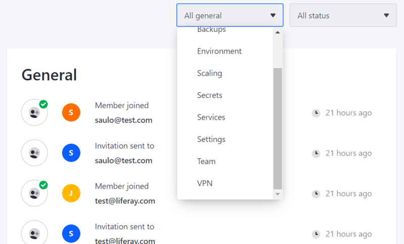

---
taxonomy-category-names:
- Cloud
- Cloud Platform Administration
- Liferay PaaS
uuid: d6ffd6f9-4bcb-462b-8907-292a91843f90
---
# Team Activities

Keeping track of activities within each project environment is essential. With Liferay Cloud, you can monitor builds, deployments, and other project activities via the web console.

## Types of Environment Activities

Within each environment, activities are organized into two sections: *Builds and Deployments* and *General Activities*.

**Builds and Deployments** lists all build, deployment, and CI-related activities in a project environment. Each entry includes a Build ID, start time, duration, and status (e.g., in process, successful, failed, interrupted).

**General Activities** lists automated service events and manual team member activities other than build, deployment, and CI activities. General activities include the following categories:

- **Backup Activities**: examples include when automated or manual backups start, and whether they succeed.
- **Environment Activities**: examples include when the environment was created.
- **Scaling Activities**: examples include when auto-scaling is enabled or disabled, and when the Liferay service is scaled up or down.
- **Secret Activities**: examples include when a secret variable is added, edited, viewed, or removed.
- **Services Activities**: examples include when environment variables are updated, and when services are installed, restarted, or deleted.
- **Settings Activities**: examples include when Support Access is disabled or enabled, and when environment Secrets are added, edited, or viewed by team members.
- **Team Activities**: examples include when environment invitations are sent, and when new members join the environment.
- **VPN Activities**: examples include when a VPN is created, edited, connected, or disconnected.

Both sections specify the acting team member and the time of the activity.

## Viewing Environment Activities

You can view summaries of recent environment activities from the environment *Overview* page under *Activities*.

Toggle between activity types by clicking on the *Builds and Deployments* or *General* tabs.

View extended records of environment activities from the *Activities* page:

1. Navigate to a project environment.

1. Click on *Activities* in the environment menu.

This page lists all activities that have occurred on the Liferay Cloud instance.

!!! note
    You can also view all build and deployment activities from your project environments via the *Builds* and *Deployments* pages. See [Overview of the Liferay Cloud Deployment Workflow](../updating-services-in-liferay-paas/overview-of-the-liferay-cloud-deployment-workflow.md) for more information about these pages.

## Related Topics

- [Environment Teams and Roles](./environment-teams-and-roles.md)
- [Overview of the Liferay Cloud Deployment Workflow](../updating-services-in-liferay-paas/overview-of-the-liferay-cloud-deployment-workflow.md)
- [Log Management](../support-and-troubleshooting/troubleshooting/reading-liferay-cloud-service-logs.md)
