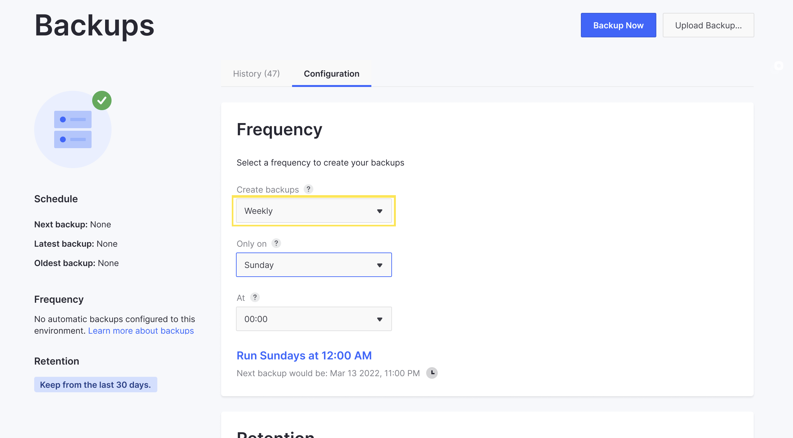

---
toc:
  - ./backup-service/downloading-and-uploading-backups.md
  - ./backup-service/restoring-data-from-a-backup.md
  - ./backup-service/creating-a-database-dump.md
taxonomy-category-names:
- Cloud
- Cloud Platform Services
- Liferay PaaS
uuid: 310e496c-44fc-417e-b75b-fecc95a003f2
---

# Backup Service

Maintaining regular backups is vital to protecting your project's data. The Liferay Cloud backup service stores iterations of environment data that can be used to restore your environments if needed. These backups include the Liferay DXP Database and the full contents of the `[LIFERAY_HOME]/data` folder.


From the Backups page in any environment, you can create backups, view or download retained backups, and restore an environment from a backup.

You can also configure the backup service to meet your project's needs via the Liferay Cloud console or the backup service's `LCP.json` file.

See the [Backup service limitations](../reference/platform-limitations.md#backup-service) section for more information.

## The Backups Page

From the Backups page in any environment, you can view backup service information and retained backups, create manual backups, and more.

!!! note
    The Backups page is only available in production environments for backup service versions older than 4.3.5.

Follow these steps to access the Backups page:

1. Click *Backups* in the menu on the left from any environment.


From here, you can perform the following tasks:

- **View Backup Info**: You can quickly view backup service information for the chosen environment. This includes the frequency of automated backups, the backup retention period, and time stamp information for the next scheduled backup, the latest created backup, and the oldest retained backup.

- **View Backup History**: You can view the full list of retained backups in the chosen environment. Each entry shows the backup's name, size, type (`Auto`, `Manual`, or `Uploaded`), and time of creation. A red backup icon indicates a backup has failed. Beside it is a *Backup failed* message and a link to contact Support.

- **Create Manual Backups**: You can manually create a backup of the chosen environment. See [Creating a Manual Backup](#creating-a-manual-backup) for more information.

!!! note
    Backup timestamps appear automatically based on your browser location, while backup schedules are based on the UTC±00 time zone.

From the Backups page, environment administrators also have access to the Actions button (⋮) and can download retained backups or restore environments.


You can also filter the list of backups by their status (failed or successful), or display the backups from the associated Disaster Recovery (`dr`) environment (if one is configured for the current environment), from the two selectors near the top of the screen.


For more information and instructions on how to perform these actions, see [Downloading and Uploading Backups](./backup-service/downloading-and-uploading-backups.md) and [Restoring Data from a Backup](./backup-service/restoring-data-from-a-backup.md).

## Creating a Manual Backup

To back up your environment manually from the Backups page, click on *Backup Now*. This process can take several minutes or hours depending on the size of your services.

Once started, the backup service icon indicates a backup is in progress, and a message appears at the top of the screen. The new backup also appears in the Backup history.


!!! warning
    Backups created while data is actively changing on your Liferay instance risk creating inconsistent data. To ensure a completely consistent backup, coordinate with your database administrator to freeze updates while you perform a manual backup.

Clicking *View logs* redirects you to the Logs page, where you can view the backup stages in real-time. You can also view backup logs in the *Logs* tab of the backup service's page.

See [Reading Liferay Cloud Service Logs](../support-and-troubleshooting/troubleshooting-tools-and-resources/reading-liferay-cloud-service-logs.md) for more information about viewing service logs.

## Configuring the Backup Service

You can configure the backup service to meet your project's needs via the Liferay Cloud console or the backup service's `LCP.json` file.

See [Environment Variables Reference](#environment-variables-reference) for a list of variables you can use to configure the backup service.

!!! important
    Whenever the backup service is reconfigured, it restarts and may stop receiving requests for some minutes or behave differently depending on the configuration.

### Configuring the Backup Service via the Liferay Cloud Console

1. Navigate to an environment where the backup service is deployed.

1. Click on *Services* in the environment menu.

1. Click the *Backup* service to see the backup service's environment variables.

   

   You can also access the backup service's page by clicking *Backup* in the environment's *Overview* page.

1. Add variables from the [Environment Variables Reference](#environment-variables-reference) list to configure the backup service.

1. Click *Save Changes*.

Apart from regular environment variables, you can also set *Secret* variables via the Liferay Cloud console. See [Managing Secure Environment Variables with Secrets](../tuning-security-settings/managing-secure-environment-variables-with-secrets.md) for more information.

### Configuring the Backup Service via the Backup `LCP.json` File

1. Use a text editor to open the backup `LCP.json` file located at the following path: `/{your_project_name}/backup/LCP.json`.

1. Scroll down to the environment section.

   ```json
   "env": {
     "LCP_BACKUP_FOLDER": "/opt/liferay/data",
     "LCP_DATABASE_SERVICE": "mydatabase",
     "LCP_MASTER_USER_PASSWORD": "mypassword"
   },
   ```

1. Add variables from the [Environment Variables Reference](#environment-variables-reference) list to configure the backup service.

1. Save the file and deploy it to your project to implement the configuration.

See [Configuration via LCP.json](../reference/configuration-via-lcp-json.md) for more information about configuring environment services via their `LCP.json` files.

## Scheduling Automated Backups and Cleanups

Determining how frequently backups are created and removed can help protect your data and optimize storage.

!!! warning
    Creating backups while data is actively changing on your Liferay instance risks data inconsistency. Configure your backup schedule to kick off during times with reduced activity to mitigate the risk of data inconsistency. To ensure a completely consistent backup, coordinate with your database administrator to freeze updates while you perform a [manual backup](./backup-service.md#creating-a-manual-backup), and set it to run at *different times* from the cleanup schedule (`LCP_BACKUP_CLEANUP_SCHEDULE`).

There are two ways to configure an automated backup schedule:

- [Via the console](#configuring-the-schedule-via-the-console)
- [Using environment variables](#configuring-the-schedule-using-environment-variables)

### Configuring the Schedule via the Console

1. From the chosen environment, navigate to the Backup service and click the *Configuration* tab.

   

   !!! note
       If this environment has no backups, clicking the *Set up a regular backup* link on the Backup service page also takes you to the Configuration tab.

1. Choose the desired backup frequency from available options in the Create Backups drop-down menu:

   - **Daily**: A backup is created every day; you can set the time it is created (in the UTC±00 time zone). Daily backups are recommended for production environments.

   - **Weekly**: A backup is created every week; you can set the day of the week and what time it is created (in the UTC±00 time zone).

   - **Advanced**: You can set a [cron schedule](https://crontab.guru/) value for a more complex frequency.

   - **Not set** (manually): No automatic backups are created. You must create all backups manually. This is the default setting for non-production environments.

   

1. Choose the desired retention period from the *Remove backups older than* selector.

1. Click *Save changes*.

The backup service restarts, and the changes are applied when the service has fully restarted.

### Configuring the Schedule Using Environment Variables

Use these variables per environment to customize when backups are created and removed:

- **Automated Backups**: Add the `LCP_BACKUP_CREATE_SCHEDULE` variable with a [cron scheduling](https://crontab.guru/) value to set the frequency of automated backups.

- **Automated Cleanups**: Add the `LCP_BACKUP_CLEANUP_SCHEDULE` variable with a [cron scheduling](https://crontab.guru/) value to set the frequency of automated backup cleanups.

- **Retention Period**: Add the `LCP_BACKUP_RETENTION_PERIOD` variable with a numerical value (between 0-30) to set the number of days backups are retained before being removed by automated cleanups.

!!! note
    Both standard and non-standard [cron scheduling syntax](https://crontab.guru/) are based on the UTC±00 time zone. When using non-standard cron syntax, automated backups and cleanups run at the start of the specified value. For example, `@daily` runs backups every day at 00:00 UTC.

You can use these environment variables by [setting them via the Liferay Cloud console](../reference/defining-environment-variables.md#defining-environment-variables-via-the-liferay-cloud-console) (in the Backup service), or by [setting them in your project repository's `backup/LCP.json` file](../reference/defining-environment-variables.md#defining-environment-variables-via-lcp-json) and deploying the Backup service to your environment.

!!! warning
    If you set the environment variables via the Liferay Cloud console but later deploy the Backup service from your repository with a different configuration in `backup/LCP.json`, the configuration from your repository overwrites the environment variables set in the console.

This `backup/LCP.json` example creates backups every 12 hours (i.e., 00:00 and 12:00 UTC) and performs monthly cleanups that remove backups over 30 days old:

```json
"env": {
  "LCP_BACKUP_FOLDER": "/opt/liferay/data",
  "LCP_DATABASE_SERVICE": "mydatabase",
  "LCP_MASTER_USER_PASSWORD": "mypassword",
  "LCP_BACKUP_CREATE_SCHEDULE": "0 0,12 * * *",
  "LCP_BACKUP_CLEANUP_SCHEDULE": "@monthly",
  "LCP_BACKUP_RETENTION_PERIOD": "30"
},
```

## Improving Backup Service Performance

You can configure the backup service to decrease the size of backups or accelerate their creation and restoration processes for better performance.

### Excluding Adaptive Media from Backups

{bdg-primary}`Liferay SaaS`
{bdg-link-primary}`Liferay PaaS + [Google Cloud Storage](https://cloud.google.com/storage)`
{bdg-secondary}`Liferay DXP 2024.Q3+`
{bdg-secondary}`Backup Service 5.17.0+`

When creating and restoring backups, you may choose to exclude adaptive media. Liferay can generate adaptive media as needed, so it need not be backed up. You can enable this feature by setting the values of `LCP_BACKUP_EXCLUDE_GENERATED_DL_FILES_ON_BACKUP_CREATE` and `LCP_BACKUP_EXCLUDE_GENERATED_DL_FILES_ON_BACKUP_RESTORE` to `true`. By reducing the amount of data that gets backed up, backups become faster and lighter.

### Discovering the Transfer Strategy

{bdg-link-primary}`[Google Cloud Storage](https://cloud.google.com/storage)`
{bdg-secondary}`Liferay DXP 2024.Q1.6+`
{bdg-secondary}`Backup Service 5.17.0+`

When restoring a backup on GCS (Google Cloud Storage), the backup service must use a transfer strategy. Liferay Cloud supports two transfer strategies for the document library: `gsutil` and `rclone`.

You can verify which transfer strategy is in use through the backup service logs. After restoring a backup on GCS, you see a message like this:

```
Spawning [TRANSFER_STRATEGY] process to transfer files from [SOURCE] to [DESTINATION]
```

The command written in `[TRANSFER_STRATEGY]` is either `gsutil` or `rclone`.

You can choose your transfer strategy with the `LCP_DOCUMENT_LIBRARY_GCS_TRANSFER_STRATEGY` environment variable. By default, the backup service uses `gsutil` to ensure backups run smoothly on Liferay DXP versions that don't support `rclone`.

!!! note
    Rclone is faster, lighter, and less error-prone than `gsutil` as a backup transfer strategy. Always use `rclone` if your Liferay DXP version supports it, as noted above.

## Key Deployment Directories

| **File Type** | **Path**                      | **Description**                                                          |
| :------------ | :---------------------------- | :----------------------------------------------------------------------- |
| SQL Scripts   | backup/configs/[ENV]/scripts/ | Any `.sql` scripts here automatically execute after each backup restore. |

## Environment Variables Reference

| Name                                                      | Default Value              | Description                                                                                                                                                                                                                                                   |
| :-------------------------------------------------------- | :------------------------- | :------------------------------------------------------------------------------------------------------------------------------------------------------------------------------------------------------------------------------------------------------------ |
| `LCP_BACKUP_CLEANUP_SCHEDULE`                             | `0 1 * * *`                | Schedules automated cleanups using [cron scheduling syntax](https://crontab.guru/). Cleanups remove all backups that exceed the backup retention period. It must not conflict with `LCP_BACKUP_CREATE_SCHEDULE`.                                              |
| `LCP_BACKUP_CREATE_SCHEDULE`                              | `[5-55][0-1] * * *`        | Schedules automated backups using [cron scheduling syntax](https://crontab.guru/). It must not conflict with `LCP_BACKUP_CLEANUP_SCHEDULE`. In versions `3.2.1` and above of the backup service, if no value is specified, a random default is created.       |
| `LCP_BACKUP_EXCLUDE_GENERATED_DL_FILES_ON_BACKUP_CREATE`  | `false`                    | Excludes adaptive media from the document library when creating backups. See [Excluding Adaptive Media from Backups](#excluding-adaptive-media-from-backups) for more information.                                                                            |
| `LCP_BACKUP_EXCLUDE_GENERATED_DL_FILES_ON_BACKUP_RESTORE` | `false`                    | Excludes adaptive media from the document library when restoring backups. See [Excluding Adaptive Media from Backups](#excluding-adaptive-media-from-backups) for more information.                                                                           |
| `LCP_BACKUP_RESTORE_SCHEDULE`                             | N/A                        | Schedules automated restores using [cron scheduling syntax](https://crontab.guru/). Intended for use with [Disaster Recovery environments](../support-and-troubleshooting/troubleshooting-tools-and-resources/configuring-cross-region-disaster-recovery.md). |
| `LCP_BACKUP_RESTORE_DL_DOWNLOAD_AND_EXTRACT_STRATEGY`     | `download-then-extract`    | Determines the download and extract strategy for the document library. Use `download-then-extract` for backups of static data that doesn't change frequently, or `stream-pipeline` for data pipelines with frequent changes that require fast recovery.       |
| `LCP_BACKUP_RETENTION_PERIOD`                             | `30`                       | Determines which backups are removed during scheduled cleanups. Select the number of days backups are retained before being removed by cleanups. Only values between 0 and 30 are allowed.                                                                    |
| `LCP_DATABASE_SERVICE`                                    | `database`                 | The database service's ID.                                                                                                                                                                                                                                    |
| `LCP_DBNAME`                                              | `lportal`                  | The database name.                                                                                                                                                                                                                                            |
| `LCP_DEBUG_LOG`                                           | `false`                    | Enables debug logging for the Backup service. Set to `true` or `false`.                                                                                                                                                                                       |
| `LCP_DOCUMENT_LIBRARY_GCS_TRANSFER_STRATEGY`              | `gsutil`                   | Determines the document library transfer strategy. `rclone` requires a minimum Liferay version, but offers [improved performance](#using-rclone-as-the-transfer-strategy).                                                                                    |
| `LCP_GCP_STORAGE_UPLOAD_MAX_RETRIES`                      | `6`                        | The maximum amount of times to retry uploading a backup if it fails. After this limit, the upload is aborted and may start over completely (up to two times).                                                                                                 |
| `LCP_GCP_STORAGE_UPLOAD_MAX_RETRY_DELAY`                  | `64`                       | The delay (in seconds) between each of the retries configured by `LCP_GCP_STORAGE_UPLOAD_MAX_RETRIES`.                                                                                                                                                        |
| `LCP_GCP_STORAGE_UPLOAD_RETRY_DELAY_MULTIPLIER`           | `3`                        | Multiplies the delay set by `LCP_GCP_STORAGE_UPLOAD_MAX_RETRY_DELAY` on each subsequent retry.                                                                                                                                                                |
| `LCP_GCP_STORAGE_UPLOAD_TIMEOUT`                          | `6000`                     | The maximum delay time (in seconds) between backup upload requests (or retries). This sets an upper limit to the amount that `LCP_GCP_STORAGE_UPLOAD_RETRY_DELAY_MULTIPLIER` can increase the delay time.                                                     |
| `LCP_MASTER_USER_NAME`                                    | `dxpcloud`                 | The master username.                                                                                                                                                                                                                                          |
| `LCP_MASTER_USER_PASSWORD`                                | `LCP_PROJECT_MASTER_TOKEN` | The master password.                                                                                                                                                                                                                                          |
| `LCP_SERVICE_LOG_LEVEL`                                   | `INFO`                     | The lowest priority level of log messages to display. Set to the log level's name or a numerical value. See [Log Levels](../support-and-troubleshooting/troubleshooting-tools-and-resources/reading-liferay-cloud-service-logs.md) for more information.      |

## Related Topics

- [Configuration via LCP.json](../reference/configuration-via-lcp-json.md)
- [Database Service](./database-service.md)
