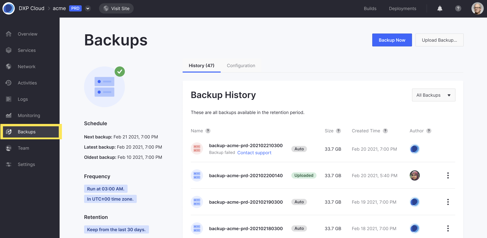
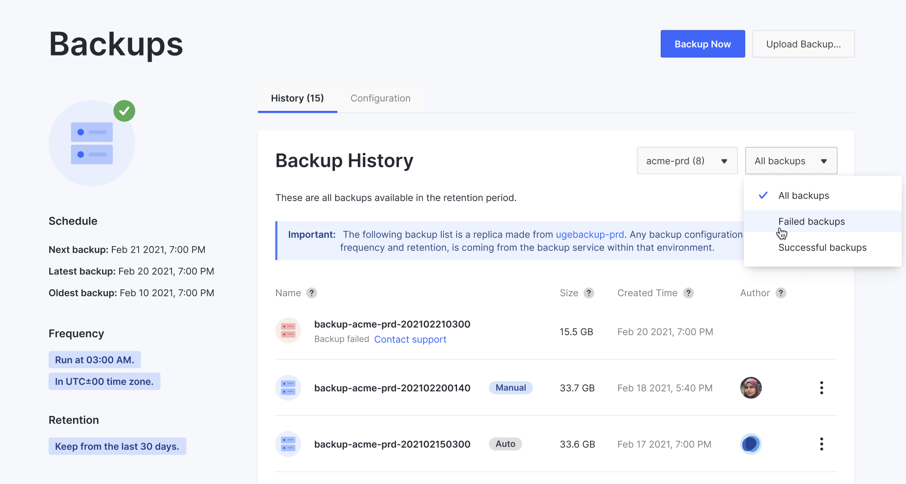
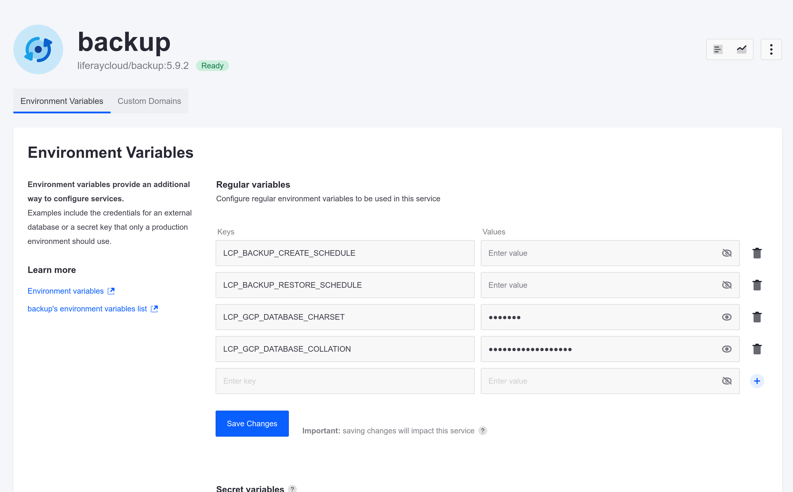

# Backup Service Overview

Maintaining regular backups is vital to protecting your project's data. The Liferay Cloud backup service stores iterations of environment data that can be used to restore your environments if needed. These backups include both the Liferay DXP Database and the full contents of the `[LIFERAY_HOME]/data` folder.


From the Backups page in any environment, you can create backups, view or download retained backups, and restore an environment from a backup.

You can also configure the backup service to meet your project's needs via the Liferay Cloud console or the backup service's `LCP.json` file.

See the [Backup service limitations](../../reference/platform-limitations.md#backup-service) section for more information.

## The Backups Page

From the Backups page in any environment, you can view backup service information and retained backups, create manual backups, and more.

```{note}
The Backups page is only available in production environments for backup service versions older than 4.3.5.
```

Follow these steps to access the Backups page:

1. Click on *Backups* in the menu on the left from any environment.



From here, you can perform the following tasks:

* **View Backup Info**: You can quickly view backup service information for the chosen environment. This includes the frequency of automated backups, the backup retention period, and time stamp information for the next scheduled backup, the latest created backup, and the oldest retained backup.
* **View Backup History**: You can view the full list of retained backups in the chosen environment. Each entry shows the backup's name, size, type (`Auto`, `Manual`, or `Uploaded`), and time of creation. A red backup icon indicates a backup has failed. Beside it is a _Backup failed_ message and a link to contact Support.
* **Create Manual Backups**: You can manually create a backup of the chosen environment. See [Creating a Manual Backup](#creating-a-manual-backup) for more information.

```{note}
Backup timestamps are displayed automatically based on your browser location, while backup schedules are based on the UTC±00 time zone.
```

From the Backups page, environment administrators also have access to the Actions button (⋮) and can download retained backups or restore environments.


You can also filter the list of backups by their status (failed or successful), or display the backups from the associated Disaster Recovery (`dr`) environment (if one is configured for the current environment), from the two selectors near the top of the screen.



For more information and instructions on how to perform these actions, see [Downloading and Uploading Backups](./downloading-and-uploading-backups.md) and [Restoring Data from a Backup](./restoring-data-from-a-backup.md).

## Creating a Manual Backup

To manually back up your environment from the Backups page, click on *Backup Now*. This process can take several minutes or hours depending on the size of your services.

Once started, the backup service icon indicates a backup is in progress, and a message appears at the top of the screen. The new backup also appears in the Backup history.


```{warning}
Backups created while data is actively changing on your Liferay instance risk creating inconsistent data. To ensure a completely consistent backup, coordinate with your database administrator to freeze updates while you perform a manual backup.
```

Clicking *View logs* redirects you to the Logs page, where you can view the backup stages in real-time. You can also view backup logs in the *Logs* tab of the backup service's page.

See [Log Management](../../troubleshooting/reading-liferay-cloud-service-logs.md) for more information about viewing service logs.

## Configuring the Backup Service

You can configure the backup service to meet your project's needs via the Liferay Cloud console or the backup service's `LCP.json` file.

See [Environment Variables Reference](#environment-variables-reference) for a list of variables you can use to configure the backup service.

```{important}
Whenever the backup service is reconfigured, the backup service will restart and may stop receiving requests for some minutes or behave differently depending on the configuration.
```

### Configuring the Backup Service via the Liferay Cloud Console

Follow these steps to configure the backup service via the Liferay Cloud Console:

1. Navigate to an environment where the backup service is deployed.

1. Click on *Services* in the environment menu.

1. Click on the *Backup* service.

1. Click on the *Environment Variables* tab.

   

   You can also access the backup service's page by clicking on *Backup* in the environment's *Overview* page.

1. Add variables from the [Environment Variables Reference](#environment-variables-reference) list to configure the backup service.

1. Click on *Save Changes*.

Apart from regular environment variables, you can also set *Secret* variables via the Liferay Cloud console. See [Managing Secure Environment Variables with Secrets](../../infrastructure-and-operations/security/managing-secure-environment-variables-with-secrets.md) for more information.

### Configuring the Backup Service via the Backup `LCP.json` File

Follow these steps to configure the backup service via its `LCP.json` file:

1. Use a text editor to open the backup `LCP.json` file located at the following path: `/{your_project_name}/backup/LCP.json`.

1. Scroll down to the environment section.

   ```
    "env": {
      "LCP_BACKUP_FOLDER": "/opt/liferay/data",
      "LCP_DATABASE_SERVICE": "mydatabase",
      "LCP_MASTER_USER_PASSWORD": "mypassword"
    },
   ```

1. Add variables from the [Environment Variables Reference](#environment-variables-reference) list to configure the backup service.

1. Save the file and deploy to your project to implement the configuration.

See [Configuration via LCP.json](../../reference/configuration-via-lcp-json.md) for more information about configuring environment services via their `LCP.json` files.

## Scheduling Automated Backups and Cleanups

Determining how frequently backups are created and removed can help protect your data and optimize storage. *Only production environments can have scheduled backups.*

```{warning}
Backups created while data is actively changing on your Liferay instance risk creating inconsistent data. Configure your backup schedule to create backups during times with reduced activity to mitigate the risk of data inconsistency. To ensure a completely consistent backup, coordinate with your database administrator to freeze updates while you perform a [manual backup](./backup-service-overview.md#creating-a-manual-backup).
```

There are two ways to configure an automated backup schedule:

* [Via the console](#configuring-the-schedule-via-the-console)
* [Using environment variables](#configuring-the-schedule-using-environment-variables)

### Configuring the Schedule via the Console

1. From the chosen environment, navigate to the Backup service and click the *Configuration* tab.

   

   ```{note}
   If this environment has no backups, clicking the *Set up a regular backup* link on the Backup service page also takes you to the Configuration tab.
   ```

1. Choose the desired backup frequency from available options in the *Create backups* drop-down menu. You have these options: 

   * **Daily**: A backup is created every day; you can set the time it is created (in the UTC±00 time zone).

   * **Weekly**: A backup is created every week; you can set the day of the week and what time it is created (in the UTC±00 time zone).

   * **Advanced**: You can set a [cron schedule](https://crontab.guru/) value for a more complex frequency.

   * **Manually** No automatic backups are created. You must create all backups manually.

   

1. Choose the desired retention period from the *Remove backups older than* selector.

1. Click *Save changes*.

The backup service restarts, and the changes are applied when the service has fully restarted.

### Configuring the Schedule Using Environment Variables

Use the following variables per environment to customize when backups are created and removed:

* **Automated Backups**: Add the `LCP_BACKUP_CREATE_SCHEDULE` variable with a [cron scheduling](https://crontab.guru/) value to set the frequency of automated backups.
* **Automated Cleanups**: Add the `LCP_BACKUP_CLEANUP_SCHEDULE` variable with a [cron scheduling](https://crontab.guru/) value to set the frequency of automated backup cleanups.
* **Retention Period**: Add the `LCP_BACKUP_RETENTION_PERIOD` variable with a numerical value (between 1-30) to set the number of days backups are retained before being removed by automated cleanups.

```{note}
Both standard and non-standard [cron scheduling syntax](https://crontab.guru/) are based on the UTC±00 time zone. When using non-standard cron syntax, automated backups and cleanups run at the start of the specified value. For example, `@daily` runs backups every day at 00:00 UTC.
```

You can use these environment variables by [setting them via the Liferay Cloud console](../../reference/defining-environment-variables.md#defining-environment-variables-via-the-liferay-cloud-console) (in the Backup service), or by [setting them in your project repository's `backup/LCP.json` file](../../reference/defining-environment-variables.md#defining-environment-variables-via-lcp-json) and deploying the Backup service to your environment.

```{warning}
If you set the environment variables via the Liferay Cloud console but later deploy the Backup service from your repository with a different configuration in `backup/LCP.json`, the configuration from your repository overwrites the environment variables set in the console.
```

The following `backup/LCP.json` example creates backups every 12 hours (i.e., 00:00 and 12:00 UTC) and performs monthly cleanups that remove backups over 30 days old:

```
 "env": {
   "LCP_BACKUP_FOLDER": "/opt/liferay/data",
   "LCP_DATABASE_SERVICE": "mydatabase",
   "LCP_MASTER_USER_PASSWORD": "mypassword",
   "LCP_BACKUP_CREATE_SCHEDULE": "0 0,12 * * *",
   "LCP_BACKUP_CLEANUP_SCHEDULE": "@monthly",
   "LCP_BACKUP_RETENTION_PERIOD": "30"
 },
```

## Environment Variables Reference

Name                          | Default Value              | Description |
:--- | :--- | :--- |
`LCP_BACKUP_CLEANUP_SCHEDULE` | 0 1 * * * | This variable schedules automated cleanups using [cron scheduling syntax](https://crontab.guru/). Cleanups remove all backups that exceed the backup retention period. |
`LCP_BACKUP_CREATE_SCHEDULE`  | `[5-55][0-1] * * *`     | This variable schedules automated backups using [cron scheduling syntax](https://crontab.guru/). In versions `3.2.1` and above of the backup service, if no value is specified then a random default will be created. |
`LCP_BACKUP_RESTORE_SCHEDULE` | N/A | This variable schedules automated restores using [cron scheduling syntax](https://crontab.guru/). Intended for use with [Disaster Recovery environments](../../troubleshooting/configuring-cross-region-disaster-recovery.md). |
`LCP_BACKUP_RESTORE_STRATEGY` | `OVERWRITE` | By default, existing instances are taken down immediately. To start a fresh database instance and volume before taking down existing instances, use the `PREPARE_AND_SWAP` strategy. |
`LCP_BACKUP_RETENTION_PERIOD` | `30`                       | This variable determines which backups are removed during scheduled cleanups. Select the number of days backups are retained before being removed by cleanups. The maximum retention period is 30 days. |
`LCP_DATABASE_SERVICE`        | `database`                 | The database service's ID. |
`LCP_DBNAME`                  | `lportal`                  | The database name. |
`LCP_DEBUG_LOG`               | `false`                    | Enables debug logging for the Backup service. Set to `true` or `false`. |
`LCP_GCP_STORAGE_UPLOAD_MAX_RETRIES` | `6` | The maximum amount of times to retry uploading a backup if it fails. After this limit, the upload is aborted and may start over completely (up to two times). |
`LCP_GCP_STORAGE_UPLOAD_MAX_RETRY_DELAY` | `64` | The delay (in seconds) between each of the retries configured by `LCP_GCP_STORAGE_UPLOAD_MAX_RETRIES`). |
`LCP_GCP_STORAGE_UPLOAD_RETRY_DELAY_MULTIPLIER` | `3` | Multiplies the delay set by `LCP_GCP_STORAGE_UPLOAD_MAX_RETRY_DELAY` on each subsequent retry. |
`LCP_GCP_STORAGE_UPLOAD_TIMEOUT` | `6000` | The maximum delay time (in seconds) between backup upload requests (or retries). This sets an upper limit to the amount that `LCP_GCP_STORAGE_UPLOAD_RETRY_DELAY_MULTIPLIER` can increase the delay time. |
`LCP_MASTER_USER_NAME`        | `dxpcloud`                 | The master username. |
`LCP_MASTER_USER_PASSWORD`    | `LCP_PROJECT_MASTER_TOKEN` | The master password. |

## Related Topics

* [Downloading and Uploading Backups](./downloading-and-uploading-backups.md)
* [Restoring Data from a Backup](./restoring-data-from-a-backup.md)
* [Configuration via LCP.json](../../reference/configuration-via-lcp-json.md)
* [Database Service (MySQL)](../database-service/database-service.md)
