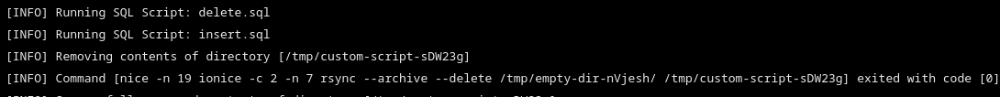
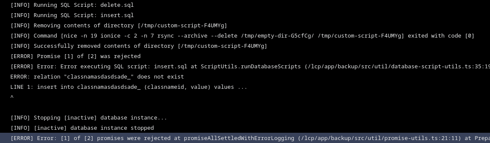

---
taxonomy-category-names:
- Cloud
- Cloud Platform Services
- Liferay PaaS
uuid: b323c5f9-5ba1-4468-8b8c-5c16c36b3078
---
# Restoring Data from a Backup

During project development, there may be times when you need to restore data or roll back the project to an earlier state. Restoring a backup to an environment restores the data for each service, but it does *not* change the build the environment is using.

You can also use custom SQL scripts to perform additional updates to a database as part of the data restore.

Restoring data from a backup results in downtime for the database service and any services that depend on it (including Liferay). However, if your backup service is at least version `5.x.x`, you can minimize the downtime by changing the default `OVERWRITE` restore behavior to `PREPARE_AND_SWAP`. This starts a separate, fresh database instance and volume and only switches to the new instance when it's ready. Set the [`LCP_BACKUP_RESTORE_STRATEGY` environment variable](./backup-service-overview.md#environment-variables-reference) to `PREPARE_AND_SWAP` to use this strategy.

See [Backup Service](./backup-service-overview.md) and [Downloading and Uploading Backups](./downloading-and-uploading-backups.md) for more information about the Backups page.

```{important}
Only users with the Admin role for the chosen environment can manually restore environments via the Liferay Cloud console.
```

## Restoring an Environment from the Backups Page

The *Backups* page of each environment has a list of all recent backups taken (automatically and manually). Restoring a backup to an environment from this page restores the data used by each service, but it does *not* change the build or Docker image that each service is using.

```{warning}
The `backup` service version of the backup you're restoring should match the target environment before the restore to ensure it completes successfully. The Liferay [fix pack level](https://learn.liferay.com/w/dxp/installation-and-upgrades/maintaining-a-liferay-installation/patching-dxp-7-3-and-earlier) should also match to avoid causing errors with a mismatched database schema. If you restore a backup that requires a different build from what is currently deployed in the environment, then [deploy an appropriate build](../../updating-services-in-liferay-paas/overview-of-the-liferay-cloud-deployment-workflow.md) *before* beginning the restore.
```

Follow these steps to restore an environment from a backup:

1. Navigate to your project's chosen environment.

1. Click on Backups in the environment menu on the left side of the screen.

1. Click on the *Actions* button ( ⋮ ) for the backup you want to use to restore a project environment.

1. Click on *Restore to...*

   

1. Click the drop-down *Environment* menu, and select the environment you want to restore.

   

   ```{note}
   Administrators can only restore environments to which they have access.
   ```

1. Click all *checkboxes* that appear below. You must check these boxes to enable the button to initiate the restore.

1. Click on *Restore to Environment* to start the restore process.

   

During the restore process, the target environment's services will restart.

You can track the status of the restore in the backup service's *Logs* and the *General* section of the Activities page.

## Applying Custom SQL Scripts with a Data Restore

You can also use custom SQL scripts to perform additional updates to your database with a normal data restore. This approach is ideal for sanitizing sensitive data, since it allows you to apply the scripts to separately maintained database backups.

SQL scripts support these formats:

* `.sql` is used for individual scripts.
* `.zip`, `.tgz`, or `.gz` are used for multiple scripts within a compressed file.

### Preparing SQL Scripts for PostgreSQL

Scripts for PostgreSQL only run on the database specified in the secret `lcp-secret-database-name`. Specify tables either without a qualifier or with the public schema (e.g., `update journalarticle` or `update public.journalarticle`).

The database user specified in the `lcp-secret-database-user` secret is used to run your scripts with the `psql` command, with these options:

* `--single-transaction`: Runs all commands within one transaction.
* `-v ON_ERROR_STOP=1`: Forces all errors encountered to stop executing the script and report the error in the restore process.

You can see details about the script execution in the backup log, like this example:



Any errors encountered executing your scripts (such as syntax errors) causes the restore process to fail and report the error in the restore log. Here's an example of an error:



Place your SQL scripts into the appropriate, environment-specific `backup/configs/[ENV]/scripts/` folder. Note that scripts run in alphanumerical order.

### Preparing SQL Scripts for MySQL

Scripts for MySQL must reference the exact database to run on (e.g., with `USE lportal;` or `lportal.User_`).

Place your SQL scripts into the appropriate, environment-specific `backup/configs/[ENV]/scripts/` folder. Note that scripts run in alphanumerical order.

### Performing the Data Restore

Once you have prepared your SQL script(s), follow these steps to apply your custom SQL script(s) with a data restore:

1. [Deploy your backup service](../../updating-services-in-liferay-paas/overview-of-the-liferay-cloud-deployment-workflow.md) to include the custom SQL script(s) online.

1. Follow the instructions listed above for [Restoring an Environment from the Backups Page](#restoring-an-environment-from-the-backups-page)

Once the database has been restored, the SQL script(s) from your backup service's `scripts` folder will run:

```bash
Jun 20 14:46:41.795 build-39 [backup-57488f8b8-rjq4f] Running Script: SanitizeOrg.sql
Jun 20 14:46:41.970 build-39 [backup-57488f8b8-rjq4f] Running Script: SanitizeUsers.sql
```

## Related Topics

* [Backup Service](./backup-service-overview.md)
* [Downloading and Uploading Backups](./downloading-and-uploading-backups.md)
* [Database Service](../database-service.md)
