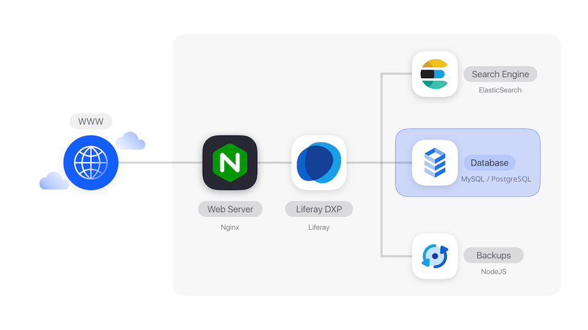

---
toc:
  - ./database-service/changing-your-database-username.md
  - ./database-service/changing-your-database-password.md
  - ./database-service/using-the-database-client.md
taxonomy-category-names:
- Cloud
- Cloud Platform Services
- Liferay PaaS
uuid: f7f6cc00-f0b7-4f30-9599-96cd842e7d18
---
# Database Service

The database service is a distributed, relational database that simplifies the setup, operation, and scaling of your applications. It's a private service inside your application environment. It can only communicate with your other services, not the public internet. The database in Liferay Cloud has case-sensitive table and column names.

See the [Database service limitations](../reference/platform-limitations.md#database-service) section for more information.

## Core Database Settings and User Management Variables

These environment variables influence core settings for the database and the main users that access it. They are already created for you during project provisioning, and you should only need to change them if you have very specific requirements.

Values starting with `LCP_SECRET` are secret variables exposed to the Liferay, backup, and database services.

!!! warning
    Changing the database name, default character set, or collation requires you to drop the existing database and restart the service with the new values, which involves application downtime.

For more information, see [Changing Your Database Username](./database-service/changing-your-database-username.md) and [Changing Your Database Password](./database-service/changing-your-database-password.md).

| **Name**                                     | **Default Value**                                      | **Where to Set**                                     | **Description**                                                                                           |
| :------------------------------------------- | :----------------------------------------------------- | :--------------------------------------------------- | :-------------------------------------------------------------------------------------------------------- |
| `LCP_GCP_DATABASE_CHARSET`                   | PostgreSQL: `UTF8`; MySQL: `utf8mb4`                   | `LCP.json`                                           | Database character set. This generally should not be changed.                                             |
| `LCP_GCP_DATABASE_COLLATION`                 | PostgreSQL: `en_US.UTF-8`; MySQL: `utf8mb4_unicode_ci` | `LCP.json`                                           | Database collation. This should only be changed for specific requirements for the sorting order.          |
| `LCP_SECRET_DATABASE_NAME`                   | `lportal`                                              | Secrets (`lcp-secret-database-name`)                 | Database name.                                                                                            |
| `LCP_SECRET_DATABASE_PASSWORD`               | (Random value)                                         | Secrets (`lcp-secret-database-password`)             | Master password.                                                                                          |
| `LCP_SECRET_DATABASE_READONLY_USER`          | (Environment name)                                     | Secrets `lcp-secret-database-readonly-user`          | Readonly username (for database client connection).                                                       |
| `LCP_SECRET_DATABASE_READONLY_USER_PASSWORD` | (Random value)                                         | Secrets `lcp-secret-database-readonly-user-password` | Readonly user password.                                                                                   |
| `LCP_SECRET_DATABASE_USER`                   | `dxpcloud`                                             | Secrets (`lcp-secret-database-user`)                 | Master username.                                                                                          |
| `LCP_DATABASE_USER_WHITELIST`                | None                                                   | `LCP.json`                                           | Add any extra users to to the whitelist to prevent the database service from removing them automatically. |

## Database Maintenance Window Variables

Your Liferay Cloud environment's database service occasionally requires downtime for scheduled maintenance, typically for about two minutes. You can configure a preferred window for this maintenance to take place to reduce the downtime's impact. By default, no specific time preference is defined.

| **Name**                      | **Acceptable Values**  | **Description**                                                         |
| :---------------------------- | :--------------------- | :---------------------------------------------------------------------- |
| `LCP_GCP_MW_DAY`              | `1` through `7`        | Preferred day of the week (Monday (1) through Sunday (7), in UTC time). |
| `LCP_GCP_MW_HOUR`             | `0` through `23`       | Preferred hour of the day (in UTC time).                                |
| `LCP_GCP_MW_UPDATE_TRACK`     | `canary`, `stable`     | Set `canary` to update earlier, up to a week before other environments. |

## Google Cloud PostgreSQL Flags

You can pass MySQL flags in as environment variables. The available flags are listed in the [Google Cloud documentation](https://cloud.google.com/sql/docs/postgres/flags). Each flag must be prepended with `LCP_GCP_DATABASE_FLAG_` to work in Liferay Cloud. Below are common flags that can be useful for debugging in a development environment, but should NOT be used in a production environment as they have significant performance costs.

!!! warning
    As noted in Google's documentation, some database flag settings can affect instance availability or stability. Be very careful when using these flags and follow Google's [Operational Guidelines](https://cloud.google.com/sql/docs/mysql/operational-guidelines).

## Google Cloud MySQL Flags

You can pass MySQL flags in as environment variables. The available flags are listed in the [Google Cloud documentation](https://cloud.google.com/sql/docs/mysql/flags). Each flag must be prepended with `LCP_GCP_DATABASE_FLAG_` to work in Liferay Cloud.Here are common flags useful for debugging in a development environment. They should NOT be used in a production environment because they have significant performance costs.

| **Name**                               | **Acceptable Values** | **Default Value** |
| :------------------------------------- | :-------------------- | :---------------- |
| `LCP_GCP_DATABASE_FLAG_GENERAL_LOG`    | `on, off`             | `off`             |
| `LCP_GCP_DATABASE_FLAG_SLOW_QUERY_LOG` | `on, off`             | `off`             |

You can also use the `max_allowed_packet` property to limit the size of payloads. Setting it too high might consume more memory. Setting it too low might result in failed queries and lost connections for larger payloads.

| Name                                       | Acceptable Values | Default Value       |
| :----------------------------------------- | :---------------- | :------------------ |
| `LCP_GCP_DATABASE_FLAG_MAX_ALLOWED_PACKET` | Multiples of 1024 | `268435456`         |

!!! warning
    As noted in Google's documentation, some database flag settings can affect instance availability or stability. Be very careful when using these flags and follow Google's [Operational Guidelines](https://cloud.google.com/sql/docs/mysql/operational-guidelines).

## Related Topics

- [Changing Your Database Username](./database-service/changing-your-database-username.md)
- [Changing Your Database Password](./database-service/changing-your-database-password.md)
- [Database Service Limitations](../reference/platform-limitations.md#database-service)
- [Using the Database Client](./database-service/using-the-database-client.md)
