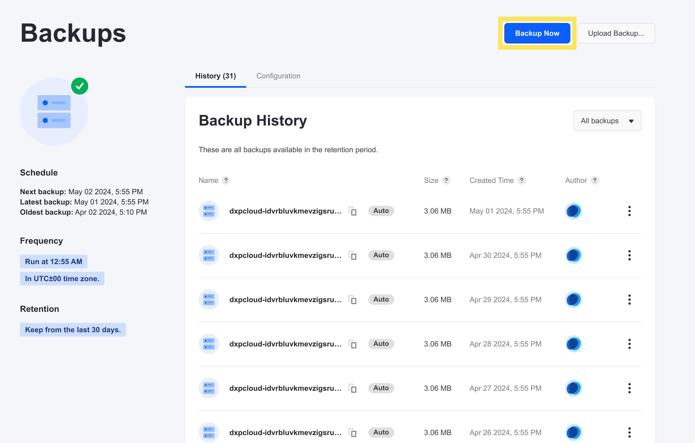
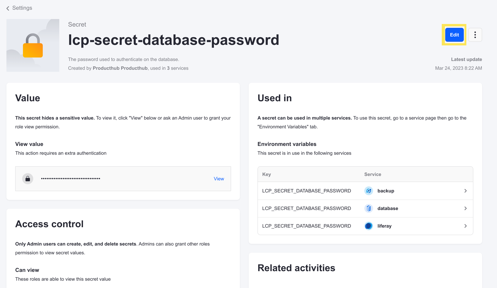

---
taxonomy-category-names:
- Cloud
- Cloud Platform Services
- Cloud Platform Administration
- Liferay PaaS
uuid: 792fe30d-65cb-4c3e-8ea6-a97cde3dc4cd
---
# Changing Your Database Password

Changing the database password for your [`database` service](../database-service.md) also affects the other services that must connect to the database.

!!! warning
    Updating your database password requires a period of downtime for you to restore a backup to your database service, and then restart all of your services. Plan ahead to make time for this before rotating your database password.

## Creating a Backup

If you are changing the password for a production environment, you must ensure you have an up-to-date backup so you can restore it after the update.

To create a backup for any environment, click _Backups_ from the menu on the left:


Then, click _Backup Now_ on the _Backups_ page:



## Changing the Database Password

Change your database password using your chosen environment's [secrets](../../tuning-security-settings/managing-secure-environment-variables-with-secrets.md), after you've created a backup.

1. Navigate to your chosen environment.

1. Click _Settings_ from the menu on the left.

    

1. Click the _Secrets_ tab.

1. Click the `lcp-secret-database-password` secret from the list.

1. Click _Edit_ at the top of the screen.

    

1. In the _Value_ section, click _Show_ beside the value to reveal the secret and enable editing.

    

1. Edit the secret value.

1. Scroll down and check all of the boxes acknowledging the effects of changing the value of the secret.

    

1. Click _Publish Changes_.

The services restart and the database user is updated with the new password. While the services are restarting, they do not receive requests.

!!! important
    If your database service is not updated to version 5.1.2+, the password can only be updated after deleting and redeploying the service. Continue reading to complete the process for these versions.

## Additional Required Steps (Versions Before 5.1.2)

The database password is still changed directly using your chosen environment's [secrets](../../tuning-security-settings/managing-secure-environment-variables-with-secrets.md) prior to version 5.1.2. However, you must follow additional steps to ensure that your services update correctly with the new value.

After you've [updated the secret value](#changing-the-database-password), follow these steps to complete the process.

1. Return to your environment's _Services_ page.

1. From the Actions menu for the `database` service, click _Delete Service_.

    

1. Open a command prompt within your local clone of the repository.

1. Deploy the `database` service to your environment using the [command-line interface](../../reference/command-line-tool.md):

    ```bash
    cd database
    ```

    ```bash
    lcp deploy
    ```

1. If you are not already logged in, enter `y` at the prompt and authenticate with your browser.

1. When prompted, enter the number corresponding to your environment:

    ```bash
    #      Project             Status
    1      lfrlearn-infra      Ready
    2      lfrlearn-uat        Ready
    3      lfrlearn-dev        Ready
    4      lfrlearn-prd        Ready

    ? Type a number (#) or project name: 2
    ```

    The database service starts up using the updated password. The `liferay` and `backup` services restart to reconnect to the database service with the correct password, as well.

1. If you [prepared a backup](#creating-a-backup), then navigate to your chosen environment's _Backups_ page, and [restore the backup](../backup-service/restoring-data-from-a-backup.md).

Your `database` service is now updated with a new password, and your other services are synchronized to connect to it properly.

## Related Topics

* [Database Service](../database-service.md)
* [Changing Your Database Username](./changing-your-database-username.md)
* [Managing Secure Environment Variables with Secrets](../../tuning-security-settings/managing-secure-environment-variables-with-secrets.md)
