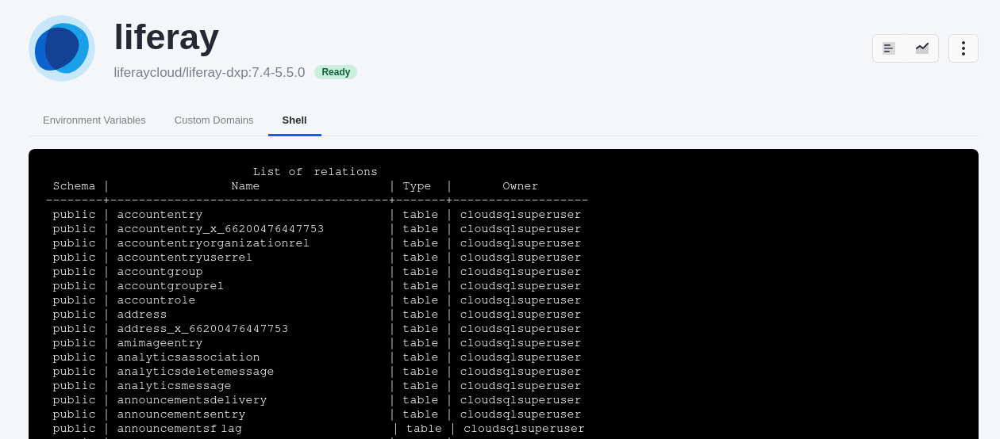

---
taxonomy-category-names:
- Cloud
- Cloud Platform Services
- Cloud Platform Administration
- Liferay PaaS
uuid: fa9c0cd6-ff6b-4672-816a-9d93243dede3
---
# Using the Database Client

Viewing data in the database is sometimes necessary to troubleshoot an issue with your application or for custom development. In order to access the database, you must use a built-in database client to interface directly with it. This feature is available in up-to-date versions of Liferay Cloud, and it can be accessed in a few short steps.

!!! note
    Only Liferay Cloud users with *Admin* and *Contributor* privileges can make use of the database client.

You'll use either the [PostgreSQL client](#postgresql-client) or [MySQL client](#mysql-client), depending on which database your environment uses.

## PostgreSQL Client

Before you can use the PostgreSQL client via the Liferay service, you must upgrade your services to at least these supported image versions:

### Prerequisites

| **Service**       | **Minimum Supported Image Version** |
| :---------------- | :---------------------------------- |
| **Database**      | liferaycloud/database:5.4.0         |
| **Liferay (7.4)** | liferaycloud/liferay-dxp:7.4-5.5.0  |
| **Liferay (7.3)** | liferaycloud/liferay-dxp:7.3-5.5.0  |
| **Liferay (7.2)** | liferaycloud/liferay-dxp:7.2-5.5.0  |
| **Liferay (7.1)** | liferaycloud/liferay-dxp:7.1-5.5.0  |

### Accessing the PostgreSQL Client

1. Log into the Liferay Cloud console.

1. Navigate to the correct environment, and click *Services*:

   

1. Click on the **liferay** service.

1. Click the *Shell* tab.

1. Type `psql` into the shell on this screen.

This logs you into the PostgreSQL client, where you can perform any read-only queries. For example, you can see all the tables by executing `\dt`.



See the official [PostgreSQL documentation](https://www.postgresql.org/docs/current/app-psql.html) for all the available commands.

### Logging in with Read and Write Privileges

The default user can only perform read queries on the database, and cannot manipulate data. This prevents accidental modifications that may corrupt your services' data.

However, if it is *critical* to manipulate data in the database, you can log in using your database credentials by typing this command into the shell (instead of only typing `psql`):

```bash
psql -U [LCP_SECRET_DATABASE_USER]
```

The client prompts you for the password. You can find the database name, user name, and password in your `database` service's [secrets](../../tuning-security-settings/managing-secure-environment-variables-with-secrets.md#viewing-and-modifying-an-existing-secret).

## Accessing the MySQL Client

1. Log into the Liferay Cloud console.

1. Navigate to the correct environment, and click *Services*:

1. Click on the **liferay** service.

1. Click the *Shell* tab.

1. Type `mysql` into the shell on this screen.

This logs you into the MySQL client, where you can perform any read-only queries. For example, you can see all the tables by executing `show tables;`.


See the official [MySQL Client documentation](https://dev.mysql.com/doc/refman/8.0/en/mysql-commands.html) for all the available commands.

### Logging in with Read and Write Privileges

The default user can only perform read queries on the database, and cannot manipulate data. This prevents accidental modifications that may corrupt  your services' data.

However, if it is *critical* to manipulate data in the database, you can log in using your database credentials by typing this command into the shell (instead of only typing `mysql`):

```bash
mysql -u [LCP_SECRET_DATABASE_USER] -p
```

The client prompts you for the password. You can find the database name, user name, and password in your `database` service's [secrets](../../tuning-security-settings/managing-secure-environment-variables-with-secrets.md#viewing-and-modifying-an-existing-secret).

## Related Topics

- [Database Service](../database-service.md)
