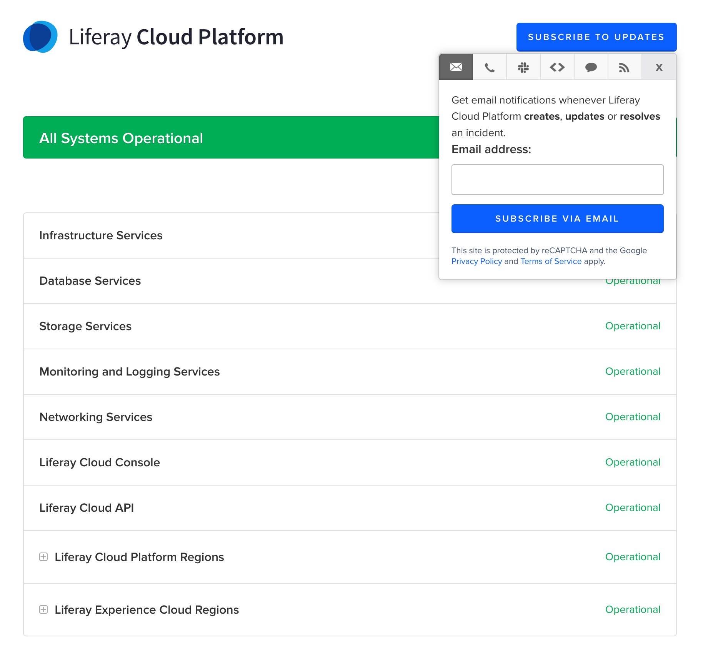
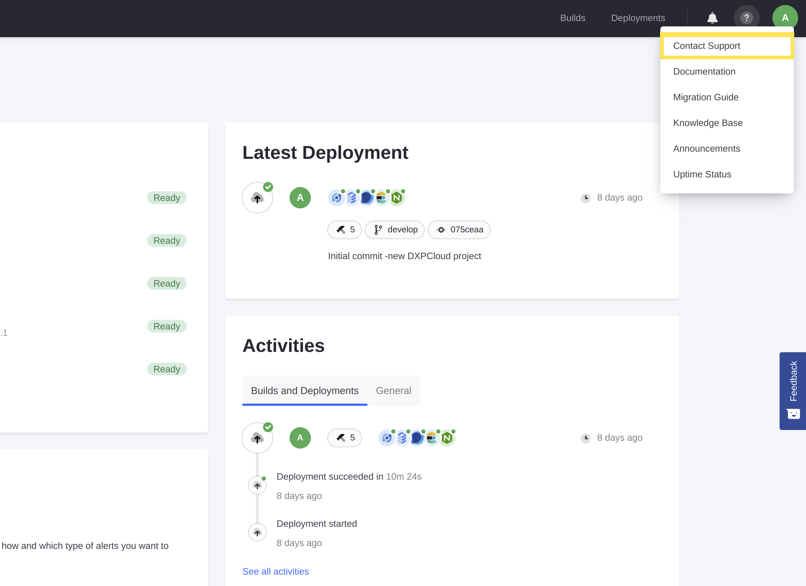
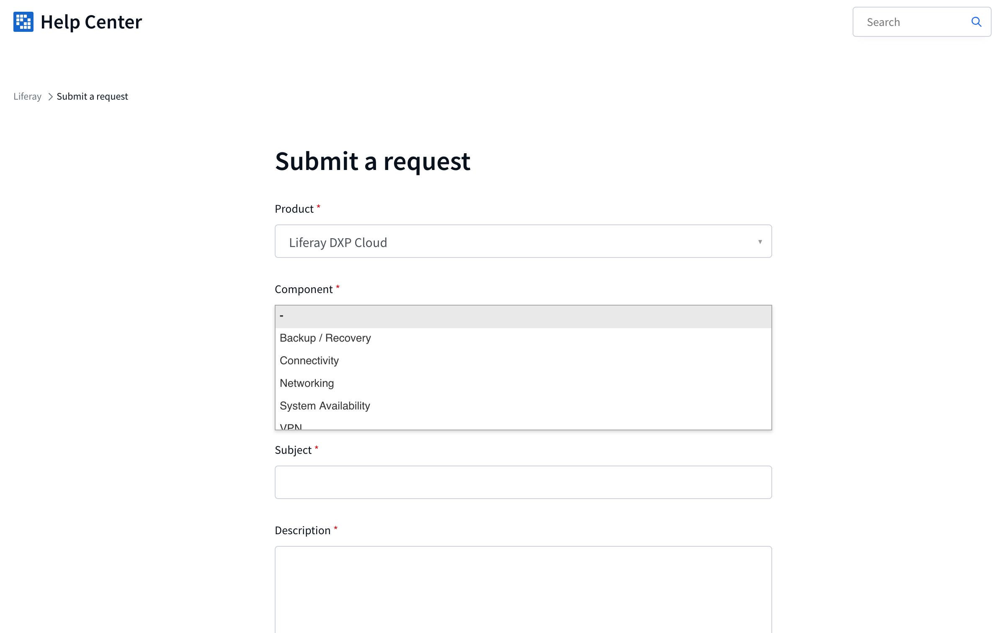

---
toc:
  - ./liferay-cloud-support/support-access.md
  - ./liferay-cloud-support/liferay-paas-shared-activities.md
  - ./liferay-cloud-support/live-chat-for-liferay-paas.md
  - ./liferay-cloud-support/liferay-cloud-maintenance-and-release-schedule.md
  - ./liferay-cloud-support/liferay-cloud-support-faqs.md
taxonomy-category-names:
- Cloud
- Cloud Platform Administration
- Liferay PaaS
- Liferay SaaS
uuid: 7575a756-e793-4243-87f6-e22c4fd1ebd9
---
# Liferay Cloud Support

Liferay is committed to providing excellent service and customer experience. Liferay Cloud customers have several means to contact support, including [opening a Support ticket](#opening-a-support-ticket) or calling the appropriate region's Support office. Liferay PaaS customers can also use a [live chat with Support](./liferay-cloud-support/live-chat-for-liferay-paas.md) to ask about simple questions or issues.

Subscribe to the [Liferay Cloud Status page](https://status.liferay.cloud/) for real-time updates on the platform's status, including its various services, the console, and API. You can subscribe to updates via email, text message, Slack message, or webhook notifications.

## Opening a Support Ticket

If you need help with issues you are experiencing as a Liferay Cloud customer, you can always open a ticket for Liferay Cloud Support's assistance. Follow these steps to create a ticket at the Liferay Help Center:

1. From the Liferay Cloud console, click the `?` icon at the top-right corner of the screen, and click *Contact Support*. This link redirects to the Help Center website's ticket creation page.

    

1. Log in with your liferay.com account credentials if you are not already. 

1. Fill in any relevant information for your issue into all of the fields on the page, and then submit the request.

    

    When submitting a ticket, please provide information including:

    * The build images currently in use
    * The behavior or question you are facing
    * Steps to reproduce the issue
    * A description of both the actual behavior and the expected behavior

The ticket is created once you submit the form. You will get an email notification once a Support team member has responded to your ticket. You can continue to respond via the [Help Center Requests](https://help.liferay.com/hc/requests) page, or by responding to the email.

## Additional Information

* [Support Access](./liferay-cloud-support/support-access.md)

