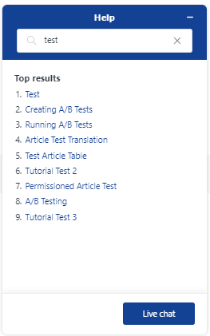

---
taxonomy-category-names:
- Cloud
- Cloud Platform Services
- Liferay PaaS
uuid: 5e7b81ac-0369-4ce5-9f72-967746305ba3
---
# Live Chat for Liferay PaaS

Liferay PaaS subscribers can use the live chat on Help Center to get quick answers to common questions or simple issues, without needing to submit a ticket.

!!! important
    The live chat is not a substitute for submitting Support tickets or calling phone support. The Support team member will direct you to one of these other channels if a question cannot be quickly and simply answered. *The highest-priority issues (severity level 1) should be reported via phone support.*

## How to Access the Live Chat

Liferay PaaS subscribers can access the live chat via the [Liferay Cloud console](https://console.liferay.cloud/)'s Help menu.

1. Click *Help* at the bottom-right corner of the screen.

    

    The Help menu includes a search bar, where you can search for article suggestions that might already answer your question.

1. Type your question into the search bar and check any articles that might answer your question before proceeding.

    

1. If you still need the live chat, click *Live chat* at the bottom of the Help menu.

1. Fill in the form with your name, email, and a message introducing your question or concern.

Once you send your message, your position in the live chat queue is shown. The widget updates when a Support staff member joins and responds to your chat.

You can also review previous chat messages afterward by clicking *View My Tickets* at [Help Center](https://help.liferay.com), the same way you can review Support tickets.

## Service Level Agreement

Here are the SLA times for Liferay Support to respond when you report an issue *via the live chat*. Note that this response may be to contact Liferay's phone support or submit a Support ticket if the query cannot be quickly resolved.

| **Severity Level**        | **Description**                                                                                     | **Response Time SLA**          |
| :------------------------ | :-------------------------------------------------------------------------------------------------- | :----------------------------: |
| **Severity 1 ("High")**   | Production environment is severely impacted or shut down.                                           | N/A (unsuitable for live chat) |
| **Severity 2 ("Normal")** | Any environment is running but experiencing limitations, instability, or periodic interruptions.    | 2 minutes                      |
| **Severity 3 ("Low")**    | Any environment is running and fully functional, but there are errors that do not impact usability. | 2 minutes                      |

## Availability

The live chat is only available during the Liferay office's [business hours](../liferay-cloud-support.md#support-office-business-hours) in your region. You can still use the Help button to search for relevant Support articles at any time.

The live chat is also limited to specific regions. However, live chat support may be added for more regions with time. You'll receive an email when live chat support is added for your region.
