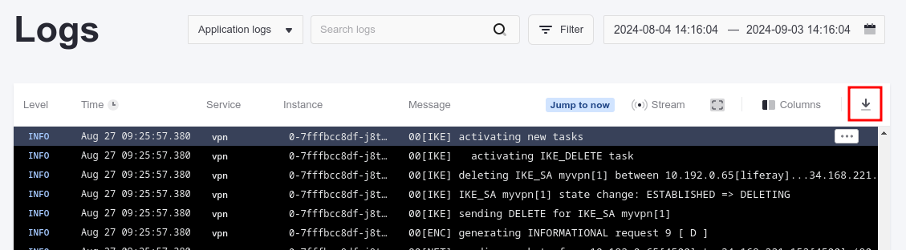
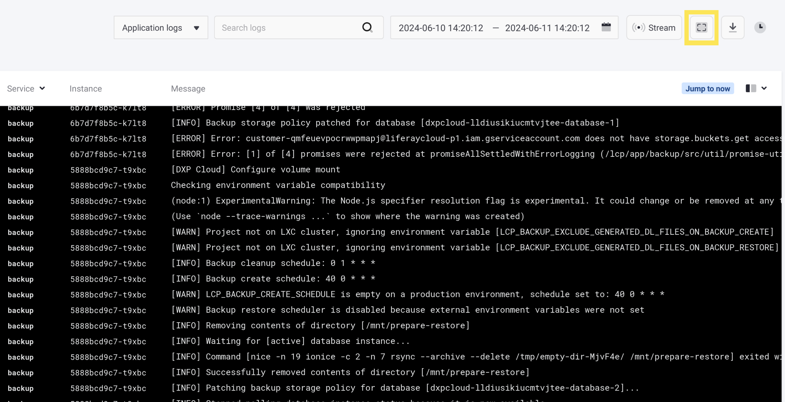
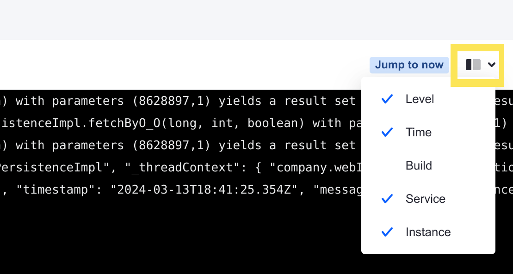
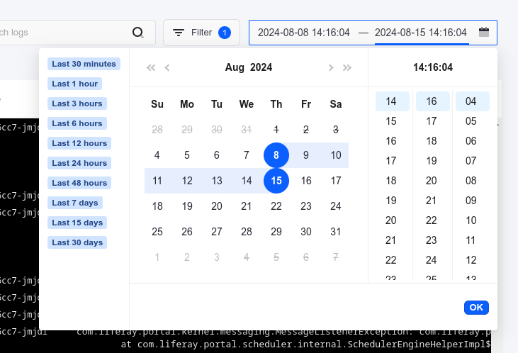

---
taxonomy-category-names:
- Cloud
- Cloud Platform Administration
- Liferay PaaS
uuid: 214e29d5-25cf-4f48-84c6-6bb9853af7ae
---

# Reading Liferay Cloud Service Logs

Environment logs are crucial for diagnosing and resolving technical issues in a project. Liferay Cloud provides a variety of environment logs that users can access and download via the Liferay Cloud console or OS terminal.

## Log Types

Liferay Cloud provides three types of logs for environment services:

- **Application Logs**: Shows runtime information generated after the application is running and accessed by users.

- **Build Logs**: Shows build information generated as the application boots up. Examples include: when Docker images are pulled from the registry, when deploys are in progress, and when builds are successful.

- **Status Logs**: Shows orchestration layer information from the Kubernetes cluster. Examples include: when images are successfully pulled, when containers are created and started, and when readiness or liveness probes fail.

- **VPN Logs**: Shows VPN server information. Examples include when a VPN connection fails, when a certificate is invalid or expired, and when the connection times out.

## Log Structure

Logs in Liferay Cloud conform to a specific structure that gives extra, contextual information. See this log message as an example:

```log
Jun 29 10:07:46.585 build-214 [webserver-699bf65bfb-4w8pl] [WARNING] 179/170746 (13) : api/backend2 changed its IP from 10.0.17.186 to 10.0.26.120 by DNS cache.
```

Logs always appear in this format when you download them or [view them from a terminal](#accessing-logs-via-the-terminal). However, if you access logs [via the console](#accessing-logs-via-the-liferay-cloud-console), the structure varies because the columns of information with each log message are customizable.

Many logs in Liferay Cloud have a label (in this example, `[WARNING]`) that indicates that this message came from Liferay Cloud infrastructure, and not directly from the service's output. Logs can also have labels that come from Liferay Cloud infrastructure but are related to the service, such as `[LIFERAY]`. Logs that come directly from the service's output have no label.

Additionally, these components are always present in any log message in Liferay Cloud:

- The **timestamp**: in this example, `Jun 29 10:07:46.585`.

- The **build ID**: in this example, `build-214`. This corresponds to the build that the currently deployed version of the service corresponds to. You can match this build ID to the list of builds shown in your project's *Builds* page.

- The **instance ID**: in this example, `[webserver-699bf65bfb-4w8pl]`. This is used to identify which instance of a service a message is related to.

The instance ID associated with a log message corresponds to one of the instances of your service. The format of the instance ID depends on what deployment type (deployment or stateful set) the service is configured as. See [Understanding Deployment Types](../../updating-services-in-liferay-paas/understanding-deployment-types.md) for more information.

### Instance ID for Deployment Type Logs

Deployment type logs have an instance ID with multiple parts. See this example of a log message from a deployment type service:

```log
Jun 29 10:07:57.102 build-214 [liferay-7485669bdd-7ktfl] [LIFERAY] Executing 010_liferay_cloud_customizable_files_override.sh.
```

The instance ID for this message (in this example, `[liferay-7485669bdd-7ktfl]`) contains these components:

- The **service name**: in this example, `liferay`.

- A randomly generated **version ID**: in this example, `7485669bdd`. This corresponds to the version of your service that has been deployed with possible changes. Note that new deployments, changes to environment variables, and even manually restarting the service all generate a new version ID (because a new change may have been made in the configuration).

- A randomly generated **container ID**: in this example, `7ktfl`. Whenever a new container is created (for example, after you deploy a new build and the service restarts), a new container ID is generated because a new container is created each time the service starts up. Note that any restart generates a new container ID, even when the version ID does not change (for example, when a [liveness or readiness probe failure](./self-healing.md) triggers a restart).

### Instance ID for Stateful Set Type Logs

Stateful set type logs have a smaller and more consistent instance ID. See this example of a log message from a stateful set type service:

```log
Jun 29 07:44:44.676 build-214 [search-0] #  - Creating and Starting rollup jobs will no longer be allowed.
```

These are the only components of the `instance ID` for stateful set type services:

- The **service name**: in this example, `search`.

- An iterating (non-random) **node ID**: in this example, `0`. This ID remains the same even after deploying new versions of the service.

The entire instance ID for stateful set type services always remains the same for each node of the service. You can reliably use the same instance ID to identify the node in a cluster with the same [volume](../../updating-services-in-liferay-paas/configuring-persistent-file-storage-volumes.md), even after the service has been redeployed.

## Log Levels

Liferay Cloud service logs are divided into six levels of increasing severity, with number values associated with them:

| **Log Level** | **Priority Value** |
| :------------ | :----------------: |
| `TRACE`       | 100                |
| `DEBUG`       | 200                |
| `INFO`        | 300                |
| `WARN`        | 400                |
| `ERROR`       | 500                |
| `FATAL`       | 600                |

You can set the log level for the [backup service](../../platform-services/backup-service.md) and [database service](../../platform-services/database-service.md) using the `LCP_SERVICE_LOG_LEVEL` [environment variable](../../reference/defining-environment-variables.md). The service's messages appear if their priority value is equal to or higher than the service's configured log level. You can set this environment variable using the log level's name (e.g., `DEBUG`) or with a numerical value (for example, setting the value to `0` to guarantee all messages are shown, or `601` to suppress all of these message types).

## Accessing Logs via the Liferay Cloud Console

Follow these steps to access environment service logs via the Liferay Cloud console:

1. Navigate to a project environment.

1. Click on *Logs* in the environment menu.

View application, status, build, and VPN logs across all environment services or [filter results](#searching-and-filtering-logs) using the drop-down menus.

To download logs, click the *Download Logs* button.



You can also use the drop-down menu at the top-right corner to select which information to display as a column for each log message.



The log inspector contains detailed breakdowns of each log. To open the log inspector, click the button that appears when hovering over the log.

### Searching and Filtering Logs

You can filter by [type](#log-types), by date, or by service and instance on the Logs page. To filter by service or by the specific instance of a service, use the Filter button.



To filter by a date range, use the date picker at the top-right corner. You cannot choose a date that [no longer has valid logs](../../reference/platform-limitations.md#all-services).



!!! tip
    Click *Jump to now* to see the latest log messages when you've selected a date range. The end of your selected date range changes to the current time.

You can also use the search bar to search for specific terms in log messages.

### Viewing Continuous Log Updates

By default, logs on the Logs page only update when you refresh the page or update the date range manually (which includes updates up to the second the page is loaded). Click *Stream* to enable streaming new log messages while you view the Logs page. Any new log messages automatically appear at the bottom.


Streaming log messages only stays enabled until the next time you load the page. While streaming is enabled, the controls to [filter by date or type](#searching-and-filtering-logs) are disabled.

## Accessing Logs via the Terminal

Administrators and developers can also view logs via an OS terminal.

Run the following command to list logs for all services:

```shell
lcp log
```

To access service logs from a specific environment, either enter the environment's ID after running the `lcp log` command, or run the `lcp log` command with the environment ID:

```shell
lcp log -p <environment-id>
```

Users can also specify a service as part of the `lcp log` command:

```shell
lcp log -p <environment-id> -s <service-id>
```

## Related Topics

- [Shell Access](./shell-access.md)
- [Disaster Recovery Overview](./disaster-recovery-overview.md)
- [Configuring Cross-Region Disaster Recovery](./configuring-cross-region-disaster-recovery.md)