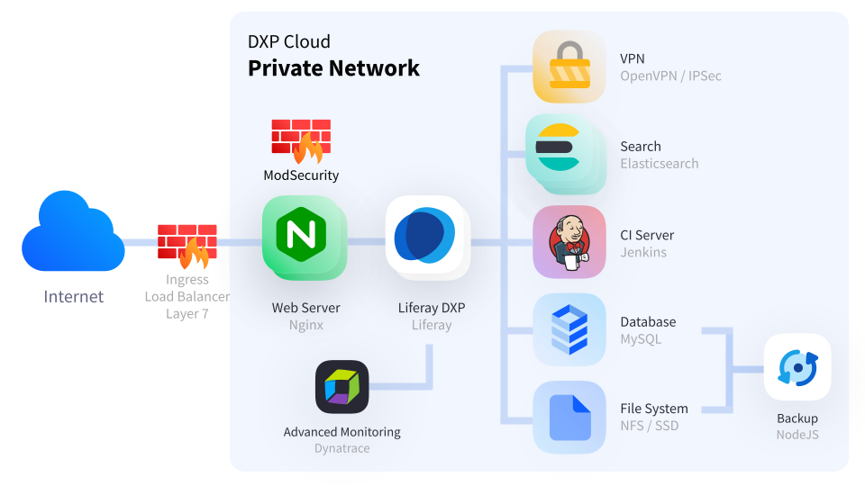

---
taxonomy-category-names:
- Cloud
- Cloud Platform Administration
- Cloud Platform Security
- Cloud Platform Networking
- Liferay PaaS
uuid: 4f659a0a-7b7b-4798-8c88-21222e42ab81
---
# Web Application Firewall

{bdg-secondary}`Liferay Cloud 5.x.x`

Liferay Cloud includes a web application firewall called [ModSecurity](https://github.com/SpiderLabs/ModSecurity). It inspects requests sent to the web server against a predefined set of custom rules. This step prevents typical web application real time L7 attacks, like XSS, SQL Injection, and other forms of hijacking attempts that might lead to loss of sensitive information.

Liferay Cloud includes additional network security features, including a [private network](../configuring-the-cloud-network/private-network.md), public [load balancer](../configuring-the-cloud-network/load-balancer.md) ([Layer 7](https://www.nginx.com/resources/glossary/layer-7-load-balancing/)), and [CDN](../configuring-the-cloud-network/load-balancer.md#cdn).



```{note}
Custom firewall rules are not available with [shared cluster subscriptions](../reference/platform-limitations.md#security).
```

## Enabling ModSecurity

ModSecurity is disabled by default. To enable it, add the `LCP_WEBSERVER_MODSECURITY` [environment variable](../platform-services/web-server-service.md#environment-variables) to your project repository's `webserver/LCP.json` file. Attack detection rules are only processed if ModSecurity is enabled. You must [add your own rules](#adding-attack-detection-rules).

These values are allowed for `LCP_WEBSERVER_MODSECURITY`:

* **On**: enables ModSecurity. Attack detection rules are processed.

* **Off**: disables ModSecurity. Rules are not processed.

* **DetectionOnly**: enables ModSecurity. Rules are processed, but disruptive actions are not executed (block, deny, drop, allow, proxy, or redirect).

```{tip}
The `LCP_WEBSERVER_MODSECURITY` environment variable is equivalent to ModSecurity's own [`SecRuleEngine` directive](https://github.com/SpiderLabs/ModSecurity/wiki/Reference-Manual-%28v3.x%29#SecRuleEngine).
```

To enable ModSecurity, set the value of `LCP_WEBSERVER_MODSECURITY` to `On` or `DetectionOnly`, then [deploy the change](../updating-services-in-liferay-paas/deploying-changes-via-the-cli-tool.md).

## Changing ModSecurity's Configuration

The default ModSecurity settings are recommended. To override the default configuration, create a `modsecurity.conf` file in your project repository's `webserver/configs/[ENV]/modsec/` directory. You must provide all necessary configurations, because it completely overrides Liferay Cloud's default `modsecurity.conf`.

Copy [this example of recommended settings](https://github.com/SpiderLabs/ModSecurity/blob/v3/master/modsecurity.conf-recommended) as a starting point for your own `modsecurity.conf` file. If you use this file, replace the line `SecRuleEngine DetectionOnly` with this line:

```
SecRuleEngine ${LCP_WEBSERVER_MODSECURITY}
```

See the [ModSecurity Reference Manual](https://github.com/SpiderLabs/ModSecurity/wiki/Reference-Manual-%28v3.x%29) for more information on the allowed settings.

## Adding Attack Detection Rules

Attack detection rules are not provided by default. You must provide rules according to your specific needs.

### OWASP ModSecurity Core Rule Set

The OWASP Foundation's ModSecurity Core Rule Set (CRS) is recommended for use with Liferay Cloud.

To add the OWASP CRS to ModSecurity,

1. Download the OWASP CRS [here](https://coreruleset.org/docs/deployment/install/).

1. Unzip the downloaded archive into a temporary folder.

1. Copy the `rules/` folder from the download into the repository folder `webserver/configs/[ENV]/modsec/rules/`.

1. From the copied files, move `crs-setup.conf.example` to the `webserver/configs/[ENV]/modsec/` folder.

1. Rename `crs-setup.conf.example` to `crs-setup.conf`.

1. Open the `crs-setup.conf` file and add this to the last line of the file:

```
include /etc/nginx/modsec/rules/*.conf
```

1. Commit the files to your repository and [deploy the changes](../updating-services-in-liferay-paas/deploying-changes-via-the-cli-tool.md).

The rule set is interpreted once you [enable ModSecurity](#enabling-modsecurity).

## Using ModSecurity Audit Logs

When [enabled](#enabling-modsecurity), ModSecurity automatically generates audit logs, recording detailed information for all transactions. To view the logged information, open the `modsec_audit.log` file in your web server's `/var/log` directory.

If you [configure ModSecurity by providing your own `modsecurity.conf` file](#changing-modsecuritys-configuration), you can log the information in the web server's console (where you can download it) instead of `modsec_audit.log`. Change this line in your `modsecurity.conf` file:

```
SecAuditLog /var/log/modsec_audit.log
```

Replace `/var/log/modsec_audit.log` with `/dev/stdout` to print audit logs for each transaction in the console. The audit logs appear once you deploy the change.

If desired, change the audit log format to JSON by adding one line to the `modsecurity.conf` file:

```
SecAuditLogFormat JSON
```

## Related Topics

* [Private Network](../configuring-the-cloud-network/private-network.md)
* [Load Balancer](../configuring-the-cloud-network/load-balancer.md)
* [CDN](../configuring-the-cloud-network/load-balancer.md#cdn)
