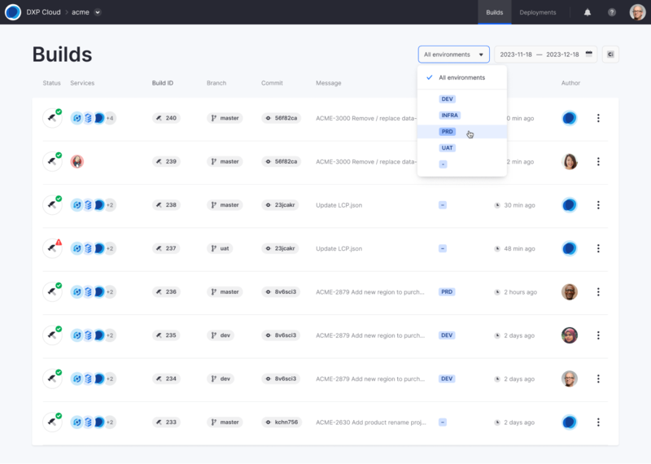
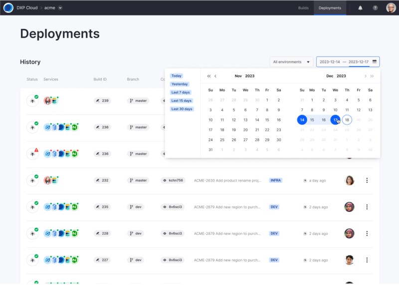
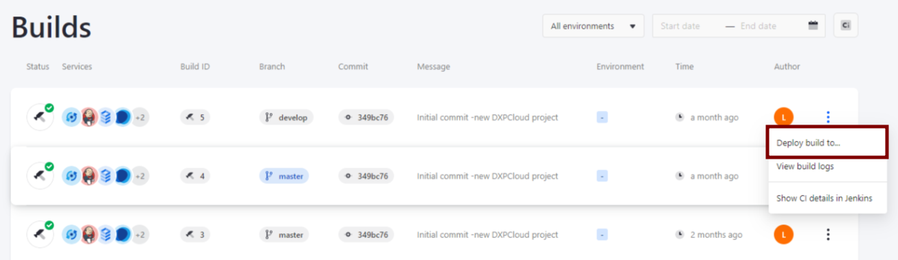

---
taxonomy-category-names:
- Cloud
- Cloud Platform Builds and Deployments
- Liferay PaaS
uuid: dc78712a-aba2-48cd-9566-a6f9182726c7
---
# Overview of the Liferay Cloud Deployment Workflow

Liferay PaaS provides a robust framework for achieving a highly efficient CI/CD strategy. With Git and Jenkins integrations, you can automatically trigger CI builds that you can then deploy to project environments. Alternatively, you can skip the CI service's build process altogether and directly deploy local changes to project environments using the [Command Line Interface](../reference/command-line-tool.md) (CLI) tool.

Although there are multiple paths for deployment, workflows generally follow these three stages:

- [Develop and Configure](#develop-and-configure)
- [Build and Test](#build-and-test)
- [Deploy](#deploy)

## Develop and Configure

All workflows begin with making changes to your project's Git repository (i.e., [GitHub](../getting-started/configuring-your-github-repository.md), [Bitbucket](../getting-started/configuring-your-bitbucket-repository.md), or [GitLab](../getting-started/configuring-your-gitlab-repository.md)). This repository serves as the basis for any custom additions to your project, including the Liferay service instance itself. This Git repository provides shared version control for configuration and customization of project services, a single source of truth for project deployments, and a shared workspace for building Liferay modules, themes, and extensions.

Configure a service's [LCP.json file](../reference/configuration-via-lcp-json.md), or make environment-specific and project-wide changes to a service via its `configs/` folder. To learn more about each service's configuration options, see their respective documentation:

- [Liferay Service](../customizing-liferay-dxp-in-the-cloud/using-the-liferay-dxp-service/configuring-the-liferay-dxp-service.md)
- [Backup Service](../platform-services/backup-service.md)
- [Continuous Integration Service (Jenkins)](../platform-services/continuous-integration.md)
- [Database Service](../platform-services/database-service.md)
- [Search Service (Elasticsearch)](../platform-services/search-service.md)
- [Web Server Service (Nginx)](../platform-services/web-server-service.md)

## Build and Test

Depending on the configuration of your project's Git repository, you can trigger automatic CI builds by merging commits into your project's central repository or opening a new pull request with your changes. While this process is automatic, you can modify the CI service in the `infra` environment to include additional pipeline steps, including testing. See [Continuous Integration](../platform-services/continuous-integration.md) for more information.

To access a full history of builds across all project environments, navigate to the *Builds* page in the Liferay Cloud console. Here you can view all builds initiated by either the CI service or CLI tool, along with their general information and status (i.e., pending, passed, or failed). You can filter builds by date and environment.

## Deploy

With Liferay PaaS, there are three ways to deploy services: deploying via the CLI tool (manually), deploying via the Liferay Cloud Management Console (manually), or configuring certain CI builds to deploy automatically.

To access a full history of deployments across all project environments, navigate to the *Deployments* page in the Liferay Cloud console. Here you can view all deployments initiated using any of the three methods, along with their general information. You can filter deployments by date and environment.

### Option 1: Deploying Through the Command Line Interface

Using the CLI tool is the quickest way to deploy local changes to a service. With it, you can deploy from your terminal and skip pushing your changes to a remote repository or triggering a Jenkins build altogether. Unlike other deployment methods, the CLI tool can also deploy local changes for one service at a time.

To do this, log in to the CLI tool in your terminal, and navigate to the folder for the service you want to deploy (the folder must contain the service's `LCP.json` file). Then, initiate the deployment process by running `lcp deploy`, and select which project and environment to deploy to (e.g., `dev`, `uat`, `prd`). *Always deploy to a `dev` or `uat` environment to verify any changes before deploying to a production environment.*

For the deployment to be successful, you must have permissions to deploy to the chosen environment. See [Deploying Changes via the CLI Tool](./deploying-changes-via-the-cli-tool.md) for a walk through of this deployment workflow.

!!! important
    While you can directly deploy backup, CI, database, search, and webserver services, you must first create a gradle build of the Liferay service before running the `lcp deploy` command. See [Deploying to the Liferay Service](../customizing-liferay-dxp-in-the-cloud/using-the-liferay-dxp-service/deploying-to-the-liferay-service.md#cli-tool-deployment) for more information.

When you deploy with the CLI tool, you can either deploy all services at once (by running the command from the root directory of your project), or deploy only a single service (by running the command from the directory containing the service's `LCP.json` file). The `liferay` service in particular [requires extra steps](../customizing-liferay-dxp-in-the-cloud/using-the-liferay-dxp-service/deploying-to-the-liferay-service.md#cli-tool-deployment) to deploy, so it can build and prepare the files from your project workspace.

### Option 2: Deploying From the Liferay Cloud Console

The Liferay Cloud console is the primary way for deploying changes to your project. With it, you can view and select from successful builds and deploy them to the environments of your choice. These include builds generated by both the CI service and CLI tool and can be accessed via the *Builds* page in the Liferay Cloud console. *Always choose a `dev` or `uat` environment to verify any changes before deploying to a production environment.*

See [Deploying Changes via the Liferay Cloud Console](./deploying-changes-via-the-liferay-cloud-console.md) for a walk through of the deployment workflow.

### Option 3: Automatically Deploying Builds to `dev` Environment

If desired, you can set up your CI service to automatically deploy builds to your project's `dev` environment. Add an environment variable to the CI service that initiates automatic deployments for builds made from your specified branch. See [Setting Up Automatic Deployment](./automatically-deploying-ci-service-builds.md) for more information.

## Related Topics

- [Understanding Deployment Types](./understanding-deployment-types.md)
- [Understanding Deployment Strategies](./understanding-deployment-strategies.md)
- [Team Activities](../manage-and-optimize/team-activities.md)