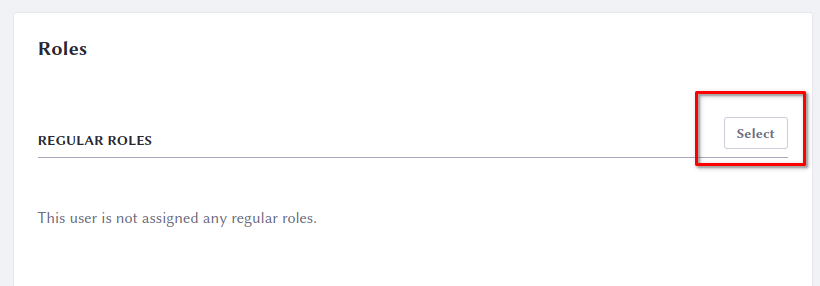

# Liferay Documentation Format

The format, or how a style of documentation is organized, is important to maintaining consistency of experience. As readers make more use of the documentation, the organization of how a feature is presented and described should become familiar. To make this possible, writers must adhere to format conventions. 

## Never Use the word Introduction in an Introduction Title

In other words, never name an introduction *Introduction to....*

## Make Feature Documentation as Independent as Possible

Each feature article should be as standalone as possible. Never assume the reader has (or might have) read another article on the same topic. If it's helpful to link to another article, definitely do it, but avoid language like this:

*You may have noticed the Big Red Button at the bottom of the screen in the article on Foos. Here's what it does.*

Instead, do this:

*At the bottom of the [form](../some-other-article.md) is this other function. Here's how to use it.*

## Introducing Steps

If you have a set of steps for the reader to follow, don't introduce those steps directly underneath a heading. Directly list the steps. 

**Example 1 (don't do this):**

```
## Editing Fields

To edit fields,

1. Step one 
```

**Example 2 (do this):**

```
## Editing Fields

1. Click the _Edit_ button.

1. Enter a name...
```

## Comparing Features

When comparing features between items, such as Public and Private Pages, use a table with checks:

```
| Behavior | Public Pages | Private Pages |
| --- | --- |---|
| Visible to unauthenticated users | &#10004; |  |
| Viewing requires Login and Site Membership |  | &#10004; |
| Distinct URL pattern | &#10004; | &#10004; |
```

The table above renders like this:

| Behavior | Public Pages | Private Pages |
| --- | --- |---|
| Visible to unauthenticated users | &#10004; |  |
| Viewing requires Login and Site Membership |  | &#10004; |
| Distinct URL pattern | &#10004; | &#10004; |

## Highlighting UI Elements

Highlighting UI elements is a great way to show users how to use a feature. There are two ways of highlighting UI elements: Box highlighting and numeric annotations.

An example using box highlighting:



An example of using numeric annotations:


If you use numeric annotations, define what's pictured in the text below the image. 

## Diagrams / Visual Aids

Add diagrams to help users better understand complex concepts, including but not limited to how Liferay features relate to one another, a feature's purpose/function, or anything else you think may help a reader learn a concept. 

## Videos

Upload videos to YouTube and then reference them in the article using the YouTube token: 

```
[$LIFERAY_LEARN_YOUTUBE_URL$]=https://www.youtube.com/embed/x7fm_nCZ0sY
```

## Documenting Multiple Liferay Versions

The Liferay documentation is versionless in that it always supports the latest version. Sometimes there must be documentation for an older version: 

- When Liferay modifies the user interface for a feature
- When Liferay deprecates or removes a feature, but users still use the old version
- When Liferay adds new functionality to an already existing feature

In these cases, you must support more than one version of the software in the documentation. Here are some ways to do that: 
 
-   Do not create a new article to discuss the changes in a new software minor version. Keep all the content for the same software major version in the same article.

-   Place the newest information at the top of the article and the oldest information at the bottom.

-   Evaluate the impact of the changes in the existing document:

    -   For minor changes, use badges (see above) to let readers know which version the content applies to. If the change requires a header, place the note right after the header.
    -   For major changes, use a dedicated H2 section to discuss the changes and place a note-type admonition at the beginning of the topic cross-linking the H2. 
