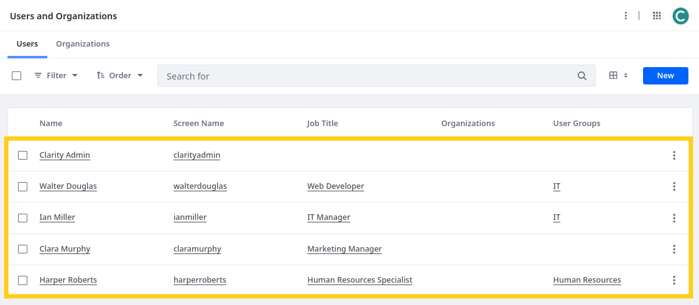
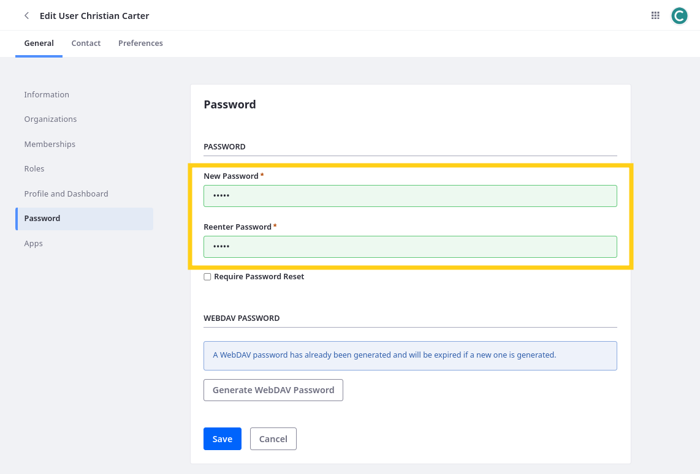
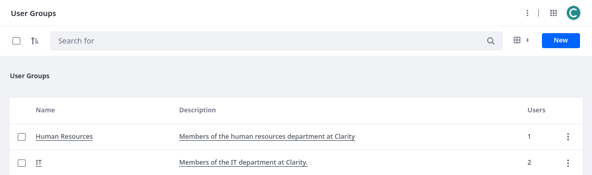
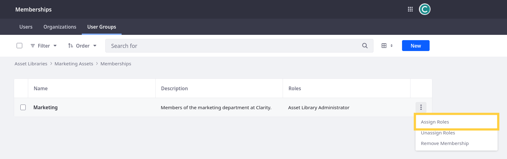

# Day 1 Exercises for Building Enterprise Websites with Liferay

* [Exercise 1: Exploring Clarity's Public Enterprise Website](#exercise-1-exploring-claritys-public-enterprise-website)
* [Exercise 2: Verifying and Launching Liferay Workspace](#exercise-2-verifying-and-launching-liferay-workspace)
* [Exercise 3a: Creating Users](#exercise-3a-creating-users)
* [Exercise 3b: Creating and Assigning User Groups](#exercise-3b-creating-and-assigning-user-groups)
* [Exercise 3c: Creating and Assigning User Roles](#exercise-3c-creating-and-assigning-user-roles)
* [Exercise 3d: Defining Role Permissions](#exercise-3d-defining-role-permissions)
* [Exercise 3e: Fine Tuning Manager Permissions (Bonus)](#exercise-3e-fine-tuning-manager-permissions-bonus)
* [Exercise 4a: Creating a Site](#exercise-4a-creating-a-site)
* [Exercise 4b: Adding Users to a Site](#exercise-4b-adding-users-to-a-site)
* [Exercise 4c: Configuring the Site](#exercise-4c-configuring-the-site)
* [Exercise 5: Analytics Cloud](#exercise-5-analytics-cloud)
* [Exercise 6a: Adding Content Pages](#exercise-6a-adding-content-pages)
* [Exercise 6b: Adding Display Page Templates](#exercise-6b-adding-display-page-templates)
* [Exercise 6c: Designing Clarity's Master Pages](#exercise-6c-designing-claritys-master-pages)
* [Exercise 6d: Configuring Allowed Fragments](#exercise-6d-configuring-allowed-fragments)
* [Exercise 6e: Creating a Secondary Master Page](#exercise-6e-creating-a-secondary-master-page)
* [Exercise 6f: Applying the Master Pages](#exercise-6f-applying-the-master-pages)
* [Exercise 7a: Creating Navigation Menus](#exercise-7a-creating-navigation-menus)
* [Exercise 7b: Updating Menu Display Fragments](#exercise-7b-updating-menu-display-fragments)
* [Exercise 8a: Creating Custom Fragments](#exercise-8a-creating-custom-fragments)
* [Exercise 8b: Importing Fragments](#exercise-8b-importing-fragments)
* [Exercise 8c: Adding Custom Fragments to Master Pages](#exercise-8c-adding-custom-fragments-to-master-pages)
* [Exercise 8d: Adding Fragment Compositions to Pages](#exercise-8d-adding-fragment-compositions-to-pages)
* [Exercise 8e: Updating Clarity's Default Theme, Favicon, and Logo](#exercise-8e-updating-claritys-default-theme-favicon-and-logo)
* [Exercise 8f: Deploying and Applying Clarity's Theme CSS Client Extension](#exercise-8f-deploying-and-applying-claritys-theme-css-client-extension)
* [Exercise 9a: Creating Asset Libraries](#exercise-9a-creating-asset-libraries)
* [Exercise 9b: Adding Clarity’s Logo to the Master Pages](#exercise-9b-adding-claritys-logo-to-the-master-pages)
* [Exercise 10a: Creating Web Content Structures](#exercise-10a-creating-web-content-structures)
* [Exercise 10b: Creating Web Content Articles](#exercise-10b-creating-web-content-articles)
* [Exercise 10c: Mapping Content to Fragments](#exercise-10c-mapping-content-to-fragments)

## Exercise 1: Exploring Clarity's Public Enterprise Website

Throughout this training, you'll help build an enterprise marketing website for Clarity Vision Solutions. This site is intended to increase brand awareness, showcase their products, and convert visitors to customers. Instead of starting from scratch, we've provided a Liferay workspace that includes a partially complete version of Clarity's site that you'll finish throughout the training. Along the way, you'll take on different Clarity personas to demonstrate how they can contribute to Clarity's solution.

Before moving on to the next lesson,

1. Review Clarity's [Figma designs](https://www.figma.com/design/vLkKooAPBSwVzQ8QDqJ7NM/Clarity---Public-Enterprise-Website?node-id=606-2&t=H8Uw4T29g2Kz0Z9i-0) to get an idea of the site you're building.

1. Visit [https://clarityvisionsolutions.com](https://clarityvisionsolutions.com) to explore a complete implementation of the site on Liferay.

## Exercise 2: Verifying and Launching Liferay Workspace

As you prepare to build Clarity's enterprise website, ensure you've followed the [Enablement Bootcamp Prerequisite](https://www.liferay.com/web/events/enablement-bootcamp-prerequisites) to set up the training workspace:

1. Open your terminal and verify you have Java JDK 11.

   ```bash
   java -version
   ```

   If you don't have Java 11 installed, see [Microsoft OpenJDK installation](https://learn.microsoft.com/en-us/java/openjdk/install) for instructions according to your OS.

   **Note**: Some students have encountered issues with JDK 11.0.2, so we recommend using an early or later version.

1. (Optional) Verify Liferay Blade CLI is installed:

   ```bash
   blade version
   ```

   If you don't have Blade installed, run this command:

   ```bash
   curl -L https://raw.githubusercontent.com/liferay/liferay-blade-cli/master/cli/installers/local | sh
   ```

   **Note**: Liferay Blade CLI can help simplify terminal commands for Liferay workspaces but is not necessary for this training. You can use Gradle Wrapper commands instead.

1. Verify Git is installed:

   ```bash
   git version
   ```

   If Git is not installed, see [Git's official documentation](https://git-scm.com/downloads) for how to install it on your OS ([macOS](https://git-scm.com/download/mac)|[Windows](https://git-scm.com/download/win)|[Linux/Unix](https://git-scm.com/download/linux)).

1. In your terminal, go to your desired folder and clone the training workspace to your computer:

   ```bash
   git clone https://github.com/liferay/enablement-bootcamp-clarity.git
   ```

   This saves a copy of the project in your current terminal directory.

   **Note**: If you've cloned the repo previously, ensure your workspace is up to date by running `git pull origin main`.

1. Go to the workspace's root folder in your terminal:

   ```bash
   cd enablement-bootcamp-clarity/
   ```

1. Initialize your Liferay bundle:

   ```bash
   blade server init
   ```

   If you don't have Blade installed, run this command:

   * **Unix-based systems**:

      ```bash
      ./gradlew initBundle
      ```

   * **Windows**:

      ```bash
      .\gradlew.bat initBundle
      ```

   This downloads and builds dependencies for running Liferay, including the Liferay server.

1. Start your Liferay server:

   **Blade**:

   ```bash
   blade server run
   ```

   * **Unix-based systems**:

      ```bash
      ./bundles/tomcat/bin/catalina.sh run
      ```

   * **Windows**:

      ```bash
      .\bundles\tomcat\bin\catalina.bat run
      ```

1. When finished, access your Liferay DXP instance by going to `http://localhost:8080/` in your browser.

1. Sign in using these credentials:

   * Username: `admin@clarityvisionsolutions.com`
   * Password: `learn`

1. Take some time to explore the site and resources included in the training workspace.

Now you're ready to start contributing to Clarity's public enterprise website!

## Exercise 3a: Creating Users

While building the public enterprise website, we’ll follow these Clarity personas as they contribute to the final site:

| Screen Name     | Email                                         | First Name | Last Name | Job Title                  |
|:----------------|:----------------------------------------------|:-----------|:----------|:---------------------------|
| christiancarter | `christian.carter@clarityvisionsolutions.com` | Christian  | Carter    | Marketing Coordinator      |
| claramurphy     | `clara.murphy@clarityvisionsolutions.com`     | Clara      | Murphy    | Marketing Manager          |
| harperroberts   | `harper.roberts@clarityvisionsolutions.com`   | Harper     | Roberts   | Human Resources Specialist |
| ianmiller       | `ian.miller@clarityvisionsolutions.com`       | Ian        | Miller    | IT Manager                 |
| walterdouglas   | `walter.douglas@clarityvisionsolutions.com`   | Walter     | Douglas   | Web Developer              |


The training workspace already includes all of these users except for Christian Carter. Here you'll add him manually as the Clarity Admin user.

**Note**: In real world scenarios, large organizations like Clarity would benefit from using an identity and access management system (e.g., Okta) to add users to their Liferay instance. For training purposes, you’ll create the missing user manually.

To do this,

1. Open the *Global Menu* (), go to the *Control Panel* tab, and click *Users and Organizations*.

   

   Here you can view and manage all users for the current Liferay instance. This should include the Clarity Admin user along with Walter Douglas, Ian Miller, Clara Murphy, and Harper Roberts.

   

1. Click *New*.

1. To set the user's profile image, click the *Change Image* button (), click *Select*, navigate to the `[repository-folder]/exercises/lesson-3/` folder in the training workspace, select `christian-carter.png`, and click *Done*.

   

1. Enter these details for Christian Carter:

   | Field         | Value                                         |
   |:--------------|:----------------------------------------------|
   | Screen Name   | `christiancarter`                             |
   | Email Address | `christian.carter@clarityvisionsolutions.com` |
   | Job Title     | `Marketing Coordinator`                       |
   | First Name    | `Christian`                                   |
   | Last Name     | `Carter`                                      |

   

1. Click *Save*.

   You can now access additional configuration options for Christian Carter.

1. In the left menu, click *Password*.

1. Enter `learn` for his password.

   

1. Click *Save*.

Great! You've added Christian Carter to Clarity's Liferay instance. Next you'll create a user group to help organize and manage Clarity's users.

## Exercise 3b: Creating and Assigning User Groups

In a real-world scenario, organizations like Clarity have hundreds of users, and managing them individually is impossible. To help reduce the burden of user management, Liferay provides user groups for easily assigning roles to related users. The next exercise will explore roles in more detail.

To begin with, Clarity needs these user groups:

| Group Name      | Description                                           |
|:----------------|:------------------------------------------------------|
| Human Resources | Members of the human resources department at Clarity. |
| IT              | Members of the IT department at Clarity.              |
| Marketing       | Members of the marketing department at Clarity.       |

The training workspace includes both the IT and Human Resources user groups. Here you'll create and assign Clarity's *Marketing* user group as the Clarity Admin user.

To do this,

1. Open the *Global Menu* (), go to the *Control Panel* tab, and click *User Groups*.

   

1. Click *New*.

1. Enter these details for the user group:

   | Field       | Value                                             |
   |:------------|:--------------------------------------------------|
   | Name        | `Marketing`                                       |
   | Description | `Members of the marketing department at Clarity.` |

   

1. Click *Save*.

   This creates the user group, so you can now add Clarity's marketing users to it.

1. Click the *Marketing* user group.

1. Click *New*.

1. Select *Christian Carter* and *Clara Murphy*.

   

1. Click *Add*.

Great! Now any roles assigned to the Marketing user group are automatically assigned to all team members. Next, you'll learn how to define and assign custom roles for Clarity.

## Exercise 3c: Creating and Assigning User Roles

Each Clarity persona belongs to different teams with different responsibilities. You can use Liferay roles to model this structure. A role is a list of permissions that empower users to perform specific actions within the Liferay instance.

While Clarity can leverage many of Liferay's OOTB roles, they also want these custom roles:

| Type    | Title                    | Description                                                         |
|:--------|:-------------------------|:--------------------------------------------------------------------|
| Regular | Content Manager          | Clarity role for those managing content on Liferay.                 |
| Regular | IT Manager               | Clarity role for a manager within the IT department.                |
| Regular | Web Developer            | Clarity role for a front end developer within the IT Department.    |
| Regular | Marketing Coordinator    | Clarity role for an individual contributor from the marketing team. |
| Site    | Site Content Contributor | Site based role for those contributing to the Clarity site.         |

The training workspace includes all of these roles except for Marketing Coordinator. Here you'll create and assign the Marketing Coordinator role as the Clarity Admin user.

To begin,

1. Open the *Global Menu* (), go to the *Control Panel* tab, and click *Roles*.

1. Click *New*.

1. Enter these details for the role:

   | Field       | Value                                                                 |
   |:------------|:----------------------------------------------------------------------|
   | Type        | `Regular`                                                             |
   | Title       | `Marketing Coordinator`                                               |
   | Description | `Clarity role for an individual contributor from the marketing team.` |
   | Key         | `Marketing Coordinator`                                               |

   

1. Click *Save*.

   This creates the role, so you can add permissions and assign it to users. Since this role should apply to all marketing team members, you can assign it to the Marketing user group.

1. Go to the *Assignees* tab and click *User Groups*

   

1. Click *New*.

1. Select *Marketing*.

   

1. Click *Add*.

Great! You've created and assigned a role to Clarity's marketing users. However, the role doesn't have any permissions yet. Next, you'll add permissions to the role. This enables anyone with the role to fulfill their responsibilities in the Clarity website.

## Exercise 3d: Defining Role Permissions

Permissions grant the ability to access data and perform specific actions in a Liferay instance. Now that you've created the Marketing Coordinator role, you'll start adding specific permissions associated with the role as the Clarity Admin user.

Throughout this process, you'll impersonate Christian Carter to see the practical effect of granting the Marketing Coordinator role additional permissions.

To do this,

1. Open the *Global Menu* (), go to the *Control Panel* tab, and click *Users and Organizations*.

1. Click *Actions* () for Christian Carter and select *Impersonate User*.

   

   This opens a new tab where you can view the Liferay instance using Christian Carter's permissions.

   Notice how he doesn't have access to any of the applications or resources he needs as a marketing coordinator.

   

   Clarity needs all Marketing Coordinators to have access to assets in the team's asset library.

1. Return to the Clarity Admin tab, go to the *Roles* application, and click the *Marketing Coordinator* role to begin editing it.

1. Go to the *Define Permissions* tab.

1. In the left menu, go to *Applications Menu* &rarr; *Content* &rarr; *Asset Libraries*.

   **Tip**: Enter "Asset Libraries" into the search bar to quickly locate this section.

   

1. Select these permissions:

   | Section                                    | Permission                                      |
   |:-------------------------------------------|:------------------------------------------------|
   | Application Permissions                    | Access in Control Panel                         |
   | Application Permissions                    | View                                            |
   | Resource Permissions > Asset Library Entry | View Site and Asset Library Administration Menu |

1. Click *Save*.

   This updates the Marketing Coordinator role's permissions.

   **Note**: Liferay automatically assigns the `Portal: View Control Panel Menu` permission when you grant the `Access in Control Panel` permission.

1. Refresh the tab where you're impersonating Christian Carter.

   Now he can access the Asset Libraries application in the Global Menu ().

   

1. Go to the *Asset Libraries* application.

   Although Christian Carter can access the application, he cannot view or access any libraries included in the bootcamp workspace:

   * Error Pages
   * HR
   * Leadership
   * Legal
   * Marketing Assets
   * Product Images

   Since Christian Carter and other marketing team members need access to the Marketing Assets library, let's grant grant them membership using the Marketing user group.

1. Return to the Clarity Admin tab.

1. In the Global Menu, go to *Asset Libraries* and click *Marketing Assets*.

1. Click *Memberships* and go to the *User Groups* tab.

1. Click *New*.

1. Select *Marketing* and click *Done*.

   

1. Refresh the tab where you're impersonating Christian Carter.

   Now he can access the Marketing Assets library, but he still cannot access the library's applications or data.

   To solve this, let's assign the default Asset Library Administrator role to the Marketing user group.

1. Return to the Clarity Admin tab.

1. Click *Actions* () for the Marketing user group and select *Assign Roles*.

   

   Here you can select from available asset library roles. These roles grant permissions for individual libraries.

1. Select the *Asset Library Administrator* role and click *Done*.

1. Refresh the tab where you're impersonating Christian Carter.

   Now he can access the library's applications.

   

   Although Christian Carter can access the library's applications, he doesn't have the application permissions necessary for fulfilling his responsibilities (e.g., uploading documents, editing articles).

   Let's add these permissions to the Marketing Coordinator role.

1. Return to the Clarity Admin tab, go to the *Roles* application, and click the *Marketing Coordinator* role to begin editing it.

1. Go to the *Define Permissions* tab.

1. In the left menu, go to *Site and Asset Library Administration* &rarr; *Content & Data* &rarr; *Documents and Media*.
 
   **Note**: If you search "Documents and Media," two options appear with the same name. Select the option under Content & Data.

1. Select these permissions:

   | Section                                 | Permission                                      |
   |:----------------------------------------|:------------------------------------------------|
   | General Permissions                     | Access in Site and Asset Library Administration |
   | General Permissions                     | View                                            |
   | Resource Permissions > Documents        | Add Document                                    |
   | Resource Permissions > Documents        | Add Folder                                      |
   | Resource Permissions > Documents        | Update                                          |
   | Resource Permissions > Documents        | View                                            |
   | Resource Permissions > Documents Folder | View                                            |

1. Click *Save*.

1. In the left menu, go to *Site and Asset Library Administration* &rarr; *Content & Data* &rarr; *Web Content*.

   **Note**: If you search "Web Content," two options appear with the same name. Select the option under Content & Data.

1. Select these permissions:

   | Section                                      | Permission                                      |
   |:---------------------------------------------|:------------------------------------------------|
   | General Permissions                          | Access in Site and Asset Library Administration |
   | General Permissions                          | View                                            |
   | Resource Permissions > Web Content           | Add Folder                                      |
   | Resource Permissions > Web Content           | Add Structure                                   |
   | Resource Permissions > Web Content           | Add Template                                    |
   | Resource Permissions > Web Content           | Add Web Content                                 |
   | Resource Permissions > Web Content           | Update                                          |
   | Resource Permissions > Web Content           | View                                            |
   | Resource Permissions > Web Content Article   | Update                                          |
   | Resource Permissions > Web Content Structure | View                                            |
   | Resource Permissions > Web Content Template  | View                                            |

1. Click *Save*.

1. In the left menu, go to *Site and Asset Library Administration* &rarr;  *Categorization* &rarr; *Categories*.

1. Select these permissions:

   | Section                                 | Permission     |
   |:----------------------------------------|:---------------|
   | Resource Permissions > Asset Categories | Add Category   |
   | Resource Permissions > Asset Categories | Add Vocabulary |

1. Refresh the tab where you're impersonating Christian Carter.

   He can now perform all content actions necessary for his responsibilities (e.g., create and edit web content). Next, marketing coordinators need the ability to update site pages.

1. Return to the Clarity Admin tab.

1. In the left menu, go to *Site and Asset Library Administration* &rarr; *Site Builder* &rarr; *Pages*. 

   

1. Select this permission.

   | Section                     | Permission |
   |:----------------------------|:-----------|
   | Resource Permissions > Page | Update     |

1. Click *Save*.

1. Refresh the tab where you're impersonating Christian Carter.

   Notice that he can now access edit tools for site pages.

   

Well done! Now all members of the Marketing user group have the correct base permissions. By assigning additional roles, Clarity can ensure they have access to the applications and data they need.

Next, you can opt to learn more about roles and user permissions by creating a manager role. Otherwise, you can move to Lesson 4 and explore how to create and configure sites.

## Exercise 3e: Fine Tuning Manager Permissions (Bonus)

So far you've been using the Clarity Admin user to make changes. This user is the omni-administator and has all Liferay permissions. In real world scenarios, companies should strictly guard access to this user and greatly restrict which users have full admin privileges. Companies like Clarity should set up manager roles that only have the permissions necessary for their responsibilities.

Here you'll set up a management group that has authority to configure permissions for their team members, without granting them full admin privileges as the Clarity Admin user.

To do this,

1. Go to the *User Groups* application in the Global Menu.

1. Create a `Marketing Managers` user group.

1. Add Clara Murphy to the group.

1. Go to the *Roles* application in the Global Menu.

1. Create a `Marketing Manager` role.

1. While editing the *Marketing Manager* role, go to the *Define Permissions* tab.

1. In the left menu, go to *Control Panel* &rarr; *Users* &rarr; *User Groups*.

1. Select this permission:

   | Section                 | Permission              |
   |:------------------------|:------------------------|
   | Application Permissions | Access in Control Panel |

1. Click *Save*.

1. In the left menu, go to *Control Panel* &rarr; *Users* &rarr; *Users and Organizations*.

1. Select this permission:

   | Section         | Permission |
   |:----------------|:-----------|
   | Resource > User | View       |

1. Click *Save*.

1. Go to the *Assignees* tab and assign this role to the *Marketing Managers* user group.

   These permissions grant the ability to view the User Groups application and view users. Next, you'll give the Marketing Manager role permission to view and add members for the Marketing user group.

1. Go to the *User Groups* application in the Global Menu.

1. Click *Actions* () for the Marketing user group and select *Permissions*.

   

1. For the Marketing Manager role, select these permissions and click *Save*:

   | Role              | Permission     |
   |:------------------|:---------------|
   | Marketing Manager | Assign Members |
   | Marketing Manager | View Members   |
   | Marketing Manager | View           |

   

1. Go to the *Users and Organizations* application in the Global Menu.

1. Impersonate Clara Murphy to verify the Marketing Manager role permissions.

   Clara should see the Marketing user group. She should also be able to view members of the user group and add new members to the group.

   

   **Note**: This is just an example of the types of permissions you can assign to manager roles.

Great! For now, you've finished setting up Clarity's users, user groups, and roles. Next, we'll turn our attention to Clarity's website.

## Exercise 4a: Creating a Site

When you create a site, you can start from scratch or select from available templates and initializers. The training workspace includes a prebuilt site, Clarity Public Enterprise Website. However, to see what the site creation process looks like, let's create a new test site as Ian Miller.

To do this,

1. Sign in as Ian Miller, Clarity's IT manager.

   * Username: `ian.miller@clarityvisionsolutions.com`
   * Password: `learn`

   **Note**: So far we've used Clarity's administrator user, which has complete control over the Liferay instance. In practice, it's best to limit the use of such high-level accounts to ensure optimal security.

1. Open the *Global Menu* (), go to the *Control Panel* tab, and click *Sites*.

1. Click *New*.

   Here you can select from available templates and initializers.

1. Select the *Blank Site* template.

1. Enter `Clarity Distributor Portal` for name.

1. Click *Add*.

   This creates a new empty site and redirects you to its configuration page.

Clarity could use this site to build a channel for selling products to their distributors. But for this course, we'll focus on optimizing the *Clarity Public Enterprise Website*.

Next, you'll learn about site membership and how you can grant users site specific roles.

## Exercise 4b: Adding Users to a Site

By default, when you create a public site, all unauthenticated visitors can view its public pages and content. For authenticated site members, you can grant additional privileges using site-scoped roles. While most users in your training workspace are already members of the enterprise website, Christian Carter and Harper Robert are not.

Here you'll add them to the site as Ian Miller.

To do this,

1. Open the *Global Menu* () and select *Clarity Public Enterprise Website* in the right panel.

1. Open the *Site Menu* (), expand *People*, and select *Memberships*.

1. Click *New*.

1. Select *Christian Carter* and *Harper Roberts*.

1. Click *Done*.

   Great! Now both users are members of the site and you can assign site roles to them.

   

1. Click *Actions* () for Christian Carter and select *Assign Roles*.

1. Select the *Site Content Contributor* role and click *Done*.

   This enables Christian Carter to make contributions to the Clarity's website content.

1. Repeat steps 6-7 to assign the Site Content Contributor role to Harper Roberts as well.

Next, you'll begin configuring Clarity's enterprise website to ensure it is public and accessible to their target audience.

## Exercise 4c: Configuring the Site

As mentioned previously, the purpose of Clarity's site is to increase brand awareness, showcase their products, and convert visitors to customers. To this end, Clarity wants to

* Allow guest users to freely register as site members.
* Set their site's virtual host.
* Configure their language settings.
* Enable Liferay's OOTB accessibility tools.

Here you'll configure these settings as Clarity's IT Manager, Ian Miller.

To do this,

1. Ensure you're in the *Clarity Public Enterprise Website*.

1. Open the *Site Menu* (), expand *Configuration*, and select *Site Settings*.

   

1. Go to *Site Configuration* &rarr; *Details*.

1. Add this description:

   > Elevate Your Brand with Premium Eyewear: Discover premium craftsmanship, innovative lenses, and designs that help your brand stand out.

1. For Membership Type, select *Open*.

   This allows guests to freely become site members and access the site's public pages and content.

   

1. Click *Save*.

1. Go to the *Site URL* tab.

1. Set the friendly URL to `/clarity`.

   This URL is used by site pages and is appended to `http://localhost:8080/web`.

1. Set the site’s virtual host for the default language to `www.clarityvisionsolutions.com`.

   Setting the virtual host connects a domain name (e.g., `www.helloworld.com`) to a site.

   **Note**: Before setting the virtual host in Liferay, you must contact your provider and set the DNS name to point to the IP address for your Liferay DXP instance.

1. Click *Add* () to add an extra virtual host for Spanish with the URL `www.solucionesdeclaridad.com`.

   This way their Spanish speaking audience can access the site using a localized domain name.

   

1. Click *Save*.

1. Return to the *Site Settings* page and go to *Localization*.

1. Click *Define a custom default language* and use the *left arrow* button () to remove all languages except for English and Spanish.

   For now, Clarity only wants to support English (United States) and Spanish (Spain) for content localization on their site.

   **Tip**: To select multiple languages at a time, hold the CTRL key.

   

1. Click *Save*.

1. Return to the *Site Settings* page and go to *Accessibility*.

1. Check the box to enable the accessibility menu.

   This means users can press Tab twice and hit Enter to access a menu for configuring their accessibility settings.

   

1. Click *Save*.

Together, these configurations help Clarity’s enterprise website fulfill its intended purpose: promoting their products to their international audience. Liferay provides many other site configurations, including cookie handling, session timeouts, and SEO. For now, these configurations satisfy Clarity's basic needs.

Before moving further, let's update the default home page and landing page for Clarity's instance.

### Configuring the Instance's Default Home and Landing Pages

Currently, when you visit `http://localhost:8080/`, you're directed to the default Clarity Vision Solutions site, instead of Clarity Public Enterprise Website. Here you'll update the default home and landing pages for your instance as the Clarity Admin user.

To do this,

1. Sign in as the Clarity Admin user:

   * Username: `admin@clarityvisionsolutions.com`
   * Password: `learn`

1. Open the *Global Menu* (), go to the *Control Panel* tab, and click *Instance Settings*.

1. Under Platform, click *Instance Configuration* and go to the *General*  tab.

1. For Home URL, enter `/web/clarity`.

   This sets the default page displayed when you access `http://localhost:8080/`.

1. For Default Landing Page, enter `/web/clarity`.

   This specifies the default page to which users are redirected after logging in.

1. For Default Logout Page, enter `/web/clarity`.

   This defines the default page to which users are redirected after signing out.

   

1. Click *Save*.

Great! Now when users visit `http://localhost:8080/` and log out or log in, they're directed to the home page for Clarity's public enterprise website.

Next, you'll learn about how Analytics Cloud can help businesses like Clarity enhance their digital strategy and support data-driven workflows.

## Exercise 5: Analytics Cloud

Liferay Analytics Cloud is a cloud-based analytics service that integrates with Liferay DXP to gain insights into user behavior for optimizing digital experiences. With it, businesses like Clarity can enhance their digital strategy and support data-driven workflows.

This training does not include exercises for Analytics Cloud.

Next, you'll finish implementing Clarity's enterprise website structure.

## Exercise 6a: Adding Content Pages

As previously mentioned, Clarity wants to implement this page hierarchy for their enterprise website:


Some parts of this structure should be implemented as content pages, while others should be display pages or utility pages. The training workspace includes most of these pages, though it is missing the *FAQ* content page and the *Leadership Profile* display page.

Here you'll add the missing content page as Clarity's web developer, Walter Douglas.

To add the FAQ content page,

1. Sign in as Walter Douglas.

   * Email: `walter.douglas@clarityvisionsolutions.com`
   * Password: `learn`

   **Note**: As a web developer, Walter Douglas has the site administrator role and perform most actions within the enterprise website.

1. Open the *Site Menu* (), expand *Site Builder*, and click *Pages*.

1. In the Static Pages tab, click *New* and select *Page*.

   

1. Select the *Primary Master Page* template.

   **Note**: This applies an incomplete template provided by the training workspace. You'll complete this template in later exercises.

   

1. For name, enter `FAQ` and click *Add*.

   This creates a blank content page and directs you to Liferay’s page editor UI. Here you can access all page building tools and configuration options.

   <!--TASK: Assess whether users should add the FAQ to the Resources navigation menu here instead of later.-->

1. For now, leave the page blank and click *Publish*.

   This is the final content page that Clarity needs for their site structure. But they need to reorganize some pages to create the desired hierarchy.

1. Drag and drop *Product Detail* onto *Product List* and then drag and drop *Product List* onto *Products*.

   This creates a hierarchical relationship between these pages.

   

1. Drag and drop *Open Positions* onto *Careers*.

With these pages in place, let's create the final part of Clarity's site structure: a display page for their leadership profiles.

## Exercise 6b: Adding Display Page Templates

Display page templates define structures for displaying content at a dedicated URL. When you create or upload content items, Liferay generates a unique friendly URL for accessing it. However, you can only use this URL to view the content if you create one of these templates for displaying it. Display pages are built using the same UI and features as content pages.

The training workspace includes all necessary display pages except for the *Leadership Profile* template. Here you'll add this missing template as Walter Douglas.

To do this,

1. Open the *Site Menu* (), expand *Design*, and click *Page Templates*.

1. Go to the *Display Page Templates* tab.

1. Click *New*.

1. Select *Blank*.

1. For Name, enter `Leadership Profile`.

1. For Content Type, select *Web Content Article*.

1. For Subtype, select *Leadership Profile*.

   **Note**: The Leadership Profile subtype was provided by the training workspace. You'll learn more about web content types in a later lesson.

   

1. Click *Save*.

   This creates a blank display page template that’s linked to the selected content type. Each template has the same page building tools and configuration options as content pages.

1. For now, leave the template blank and click *Publish*.

1. Click *Actions* () for the Leadership Profile template and select *Mark as Default*.

   This ensures leadership profile articles use this template.

   

For now, we'll leave this template blank, but we'll revisit it in a later exercise. With Clarity's page structure complete, let's finish designing the header for Clarity's pages.

## Exercise 6c: Designing Clarity's Master Pages

In Liferay, designing page headers and footers involves creating master page templates. These templates are designed using the same tools and elements as pages.

The training workspace provides the *Primary Master Page* template. While this template includes the footer, it does not include a header. Here you'll add the header as Walter Douglas.

To do this,

1. While in the Page Templates application, go to the *Masters* tab.

1. Click the *Primary Master Page* template to begin editing it.

1. Open the *Fragments and Widgets* tab () in the left side panel.

1. Drag and drop a *Container* fragment to the top of the template. This container is for the page header.

   **Note**: When designing a page, it’s recommended to always put elements into their own containers. This can help provide more control over styling.

1. Go to the *Browser* tab in the side panel (), double-click the name of the container and rename it `Page Header`.

   **Note**: Naming fragments adds a custom `data-name` attribute to the `<div>` that you can use in your JavaScript and CSS. This can help bring clarity to complex page structures and provide more control over your site.

   <!-- **Note**: By default, containers and grids automatically adjust to the size of their content, like the Header Navigation container adjusted to the dimensions of the menu display fragment. -->

1. Add two separate containers to the Page Header container and name them `Header Announcement Bar` and `Header Navigation Bar`.

   * **Header Announcement Bar**: This container is for displaying Clarity’s announcements.

   * **Header Navigation Bar**: This container is for essential elements, including Clarity's logo, main navigation menu, search bar, and user menu.

   **Tip**: To duplicate a page element while editing, press CTRL + D.

   

1. Select the *Header Announcement Bar* and configure these settings in the configuration side panel:

   | Tab     | Setting           | Value                     |
   |:--------|:------------------|:--------------------------|
   | General | Content Display   | Flex Row                  |
   | General | Align Items       | Center                    |
   | General | Justify Content   | Center                    |
   | Styles  | Spacing > Padding | Spacer 2 (top and bottom) |

   

   **Note**: Use the green boxes to add padding. This adds space between the container and its contents.

   You'll see these settings take effect when you add page elements to the container.

   For now, leave this container empty and toggle its visibility (); you’ll revisit it in a later exercise.

1. Select the *Header Navigation Bar* container and configure these settings:

   | Tab     | Setting           | Value                                                    |
   |:--------|:------------------|:---------------------------------------------------------|
   | General | Container Width   | Fixed Width                                              |
   | Styles  | Spacing > Padding | Spacer 3 (top and bottom) <br> Spacer 6 (left and right) |

   

1. Add a *Grid* element to the Header Navigation Bar container.

1. Widen the center module by dragging the dividers outward one space on each side.

   

1. Select the grid and configure these settings:

   | Tab     | Setting            | Value   |
   |:--------|:-------------------|:--------|
   | General | Vertical Alignment | Middle  |
   | General | Overflow           | Visible |

1. Add a container to each grid area and name them Header Branding, Header Navigation, and Header User Actions.

   * **Header Branding**: This container is for Clarity’s logo.

   * **Header Navigation**: This container is for the page navigation menu.

   * **Header User Actions**: This container is for the search bar and user login/menu.

   

1. Select the *Header Branding* container and configure these settings:

   | Tab     | Setting         | Value    |
   |:--------|:----------------|:---------|
   | General | Content Display | Flex Row |
   | General | Align Items     | Center   |
   | General | Justify Content | Start    |

1. Select the *Header Navigation* container and configure these settings:

   | Tab     | Setting         | Value    |
   |:--------|:----------------|:---------|
   | General | Content Display | Flex Row |
   | General | Align Items     | Center   |
   | General | Justify Content | Center   |

1. Select the *Header User Actions* container and configure these settings:

   | Tab     | Setting         | Value    |
   |:--------|:----------------|:---------|
   | General | Content Display | Flex Row |
   | General | Align Items     | Center   |
   | General | Justify Content | End      |

1. Add these fragments to the containers:

   | Container           | Fragment            |
   |:--------------------|:--------------------|
   | Header Branding     | Image               |
   | Header Navigation   | Menu Display        |
   | Header User Actions | Login and User Menu |

   **Note**: The "Login and User Menu" fragment is a custom fragment provided in the Clarity Components fragment set. In a later lesson, you'll create a custom fragment for the header's search button.


For now, this completes the wireframing for the primary master page. You'll revisit it again in the following lessons to update its menus and add the search bar. Next, you'll configure the template's allowed fragments.

## Exercise 6d: Configuring Allowed Fragments

When editing a master page template, you can configure which fragments are allowed in pages that use the template. This helps ensure consistent design and prevents users from adding incorrect elements to pages that use the template.

To ensure users only add the appropriate fragments to pages with the Primary Master Page template, Clarity wants to limit the available fragments. Here you'll configure the allowed fragments for the Primary Master Page template as Walter Douglas.

To do this,

1. While editing the Primary Master Page template, click *Configure Allowed Fragments* in the Page Body container.

1. Uncheck these fragments to prevent users from adding them to pages using the template:

   * Account (fragment set)
   * Cart (fragment set)
   * Footers (fragment set)
   * Navigation Bars (fragment set)
   * Knowledge Base Navigation (fragment)
   * Add to Cart (fragment)

   

1. Click *Save*.

1. Click *Publish Master*.

1. Click *Ok* in the popup stating:

   > Changes made to this master are going to be propagated to all page templates, display page templates, and pages using it. Are you sure you want to proceed?

Now when the template is applied to a page, users can only add the allowed fragments to the page. But before we apply the template to any pages, let’s create the secondary master page that Clarity wants to use for their sign in and utility pages.

## Exercise 6e: Creating a Secondary Master Page

Clarity needs a simplified master page for pages that shouldn't include the announcement banner and detailed footer. Here you'll create that template as Walter Douglas.

To do this,

1. While in the Masters tab of the Page Templates application, click *Actions* () for the Primary Master Page and select *Make a Copy* &rarr; *Master Page*.

   

1. Click *Actions* () for the copy and select *Rename*.

1. Enter `Secondary Master Page` and click *Save*.

1. Begin editing the template and remove these containers:

   * Header Announcement Bar
   * Footer Branding
   * Footer Navigation

   

1. Click *Publish Master*.

Great! Clarity now has both a primary and secondary master page template. You can now apply both master pages to their respective pages.

## Exercise 6f: Applying the Master Pages

When you create a content page or display page template, you must select a master page. While most pages in your training workspace already use the correct master page, several pages do not.

Here you'll configure these pages assigning them the correct master page as Walter Douglas.

To do this,

1. Begin editing one of these pages.

   * Home (Content Page)
   * Sign In (Content Page)
   * Leadership Profile (Display Page Template)

   <!-- * 404 Error (Utility Page)
   * 500 Error (Utility Page) -->

   <!-- To access the utility pages, open the *Site Menu* (), expand *Site Builder*, click *Pages*, and go to the *Utility Pages* tab. -->

   To access the display page template, open the *Site Menu* (), expand *Design*, click *Page Templates* and go to the *Display Page Templates* tab.

1. Go to the *Page Design Options* tab () in the left side panel.

1. Select the appropriate *master page*.

   * **Home**: Primary Master Page
   * **Sign In**: Secondary Master Page
   * **Leadership Profile**: Secondary Master Page

   <!-- * **404 Error**: Secondary Master Page
   * **500 Error**: Secondary Master Page -->

   

1. Click *Publish*.

1. Repeat this process until you've finished applying the master pages.

Once finished, each page should be linked to the correct master page template. Now any changes made to the templates are automatically applied to each page using it.

Next, you’ll create custom navigation menus and use them for these master page templates so they only include the desired pages.

## Exercise 7a: Creating Navigation Menus

Navigation is an integral part of designing a clear and intuitive user experience. In Liferay, setting up navigation involves creating menus and then adding them to pages using widgets or fragments.

Most of the custom navigation menus that Clarity needs are provided in the training workspace. However, they still need a menu for their page header that only includes these pages: Products, About Us, Blog, FAQ, Careers, and Contact Us.

Here you'll create this custom navigation menu as Walter Douglas.

To do this,

1. Open the *Site Menu* (), expand *Site Builder*, and click *Navigation Menus*.

1. Click *New*.

1. For Name, enter `Header Page Menu`.

   

1. Click *Save*.

   This creates a blank menu and directs you to its edit page. Now you can add pages to it.

1. Click *Add*. This displays a list of available types of items you can add to the menu.

1. Select the *Page* item type.

   

1. Check these pages:

   * About Us
   * Blog
   * Careers
   * Contact Us
   * FAQ
   * Products

   

1. Click *Select*. This saves your changes to the menu.

1. Click *Actions* () for one of the menu items and select *View Info*. This opens a side panel where you can update its display name if desired.

   

1. Drag and drop the pages into this order:

   * Products
   * About Us
   * Blog
   * FAQ
   * Careers
   * Contact Us

   These changes are saved automatically, so the menu is ready to use.

Now that the header page menu is defined, you can update the menu display fragment in each master page's header to use it. But before returning to Clarity's master pages, let's update their Footer Resource Menu to include the recently created FAQ page.

1. Return to the *Navigation Menus* overview page.

1. Select *Footer Resources Menu*.

1. Click *Add*.

1. Select the *Page* item type.

1. Check *FAQ*.

1. Click *Select*.


With Clarity's navigation menus complete, let's return to Clarity's master page templates and update their header menu displays to use the correct navigation menu.

## Exercise 7b: Updating Menu Display Fragments

When you add a menu display fragment or widget to a page, you can determine which menu to display. Here you'll update the header menu display fragment in Clarity's master pages as Walter Douglas.

To do this,

1. Begin editing the *Primary Master Page* template.

1. Select the *menu display* fragment in the header.

1. In the configuration side panel, click *Change Source* () for the menu's source.

1. Click *Header Page Menu* and click *Select This Level*.

   

1. Click *Publish Master*.

1. Repeat this process to update the Secondary Master Page’s menu display fragments.

Once finished, navigate to the Home page to see how your changes to the template were automatically applied to the connected pages.


Clarity's master pages are nearly done. Now they just need a custom Search Button fragment to add to the header.

## Exercise 8a: Creating Custom Fragments

Page fragments are reusable drag-and-drop elements for designing page layouts, displaying content, building forms, and more. They are built using HTML, CSS, and JavaScript and can provide both structure and functionality to pages. Liferay provides a variety of fragments out-of-the-box, but you can develop your own.

The training workspace includes a set of custom fragments called Clarity components. While this fragment includes most of what Clarity needs, they still need a custom Search Button fragment. Here you'll create it as Walter Douglas.

To do this,

1. Open the *Site Menu* (), expand *Design*, and click *Fragments*.

1. Under Fragment Sets, click *Clarity Components*.

1. Click *New*, select *Basic Fragment*, and click *Next*.

1. Enter `Search Button` and click *Add*.

1. Go to the *Configuration* tab and copy the contents of the `search-button-configuration.json` file into the editor. This file is in the `[repository-folder]/exercises/lesson-8/` folder.

   

   This defines two configuration options for the fragment: `iconName` and `iconSize`. You can reference these options in the fragment's code.

1. Return to the *Code* tab and replace the contents of the HTML window with the contents of the `search-button.ftl` file. This file is also in the `[repository-folder]/exercises/lesson-8/` folder.

   

   Notice this includes references to the configuration options you defined in the previous step: `${configuration.iconSize}` and `${configuration.iconName}`. This way you can configure the icon's name and size when you add the fragment to a page.

1. Click *Publish*.

You can now add this fragment to Clarity's master pages. But before you do this, let's import some additional fragments that you'll use throughout the following exercises.

## Exercise 8b: Importing Fragments

When building pages with fragments, you can save any container and its contents as a composition for reuse. Clarity's team has provided some fragments to wireframe the Home page, FAQ page, and Leadership Profile display page. To use these fragments, you must first import them to your site as Walter Douglas.

While in the Fragments application,

1. Under Fragment Sets, click *Clarity Page Compositions*.

1. Click *Actions* () for the fragment set and select *Import*.

   

1. Click *Select File*, navigate to the `[repository-folder]/exercises/lesson-8/` folder in the training workspace, and select `page-composition-faq.zip` file.

1. Click *Import*.

1. Click *Done* when finished.

   This adds the FAQ Page composition to the current fragment set. You can now import the display page composition.

1. Repeat the above steps to import these compositions:

   | Fragment Set                 | File                                         |
   |:-----------------------------|:---------------------------------------------|
   | Clarity Page Compositions    | `page-composition-home.zip`                  |
   | Clarity Display Compositions | `display-composition-leadership-profile.zip` |

Great! Now that you've created and imported Clarity's custom fragments, you can add them to pages.

## Exercise 8c: Adding Custom Fragments to Master Pages

After creating the Search Button fragment, you'll add it to the primary and secondary master pages as Walter Douglas.

To do this,

1. Open the *Page Templates* application and begin editing *Primary Master Page*.

1. Add the *Search Button* fragment to the Header User Actions container.

   

1. In the Browser side panel (), select the *link* sub-element for the Search Button fragment.

1. In the configuration side panel, go to the *Link* tab and configure these settings:

   | Tab  | Setting | Value  |
   |:-----|:--------|:-------|
   | Link | Link    | Page   |
   | Link | Page    | Search |

   Now when users click the button, they're directed to Clarity's Search page.

1. Click *Publish Master*.

1. Click *Ok* in the popup.

1. Repeat these steps to update *Secondary Master Page*.

Great! Next, let's add the imported fragment compositions to Clarity's pages.

## Exercise 8d: Adding Fragment Compositions to Pages

Fragment compositions are reusable arrangements of page elements saved within a fragment container. You can use them to quickly duplicate layouts between site pages to accelerate development and achieve a more consistent design.

Here you'll add the fragment compositions to their corresponding pages as Walter Douglas.

To do this,

1. Begin editing one of these pages or display page:

   * Home (Content Page)
   * FAQ (Content Page)
   * Leadership Profile (Display Page Template)

1. Drag and drop the corresponding fragment composition into the page's central content area.

   **Note**: For the Home page, remove its default content before adding the fragment composition.

   

1. Click *Publish*.

1. Repeat this process until you've finished adding the page compositions to the other pages.

Congratulations! You've finished wireframing Clarity's pages. Next, you'll apply their branding to the site.

## Exercise 8e: Updating Clarity's Default Theme, Favicon, and Logo

Liferay empowers users with a set of powerful styling tools for both technical and non-technical users, ensuring a consistent visual identity and user experience across your website. So far, we've used the classic theme's default styling options.

Here you'll use the Theme CSS client extension to overwrite these options as Walter Douglas. You'll also update the site's favicon and logo to make the platform align more closely with Clarity's branding.

To do this,

1. Open the *Site Menu* (), expand *Site Builder*, and click *Pages*.

1. Click *Actions* () in the Application Bar and select *Configuration*.

1. Click *Change Current Theme* and select *Dialect*.

   

   **Note**: Themes determine the baseline look and feel for your website, including color schemes, typography, spacing, and other styling options. They serve as the starting point for additional configurations that you can make using style books and frontend client extensions.

1. Under Basic Settings, click *Select Favicon* () and add the `clarity-favicon.svg` file found in the `[repository-folder]/exercises/lesson-8/` folder.

   **Note**: Favicons are images used to identify sites in browser tabs.

1. Click *Change Logo* () and select the `clarity-logo-c.png` file.

   **Note**: The logo determines the image used to identify the site in the Liferay UI.

   

1. Scroll down to the bottom and click *Save*.

You can now explore site pages to see how these configurations have affected the site. Next, you'll deploy a client extension to apply Clarity's styling on top of the Dialect theme.

## Exercise 8f: Deploying and Applying Clarity's Theme CSS Client Extension

Liferay offers frontend client extensions to provide a flexible and secure way to customize the appearance of your website. With them, you can inject design assets directly into your site pages, empowering you to achieve the desired look and feel without modifying Liferay’s core code.

The training workspace includes a theme CSS client extension for overriding the current theme's CSS files. Here you'll deploy it as Walter Douglas.

To deploy Clarity's theme CSS client extension:

1. Open a new terminal window and go to the `liferay-clarity-theme-css` folder in your local copy of the training workspace (i.e., `[repository-folder]/client-extensions/liferay-clarity-theme-css`)

1. Run this command to build and deploy the client extension:

   **Blade**:

   ```bash
   blade gw clean deploy
   ```

   **Unix-based systems**:

   ```bash
   ../../gradlew clean deploy
   ```

   **Windows**:

   ```bash
   ..\..\gradlew.bat clean deploy
   ```

1. Verify the command executes successfully in your instance logs.

   ```bash
   2024-05-09 16:17:41.233 INFO  [fileinstall-directory-watcher][BundleStartStopLogger:68] STARTED liferayclaritythemecss*7.4.13 [1449]
   ```

   Now that you've deployed the client extension, you can apply it to your pages.

1. In Clarity's site, open the *Site Menu* (), expand *Site Builder*, and click *Pages*.

1. Click *Actions* () in the Application Bar and select *Configuration*.

1. Under Customization, click *Plus* () for Theme CSS and select *Liferay Clarity Theme CSS*.

   

1. Click *Save*.

   This applies the theme to all of Clarity's pages.

   **Note**: After applying the client extension, you may need to clear your browser cache for the pages to appear as intended.

You can now explore Clarity's site to see how applying the theme has updated the styling of page elements.


Congratulations! You've finished setting up Clarity's site architecture and styling. Next, you'll begin adding content.

## Exercise 9a: Creating Asset Libraries

Asset libraries are spaces for storing documents, media, and web content articles. You can connect each library to multiple sites, enabling you to share your resources across multiple contexts.

The training workspace already includes multiple libraries for Clarity's assets. Here, you'll create a library for branding assets as Walter Douglas.

To do this,

1. Open the *Global Menu* (), go to the *Applications* tab, and click *Asset Libraries*.

1. Click *New* and enter the name `Clarity Branding and Logo`.

1. Click *Save*. This creates a library and redirects you to its configuration page.

   Now you can link the library to Clarity's site.

1. Go to the *Sites* tab in the sidebar menu.

1. Click *Add* and select *Clarity Public Enterprise Website*.

   

   This enables users in the site to access content in the asset library. Next, add content to the library.

1. Return to the *Asset Libraries* overview page.

1. Click *Clarity Branding and Logo* to access its applications and begin adding content.

1. Select *Documents and Media*.

1. Click *New* and select *Multiple Files Upload*.

1. Select all images from the `[repository-folder]/exercises/lesson-9/` resources folder.

1. Click *Publish*.

After completing this exercise, you should have seven asset libraries with images and content that you can use in Clarity's website:

* Clarity Branding and Logo
* Error Pages
* HR
* Leadership
* Legal
* Marketing Assets
* Product Images


Next, you'll return to Clarity's master pages and use the imported branding images.

## Exercise 9b: Adding Clarity’s Logo to the Master Pages

Clarity's master page templates are mostly complete. However, we still need to add Clarity's logo to the header and footer. Here you'll add these images as Walter Douglas.

To do this,

1. Go to *Clarity Public Enterprise Website*.

1. Open the *Site Menu* (), expand *Design*, and select *Page Templates*.

1. In the Master tab, click *Primary Master Page* to begin editing it.

1. Double click the header's *Image* fragment.

   This selects the fragment's *image-square* sub-element and opens its configuration options.

1. In the configuration side panel, click *Select Image* ().

1. Click *Sites and Libraries* in the breadcrumb menu.

   

1. Go to the *Asset Library* tab.

   You should now see all asset libraries connected to this site.

1. Select *Clarity Branding and Logo*.

1. Select `logo-name-vector` to add the image to the header.

   **Tip**: If you're having difficulty finding the image, use the search bar.

1. In the configuration side panel, go to the *Link* tab and configure these settings for the image-square element:

   | Tab  | Setting | Value |
   |:-----|:--------|:------|
   | Link | Link    | Page  |
   | Link | Page    | Home  |

   Now when users click the header image, they're directed to Clarity's Home page.

1. Repeat these steps for the footer image fragment, selecting the `logo-full-name-vector` instead.

1. Click *Publish Master* to save your changes to the master page template.

   All pages using the master page are now automatically updated.

   **Important**: If the image does not update for you, you must clear the Liferay server's cache. To do this, sign in as the Clarity Admin user, open the *Global Menu* (), go to the *Control Panel* tab, and click *Server Administration*. Then, click *Execute* for the "Clear content cached across the cluster" operation.

   

1. Repeat steps 4-10 to update the header image in the *Secondary Master Page* template to use `logo-name-vector`.

Great! So far you've learned how to create asset libraries, import content, and display it in pages. Next, you'll create a unique web content structure.

## Exercise 10a: Creating Web Content Structures

Web content articles are content items that you can create, edit, and manage through Liferay’s built-in content management system (CMS). You can also define structures for web content to create different types of content with different fields.

The training workspace includes most of the custom web content structures Clarity needs. Here you'll add the Announcements structure as Christian Carter.

To do this,

1. Sign in as Christian Carter.

   * Email: `christian.carter@clarityvisionsolutions.com`
   * Password: `learn`

1. Open the *Global Menu* (), go to the *Applications* tab, and click *Asset Libraries*.

1. Select the *Marketing Assets* library and *Web Content*.

1. Go to the *Structures* tab and click *New*.

1. Enter `Announcements` for the title.

1. From the *Builder* sidebar, drag and drop a *Text* field into the structure.

1. Select the *Text* field and configure these options:

   | Tab      | Field           | Value     |
   |:---------|:----------------|:----------|
   | Basic    | Label           | `Message` |
   | Basic    | Required Field  | Yes       |
   | Advanced | Field Reference | `message` |

1. Click the *back arrow* () to return to the Builder sidebar menu.

1. Drag and drop another *Text* field just below the first one.

1. Select the *Text* field and configure these options:

   | Tab      | Field           | Value       |
   |:---------|:----------------|:------------|
   | Basic    | Label           | `Link Text` |
   | Basic    | Required Field  | Yes         |
   | Advanced | Field Reference | `linkText`  |

1. Return to the Builder sidebar menu.

1. Drag and drop a *Link to Page* field on top of the *Link Text* field.

   This creates a *Fields Group* that contains both *Link Text* and *Link to Page*.

1. Select the *Link to Page* field and configure these options:

   | Tab      | Field           | Value      |
   |:---------|:----------------|:-----------|
   | Advanced | Field Reference | `linkPage` |

1. Click *Save*.


Users can now create web content articles using the Announcements structure. Next, you'll create some web content articles.

## Exercise 10b: Creating Web Content Articles

The training workspace includes some web content articles. However, Clarity also needs some FAQ and announcement articles. Here you'll create them as Christian Carter.

To do this,

1. Open the *Global Menu* (), go to the *Applications* tab, and click *Asset Libraries*.

1. Select the *Marketing Assets* library and click *Web Content*.

1. Click *New*, select *Folder*.

1. Enter these values:

   | Field       | Value                                               |
   |:------------|:----------------------------------------------------|
   | Name        | `Announcements`                                     |
   | Description | `Stores announcement articles for the page header.` |

   **Tip**: It's best practice to organize your web content into folders instead of adding it to the home folder.

1. Click *Save*.

1. Click the *Announcements* folder.

1. Click *New* and select *Announcements*.

1. Enter these values:

   | Field        | Value                                       |
   |:-------------|:--------------------------------------------|
   | Title        | `Product Innovations`                       |
   | Message      | `See Clarity's latest eyewear innovations!` |
   | Link Text    | `Learn more`                                |
   | Link to Page | Products                                    |

   **Note**: When selecting the page, click the *Sites and Libraries* in the breadcrumb menu and select *Clarity Public Enterprise Website*.

   

1. Click *Publish*.

   Next, you'll add some missing web content articles.

1. Click *Web Content* in the breadcrumb menu.

1. Go to *FAQ* folder &rarr; *Retail Partners* subfolder.

1. Create these FAQ articles:

   | Title (Question)                                             | Answer                                                                                                                                                                                  |
   |:-------------------------------------------------------------|:----------------------------------------------------------------------------------------------------------------------------------------------------------------------------------------|
   | Can I become a retail partner?                               | Yes, we are always looking to expand our network of retail partners. If you are interested in stocking our eyewear, please contact our sales team for more information.                 |
   | Do you have retail partners where I can try on your eyewear? | Yes, we have partnered with various optical shops where you can try on our eyewear. Please visit our website to find the nearest location.                                              |
   | What types of eyewear do you offer?                          | We offer a wide range of eyewear including prescription glasses, sunglasses, and contact lenses. We also have a collection of designer frames to suit different styles and preferences. |


Great! You should have all the web content Clarity needs for their pages. Next, you'll map some content to fragments on Clarity's home page.

## Exercise 10c: Mapping Content to Fragments

Many fragments include sub-elements with their own configuration options, which depend on the sub-element’s type. Available types include

* Simple Text Element
* Rich Text Element
* Link Element
* HTML Element
* Image Element

You can set each sub-element's content directly, or you can map them to existing content items so that they update dynamically. Here you'll map some image elements in the Home page to asset library images as Walter Douglas.

To do this,

1. Sign in as Walter Douglas.

   * Email: `walter.douglas@clarityvisionsolutions.com`
   * Password: `learn`

1. Begin editing Clarity's *Home* page.

   <!--TASK: Improve the following instructions.-->

1. In the Browser side panel (), select the *Banner* container.

1. Select the *Image* fragment in the *Banner* container. Notice that the fragment includes an image-square sub-element.

1. Select the fragment's *image-square* sub-element to access its mapping options.

   

1. For Source Selection, select *Mapping*.

1. For Item, click *Select Item* ().

1. Go to the *Documents and Media* tab and click *Sites and Libraries* in the breadcrumb menu.

   

1. Go to the *Asset Library* tab, select *Marketing Assets*, and select the image named `home-banner-narrow-no-background`.

1. For Field, select *File URL*. The image should appear in the Home page banner.

   

1. Repeat steps 4-9 for the *Image* fragment in the Clarity Solutions Promo container and select the `sunglasses-on-shelves` image from the Marketing Assets asset library.

1. In the Browser side panel (), select the *Content Wrapper* container in the Clarity Solutions Promo container.

   Here you'll use a background image instead of an image sub-element.

1. In the configuration side panel, go to the *Styles* tab.

1. Under Background, set Image Source to *Mapping* and select the `gradient-overlay` image from the Marketing Assets asset library.

1. For Field, select *File URL*. The texture should overlay the gradient promotion.

   

1. Repeat steps 12-14 for the *Distributor Promo* container and select the `home-promotion` image from the Marketing Assets asset library.

   Once you've finished, you may notice that the image dimensions don't match [Clarity's Home page design](https://www.figma.com/design/vLkKooAPBSwVzQ8QDqJ7NM/Clarity---Public-Enterprise-Website?node-id=1-3449&t=kMamr3HMnej3CvB0-1). Let's fix this.

1. Select the *Banner Content* container and configure this setting:

   | Tab     | Setting         | Value       |
   |:--------|:----------------|:------------|
   | General | Container Width | Fixed Width |

   

1. Repeat the previous step for these containers

   * *Clarity Solutions Promo*
   * *Content Container* (under See the Difference)
   * *Helpful Articles*

   

   Now the contents of these containers should be fixed and the dimensions should better resemble Clarity's designs.

You have now mapped content from Clarity's asset libraries to the image fragments on their Home page. In later lessons, you'll map content fields to additional types of fragment sub-elements. But for now, you've completed all exercises for day one of Building Enterprise Websites!


Next, you'll learn about how you can use AI to assist in content creation and tagging.