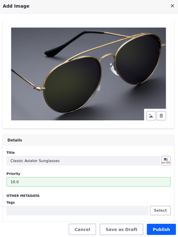

# Day 2 Exercises for Building Enterprise Websites with Liferay

* [Exercise 11a: Generating Content with ChatGPT](#exercise-11a-generating-content-with-chatgpt)
* [Exercise 11b: Auto-Tagging Content (Bonus)](#exercise-11b-auto-tagging-content-bonus)
* [Exercise 12a: Creating a Vocabulary](#exercise-12a-creating-a-vocabulary)
* [Exercise 12b: Adding Categories to a Vocabulary](#exercise-12b-adding-categories-to-a-vocabulary)
* [Exercise 13a: Creating a Manual Collection](#exercise-13a-creating-a-manual-collection)
* [Exercise 13b: Creating a Dynamic Collection](#exercise-13b-creating-a-dynamic-collection)
* [Exercise 13c: Displaying Content on the FAQ Page](#exercise-13c-displaying-content-on-the-faq-page)
* [Exercise 13d: Adding Announcements to the Header](#exercise-13d-adding-announcements-to-the-header)
* [Exercise 14a: Creating Clarity’s Products Catalog](#exercise-14a-creating-claritys-products-catalog)
* [Exercise 14b: Defining Product Specifications](#exercise-14b-defining-product-specifications)
* [Exercise 14c: Creating Products](#exercise-14c-creating-products)
* [Exercise 14d: Creating a Commerce Channel](#exercise-14d-creating-a-commerce-channel)
* [Exercise 14e: Setting Up the Product Pages](#exercise-14e-setting-up-the-product-pages)
* [Exercise 15a: Connecting to Headless APIs using the API Explorer](#exercise-15a-connecting-to-headless-apis-using-the-api-explorer)
* [Exercise 15b: Using Headless APIs to Batch Import Web Content](#exercise-15b-using-headless-apis-to-batch-import-web-content)
* [Exercise 15c: Using Headless APIs to Batch Import Products](#exercise-15c-using-headless-apis-to-batch-import-products)
* [Exercise 15d: Using Headless to Import Taxonomy Categories](#exercise-15d-using-headless-to-import-taxonomy-categories)
* [Exercise 16a: Configuring Publications and Workflow for Content](#exercise-16a-configuring-publications-and-workflow-for-content)
* [Exercise 16b: Managing Changes with a Content Publishing Workflow](#exercise-16b-managing-changes-with-a-content-publishing-workflow)
* [Exercise 17a: Adding Search Capabilities to the Job Listings Page](#exercise-17a-adding-search-capabilities-to-the-job-listings-page)
* [Exercise 17b: Adding Search Capabilities to Product Pages](#exercise-17b-adding-search-capabilities-to-product-pages)
* [Exercise 17c: Filtering Results with Custom Filters](#exercise-17c-filtering-results-with-custom-filters)
* [Exercise 18a: Customizing Search Results with Search Blueprints](#exercise-18a-customizing-search-results-with-search-blueprints)
* [Exercise 18b: Dynamic Collections with Search Blueprints](#exercise-18b-dynamic-collections-with-search-blueprints)
* [Exercise 18c: Search Blueprints with Custom Fields](#exercise-18c-search-blueprints-with-custom-fields)

## Exercise 11a: Generating Content with ChatGPT

You may have noticed that web content articles include the *AI Creator* button for generating content using ChatGPT. Using this feature requires a valid API key.

Here you'll add a temporary API key to your instance as the Clarity Admin user.

To do this,

1. Sign in as the Clarity Admin user.

   * Username: `admin@clarityvisionsolutions.com`
   * Password: `learn`

1. Open the *Global Menu* (), go to the *Control Panel* tab, and click *Instance Settings*.

1. Click *AI Creator*.

1. Enter the API key provided for this training.

   **Note**: This key is temporary.

1. Ensure these options are checked:

   * *Enable ChatGPT to Create Content*
   * *Enable DALL-E to Create Images*

1. Click *Save*.

1. Go to the *Marketing Assets* library and select *Web Content*.

1. Click *New* and select *Basic Web Content*.

1. Click the *AI Creator* button () to generate content.

   

1. Enter your desired description, tone, and word count.

1. Click *Create*.

   This generates a text response.

1. Click *Add* to copy the response into your web content.

   Alternatively, click *Try Again* to generate a new response.

Great! You've used ChatGPT to generate web content. Next, you can explore how to use AI to tag content or move to Lesson 12 and learn about how Liferay features can improve Clarity's content management.

## Exercise 11b: Auto-Tagging Content (Bonus)

You can manually tag most Liferay assets, but manually tagging content can be time consuming. Liferay also provides auto tagging features and integrations to simplify this process. By default, auto tagging is disabled.

Here you'll enable text and image auto-tagging as the Clarity Admin user.

To do this,

1. Open the *Global Menu* (), go to the *Control Panel* tab, and click *Instance Settings*.

1. Under Content and Data, click *Assets*.

1. Click *Asset Auto Tagging* in the left menu.

1. Ensure these options are checked

   * *Enable Auto Tagging of Assets*
   * *Update Auto Tags*

1. Set the max number of tags to `3`.

   **Note**: Leaving the field blank disables auto-tagging. Setting the value to 0 removes any auto limit.

1. Click *Update*.

   Now that it's enabled, we need to set up our tagging providers for web content articles and images.

1. Click *OpenNLP Text Auto Tagging* in the left menu.

1. Select *Web Content Article* in the drop-down menu.

   If the drop-down menu does not appear, enter `com.liferay.journal.model.JournalArticle`.

   **Note**: You can also click the plus button to enable OpenNLP auto tagging for additional types of text content (i.e., blog entries = `com.liferay.blogs.model.BlogsEntry`; documents = `com.liferay.document.library.kernel.model.DLFileEntry`).

1. Click *Update*.

1. Click *TensorFlow Image Auto Tagging* in the left menu.

1. Check *Enable TensorFlow Image Auto Tagging*.

1. Click *Update*.

   **Tip**: You can double check that all the settings are correct for the Clarity site by going to *Site Menu* &rarr; *Configuration* &rarr; *Site Settings* &rarr; *Assets* and validating that auto tagging is enabled.

1. Go to the *Marketing Assets* library and select *Web Content*.

1. Click *New* and select *Basic Web Content*.

1. Enter a *title* and use the *AI Creator* () to generate article content with over 500 words. 

   For example,

   | Field       | Value                                                                                       |
   |:------------|:--------------------------------------------------------------------------------------------|
   | Description | Write a compelling article on the importance of annual eye exams is for ongoing eye health. |
   | Tone        | Friendly                                                                                    |
   | Word Count  | `2000`                                                                                      |

   **Important**: The article's title and content must be meaningful for auto-tagging to work. Do not use "Lorem Ipsum."

1. Click *Publish*.

1. Begin editing the article. In the right side panel, you should see tags set for the content.

   **Note**: If you don't see any tags, add more content to the article and click *Update*.

## Exercise 12a: Creating a Vocabulary

Liferay provides vocabularies for categorizing content, making it easier to find and display the content you need.

Here you'll define a vocabulary with categories for the FAQ web content as Christian Carter.

To do this,

1. Sign in as Christian Carter.

   * Username: `christian.carter@clarityvisionsolutions.com`
   * Password: `learn`

1. Open the *Global Menu* (), go to the *Applications* tab, and click *Asset Libraries*.

1. Select the *Marketing Assets* library and click *Categories*.

1. Click *Add* () next to *Vocabularies* to create a new vocabulary.

1. Enter these details:

   | Field                     | Value                          |
   |:--------------------------|:-------------------------------|
   | Name                      | `FAQ`                          |
   | Description               | `Categories for FAQ articles.` |
   | Allow Multiple Categories | Yes                            |
   | Visibility                | Public                         |
   | Asset Types               | Web Content Article            |
   | Subtype                   | FAQ                            |
   | Required                  | Not Required                   |

   

1. Click *Save* to create the vocabulary.

You now have a vocabulary to contain FAQ categories.

## Exercise 12b: Adding Categories to a Vocabulary

After creating a vocabulary, you can add categories and subcategories to establish the desired organizational schema for your content.

Here you'll add categories to the FAQ vocabulary you created in the previous exercise as Christian Carter.

To do this,

1. In the Categories application, select the *FAQ* vocabulary in the Vocabularies sidebar.

1. Click *New* and enter `Retail Partners` for Name.

1. Click *Save* to add the category.

1. Repeat the above steps to add three more categories to the FAQ vocabulary:

   * `Products & Services`
   * `Pricing & Ordering`
   * `Returns & Exchanges`

   

1. **(Challenge)** Assign the correct category to each FAQ web content article. The FAQs are sorted into folders corresponding to their categories.

   **Hint**: Look in the Properties sidebar for each FAQ.

You have now defined and assigned categories to your FAQ web content.

## Exercise 13a: Creating a Manual Collection

Liferay Collections are lists of content items that you can showcase in your site pages. You can group different content types together, making it easier to find and display related items. Each list can be defined manually or dynamically.

Here you'll add web content articles to a manual collection and map them to Clarity's home page as Walter Douglas.

To do this,

1. Sign in as Walter Douglas.

   * Email: `walter.douglas@clarityvisionsolutions.com`
   * Password: `learn`

1. Open the *Site Menu* (), expand *Site Builder*, and select *Collections*.

1. Click *New* and select *Manual Collection*.

1. For Title, enter `Helpful Articles` and click *Save*.

1. For Item Type, select *Web Content Article*.

1. For Item Subtype, select *Article*.

1. Click *Save*.

1. In the Collection Items section, click *Select* and select *Article*.

1. Go to the *Articles* folder, select these three articles:

   * *Embracing Innovation: Key Trends Shaping Eyewear Manufacturing*
   * *Revolutionizing the Eyewear Industry: How Innovative Materials Make a Difference*
   * *Enhancing Efficiency in Eyewear Manufacturing: A Comprehensive Approach*

1. Click *Add*.

   

   The manual collection is now populated with content and ready to use in site pages.

1. Go to the *Home* page and click *Edit* ().

1. Select the *Collection Display* fragment in the Helpful Articles container.

1. In the configuration side panel, click *Plus* () for Collection and select the *Helpful Articles* collection.

   

   The fragment now sources its content from the Helpful Articles collection. The provided composition already applies the Clarity Card fragment to the collection display for rendering each item. To display article content from the collection, you'll need to map the card's sub-elements to fields in the articles. But before mapping the card's sub-elements to content fields, let's change the collection display's pagination.

1. For Pagination, select *None*.

   Now let's map the card's sub-elements to their corresponding fields in the articles.

1. Select the *Clarity Card* fragment and note the sub-elements included:

   * card-image
   * category
   * card-title
   * summary
   * card-link

1. Select each of the following elements, set its Source Selection to *Mapping*, and select the corresponding field:

   * card-image: *Image* under Content (Article)
   * category: *Articles* under Categorization
   * card-title: *Title* under Basic Information
   * summary: *Headline* under Content (Article)

1. Select the *card-link* sub-element, go to the *Link* tab.

1. For Link, select *Mapped URL*.

1. For Field, select *Default*.

1. Click *Publish* to save your changes to the Home page.

   The *Helpful Articles* section of the Home page should now display web content from the collection you created. However, two elements aren't working as expected: category and card-link. This is because the articles do not have categories assigned to them and because the articles do not have a default display page template. Let's fix these issues.

1. Go to the *Web Content* application and assign one category to each article.

1. Go to the *Page Templates* application, go to the *Display Page Templates* tab, and set the *Article* display page template as the default for its type.

1. Return to the Home page and verify all mappings work.


Great! You created a manual collection and displayed it in Clarity's Home page. Next, you'll learn how to create a dynamic collection.

## Exercise 13b: Creating a Dynamic Collection

Having categorized your FAQ web content articles earlier, here you'll use those categories to build dynamic FAQ collections as Walter Douglas.

To do this,

1. Open the *Site Menu* (), expand *Site Builder*, and select *Collections*.

1. Click *New* and select *Dynamic Collection*.

1. For Title, enter `FAQ - Retail Partners` a   nd click *Save*.

1. For Item Type, select *Web Content Article*.

1. For Item Subtype, select *FAQ*.

   This limits the collection to FAQ web content articles. Next, you'll define the collection's scope and filter to limit which FAQs are included in the collection.

1. Under Scope, click *Select* and select *Other Site or Asset Library*.

1. Go to the *Asset Libraries* tab and click *Marketing Assets*.

   This ensures the collection uses FAQ articles from the Marketing Assets library.

1. Under Filter, set the rule to `Contains *All* of the following Categories`.

1. In the Categories field, search for `Retail Partners` and select it.

   

1. Click *Save* to create the collection.

1. Repeat the above steps to create these collections:

   * `FAQ - Products & Services`
   * `FAQ - Pricing & Ordering`
   * `FAQ - Returns & Exchanges`

   

   For each collection, filter results using its corresponding category.

You now have four FAQ collections. Next, you'll use them to display content in Clarity's FAQ page.

## Exercise 13c: Displaying Content on the FAQ Page

Using what you have learned in the previous exercises, let’s map content to the FAQ page as Walter Douglas.

To do this,

1. Begin editing the *FAQ* page.

1. Double click the *Image* fragment to configure its image-square sub-element.

1. Set the image to `glasses-vertical-banner-with-text-lg` from the Marketing Assets library.

   <!--TASK: Revise the following steps.-->

1. The block on the right contains a page title and four FAQ Section compositions. Each FAQ Section contains a heading and a Collection Display fragment. Each Collection Display contains a custom fragment called FAQ Question and Answer Pair. First map the collection displays to the FAQ collections you built earlier. Make sure each collection corresponds to the heading for that section.

   

1. For Pagination, select *None*.

1. Check *Display All Collection Items*.

1. Map the correct fields for each FAQ Question and Answer Pair so that the content renders properly in the collection displays.

1. In the Promoted Articles container, map the collection display to the Helpful Articles collection.

1. 

1. Configure this setting for the *FAQ Content* and *Promoted Articles* containers:

   | Tab     | Setting         | Value         |
   |:--------|:----------------|:--------------|
   | General | Container Width | *Fixed Width* |

1. Click *Publish* to save your changes to the FAQ page.


Using collection displays and custom fragments, you have rendered FAQ web content onto Clarity's FAQ page. Next, let's add content to the header announcement bar.

## Exercise 13d: Adding Announcements to the Header

Here you'll apply what you've learned about web content, collections, and page templates to add an announcement to Clarity's header bar as Walter Douglas.

To do this,

1. Open the *Site Menu* (), expand *Site Builder*, and select *Collections*.

1. Create a new dynamic collection titled `Announcements`.

1. In the collection configuration menu, set Item Type to *Web Content Article* and Item Subtype to *Announcements*.

1. For scope, select the *Marketing Assets* library.

1. Click *Save* to publish the collection.

   Now that you've created the collection, let's add it to the Primary Master Page template.

1. Open the *Site Menu* (), expand *Design*, and select *Page Templates*.

1. Begin editing the *Primary Master Page* template.

   **Note**: You may notice the styles applied to the master page are different from those applied in site pages. This is because you've applied the theme and theme CSS client extension to site pages and not to master pages. If desired, you can apply the theme and client extension to the master page directly. Make sure you uncheck all theme properties (e.g., Show Footer, Show Header, etc.).

1. Toggle the *visibility* () of the *Header Announcement Bar* container.

1. Select the *Header Announcement Bar* container and configure this setting:

   | Tab    | Field              | Value                 |
   |:-------|:-------------------|:----------------------|
   | Styles | Background > Color | *Color Brand Primary* |

   

   **Note**: Color options are defined by the theme's style book. Unless you've applies the theme CSS client extension to the master page template, the Color Brand Primary option appears purple. This value is overridden in site pages by the Theme CSS client extension.

1. Add a *Collection Display* fragment to the container, select it, and configure these settings:

   | Tab     | Field                              | Value           |
   |:--------|:-----------------------------------|:----------------|
   | General | Collection                         | *Announcements* |
   | General | Pagination                         | *None*          |
   | General | Maximum Number of Items to Display | *1*             |

1. Add a *Container* fragment to the collection display, rename it `Announcement`, and configure these settings:

   | Tab     | Field           | Value      |
   |:--------|:----------------|:-----------|
   | General | Content Display | *Flex Row* |
   | General | Align Items     | *Center*   |
   | General | Justify Content | *Center*   |

1. Add a *Paragraph* fragment to the container, select it, and configure these settings:

   | Tab    | Field        | Value             |
   |:-------|:-------------|:------------------|
   | Styles | Text > Color | *Color Neutral 0* |

   

1. Select the paragraph's *element-text* sub-element and configure this setting:

   | Tab     | Field | Value     |
   |:--------|:------|:----------|
   | Mapping | Field | *Message* |

1. Add a *Clarity Button* fragment to the Announcement container after the paragraph, select it, and configure these settings:

   | Tab     | Field    | Value        |
   |:--------|:---------|:-------------|
   | General | Type     | *Borderless* |
   | General | Style    | *Primary*    |
   | General | Size     | *Small*      |
   | General | Inverted | *Yes*        |

1. Select the button's *link* sub-element and configure these settings:

   | Tab     | Field | Value          |
   |:--------|:------|:---------------|
   | Mapping | Field | *Link Text*    |
   | Link    | Link  | *Mapped URL*   |
   | Link    | Field | *Link to Page* |

1. Adjust the margins and padding for the announcement bar elements until you are satisfied with it.

   

1. Click *Publish Master* to save your changes.

The Header Announcement Bar is now visible on all pages that use the Primary Master Page template. Next, let's use Liferay's Commerce features to create Clarity's products catalog.

## Exercise 14a: Creating Clarity’s Products Catalog

A catalog is a group of related products. Liferay catalogs provide a highly flexible way to organize your product offerings in the most sensible way for your business.

Here you'll create a catalog for Clarity's products as Ian Miller.

To do this,

1. Sign in as Ian Miller.

   * **Username**: `ian.miller@clarityvisionsolutions.com`
   * **Password**: `learn`

1. Open the *Global Menu* (), go to the *Commerce* tab, and click *Catalogs*.

1. Click *Add* ().

1. Enter the following:

   | Field                    | Value                   |
   |:-------------------------|:------------------------|
   | Name                     | `Clarity Eyewear`       |
   | Default Catalog Language | English (United States) |
   | Currency                 | US Dollar               |

   

1. Click *Submit* to finish creating the catalog.


Great! Now that you've created the catalog, you can start adding products to it. But first, let's add specifications that you can add to Clarity's products when you create them.

## Exercise 14b: Defining Product Specifications

Product specifications store information about products, like size, material, and color. To improve organization, you can also save them into specification groups.

Here you'll add product specifications as Ian Miller.

To do this,

1. Open the *Global Menu* (), go to the *Commerce* tab, and click *Specifications*.

1. Click the *Specification Groups* tab.

1. Click *New* to add a new specification group.

1. Enter the following:

   | Field    | Value               |
   |:---------|:--------------------|
   | Title    | `Frame Description` |
   | Priority | `10.0`              |
   | Key      | `frame-description` |

1. Click *Save* to finish creating your product specification group.

   You can now add product specifications to it.

1. Return to the *Specification Groups* overview and go to the *Specification Labels* tab.

1. Click *New* to add a new specification.

1. Enter the following:

   | Field                       | Value                        |
   |:----------------------------|:-----------------------------|
   | Label                       | `Frame Material`             |
   | Description                 | `The material of the frame.` |
   | Use in Faceted Navigation   | Yes                          |
   | Default Specification Group | Frame Description            |
   | Key                         | `frame-material`             |

1. Click *Save* to finish creating your specification label.

1. Create two more specifications with these values:

   * **Frame Color**

      | Field                       | Value                     |
      |:----------------------------|:--------------------------|
      | Label                       | `Frame Color`             |
      | Description                 | `The color of the frame.` |
      | Use in Faceted Navigation   | Yes                       |
      | Default Specification Group | Frame Description         |
      | Key                         | `frame-color`             |

   * **Frame Size**

      | Field                       | Value                                       |
      |:----------------------------|:--------------------------------------------|
      | Label                       | `Frame Size`                                |
      | Description                 | `The size of the frame (in default units).` |
      | Use in Faceted Navigation   | No                                          |
      | Default Specification Group | Frame Description                           |
      | Key                         | `frame-size`                                |

1. Return to the *Specification Labels* page.


Now that you've added some specifications, you can apply them to products as you create them.

## Exercise 14c: Creating Products

Products represent the items sold by a company. Like any manufacturer, Clarity has a wide variety of products designed to achieve different goals and target different customer profiles.

Here you'll add products to Clarity's catalog, apply specifications and more as Ian Miller.

To do this,

1. Open the *Global Menu* (), go to the *Commerce* tab, and click *Products*.

1. Click *Add* () and select *Simple*.

   **Note**: A simple product is any physical product for which inventory is tracked.

1. Enter the following:

   | Field   | Value                        |
   |:--------|:-----------------------------|
   | Name    | `Classic Aviator Sunglasses` |
   | Catalog | Clarity Eyewear              |

1. Click *Submit* to finish creating your product.

   Now you can configure the product. First, add a product description using ChatGPT.

1. In the Full Description field editor, click on the *AI Creator* button ().

1. Enter a description, tone, and word count. 

   For example,

   | Field       | Value                                                                               |
   |:------------|:------------------------------------------------------------------------------------|
   | Description | A product description for a pair of classic aviator sunglasses made for sunny days. |
   | Tone        | Friendly                                                                            |
   | Word Count  | `200`                                                                                |

1. Click *Create*. This generates your content.

1. Click *Add* to copy the response into the Full Description field.

   Alternatively, click *Try Again* to generate a new response.

   Now that you've added a long description, let's categorize the product.

1. In the Categorization section, click *Select* for Clarity Products.

1. Select *Sunglasses* and click *Done* to apply the category to this item.

   Now that the product is categorized, add some specifications.

1. Scroll down and type `Frame` in the Add Specifications field.

   This lists available specifications.

1. Select *Frame Material*, *Frame Color*, and *Frame Size* specifications, and close the modal window.

1. In the Specifications section, click *Frame Material* to begin editing it.

1. Enter the following:

   | Field    | Value   |
   |:---------|:--------|
   | Value    | `Metal` |
   | Position | `10`    |

1. Click *Save*.

1. Repeat steps 7-9 for the other specifications and enter these values:

   * **Frame Color**:

      | Field    | Value  |
      |:---------|:-------|
      | Value    | `Gold` |
      | Position | `20`   |

   * **Frame Size**:

      | Field    | Value   |
      |:---------|:--------|
      | Value    | `54-20` |
      | Position | `30`    |

   Now that your product has specifications, let's add an image for the product.

1. Click *Save as Draft* to save your changes.

1. Go to the *Media* tab.

1. For Images, click *Add* () and click *Select File*.

1. Select the *classic-aviator-sunglasses* image from the Product Images asset library.

1. Enter these details for the image:

   | Field    | Value                      |
   |:---------|:---------------------------|
   | Title    | Classic Aviator Sunglasses |
   | Priority | 10.0                       |

1. Click *Publish* to save the product image.

   

   <!--TASK: Add attachment-->

1. Click *Publish* to finish creating the product.

1. Repeat the above steps to create two more products: *AquaComfort Plus Dailies* and *Single Vision Lenses*. Tags should be typed directly into the Tags field in the Details screen.

   | Product                    | Specifications | Categories | Tags  | Image                    |
   |:---------------------------|:---------------|:-----------|:------|:-------------------------|
   | `AquaComfort Plus Dailies` | N/A            | Contacts   | daily | aquacomfort-plus-dailies |
   | `Single Vision Lenses`     | N/A            | Lenses     | daily | biofinity-toric-lenses   |

   **Note**: To add the tag, type `daily` into the Tags field.

   

Great! Now that you've added products, you can set up a channel to display them in Clarity's site.

## Exercise 14d: Creating a Commerce Channel

Channels determine the storefront where products are displayed and sold to customers.

Here you'll create a channel and link it to Clarity's public enterprise website as Ian Miller.

To do this,

1. Open the *Global Menu* (), go to the *Commerce* tab, and click *Channels*.

1. Click *Add* ().

1. Enter the following:

   | Field    | Value            |
   |:---------|:-----------------|
   | Name     | `Clarity Public` |
   | Currency | US Dollar        |
   | Type     | Site             |

1. Click *Add* to finish creating your channel.

   **Note**: To display products in a site, you must link it to a channel.

1. Go to the *Type* tab and click *Select Site*.

1. Choose *Clarity Public Enterprise Website*.

1. Click *Save*.


With the channel created, let's return to Clarity's site and finish setting up their product pages.

## Exercise 14e: Setting Up the Product Pages

The training workspace includes three pages for displaying Clarity's products: Products, Product List, and Product Details. Each page is already wireframed.

Here you'll finish setting up each page as Walter Douglas.

### Updating the Products Page

The Products page is a marketing page intended to showcase the product categories defined in the *Clarity Products* vocabulary. By selecting a category, users are directed to the *Product List* page where they'll only see products from the selected category.

To implement this,

1. Sign in as Walter Douglas.

   * Email: `walter.douglas@clarityvisionsolutions.com`
   * Password: `learn`

1. Go to the *Products* page and begin editing it ().

1. Open the *Fragments and Widgets* panel ().

1. Go to the *Widgets* tab.

1. Drag and drop the *Commerce Categories Navigation* widget into the Commerce Categories container.

1. Hover over the widget, click the *Actions* button () in the top right corner of the widget, and select *Configuration*.

1. For Vocabulary, select *Clarity Products*.

   **Note**: Do not enable the Use Root Category option.

1. Click *Save* and close the modal window.

   

1. Click *Publish* to view the updated page.

   Currently, you have a list of categories, but this is a long way from Clarity's designs. The content of this widget is dynamically updated, so it's easier to maintain as new categories are added and old categories are updated or retired. Now let's do something about the design.

1. Open the *Site Menu* (), expand *Design*, and select *Templates*.

1. Go to the *Widget Templates* tab.

1. Click *New* and select *Commerce Categories Navigation Template*.

1. Enter `Clarity Category Cards` as the template name.

1. From the training workspace, go to the `[repository-folder]/exercises/lesson-14/` folder and open the `commerce-category-navigation-cards.ftl` file.

1. Copy and paste the contents of this file into the editor.

1. Click *Save*.

1. Return to the *Products* page and begin editing it ().

1. Hover over the *Commerce Categories Navigation* widget, click the *Actions* button () in the top right corner of the widget, and select *Configuration*.

1. For Display Template, select *Clarity Category Cards*.

1. Click *Save* and close the window.

1. Click *Publish* to view the page.


Great! You can see we are a lot closer to the final design requested by Clarity. Now that you've finished the Products page, let's complete the Product List page.

### Creating the Product Listing Page (PLP)

As you’ve probably noticed, while the Commerce Categories Navigation widget looks better and provides us links to each category, the links aren’t working. That’s because Liferay doesn’t know which page to display for each category. For Liferay to recognize a page as a category display page, we can either assign it in the Channel settings or add the Category Content widget to it.

Currently, the Product List page includes most of the necessary widgets to display lists of products, but it's not connected to Liferay's category display feature.

To fix this,

1. Go to the *Product List* page.

1. Click *Edit* () to begin editing the page.

1. From the *Fragments and Widgets* panel (), drag and drop the *Category Content* widget just above the Search Results container.

1. Click *Publish*.

1. Return to the *Products* page and click one of the category cards to confirm it is working properly.

   The Category Navigation should be working. However, the Search Results widget is blank, as it has no display template set to it. To fix that, let's create a new template for that widget.

1. Open the *Site Menu* (), expand *Design*, and select *Templates*.

1. Go to the *Widget Templates* tab.

1. Click *New* and select *Search Results Template*.

   **Important**: There are two "Search Results Template" options. One is for general search results while the other one is for Commerce products. Try selecting the second option first. If it's the right one, you will see some commerce specific variables in the Elements menu (i.e., *Commerce Product Search Result Display Context* and *Commerce Product Catalog Entries*). If you do not see these variables, try using the other template.

1. Enter `Clarity Search Results Cards` as the template name.

1. From the training workspace, go to the `[repository-folder]/exercises/lesson-14/` folder and open the `commerce-search-results-cards.ftl` file.

1. Copy and paste the contents of this file into the editor.

1. Click *Save*.

1. Go to the Product List page and begin editing it ().

1. Hover over the Search Results widget, click *Actions* () in the top right corner of the widget, and select *Configuration*.

   **Note**: The Search Results widget should look blank, towards the bottom right side of the layout.

   

1. For Render Selection, select *Use Application Display Template*.

1. For *Display Template*, select *Clarity Search Results Cards*.

   **Note**: If you don’t see the template here, return to step 8 and try the other Search Results template.

1. Click *Save* and close the window.

1. Click *Publish*.

1. Return to the *Products* page and click one of the category cards to confirm it is working properly and you are seeing your new template.

   

### Creating the Product Display Page

Finally, when you click a product in the Product List page, it doesn't work as expected. This is because Liferay doesn't know which page to use to display product details.

To fix this,

1. In the *Page Templates* application, go to the *Display Page Templates* tab, and click *New*.

1. Select *Primary Master Page*.

1. Enter these values and click *Save*:

   | Field        | Value             |
   |--------------|-------------------|
   | Name         | `Product Details` |
   | Content Type | *Product*         |

   This creates a new display page template for products.

1. Drag and drop the *Product Details Page* fragment composition into the drop area.

   

1. In the Product Details container, map these fragments with their corresponding product fields.

   | Fragment     | Fragment Sub-Element | Mapping                           |
   |--------------|----------------------|-----------------------------------|
   | Product Name | element-text         | *Name* (Basic Information)        |
   | SKU          | element-text         | *SKU* (Basic Information)         |
   | Description  | element-html         | *Description* (Basic Information) |

1. Select the button's *link* sub-element and configure these settings:

   | Tab     | Field | Value        |
   |:--------|:------|:-------------|
   | Link    | Link  | *Page*       |
   | Link    | Page  | *Contact Us* |

1. Double click the *Button* fragment and change its text to `Contact Sales`.

1. In the Specifications container, double click the *Heading* fragment and change its text to `Specifications`.

1. Map fragments in the Specifications container to their fields:

   | Fragment            | Fragment Sub-Element | Mapping                     |
   |---------------------|----------------------|-----------------------------|
   | Specification Name  | element-text         | *Name* (Basic Information)  |
   | Specification Value | element-text         | *Value* (Basic Information) |

1. In the Attachments container, double click the *Heading* fragment and change its text to `Attachments`.

1. Map fragments in the Attachments container to their fields:

   | Fragment        | Fragment Sub-Element | Mapping                     |
   |-----------------|----------------------|-----------------------------|
   | Attachment Name | element-text         | *Title* (Basic Information) |

1. Select the Download button and configure these settings in the configuration side panel:

   | Tab     | Field | Value   |
   |---------|-------|---------|
   | General | Style | *Link*  |
   | General | Size  | *Small* |

1. Select the Download button's link sub-element and configure these settings:

   | Tab  | Field | Value          |
   |------|-------|----------------|
   | Link | Link  | *Mapped URL*   |
   | Link | Field | *Download URL* |

1. Double click the *Download* button and change its text to *Download*.

1. Click *Publish*.

1. Click *Actions* () for the Product Details template and select *Mark as Default*.

1. Return to the *Category Display* page and select one of the products to confirm it is working.

   <!--TASK: Update Img once working,
   -->

Congratulations! You've set up Clarity's product pages. Next you'll explore how to use Liferay's headless APIs.

## Exercise 15a: Connecting to Headless APIs using the API Explorer

Let's see how headless APIs can be used by interacting with it through Liferay's API Explorer. Here you'll add a new blog post as Walter Douglas.

To do this,

1. Open the *Site Menu* (), expand *Configuration*, and select *Site Settings*.

1. Select *Site Configuration* under Platform.

1. Copy down the *Site ID* and save it for a future step.

1. Open the *Site Menu* (), expand *Categorization*, and select *Categories*.

1. Click *Blog Posts* under the Clarity vocabularies.

1. Select one of the categories in the list.

1. In your browser's navigation bar, copy down the category's ID that appears in the page URL. For example, `(...)categories_admin/vocabulary/37819/category/[category-id]`. You'll use this ID in a later step.

1. Open a new browser window and access Liferay's API Explorer at `http://localhost:8080/o/api`.

   <!-- By default, this leads to the *headless-delivery/v1.0* REST application. -->

1. Scroll down to the *Document* section and expand the *postSiteDocument* endpoint.

   **Tip**: To quickly find the endpoint, search the browser page for `postSiteDocument`.

   

1. For the siteId field, enter the site ID for Clarity Public Enterprise Website.

1. For the document field, delete the default JSON content and uncheck *Send empty value*.

1. For file field, click *Choose File* and select `glasses-book.png` from the `[repository-folder]/exercises/lesson-15/` folder.

1. Click *Execute*.

   This uploads a new image file to Clarity's Documents and Media.

1. In the response body, look for the image's ID. For example:

   ```json
   (...)
   "fileExtension" : "png",
   "fileName" : "glasses-book.png",
   "id" : [image-id],
   "keywords" : [ ],
   (...)
   ```

   Copy down the image ID to use in the next step.

1. Scroll up to the *BlogPosting* section and expand the *postSiteBlogPosting* endpoint.

1. For siteId, enter the site ID for Clarity Public Enterprise Website.

1. For Request Body, delete the default JSON content.

1. From the training workspace, open the `blog-entry.json` file in the `[repository-folder]/exercises/lesson-15/` folder.

   This file contains a blog post entry with a custom headline and body content.

1. Copy the contents of `blog-entry.json` into the *Request Body* field.

1. Replace `{image-id}` and `{category-id}` with your image ID and the blog category ID, respectively.

1. Click *Execute*. Make sure the response code is `200`.

1. Return to the Clarity Public Enterprise Website window, open the *Site Menu* (), expand *Content & Data*, and click *Blogs*.

1. Confirm the `Things I Find Interesting in Eyewear` blog post appears.

   

## Exercise 15b: Using Headless APIs to Batch Import Web Content

Clarity wants to import three legacy web articles from their old portal into their new enterprise website. Here you'll add them using Liferay's Headless APIs as Walter Douglas.

To do this,

1. Return to the browser window for Liferay's API Explorer (`http://localhost:8080/o/api`).

1. Scroll down to the *StructuredContent* section and expand the *postSiteStructuredContentBatch* endpoint.

1. For siteId, enter the site ID for Clarity Public Enterprise Website.

1. For Request Body, delete the default JSON content.

1. From the training workspace, open the `import-web-content-articles-batch.json` file in the `[repository-folder]/exercises/lesson-15/` folder.

1. Copy the contents of `import-web-content-articles-batch.json` into the *Request Body* field.

1. Click *Execute*.

1. Return to the Clarity Public Enterprise Website window, open the *Site Menu* (), expand *Content & Data*, and click *Web Content*.

1. Open the *Articles* folder and confirm all three articles appear.

   

## Exercise 15c: Using Headless APIs to Batch Import Products

You can use REST APIs to import Clarity's products from external systems to Liferay DXP, streamlining product management. Here you'll use APIs to create products as Ian Miller.

To do this,

1. Sign in as Ian Miller.

   * Username: `ian.miller@clarityvisionsolutions.com`
   * Password: `learn`

1. Open the *Global Menu* (), go to the *Commerce* tab, and click *Products*.

   Take note of the number of existing products (i.e. 3).

1. Open the *Global Menu* (), go to the *Commerce* tab, and click *Catalogs*.

1. Click *Clarity Eyewear*.

   Copy down the catalog's ID. You'll use it in a later step.

1. Open a new browser window and access Liferay's API Explorer at `http://localhost:8080/o/api`.

1. Click the *REST Applications* drop-down menu and select *headless-commerce-admin-catalog/v1.0*.

1. Scroll down to the *Product* section and expand the *postProductBatch* endpoint.

1. For Request Body, delete the default JSON content.

1. From the training workspace, open the `import-products-batch.json` file in the `    [repository-folder]/exercises/lesson-15/` folder.

1. Copy the contents of `import-products-batch.json` into the *Request Body* field and replace `{catalog-id}` for all products with the Clarity Eyewear catalog ID.

1. Click *Execute*.

1. Return to the Clarity Public Enterprise Website window, open the *Global Menu* (), go to the *Commerce* tab, and click *Products*.

1. Confirm eight new products appear.

   

## Exercise 15d: Using Headless to Import Taxonomy Categories

As a multinational company, Clarity has many business locations around the globe. To better support recruitment efforts, Clarity needs to define categories that they can apply to job openings for each office location. Some categories already exist, but others are still missing.

Here you'll add the missing location categories as Clarity Admin.

To do this,

1. Sign in as the Clarity Admin user.

   * Username: `admin@clarityvisionsolutions.com`
   * Password: `learn`

1. Open the *Global Menu* (), go to the *Applications* tab, and click *Asset Libraries*.

1. Select the *HR* library and click *Categories*.

1. Go to the *Location* vocabulary in the left side menu.

   Take note of the number of existing location categories (i.e. 14).

1. In your browser's navigation bar, copy down the vocabulary's ID that appears in the page URL. For example, `(...)categories_admin/vocabulary/[vocabulary-id]`. You'll use this ID in a later step.

1. Open a new browser window and access Liferay's API Explorer at `http://localhost:8080/o/api`.

1. Click the *REST Applications* drop-down menu and select *headless-admin-taxonomy/v1.0*.

1. Scroll down to the *TaxonomyCategory* section and expand the *postTaxonomyVocabularyTaxonomyCategoryBatch* endpoint.

1. For taxonomyVocabularyId, enter the vocabulary ID for Location.

1. For Request Body, delete the default JSON content.

1. From the training workspace, open the `import-taxonomy-categories-batch.json` file in the `[repository-folder]/exercises/lesson-15/` folder.

1. Copy the contents of `import-taxonomy-categories-batch.json` into the *Request Body* field.

    

1. Click *Execute*.

1. Return to the HR Asset Library window and refresh the page.

   The new locations should appear.

1. Click *HR* in the breadcrumb menu to return to the library overview page.

1. Click *Web Content* and open the *Job Listings* folder.

1. Begin editing an article and assign any of the newly added locations (e.g. *Morocco, Casablanca*).

1. Click *Publish*. You can now search for the content using the new location category.

## Exercise 16a: Configuring Publications and Workflow for Content

You can leverage Publications with Workflow to implement robust publishing processes for site and content changes. Here you'll enable publications and configure a single approver workflow for any new articles published to Clarity’s website as Ian Miller.

To do this,

1. Sign in as Ian Miller.

   * Username: `ian.miller@clarityvisionsolutions.com`
   * Password: `learn`

1. Open the *Global Menu* (), go to the *Applications* tab, and click *Publications*.

1. Toggle *Enable Publications* and click *Save*.

   This redirects to the Publications application page.

1. Click *Add* () to create a new publication.

   Alternatively, you can click the *Publications* drop-down menu at the top of the page and select *Create New Publication*.

1. For Name, enter `Article Publication`.

1. Click *Create*.

   <!--You can check the Publications drop-down menu to confirm you're working in the new publication.-->

1. Return to *Clarity Public Enterprise Website*.

1. Open the *Site Menu* (), expand *Content & Data*, and click *Web Content*.

1. In the Web Content tab, click *Actions* () for the Articles folder and select *Edit*.

1. Expand the *Structure Restrictions and Workflow* section and select *Set the default workflow for the folder’s content (Articles)*.

1. Select *Single Approver* in the drop-down menu.

1. Click *Save*.

   

You have set up a publication for tracking changes to Clarity's article web content, along with a workflow for approving new articles before they are published to the production site.

Next, let's learn how to invite other users to work on the publication you created.

### Inviting Users and Assigning Roles in a Publication

The Publications application has an option to invite users to collaborate in a publication. These users can be invited even if they don't have Publications permissions assigned to them.

Here you'll invite Christian Carter and Clara Murphy to contribute to the Article Publication process as Ian Miller.

To do this,

1. Go to the *Publications* application click *Actions* () for Article Publication and select *Invite Users*.

   Alternatively, you can click the *Publications* drop-down menu at the top of the page, select *Review Changes*, and click *Invite Users* ().

1. Click the role drop-down menu and select *Editor*.

1. For People, enter `Christian Carter`.

1. Repeat steps 3-4 to invite Clara Murphy using these values:

   | Name         | Role      |
   |--------------|-----------|
   | Clara Murphy | Publisher |

   

1. Click *Send* and click *OK* to confirm.

Great! Now Christian Carter and Clara Murphy can contribute to the publication. Next, you'll go through the publishing workflow.

## Exercise 16b: Managing Changes with a Content Publishing Workflow

Publications provides a convenient way to manage changes to your Liferay instance. With it, you and your team can create and collaborate on blocks of changes called ‘publications’. You can then publish those changes to production when ready.

In this exercise you'll add a new article as Christian Carter, then review it with the single approver workflow and push the changes to production as Clara Murphy. These changes will be done in the Article Publication process.

### Creating and Submitting a New Article to the Workflow

Here you'll create a new article and submit it for approval as Christian Carter.

To do this,

1. Sign in as Christian Carter.

   * Username: `christian.carter@clarityvisionsolutions.com`
   * Password: `learn`

   Note that the publications menu now appears at the top of the page and a new notification for the publication invitation was received.

   

1. Click the user profile icon, go to *Notifications*, and select the publications invitation.

   

   This opens the details page for Article Publication.

1. Click the *Publications* drop-down menu at the top of the page, click *Select a Publication*, and select *Article Publication*.

1. Return to Clarity Public Enterprise Website, open the *Site Menu* (), expand *Content & Data*, and click *Web Content*.

1. Go to the *Articles* folder, click *New*, and select *Article*.

1. Enter these values:

   | Field    | Value                                                                                                                  |
   |:---------|:-----------------------------------------------------------------------------------------------------------------------|
   | Title    | Clarity x Warby Parker                                                                                                 |
   | Image    | `revolutionizing_industry` (from the *Marketing Assets* library)                                                       |
   | Headline | Summer 2024 Collaboration                                                                                              |
   | Content  | Eyewear enthusiasts rejoice! Fan favorites Clarity and Warby Parker have joined forces for a collaborative collection. |

1. Click *Submit for Workflow*.

Great! You just created a new article and submitted it for review in the Article Publication. Next, you'll learn how to approve and publish changes.

### Reviewing Content in a Workflow and Publishing a Publication

Here you'll finish reviewing the article and pushing all changes to production as Clara Murphy, Christian Carter's manager.

To do this,

1. Sign in as Clara Murphy.

   * Username: `clara.murphy@clarityvisionsolutions.com`
   * Password: `learn`

   The publications menu now appears at the top of the page and two new notifications for the publication invitation and review request were received.

   

1. Click the *Publications* drop-down menu at the top of the page, click *Select a Publication*, and choose *Article Publication*.

1. Click the *Publications* drop-down menu again and select *Review Changes*.

   This directs to the publication details page with a list of changes.

1. Click *Publish*.

   This action will fail because the publication includes unapproved changes.

   

1. Click the user profile icon and go to *My Workflow Tasks*.

1. Go to the *Assigned to My Roles* tab to see the pending workflow task.

1. Click *Actions* () for the workflow task and select *Assign to Me*.

1. Enter a comment and click *Done*.

   This assigns the task to Clara Murphy and redirects you to the *Assigned to Me* tab. Here she can review and approve or reject the Christian Carter's article.

1. Click *Actions* () for the task and select *Approve*.

1. Enter a comment and click *Done*.

1. Click the *Publications* drop-down menu again and select *Review Changes*.

   The change's status is now `Approved`.

1. Click *Publish*, verify there are no conflicts, and click *Publish* again to add the changes to production.

   

Great! You've successfully used workflow with publications to review and publish a web content article. Next, you'll learn how to leverage Liferay's Search capabilities to improve user experience.

## Exercise 17a: Adding Search Capabilities to the Job Listings Page

As part of improving their recruitment efforts, Clarity wants to implement a search page for open positions. Currently, Clarity's website includes a wireframed page for this purpose, but it is missing the necessary search widgets to make it functional.

Here you'll add and configure these widgets as Walter Douglas.

To do this,

1. Sign in as Walter Douglas.

   * Email: `walter.douglas@clarityvisionsolutions.com`
   * Password: `learn`

1. Open the *Site Menu* (), click *Page Tree*, expand *Careers*, and click *Open Positions*

1. Click *Edit* ().

1. Open the *Fragments and Widgets* panel ().

1. Go to the *Widgets* tab.

1. Drag and drop a *Search Bar* widget into the Banner container, placing it under the Heading fragment.

1. Select the widget and configure this setting:

   | Tab             | Setting   | Value |
   |:----------------|:----------|:------|
   | General > Frame | Min Width | 500px |

   Next, you'll add widgets for displaying and filtering search results, as well as defining additional search options.

1. From the *Fragments and Widgets* panel, drag and drop a *Type Facet* widget into the grid's left dropzone.

1. Hover over the widget, click *Actions* () in the top right corner of the widget, and select *Configuration*.

1. Use the right arrow button () to remove all asset types except for Web Content Article.

   

   This ensures that only web content articles appear in search results.

1. Click *Save* and close the configuration window.

1. From the *Fragments and Widgets* panel, drag and drop three *Category Facet* widgets into the left dropzone of the grid fragment, under the type facet widget.

1. Hover over the first Category Facet widget, click the *Actions* button () in the top right corner of the widget, and select *Configuration*.

1. For Display Template, select the *Clarity Search Category* template.

   

1. For Category Parameter Name, enter a unique value (e.g., `category-region`). 

   **Note**: Each Category Facet widget must have a unique parameter name to function as expected.

1. Scroll down and choose *Select Vocabularies*.

1. Expand the *Clarity Enterprise Website* vocabularies and select the *Region* vocabulary.

   

1. Click *Save* and close the configuration window.

1. Repeat steps 12-17 for the other category facet widgets, though select different vocabularies for each one:

   * For the second widget, select the *Location* vocabulary.

   * For the third widget, select the *Job Positions* vocabulary.

1. From the *Fragments and Widgets* panel, drag and drop a *Search Results* widget into the right dropzone of the grid fragment.

   **Important**: Ensure you're using the widget from the Search widget section. Do not use the Commerce Search Results widget.

1. From the *Fragments and Widgets* panel, drag and drop a *Search Options* widget below the grid fragment in the Search Results and Options container.

1. Hover over the Search Options widget, click *Actions* () in the top right corner of the widget, and select *Configuration*.

1. Check *Allow Empty Searches*.

1. Click *Save* and close the window.

1. Click *Publish*.

   

   Finally, let's update the *Explore Open Positions* button in the Careers page to link to the Open Positions page.

1. Go to the *Careers* page and begin editing it ().

1. Double click the banner's *Explore Open Positions* button to open the configuration side panel for the button's link element.

1. In the configuration side panel, go to the *Link* tab and configure these settings:

   | Setting | Value          |
   |:--------|:---------------|
   | Link    | Page           |
   | Page    | Open Positions |

1. Click *Publish*.

Now that you've added search functionality to Clarity's open positions page, site visitors can search and filter openings by different categories. You'll revisit this page in a later exercise to further restrict which web content articles appear in the search results.

Next, you'll apply these search concepts to Clarity's product pages.

## Exercise 17b: Adding Search Capabilities to Product Pages

Here you'll take a closer look at the product list page to understand the different Liferay search widgets and how to configure them as Walter Douglas.

To do this,

1. Go to Clarity's *Product List* page. Most of the page is already built with different search widgets.

   

   The left side module is made up of a search bar widget, a specification facet widget, and an option facet widget. The right side module is made up of a sort widget and a search results widget. Note that the search results widget under the commerce category of widgets is different from the search results widget under the search category of widgets. Only the commerce-related widget returns products.

   Below these two modules, there is a search options widget. If you inspect the configuration of this widget, you will see that *Allow Empty Searches* is enabled. This setting is enabled so that all available assets are shown without any search queries.

1. Click *Edit* () in the Application Bar.

   The page is still missing a category facet widget that would allow visitors to filter by the different types of Clarity products. Let's go ahead and add that widget.

1. From the *Fragments and Widgets* panel, drag and drop a *Category Facet* widget below the Search Bar in the left dropzone of the grid fragment.

1. Hover over the new Category Facet widget, click the *Actions* button () in the top right corner of the widget, and select *Configuration*.

1. For Display Template, select the *Clarity Search Category* template.

1. Click *Save* and close the configuration window.

1. Click *Publish*.

   

Great! You've included a category facet widget on the Product List page, allowing customers to filter their search results by product category.

Next, let's finish configuring the Open Positions page to only display Job Listings in the search results.

## Exercise 17c: Filtering Results with Custom Filters

So far you've seen how to filter search results by content type (e.g. blogs, web content, etc.), categories, and specifications. You can also apply custom filters using almost any indexed attribute in your content, such as a web content structure.

In a previous exercise, we limited the search results on the Open Positions page to only display Web Content Articles. However, search results still includes types articles that are not job listings.

Here you'll use custom filters to search results to job listings as Clarity Admin.

To do this,

1. Sign in as the Clarity Admin user.

   * Username: `admin@clarityvisionsolutions.com`
   * Password: `learn`

1. Open the *Global Menu* (), go to the *Applications* tab, and click *Asset Libraries*.

1. Select the *HR* library and click *Web Content*

1. Go to the *Structures* tab and copy down the structure's ID.

   You'll use this with the Custom Filter widget to limit search results in the Open Positions page.

1. Go to the *Open Positions* page and click *Edit* ().

1. From the *Fragments and Widgets* panel, drag and drop a *Custom Filter* widget below the grid fragment in the Search Results and Options container.

1. Hover over the Custom Filter widget, click *Actions* () in the top right corner of the widget, and select *Configuration*.

1. For Filter Field, enter these values:

   | Setting      | Value              |
   |:-------------|:-------------------|
   | Filter Field | `classTypeId`      |
   | Filter Value | The Structure's ID |
   | Invisible    | *Yes*              |

1. Click *Save* and close the window.

1. Click *Publish*.

   Only job listings should appear in the Search Results.

   

Great! You've set a custom filter widget that limits the search results to only display Job Listings web content in the Open Positions page.

Next, you'll learn how to use Search Blueprints as another method for customizing search results.

## Exercise 18a: Customizing Search Results with Search Blueprints

<!-- TASK: Create an introduction explaining Search Blueprints at a high-level. -->

Here you'll revisit the Open Positions results page and create a Search Blueprint to only return recent job listing articles as the Clarity Admin user.

<!--TASK: Change persona to avoid using Clarity Admin -->

To do this,

1. Sign in as the Clarity Admin user.

   * Username: `admin@clarityvisionsolutions.com`
   * Password: `learn`

1. Open the *Global Menu* (), go to the *Applications* tab, and click *Asset Libraries*.

1. Select the *HR* library and click *Web Content*.

1. Go to the *Structures* tab and begin editing *Job Listing*.

1. Click *Properties* () and copy down the Structure Key value.

1. Open the *Global Menu* (), go to the *Applications* tab, and click *Blueprints*.

1. Click *Add* ().

1. For Title, enter `Job Listings Last 60 Days`.

1. Click *Create*.

1. In the right side menu, search for `Filter by Exact Terms Match` and click *Add* to include it in your query.

1. For Field, enter `ddmStructureKey`.

1. For Values, enter the Job Listing Structure Key.

   

1. In the left navigation, click *Query Settings*.

1. Click *Selected Types* and click *Select Asset Types*.

1. Select *Web Content Article* and click *Done*.

1. In the top menu, click *Preview* and enter a job listing search (e.g., `Developer`).

1. In the left navigation, click *Query Elements*.

1. Click *Add* () to add another query element above the first one.

1. In the right side menu, search for `Custom JSON Element` and click *Add* for the element.

1. Delete the Custom JSON Element's sample JSON.

1. From the training workspace, open the `filter-last-60d.json` file in the `[repository-folder]/exercises/lesson-18/` folder.

1. Copy the contents of `filter-last-60d.json` into the Custom JSON Element.

   

1. Click *Preview* and click *Refresh* to see the filter applied.

1. In the Custom JSON Element, change `"now-60d"` to `"now-1d"` and click *Refresh* in the search preview to see the filter applied.

1. Change the value back to `"now-60d"`.

1. Click *Save*.

   Next, you'll update the Open Positions page to use the search blueprint.

1. Go to the *Open Positions* page and click *Edit* ().

1. From the *Fragments and Widgets* panel, drag and drop a *Blueprints Options* widget below the Search Options widget in the Search Results and Options container.

1. Click the *Actions* menu () and select *Configuration*.

1. For Blueprint, click *Select* and select the *Job Listings Last 60 Days* blueprint.

1. Click *Save* and close the window.

   With the blueprint applied, you can now remove the Type Facet and Custom Filter widgets from the page.

1. Click *Publish*.

   Now the search results only include job listings created in the last 60 days.

Great! You've created a search blueprint and applied it to the Open Positions page as an alternative to the Type Facet and Custom Filter widgets.

Next, you'll learn how to use search blueprints with collection providers.

## Exercise 18b: Dynamic Collections with Search Blueprints

One simple way to leverage search blueprints is with collection providers. Every time you create a search blueprint, a collection provider is automatically generated. Then, showing the results of the search blueprint is as easy as adding a collection display fragment to site pages.

For example, Clarity wants to have a site page that automatically displays a list of upcoming events. A search blueprint can query upcoming events on their calendar to automatically fetch these upcoming events.

<!--TASK: Change persona to avoid using Clarity Admin -->

<!--TASK: Restructure to remove sub-steps. Consider using H3s.-->

Here you'll implement this as Clarity Admin.

### Creating a Calendar Page

1. Open the *Site Menu* (), expand *Site Builder*, and click *Pages*.

1. Click *New* and select *Page*.

1. Select *Primary Master Page*.

1. For Name, enter `Calendar`.

1. Click *Add*.

1. In the *Fragments and Widgets* side panel, go to the *Widgets* tab.

1. Drag and drop the *Calendar* widget into the page.

1. Click *Publish*.

   Now that you've created the page, add some events to the calendar.

1. In the list of site pages, click *Actions* () for the Calendar page and select *View*.

1. Select the *Month* view and click any date before your current date, enter `Past Event 1` as the name, and click *Save*.

1. Click any date that is after your current date, enter `Future Event 1` as the name, and click *Save*.

1. Add one more event after Future Event 1 that is named `Future Event 2`.

   

With the page and events set up, you can set up a search blueprint. But before you do that, enable the feature flag for the blueprint integration with collections  element for future events.

### Enabling the Blueprint and Collections Integration

1. Open the *Global Menu* (), go to the *Control Panel* tab, and click *Instance Settings*.

1. Click *Feature Flags* and go to the *Beta* tab

1. Enable *Collections with Search Blueprints (LPS-129412)*.

   **Important**: Beta features should not be used in production environments.

With this feature enabled, you can create a search blueprint element for future calendar events.

### Creating a Future Events Search Blueprint Element

1. Open the *Global Menu* (), go to the *Applications*, and click *Blueprints*.

1. Go to the *Elements* tab and click *Add*.

1. For Title, enter `Future Events`

1. Click *Create*.

1. Delete the default JSON content.

1. From the training workspace, open the `filter-future-events.json` file in the `[repository-folder]/exercises/lesson-18/` folder.

1. Copy the contents of `filter-future-events.json` into the JSON field.

1. Click *Save*.

Now you can create a blueprint that uses this element to query future events.

### Creating a Future Events Search Blueprint

1. While in the Blueprints application, go to the *Blueprints* tab.

1. Click *Add* ().

1. For Title, enter `Future Events`

1. Click *Create*.

1. In the right side menu, search for `Future Events` and click *Add* to include it in your query.

1. In the left navigation, click *Query Settings*.

1. Click *Selected Types* and click *Select Asset Types*.

   

1. Select *Calendar Event*.

1. Click *Done*.

1. Click *Save*.

With the blueprint defined, you can now use its collection provider in a site page to render future events.

### Using the Blueprint Collection Provider

1. Go to the *Calendar* page.

1. From the *Fragments and Widgets* panel, drag and drop a *Container* fragment above the below the Calendar widget.

1. Select the *container* and configure these settings in the configuration side panel:

   | Tab     | Setting           | Value                       |
   |:--------|:------------------|:----------------------------|
   | General | Content Display   | *Flex Column*               |
   | General | Align Items       | *Center*                    |
   | General | Justify Content   | *Center*                    |
   | Styles  | Spacing > Padding | *Spacer 6* (top and bottom) |

1. From the *Fragments and Widgets* panel, drag and drop a *Heading* fragment into the container.

1. Set the Heading fragment's text to `Upcoming Events`.

1. From the *Fragments and Widgets* panel, drag and drop a *Collection Display* fragment into the container below the Heading.

1. Select the *Collection Display*.

1. In the configuration side panel, click *Select Collection* ().

1. Go to the *Collection Providers* tab and select *Future Events*.

1. Configure these settings:

   | Tab     | Setting       | Value           |
   |:--------|:--------------|:----------------|
   | General | Style Display | *Bulleted List* |
   | General | Pagination    | *None*          |

1. Click *Publish*.

   

   The search blueprint automatically provides a collection of future events that's rendered by the collection display.

You've now created and configured a search blueprint that uses a collection provider to display future calendar events.

Next, you'll learn how to leverage search blueprints with custom fields, then query those fields using headless APIs.

## Exercise 18c: Search Blueprints with Custom Fields

Occasionally businesses need to integrate with other web services. For example, Clarity wants their employee benefits system to reference their employees based on the service's registration ID numbers. In Liferay, you can add custom fields to user accounts for this value. Then you can use Liferay's headless APIs to query the custom field. 

User Account APIs cannot filter for custom fields directly, but you can use search blueprints for this purpose. Here you'll implement this as Clarity Admin.

To do this,

1. Open the Global Menu (), go to the *Control Panel* tab, and click *Custom Fields*.

1. Select *User* and click *New*.

1. Select *Input Field* and enter these details.

   | Field      | Value            |
   |:-----------|:-----------------|
   | Field Name | `RegistrationId` |
   | Data Type  | Integer          |

1. Click *Save*.

1. Open the Global Menu (), go to the *Control Panel* tab, and click *Users & Organizations*.

1. Select *Ian Miller*, scroll down to the bottom, and enter `555777` for the registration ID.

1. Click *Save*.

1. Open the Global Menu (), go to the *Applications* tab, and click *Blueprints*.

1. Click *Add* ().

1. For Title, enter `Registration ID`.

1. Click *Create*.

1. In the right side menu, search for `Filter by Exact Terms Match` and click *Add* to include it in your query.

1. For Field, enter `expando__keyword__custom_fields__RegistrationId_long`.

1. For Values, enter `${keywords}`.

   

1. Click *Save* and copy down the blueprint's ID.

1. Open the Global Menu (), go to the *Control Panel* tab, and click *Instance Settings*.

1. Click *Feature Flags* and go to the *Beta* tab.

1. Enable *Search Headless API (LPS-179669)*.

   **Important**: Beta features should not be used in production environments, but this feature will be available as a full feature Q3 2024.

1. Open a new browser window and access Liferay's API Explorer at `http://localhost:8080/o/api`.

1. Click the *REST Applications* drop-down menu and select *portal-search-rest/v1.0*.

1. Expand the *postSearchPage* endpoint.

1. For nestedFields, enter `embedded`.

1. For search, enter `555777`.

1. For Request Body, delete the default JSON content.

1. From the training workspace, open the `api-post-search.json` file in the `[repository-folder]/exercises/lesson-18/` folder.

1. Copy the contents of `api-post-search.json` into the *Request Body* field.

1. Replace `{blueprint ID}` with your blueprint's ID.

1. Click *Execute*.

1. Verify this returns Ian Miller's user information.

   

   This is one way you can use Liferay as a headless system that's utilized by a third-party service.

You've used a custom registration ID field with search blueprints to retrieve user information.

Congratulations! You've completed all exercises for day two of Building Enterprise Websites.

Next, you'll learn how you can use Liferay Objects to build business forms.