# Day 3 Exercises for Building Enterprise Websites with Liferay

* [Exercise 19a: Creating an Object Definition](#exercise-19a-creating-an-object-definition)
* [Exercise 19b: Building the Form](#exercise-19b-building-the-form)
* [Exercise 19c: Creating a Multi-Step Form (Bonus)](#exercise-19c-creating-a-multi-step-form-bonus)
* [Exercise 20a: Modifying a Theme Client Extension](#exercise-20a-modifying-a-theme-client-extension)
* [Exercise 20b: Deploying a Client Extension for Favicon](#exercise-20b-deploying-a-client-extension-for-favicon)
* [Exercise 20c: Creating a New CSS Client Extension](#exercise-20c-creating-a-new-css-client-extension)
* [Exercise 20d: Setting Up and Deploying the Distributor Application](#exercise-20d-setting-up-and-deploying-the-distributor-application)
* [Exercise 20e: Testing the Distributor Application](#exercise-20e-testing-the-distributor-application)
* [Exercise 20f: Adding Fields to the Distributor Applications Object](#exercise-20f-adding-fields-to-the-distributor-applications-object)
* [Exercise 20g: Adding Picklist Items](#exercise-20g-adding-picklist-items)
* [Exercise 20h: Assigning Object Permissions](#exercise-20h-assigning-object-permissions)
* [Exercise 20i: Enabling the Approval Workflow](#exercise-20i-enabling-the-approval-workflow)
* [Exercise 20j: Automating Account Creation](#exercise-20j-automating-account-creation)
* [Exercise 20k: Setting Up Notifications](#exercise-20k-setting-up-notifications)
* [Exercise 21a: Tailoring Experiences by User Group and Role](#exercise-21a-tailoring-experiences-by-user-group-and-role)
* [Exercise 22a: Using JMeter to Run Load Tests](#exercise-22a-using-jmeter-to-run-load-tests)
* [Exercise 22b: Auditing Page Performance](#exercise-22b-auditing-page-performance)
* [Exercise 22c: Fixing the Performance Issue](#exercise-22c-fixing-the-performance-issue)
* [Exercise 22d: Reassessing Performance with JMeter](#exercise-22d-reassessing-performance-with-jmeter)

## Exercise 19a: Creating an Object Definition

Clarity wants to create a user-friendly contact form to streamline communication with non-employees users. Liferay Objects provides the tools to build and seamlessly integrate this form with their Contact Us page.

<!-- TASK: This exercise is using Clarity Admin due to Walter Douglas missing permissions in the baseline. Clarity Admin will be replaced by Walter Douglas after it's fixed. -->

Here you'll create the `Contact Us` object and configure its fields for storing relevant information as the Clarity Admin user.

To do this,

1. Sign in as the Clarity Admin user.

   * Username: `admin@clarityvisionsolutions.com`
   * Password: `learn`

1. Open the *Global Menu* (), go to the *Control Panel* tab, and click *Objects*.

1. Click *Add* ().

1. Enter these details:

   | Field        | Value      |
   |:-------------|:-----------|
   | Label        | Contact Us |
   | Plural Label | Contact Us |
   | Object Name  | ContactUs  |

1. Click *Save*.

   This creates a draft object definition with some default system fields. You can now configure the definition to determine how its data is stored and which features you want to enable.

1. From the Objects overview page, begin editing the *Contact Us* object definition.

1. In the Details tab, configure these settings:

   | Field                                                   | Value          |
   |:--------------------------------------------------------|:---------------|
   | Scope > Scope                                           | Site           |
   | Scope > Panel Link                                      | Content & Data |
   | Configuration > Show Widget in Page Builder             | False          |
   | Configuration > Enable Entry History in Audit Framework | True           |

1. Click *Save*.

   Now that you’ve configured the object definition, you can add custom fields to determine the type of information you want to gather with the form.

1. Go to the *Fields* tab.

1. Click *Add* (), enter these details, and click *Save*:

   | Field                     | Value      |
   |:--------------------------|:-----------|
   | Label                     | Full Name  |
   | Field Name                | `fullName` |
   | Type                      | Text       |
   | Mandatory                 | Yes        |
   | Accept Unique Values Only | No         |

1. Repeat the previous step to create the remaining fields:

   | Label             | Field Name        | Type      | Mandatory | Unique Values Only |
   |:------------------|:------------------|:----------|:----------|:-------------------|
   | Email Address     | `emailAddress`    | Text      | Yes       | No                 |
   | Phone             | `phone`           | Text      | Yes       | No                 |
   | State or Province | `stateOrProvince` | Text      | No        | No                 |
   | City              | `city`            | Text      | No        | No                 |
   | Comment           | `comment`         | Long Text | No        | N/A                |

1. Return to the *Details* tab and click *Publish*.

   This creates the database tables for storing form submissions.

Next, you'll add the form to Clarity's Contact Us page.

## Exercise 19b: Building the Form

<!-- TASK: This exercise is using Clarity Admin due to Walter Douglas missing permissions in the baseline. Clarity Admin will be replaced by Walter Douglas after it's fixed. -->

Liferay Objects generates a basic user interface automatically, but you can design and add forms to Clarity’s pages.

Previously, you added and wireframed the Contact Us page. Here you’ll add the form to the page as the Clarity Admin user.

To do this,

1. Go to Clarity’s public enterprise website and begin editing the *Contact Us* page.

1. Drag and drop a *form container* fragment into the Contact Form container.

1. Click the drop-down menu and select the *Contact Us* object.

   This populates the form with fields from the object automatically.

1. Select the form container and configure these settings:

   | Tab             | Setting       | Value                |
   |:----------------|:--------------|:---------------------|
   | General > Frame | Width         | 400px                |
   | Styles          | Padding       | Spacer 4 (all sides) |
   | Styles          | Background    | #FFFFFF              |
   | Styles          | Border Radius | 15px                 |

1. Drag and drop the field fragments into this order:

   * Full Name
   * Email Address
   * Phone
   * State or Province
   * City
   * Comment

1. Select each of these field fragments and configure this setting:

   | Tab    | Setting | Value             |
   |:-------|:--------|:------------------|
   | Styles | Padding | Spacer 3 (bottom) |

1. Click *Publish*.

   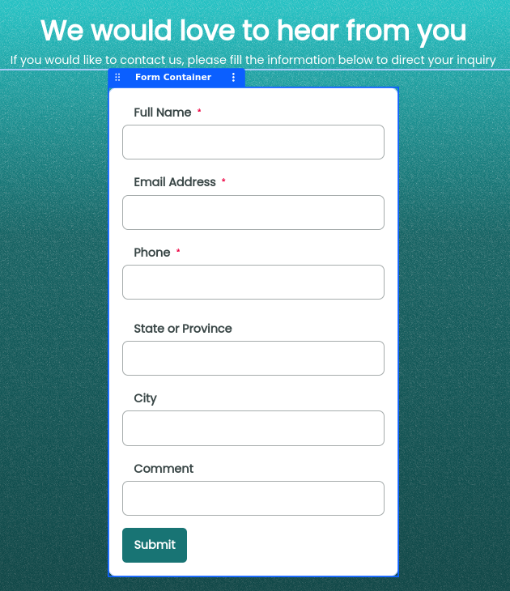

1. Test the form by submitting an entry.

1. Go to *Site Menu* (), expand *Content & Data*, and click *Contact Us*. The entry you created should appear here.

   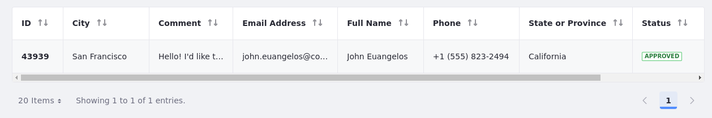

Great! You've fully set up the Contact Us page and made it available for Clarity's users.

Next, you can learn how to create a multi-step form or move to Lesson 20 to learn about Liferay Client extensions and how you can use them to add styling and functionality to your Liferay instance.

## Exercise 19c: Creating a Multi-Step Form (Bonus)

<!-- TASK: This exercise is using Clarity Admin due to Walter Douglas missing permissions in the baseline. Clarity Admin will be replaced by Walter Douglas after it's fixed. -->

Using objects, form fragments, and display page templates, you can develop multi-step forms to allow users to fill a form in different display pages, which are connected to the same object entry.

Here you'll create a display page for the second step and link the Contact Us form container to it as the Clarity Admin user.

To do this,

1. Open the *Global Menu* (), go to the *Control Panel* tab, and click *Objects*.

1. Begin editing the *Contact Us* object definition.

1. In the Details tab, configure this setting:

   | Field                                                | Value |
   |:-----------------------------------------------------|:------|
   | Configuration > Allow Users to Save Entries as Draft | True  |

   **Note**: When creating a multi-step form using objects, you must enable draft mode for the object definition.

1. Click *Save*.

1. Open the *Site Menu* (), expand *Design*, and click *Page Templates*.

1. Go to the *Display Page Templates* tab and click *New*.

1. Select the *Primary Master Page* template.

1. Enter `Contact Us - Step 2` for the name and select *Contact Us* for content type.

1. Click *Save*.

1. Drag and drop the *Contact Us Page* fragment composition into the template.

1. Repeat steps 2-5 from Exercise 19b to create the form.

1. Select the form container and configure these settings:

   | Tab     | Setting                        | Value      |
   |:--------|:-------------------------------|:-----------|
   | General | Success Action                 | Go to Page |
   | General | Page                           | Home       |
   | General | Show Notification After Submit | Yes        |

   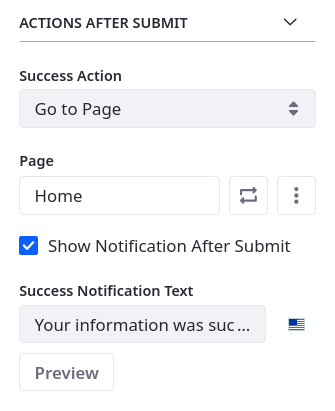

1. Click *Publish*.

1. Return to the *Contact Us* page and begin editing it.

1. Select the form container and configure these settings:

   | Tab     | Setting             | Value                    |
   |:--------|:--------------------|:-------------------------|
   | General | Success Interaction | Go to Entry Display Page |
   | General | Display Page        | Contact Us - Step 2      |

1. Remove these fields from the container:

   * State or Province
   * City
   * Comment

1. Select the *Submit Button* fragment and configure this setting:

   | Tab     | Setting                | Value |
   |:--------|:-----------------------|:------|
   | General | Submitted Entry Status | Draft |

   **Note**: Now when users click this button, Liferay saves their entry as a draft and directs them to the next step to complete the form.

1. Double-click the *Submit Button* fragment to edit its text and enter `Next`.

1. Click *Publish*.

   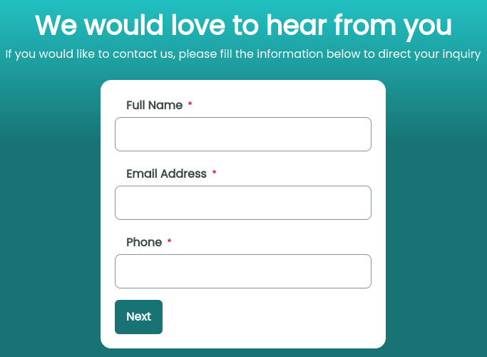

1. Test out the form.

Great! Now you've created a multi-step form using objects, form fragments, and display page templates. Next, you'll learn about Liferay Client extensions and how you can use them to add styling and functionality to your Liferay instance.

## Exercise 20a: Modifying a Theme Client Extension

Client Extensions separate customizations from the Liferay core. This helps simplify updates while freeing you to use your desired technologies and deployment models. As seen previously, the theme CSS client extension provides a way to override the current theme's CSS files. Here you'll update the client extension provided in the training workspace and deploy your changes as Walter Douglas.

To do this,

1. Sign in as Walter Douglas.

   * Email: `walter.douglas@clarityvisionsolutions.com`
   * Password: `learn`

1. In the Clarity Public Enterprise Website, go to the Home page.

   Note that Clarity's "See the Difference" banner uses a beige background (i.e., `#FCFBF8`). Let's make a change to Clarity's theme CSS client extension to update it.

   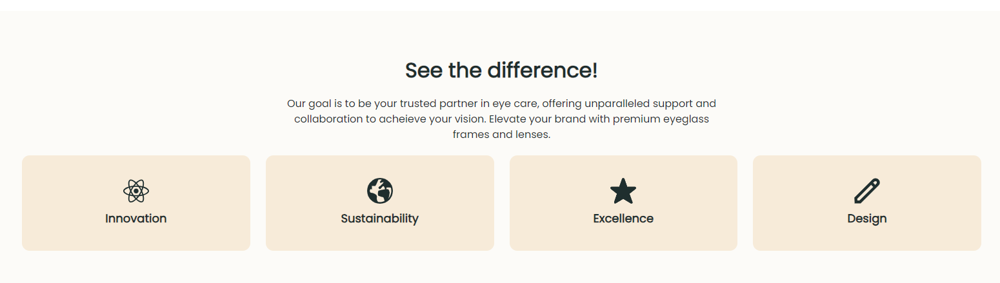

1. Navigate to the `[repository-folder]/exercises/lesson-20/` folder, open the `layout-background-color.scss` file, and copy its contents.

   This file contains styling for overwriting the background color for the `.lfr-layout-structure-item-container` CSS class.

1. Navigate to the `[repository-folder]/client-extensions/liferay-clarity-theme-css` folder, open the `src/css/_custom.scss` file, add the copied CSS style to the end of the file, and save your changes.

1. Open a new terminal window, navigate to the `[repository-folder]/client-extensions/liferay-clarity-theme-css` folder, and run this command to build and deploy the theme client extension:

   ```bash
   blade gw clean deploy
   ```

   Or use Gradle Wrapper:

   ```bash
   ../../gradlew clean deploy
   ```

1. Verify the command executes successfully.

1. If necessary, log out of the Clarity portal. It may also be necessary to clear the cache in the browser if this change is not reflected automatically.

1. Verify the background of the container is now gray:

   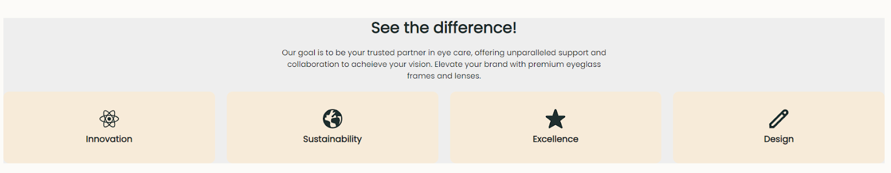

   **Tip**: When making changes to theme CSS values, you may need to clear your browser's cache to see your changes.

1. Now that you have seen how you can modify CSS styles using a theme client extension, remove the styling change just made from the `_custom.scss` file.

Next you'll learn how to use client extensions to update the site's favicon.

## Exercise 20b: Deploying a Client Extension for Favicon

In a previous exercise, you set the site favicon manually via the Liferay UI. With client extensions, you can streamline updates to your site by deploying the favicon along with your other frontend client extensions. Here you'll use a client extension to update Clarity's favicon as Walter Douglas.

To do this,

1. Open a new terminal window and go to the `liferay-clarity-theme-favicon` folder in your local copy of the training workspace (i.e., `enablement-bootcamp-clarity/client-extensions/liferay-clarity-theme-favicon`)

1. Run this command to build and deploy the client extension:

   ```bash
   blade gw clean deploy
   ```

   Or use Gradle Wrapper:

   ```bash
   ../../gradlew clean deploy
   ```

1. Verify the command executes successfully.

1. Open the *Site Menu* (), expand *Site Builder*, and select *Pages*.

1. Click *Actions* () in the Application Bar and select *Configuration*.

1. In the Design tab, click *Select Favicon* ().

1. In the modal window, go to the *Client Extension* tab and select *Liferay Clarity Theme Favicon*.

1. Click *Save*.

1. Go to the Home page and verify the page's favicon was updated.

   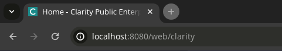

## Exercise 20c: Creating a New CSS Client Extension

Liferay provides the CSS client extension for adding a single CSS resource to site pages. Here you'll create one of these client extensions using an external cdnjs URL as Walter Douglas user.

To do this,

1. Open the *Global Menu* (), go to the  *Applications* tab, and click *Client Extensions*.

1. Click *Add* () and select *Add CSS*.

1. For name, enter `Clarity Animation`.

1. For CSS URL, enter `https://cdnjs.cloudflare.com/ajax/libs/animate.css/4.1.1/animate.min.css`.

   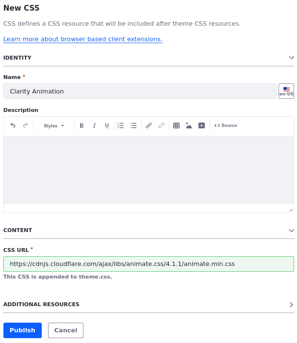

1. Click *Publish*.

1. Go to the *Home* page in the Clarity Public Enterprise Website.

1. Click *Configure Page* () and select the *Design* tab.

1. Scroll down and click *Add CSS Client Extensions*.

1. Choose *Clarity Animation* and click *Add*.

   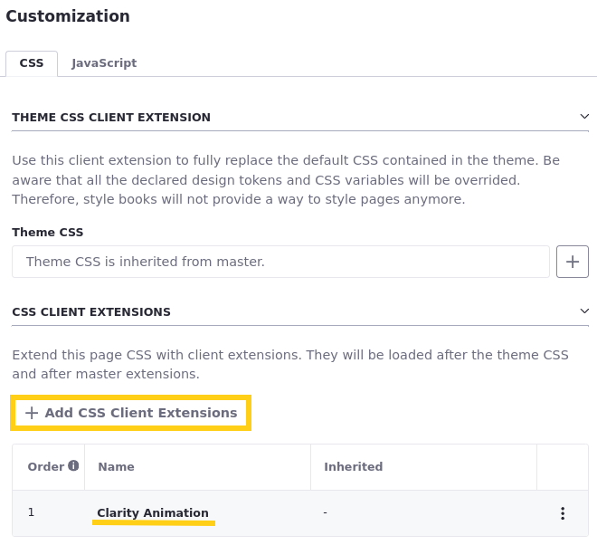

1. Scroll down and click *Save*.

   This saves the page as a draft. For the changes to take effect, you must publish the page.

1. Return to the Home page, click *Edit* (), and click *Publish*.

1. Open the *Site Menu* (), expand *Design*, and click *Fragments*.

1. Under Fragment Sets, click *Clarity Components*.

1. Select the *Clarity Gradient Container* fragment to begin editing it.

1. In your file browser, navigate to the `[repository-folder]/exercises/lesson-20/` folder, open the `clarityanimation.html` file, and copy its content into the fragment's HTML field.

   This adds three CSS animation classes to the fragment from the from the `animate.css` library on [cdnjs](https://cdnjs.cloudflare.com/ajax/libs/animate.css/4.1.1/animate.min.css) (i.e., `animate__animated`, `animate__slower`, and `animate__fadeIn`).

   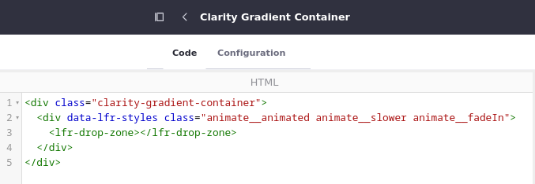

1. Click *Publish*.

   Now that you've updated the fragment, you can propagate these changes to existing instances of the fragment in site pages.

1. Click *Actions* () for the Clarity Gradient Container fragment, and select *View Usages*.

1. Check all boxes and click *Propagate*.

   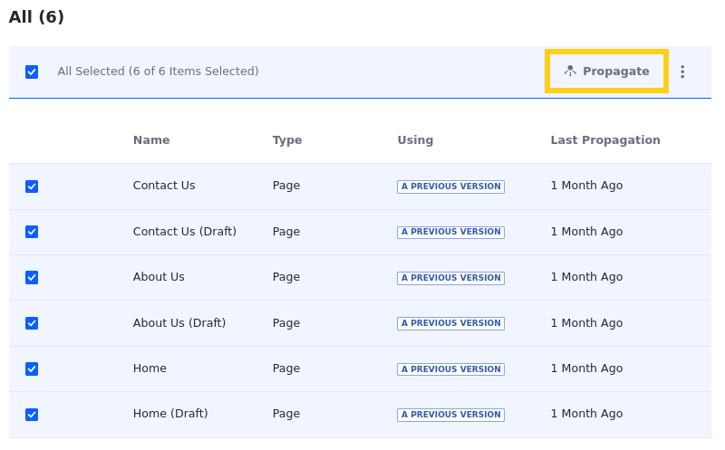

   Now, all fragments used throughout the site are updated with the new CSS classes.

1. Go to the Home Page and confirm the animation works.

   The animation now plays every time you refresh or navigate to the Home page.

   

Next, let's explore how you can use client extensions with Objects to build custom solutions with complex business logic.

## Exercise 20d: Setting Up and Deploying the Distributor Application

   <!-- !!! note Instruction -->

The training workspace includes a batch client extension for quickly setting up two object definitions and their related picklists. The specific process for deploying client extensions depends on your Liferay hosting model (i.e., Self-Hosted, PaaS, or SaaS). However, in all cases, you must add the compiled `.zip` file to the Liferay server's `[Liferay Home]/osgi/client-extensions/` folder. Here you'll deploy the batch client extensions and explore what they include as the Clarity Admin user.

1. In your training workspace, go to the `[repository-root]/client-extensions/liferay-clarity-batch/` folder.

1. Run this command to build and deploy the client extension:

   ```bash
   blade gw clean deploy
   ```

   Or use Gradle Wrapper:

   ```bash
   ../../gradlew clean deploy
   ```

1. Verify the command executes successfully.

   Two new object definitions and their picklists were added to your Liferay instance. Let's explore them.

1. While logged in as the Clarity Admin user, open the *Global Menu* (), go to the *Control Panel* tab, and click *Picklists*.

   Picklists are predefined lists of items that you can use for single select and multi-select fields in object definitions. Here are picklists imported by the batch client extension:

   * D4B8 Annual Purchase Volumes
   * D4B8 Application States
   * D4B8 Assessment Scores
   * D4B8 Business Types
   * D4B8 Decisions
   * D4B8 Distribution Channels
   * D4B8 Distribution Regions
   * D4B8 Order Types
   * D4B8 Product Labels
   * D4B8 Product Types
   * D4B8 Recommendations

   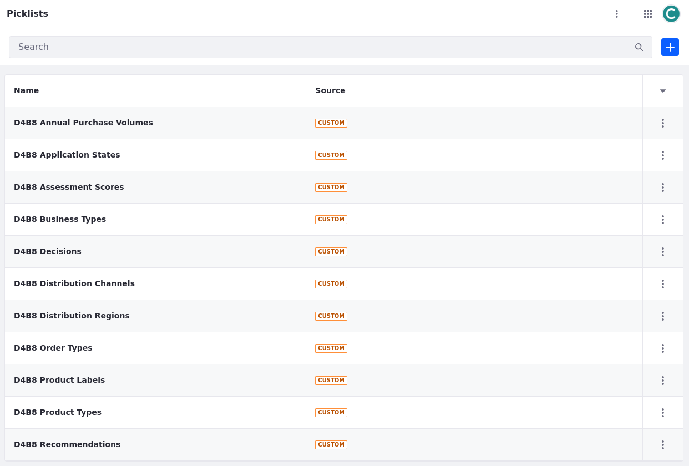

1. Open the *Global Menu* (), go to *Control Panel*, and click *Objects*.

   Here you'll see two new object definitions imported by the batch client extension:

   * D4B8 Distributor Application
   * D4B8 Application Evaluation

   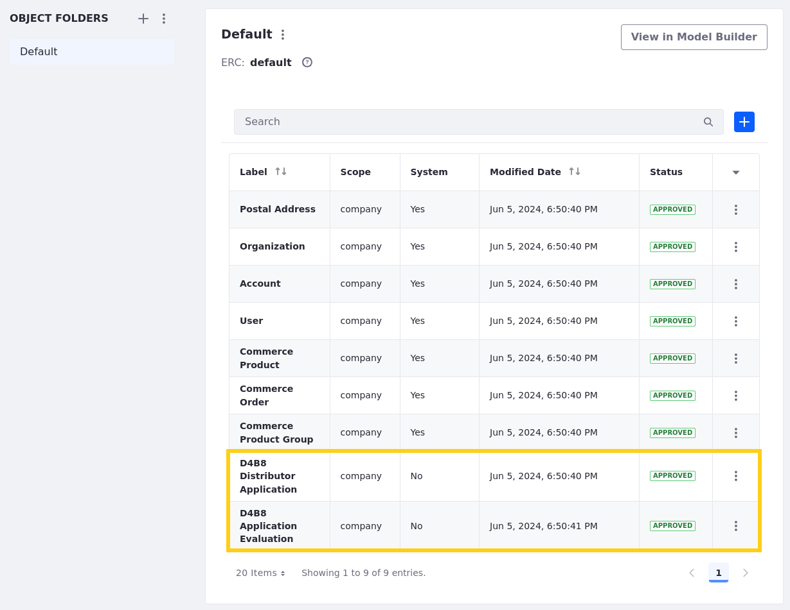

   As we're adding more object definitions, let's add a folder for organizing our objects and place the D4B8 objects into it.

1. Click *Add* () for Object Folders.

1. For label, enter `Distributor Applications`.

1. Click *Create Folder*.

   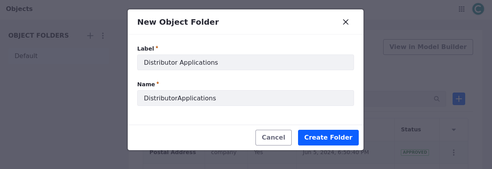

1. Click *View in Model Builder*.

   The Objects Model Builder is a graphical interface that displays each object definition as a card and visualizes relationships between them. With it, you can create, manage, and extend data models in the Objects application and quickly configure definitions, fields, and relationships.

1. In the left side panel, click *Actions* () for D4B8 Distributor Application and select *Move to Current Folder*.

   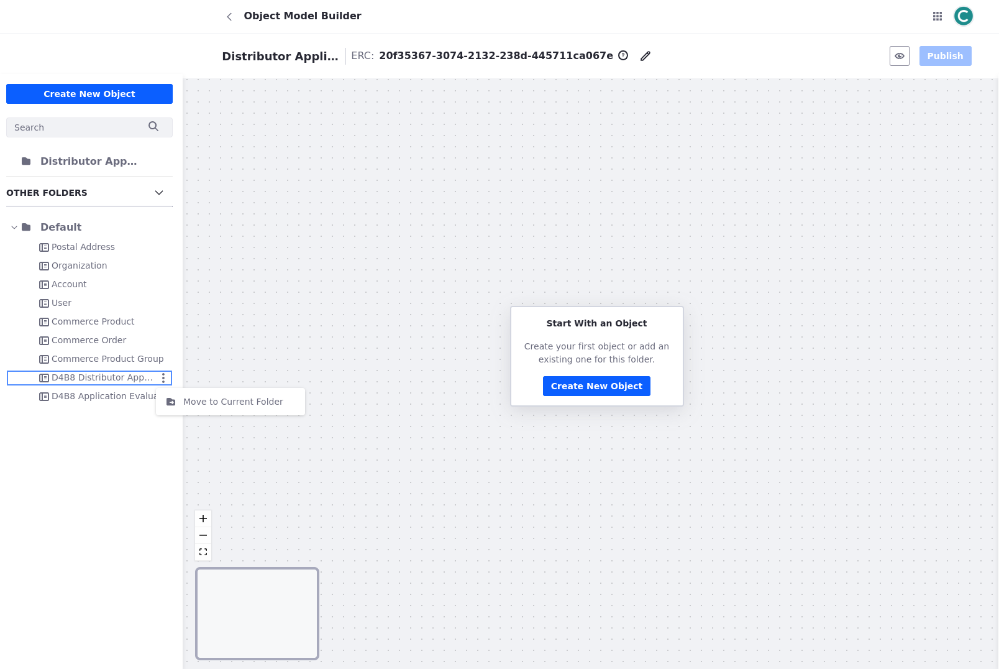

1. Repeat this step for D4B8 Application Evaluation.

1. Drag and and drop the cards to reposition them and better see their relationship.

## Exercise 20e: Testing the Distributor Application

   <!-- !!! note Instruction -->

In the following lessons, you'll learn more about these objects and how they're configured. Here you'll create and review a Distributor Application entry as the Clarity Admin user.

To do this,

1. Sign in as the Clarity Admin user.

   * Email: `admin@clarityvisionsolutions.com`
   * Password: `learn`

1. Open the *Global Menu* () and go to the *Control Panel* tab. Both D4B8 Application Evaluations and D4B8 Distributor Applications should appear in the Object category.

   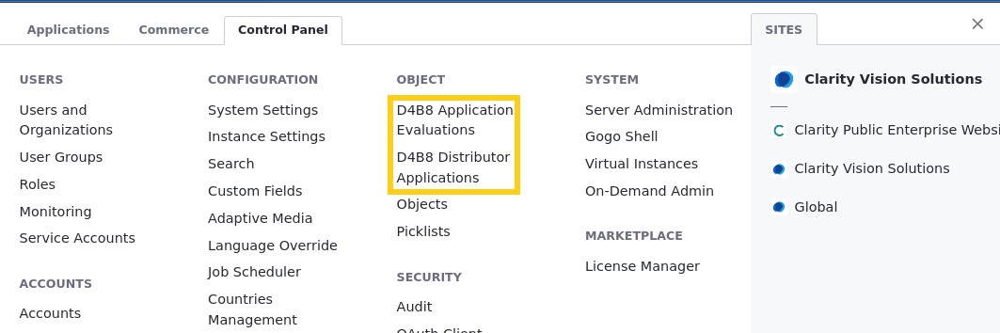

1. Open *D4B8 Distributor Applications*.

1. Click *Add* () to create an entry.

1. Fill out the required fields and click *Save*.

   **Note**: You must enter a business name. We'll use this value with client extensions in a later exercise.

1. Return to the Distributor Applications overview page and verify your entry appears in the table.

   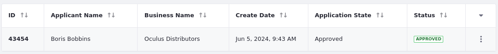

   Now you can create an evaluation for this entry.

1. Open the *Global Menu* (), go to the *Control Panel* tab, and click *D4B8 Application Evaluations*.

1. Click *Add D4B8 Application Evaluation* to create an evaluation for the application.

   <!--TASK: Why isn't this `*Add* ()`-->

1. In the Application to Evaluations field, select the application you created. It is identified by the Business Name field.

   <!--TASK: Update the definition to use the Business Name instead of the ID.-->

1. Fill out the evaluation form and click *Save*.

1. Return to the Application Evaluations overview page and verify the entry appears in the table.

   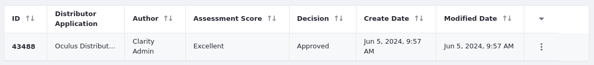

   This evaluation is automatically related to the selected application. You can confirm these entries are related by returning to *Distributor Applications* overview page, selecting the application, and going to the *Evaluation Notes* tab.

   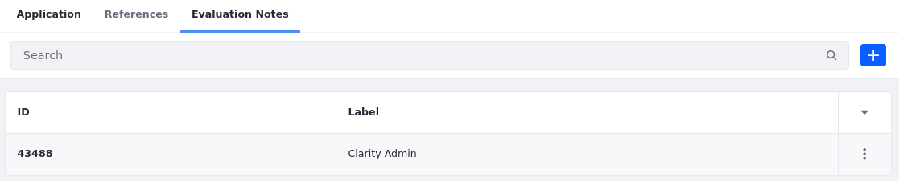

## Exercise 20f: Adding Fields to the Distributor Applications Object

   <!-- !!! note Instruction -->

The Distributor Applications object already contains a bunch of custom fields, but Clarity needs one for applicants to list other brands they offer. Here you'll add a field to the Distributor Applications Object as the Clarity Admin user.

To do this,

1. Open the *Global Menu* (), go to the *Control Panel* tab, and click *Objects*.

1. Click the *Distributor Applications* folder.

1. Click *View in Model Builder*.

1. Look for the *D4B8 Distributor Application* object, click *Add Field or Relationship*, then select *Add Field*.

1. Enter these values and click *Save*:

   | Field                    | Value                         |
   |:-------------------------|:------------------------------|
   | Label                    | Business Other Brands Offered |
   | Field Name               | `businessOtherBrandsOffered`  |
   | Type                     | Long Text                     |
   | Enable Entry Translation | False                         |
   | Mandatory                | False                         |

   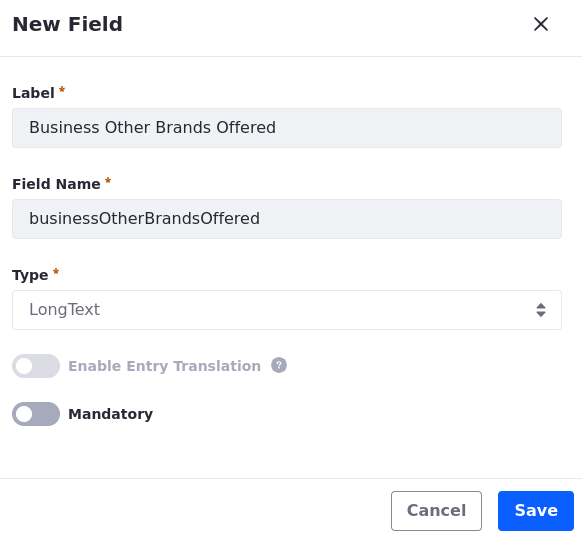

Each saved field is added immediately to the object and automatically appears in its default layout when creating entries. However, the Distributor Application object has a custom layout that must be modified to include the new field.

To add the field to the object's layout,

1. Click *Actions* () for D4B8 Distributor Application and select *Edit in Page View*.

1. When prompted, select *Open Page View*.

1. Go to the *Layouts* tab and click *Application Layout*.

1. Go to the *Layout* tab.

1. Find the Business Details block and click *Add Field*.

   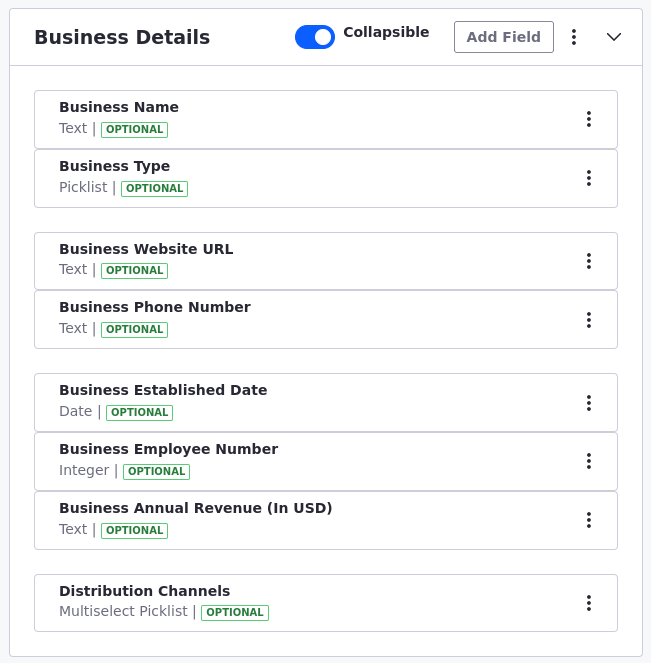

1. Select *Business Other Brands Offered* as an option, choose the single column box for the field size, and click *Save*.

   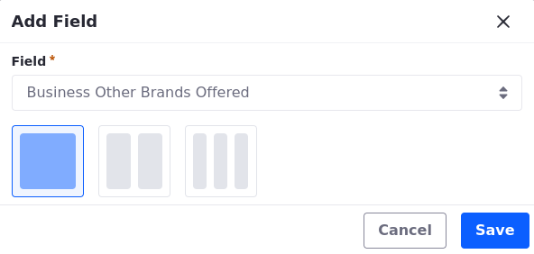

1. Click *Save* at the bottom of the panel.

Now the new field appears in the layout when creating entries.

## Exercise 20g: Adding Picklist Items

   <!-- !!! note Instruction -->

Clarity uses picklists to create predefined options for the applicants to choose from. Currently, the Product Types picklist is empty and does not include any options. Here you'll add items to the picklist as the Clarity Admin user.

To do this,

1. Open the *Global Menu* (), go to the *Control Panel* tab, and click *Picklists*

1. Select *D4B8 Product Types*.

1. Click *Add*  and create these items:

   | Name       | Key        |
   |:-----------|:-----------|
   | Eyeglasses | eyeglasses |
   | Sunglasses | sunglasses |
   | Lenses     | lenses     |
   | Contacts   | contacts   |
   | Other      | other      |

1. Click each item and replace their External Reference Code with these values:

   | Name       | External Reference Code |
   |:-----------|:------------------------|
   | Eyeglasses | PRODUCT_TYPE_EYEGLASSES |
   | Sunglasses | PRODUCT_TYPE_SUNGLASSES |
   | Lenses     | PRODUCT_TYPE_LENSES     |
   | Contacts   | PRODUCT_TYPE_CONTACTS   |
   | Other      | PRODUCT_TYPE_OTHER      |

   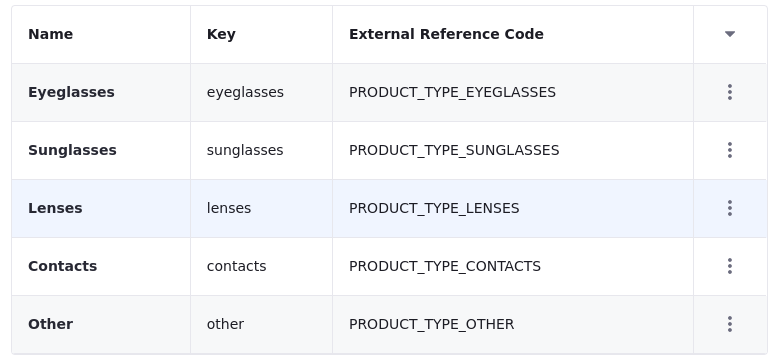

1. Click *Save*.

Once saved, the Distributor Application's `Products of Interest` custom field is updated with the selected picklist values. This allows applicants to choose their desired products from the updated list.

<!--TASK: Improve; this is the first time we've mentioned Products of Interest.-->

## Exercise 20h: Assigning Object Permissions

   <!-- !!! note Instruction -->

Clarity wants to allow all authenticated users to submit distributor applications. Here you'll grant the default *User* role permission to access Distributor Applications and add entries as the Clarity Admin user.

To do this,

1. Open the *Global Menu* (), go to the *Control Panel* tab, and click *Roles*.

1. Select the *User* role and go to the *Define Permissions* tab.

1. In the left menu, go to *Control Panel* &rarr; *Object* &rarr; *D4B8 Distributor Applications*.

1. Add these permissions:

   | Permission                                                             |
   |:-----------------------------------------------------------------------|
   | Application Permissions: Add to Page                                   |
   | Application Permissions: View                                          |
   | Resource Permissions > D4B8 Distributor Applications: Add Object Entry |
   | Resource Permissions > D4B8 Distributor Application: Delete            |
   | Resource Permissions > D4B8 Distributor Application: Update            |

   <!--TASK: Confirm whether the delete and update permissions are necessary. I suspect they are not necessary, since entry creators are assigned the entry 'owner' role, which allows them to update for delete the entry.-->

   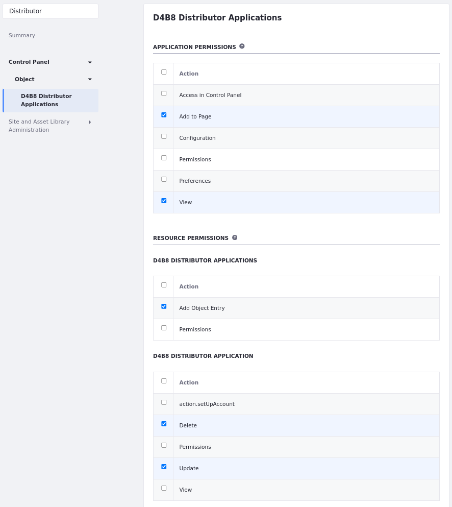

1. Click *Save*.

1. Verify the User role has the desired permissions.

   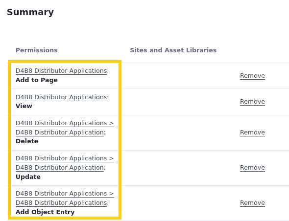

   Clarity also wants to allow members of their business development team to review all applications and fill out evaluations. To achieve this, let's grant the Business Development Manager role the necessary permissions.

1. Return to the *Roles* overview page and select *D4B8 Business Development Manager*.

1. Go to the *Define Permissions* tab.

1. In the left menu, go to *Control Panel* &rarr; *Object* &rarr; *D4B8 Distributor Applications*.

1. Add these permissions, and click *Save*:

   * D4B8 Distributor Applications

     | Permission                                                  |
     |-------------------------------------------------------------|
     | Application Permissions: Access in Control Panel            |
     | Application Permissions: View                               |
     | Resource Permissions > D4B8 Distributor Application: Update |
     | Resource Permissions > D4B8 Distributor Application: View   |

   * D4B8 Application Evaluations

     | Permission                                                            |
     |-----------------------------------------------------------------------|
     | Application Permissions: Access in Control Panel                      |
     | Application Permissions: View                                         |
     | Resource Permissions > D4B8 Application Evaluations: Add Object Entry |
     | Resource Permissions > D4B8 Application Evaluation: Add Discussion    |
     | Resource Permissions > D4B8 Application Evaluation: Delete            |
     | Resource Permissions > D4B8 Application Evaluation: Delete Discussion |
     | Resource Permissions > D4B8 Application Evaluation: Update            |
     | Resource Permissions > D4B8 Application Evaluation: Update Discussion |
     | Resource Permissions > D4B8 Application Evaluation: View              |

   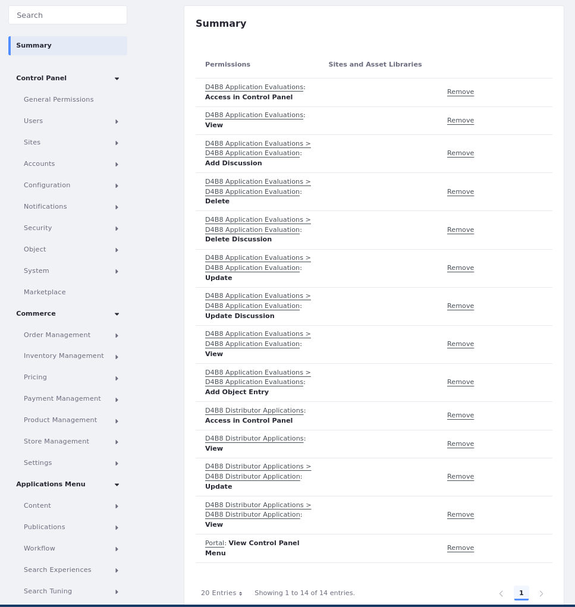

1. For test purposes, go to the *Assignees* tab and assign this role to Harper Roberts.

Great! Now Clarity can make sure the business development team's manager can view submitted applications, create evaluations, and approve or deny applications. Next, let's finish setting up Clarity's workflow.

## Exercise 20i: Enabling the Approval Workflow

   <!-- !!! note Instruction -->

Clarity has already implemented a workflow process for reviewing and approving changes made to applications, but this workflow depends on a [microservice client extension](https://learn.liferay.com/web/guest/w/dxp/liferay-development/integrating-microservices) to function properly. Currently, all updates to the *Application State* field are approved automatically. However, the workflow is supposed to require a final manager review before allowing users to set the *Application State* field to `Approved` or `Denied`.

<!--TASK: Improve; this is the first time we mention the state field.-->

Here you'll deploy the microservice client extension and finish configuring the workflow definition in the Liferay UI as the Clarity Admin user.

To do this,

1. Open your terminal and go to the `[repository-root]/client-extensions/liferay-clarity-etc-spring-boot/` folder.

1. Build and deploy the client extension project into your Liferay instance. Make sure the deployment was successful.

   ```bash
   blade gw clean deploy
   ```

   Or use Gradle Wrapper:

   ```bash
   ../../gradlew clean deploy
   ```

1. Run this command from the `liferay-clarity-etc-spring-boot/` folder to start the Spring Boot application:

   ```bash
   blade gw bootRun
   ```

   Or use Gradle Wrapper:

   ```bash
   ../../gradlew bootRun
   ```

1. When the application starts, go to http://localhost:58081/ready. If the application is ready for use, the page says “READY.”

1. In your Liferay instance, open the *Global Menu* (), go to the *Applications* tab, and click *Process Builder*.

   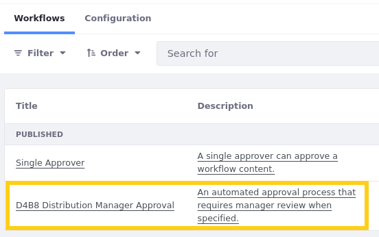

   The Distribution Manager Approval workflow is already fully configured. All you have to do is enable it for the Distributor Application object.

1. Go to the *Configuration* tab.

1. Click *Edit* for D4B8 Distributor Application, select *D4B8 Distribution Manager Approval*, and click *Save*.

   

This enables the workflow. Now you can test it by editing an object entry and setting its state field to *Under Review*. This update should be approved automatically by the workflow action. Next, update the state field to `Approved`. The entry's status should be `Pending`. You can then impersonate Harper Roberts and check for a workflow notification. You can then assign the task to Roberts and approve it. Once finished, the entry's status should be `Approved`.

## Exercise 20j: Automating Account Creation

To complete the onboarding flow, Clarity wants to automate account creation for approved applications. The client extension you deployed in the previous exercise includes an object action client extension for this. When triggered, this action creates an account using the application's business name, associates the applicant with the account, and assigns the applicant the Account Administrator role. Since the client extension is already deployed and the microservice is running, all you have to do is create an object action to finish setting it up as the Clarity Admin user.

To do this,

1. Begin editing the *D4B8 Distributor Application* object.

1. Go to the *Actions* tab and click *Add* ().

1. Enter these values in the Basic Info tab:

   | Field        | Value                                                              |
   |:-------------|:-------------------------------------------------------------------|
   | Action Label | Set Up Account                                                     |
   | Action Name  | setUpAccount                                                       |
   | Description  | Standalone, create a business account for an approved application. |
   | Active       | True                                                               |

1. Go to the *Action Builder* tab and set these values:

   | Field         | Value                                                                                    |
   |:--------------|:-----------------------------------------------------------------------------------------|
   | Trigger       | Standalone                                                                               |
   | Action        | `object-action-executor[function#liferay-clarity-etc-spring-boot-object-action-account]` |
   | Error Message | Failed to create the business account.                                                   |

1. Click *Save*.

   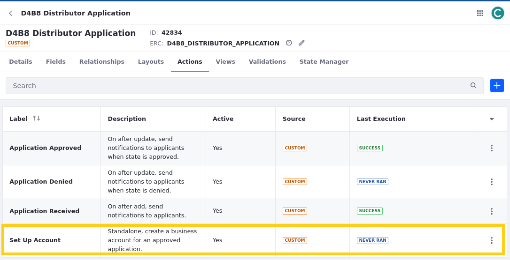

1. Open the *Global Menu* (), go to the *Control Panel* tab, and click *Roles*.

1. Add the Set Up Account action permission to the D4B8 Business Development Manager role.

1. In the left menu, go to *Control Panel* &rarr; *Object* &rarr; *D4B8 Distributor Applications*.

   | Permission                                                               |
   |--------------------------------------------------------------------------|
   | Resource Permissions > D4B8 Distributor Application: action.setUpAccount |

When saved, Liferay adds the Set Up Account action as an option in each object entry's *Actions* menu (), so you can trigger it manually. Now you can try it out!

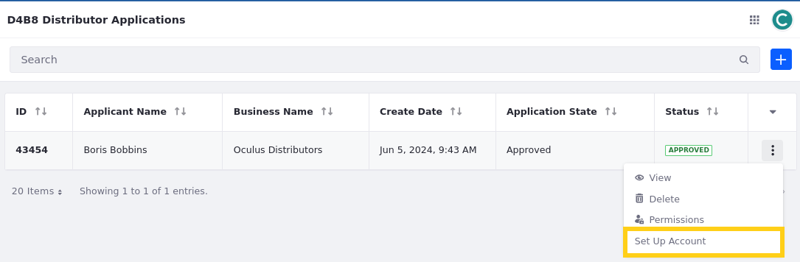

After triggering the action, open the *Global Menu* (), go to the *Control Panel* tab, and click *Accounts*. If successful, the new account should appear and the Clarity Admin user should be assigned to it as the account manager.

## Exercise 20k: Setting Up Notifications

   <!-- !!! note Instruction -->

Currently, Clarity's solution only includes notifications for notifying applicants of changes in their application's status. But they do not have notifications for alerting their business development team of new submissions. Relying on team members to manually check for new submissions does not scale and leaves room for human error, resulting in missed opportunities or poor user experience.

Here you'll add a notification template and set up an object action for triggering it as the Clarity Admin user.

To do this,

1. Open the *Global Menu* (), go to the *Control Panel* tab, and click *Templates* under Notifications.

   The provided solution includes these templates:

   * Application Approved
   * Application Denied
   * Application Received

   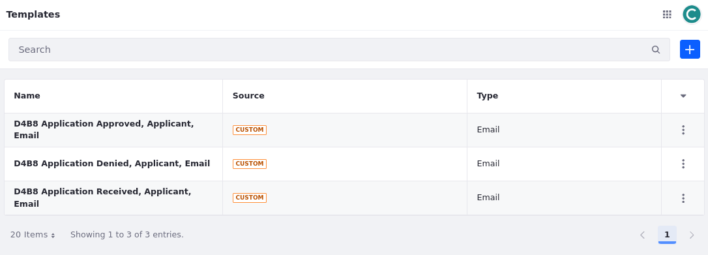

1. Click *Add* and select *User Notification*.

   Here you can begin designing the template.

   **Tip**: You can access object field references to populate notifications dynamically with data for the entry or user who triggers the notification action. To view available variables, scroll down to Definition of Terms and select *D4B8 Distributor Application* object in the dropdown menu.

1. Enter these values for Basic Info:

   | Field       | Value                                                                                               |
   |:------------|:----------------------------------------------------------------------------------------------------|
   | Name        | D4B8 Application Submitted, Admin, User                                                             |
   | Description | Sends user notifications to an administrative role whenever a distributor application is submitted. |

   <!--TASK:  -->

1. Enter these values for Settings:

   | Field      | Value                               |
   |:-----------|:------------------------------------|
   | Recipients | Role                                |
   | Role       | `D4B8 Business Development Manager` |

   <!--TASK:  -->

1. Enter this value for Content:

   | Field   | Value                                                                                                                                                                      |
   |:--------|:---------------------------------------------------------------------------------------------------------------------------------------------------------------------------|
   | Subject | `APP-[%D4B8DISTRIBUTORAPPLICATION_ID%]: [%D4B8DISTRIBUTORAPPLICATION_APPLICANTNAME%] submitted a distributor application for [%D4B8DISTRIBUTORAPPLICATION_BUSINESSNAME%].` |

1. Click *Save*.

   Now you can add a notification action to the Distributor Applications object that uses this template.

1. Open the *Global Menu* (), go to the *Control Panel* tab, and click *Objects*.

1. Select *D4B8 Distributor Application* and go to the *Actions* tab.

   The provided solution includes three notification actions:

   * Application Received
   * Application Approved
   * Application Denied

   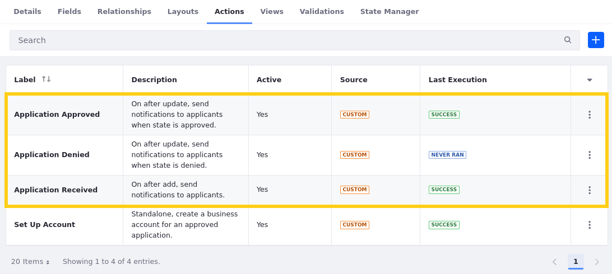

1. Click *Add* to create a new object action.

1. Enter these values in the Basic Info tab:

   | Field        | Value                                                     |
   |--------------|-----------------------------------------------------------|
   | Action Label | Application Submitted                                     |
   | Action Name  | applicationSubmitted                                      |
   | Description  | On After Add, send notifications to administrative users. |
   | Active       | True                                                      |

   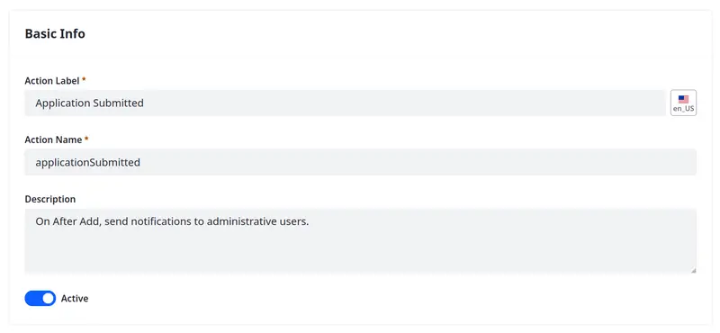

1. Go to the *Action Builder* tab and set these values:

   | Field                 | Value                                   |
   |-----------------------|-----------------------------------------|
   | Trigger               | On After Add                            |
   | Condition             | N/A                                     |
   | Action                | Notification                            |
   | Notification Template | D4B8 Application Submitted, Admin, User |

   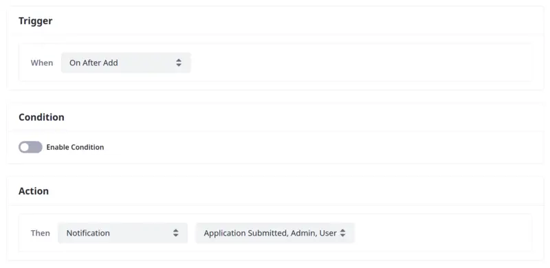

1. Click *Save*.

Now whenever users submit an application, employees with the Business Development Manager role are automatically notified. To test the notification, create another application entry and impersonate Harper Roberts. You should see a platform notification.


## Exercise 21a: Tailoring Experiences by User Group and Role

Segmentation involves grouping website visitors and users into categories based on shared characteristics or behaviors. Segmenting your audience allows you to tailor the website experience, delivering more relevant content and ultimately boosting engagement.

Here, you'll create a segment specifically for Distributor users as the Clarity Admin user.

To do this,

1. Sign in as the Clarity Admin user.

   * Email: `admin@clarityvisionsolutions.com`
   * Password: `learn`

1. Add a new user with the following attributes.

   | Field         | Value                               |
   |:--------------|:------------------------------------|
   | Screen Name   | `terrencewheatley`                  |
   | Email Address | `terrence.wheatley@distributor.com` |
   | Job Title     | `Distributor`                       |
   | First Name    | `Terrence`                          |
   | Last Name     | `Wheatley`                          |
   | Password      | `learn`                             |

   <!--TASK: mail's reference needs to be changed -->

1. Create a new user group called *Distributors*.

1. Add Terrence Wheatley to the group.

1. Create a new regular role called *Distributor*.

1. Assign the role of Distributor to the Distributors User Group.

1. Open the *Site Menu* (), expand *People*, and select *Segments*.

1. Click *New* to create a segment.

1. For title, enter `Distributors`.

1. From the Properties menu, use the User section and drag the *Regular Role* into the main part of the screen.

1. Leave the condition as `equals` and use the Select button to choose the Distributor role.

1. From the Properties menu, use the User section and drag the *User Group* into the main part of the screen.

1. Leave the condition as `equals` and use the Select button to choose the Distributors user group.

1. Change the conjunction to `Or`.

   We cover both scenarios here: users in the user group and those with the directly assigned Distributor role.

   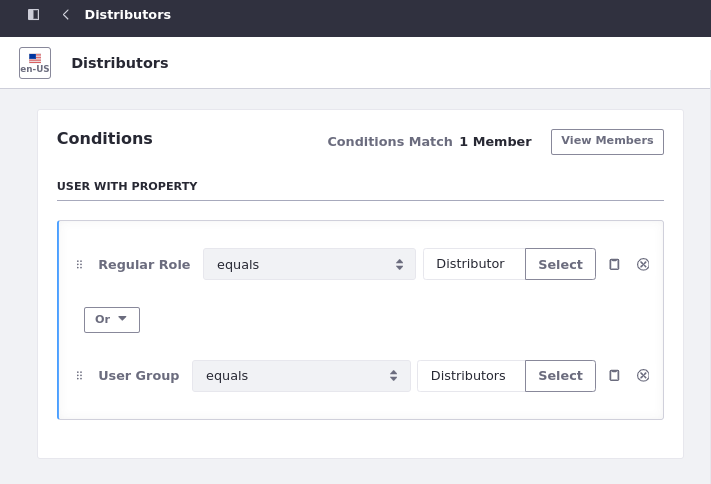

1. Click *View Members* to validate Terrence Wheatley meets the segment condition.

1. Click *Save*.

1. Go to the home page and click *Edit* ().

1. Click the *Experience* drop down at the top of the page and choose *New Experience*.

1. For the Experience Name enter *Distributor*.

1. For the Audience, choose the *Distributors* option.

1. Click *Save*.

1. Use the up arrow on the Distributor row to position the segment above the Default item so that the Distributor entry shows first.

   **Note:** The experience order determines their priority. Internally, Liferay checks the segments a user belongs to and uses the match with the highest priority.

   Once the Distributor role is re-positioned, the label on the record should now read Active.

1. Modify the title text in the Banner to say `Welcome Back! Elevate Your Inventory with Premium Eyewear`.

1. Hide the `Distributor Promo` container, since distributors don't need to apply.

1. Click *Publish*.

1. You can test the different experiences using the Simulation menu.

1. Choose to Preview By Segments. Then, use the Segment dropdown menu to toggle between `Anyone` and `Distributor` and view the corresponding changes in the main window.

1. Impersonate Terrence Wheatley to see the changes.

## Exercise 22a: Using JMeter to Run Load Tests

JMeter is an open-source, performance and load testing tool. Here you'll use it to check the performance of Clarity's site.

To do this,

1. Open JMeter on your machine. (For installation, see the [Enablement Bootcamp Prerequisite](https://www.liferay.com/web/events/enablement-bootcamp-prerequisites).)

1. From the *File* menu, click *Open*.

1. From the downloaded course bundle, navigate to the `[repository-folder]/exercises/lesson-22/` folder and select the `Clarity.jmx` file.

   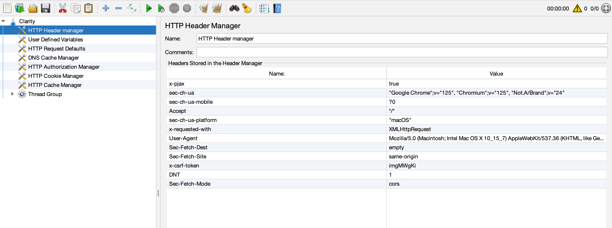

1. From the *Run* menu, click *Start*.

   The test will take a few minutes to run depending on your setup. The clock in the upper right corner displays the time while the test is running. Once the time stops, the test is complete.

1. In the left menu, click *Thread Group* to expand the section and click *Summary Report*.

1. Review the report to find any performance outliers.

   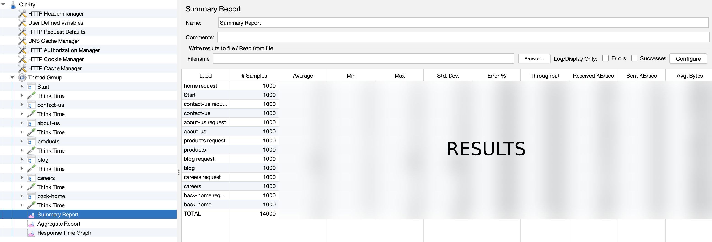

1. In the left menu, click *Response Time Graph*. Under the *Settings* tab, click *Display Graph*. This graph can also be used to identify any performance outliers.

## Exercise 22b: Auditing Page Performance

While logged in as the Clarity Admin user, use the Page Audit Tool to investigate the problem page.

1. Back in Liferay, open the *Global Menu* (), go to the *Control Panel* tab, and click *Instance Settings*.

1. Click *Feature Flags* and go to the *Beta* tab.

1. Enable `Render Times in Page Audit (LPS-187284)`.

   **Tip**: Use the search bar to quickly find the feature flag.

1. Return to Clarity's enterprise website.

1. Go to problem page to investigate the performance issue.

1. Click the *Page Audit Tool* button () just left of the Global Menu.

   The Page Audit side panel displays a list of all page fragments sorted by the load time from longest to shortest.

   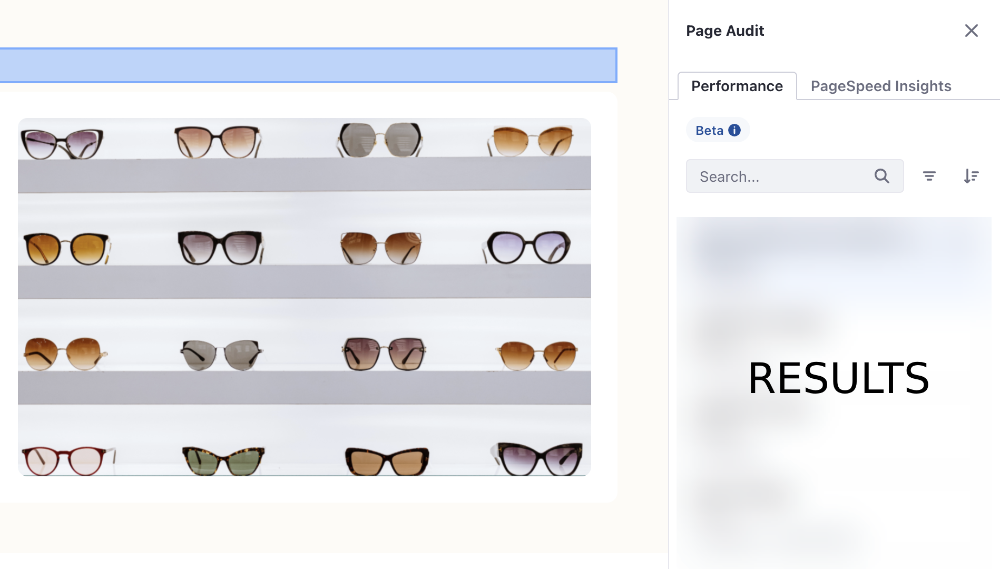

1. In the Performance tab, identify the fragments with the longest load time.

Next, you'll examine this fragment and fix it.

## Exercise 22c: Fixing the Performance Issue

Here you'll edit the slow fragment to fix the performance issue as the Clarity Admin user.

To do this,

1. In Liferay, open the *Site Menu* (), expand *Design*, and click *Fragments*.

1. Under Fragment Sets, click *Clarity Components*.

1. Begin editing the problem fragment you identified in the previous exercise.

1. In the HTML window, delete the `[#assign x = sleeper.sleep(3) /]` line.

   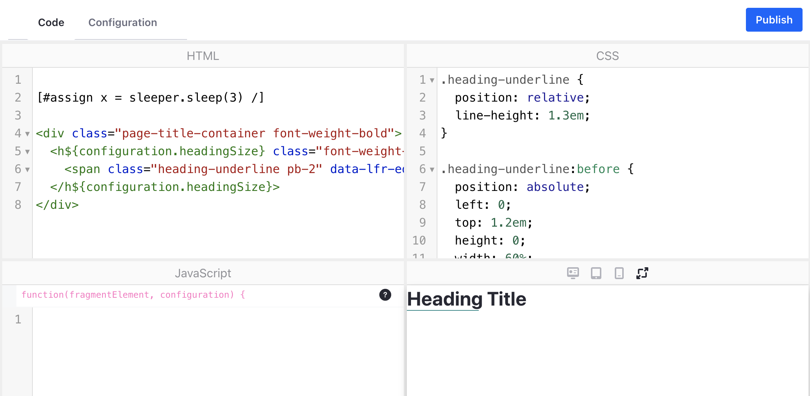

1. Click *Publish*.

1. Click *Actions* () for the fragment and select *View Usages*.

1. Check all usages and click *Propagate*.

   This applies your changes to all instances of the fragment currently being used in Clarity's site.

With the problem fragment fixed, you can retest the Clarity site.

## Exercise 22d: Reassessing Performance with JMeter

Run another performance test with JMeter to verify the fix.

1. Back in JMeter, from the *Run* menu, click *Clear All*.

1. From the *Run* menu, click *Start* to run the load test again.

1. When finished, review the Summary Report and the Response Time Graph again. Notice that the page that previously had a performance issue no longer has a problem.

   

While logged in as the Clarity Admin user, check the problem page again with the Page Audit Tool.

1. In Liferay, go to the problem page. Notice that the slow loading fragment issue has been resolved.

Congratulations! You've completed day three of Building Enterprise Websites with Liferay. Next, we'll test what you've learned.